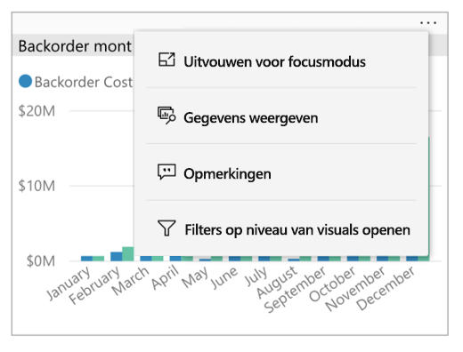

# Rapporten verkennen in de mobiele Power BI-apps
Van toepassing op:

|  |  |  |  |  |
|:---: |:---: |:---: |:---: |:---: |
| iPhones |iPads |Android-telefoons |Android-tablets |Windows 10-apparaten |

Een Power BI-rapport is een interactieve weergave van uw gegevens met visuele elementen die verschillende bevindingen en inzichten van die gegevens vertegenwoordigen. Rapporten weergeven in de mobiele Power BI-apps is de derde stap in een proces dat uit drie stappen bestaat:

1. [Rapporten maken in Power BI Desktop](../../desktop-report-view.md). U kunt zelfs [een rapport optimaliseren voor telefoons](mobile-apps-view-phone-report.md) in Power BI Desktop.
2. Deze rapporten publiceren naar de Power BI-service [(https://powerbi.com)](https://powerbi.com) of [Power BI Report Server](../../report-server/get-started.md).  
3. U kunt de rapporten gebruiken in de mobiele Power BI-apps.

## Een Power BI-rapport openen in de mobiele app
Power BI-rapporten worden opgeslagen op verschillende plaatsen in de mobiele app, afhankelijk van waar hoe u eraan bent gekomen. Ze kunnen worden opgeslagen in Apps, Gedeeld met mij, werkruimten (met inbegrip van Mijn werkruimte) of op een rapportserver. Soms doorloopt u een gerelateerd dashboard om bij een rapport te komen en soms worden ze in een lijst weergegeven.

In lijsten en menu's ziet u een pictogram naast de naam van een rapport, zodat u begrijpt dat het item een rapport is:

Er zijn twee pictogrammen voor rapporten in de mobiele Power BI-apps:

*  geeft aan dat een rapport liggend wordt weergegeven in de app. Het ziet er uit zoals in een browser.

*  geeft een rapport aan dat ten minste één voor de telefoon geoptimaliseerde pagina bevat, die staand wordt weergegeven.

> [!NOTE]
> Als u uw telefoon in de liggende stand houdt, krijgt u altijd de liggende indeling, ook als de rapportpagina een telefoonindeling heeft.

Tik op **Meer opties** (...) in de rechterbovenhoek van een tegel en tik vervolgens op **Rapport openen** om een rapport van een dashboard op te halen:
  
  
  
  Niet alle tegels kunnen als een rapport worden geopend. Tegels die worden gemaakt wanneer u een vraag stelt in het vak Q&A, openen bijvoorbeeld geen rapporten wanneer u erop tikt.
  
## Communiceren met rapporten
Nadat u een rapport hebt geopend in de app, kunt u ermee aan de slag gaan. U kunt allerlei acties uitvoeren op uw rapport en op de gegevens ervan. In de voettekst van het rapport vindt u acties die in het rapport kunnen worden uitgevoerd. Door te tikken of lang te tikken op de gegevens die in het rapport worden weergegeven, kunt u de gegevens bovendien segmenteren en analyseren.

### Tikken en lang tikken
Een tik is vergelijkbaar met een klik op de muis. Als u het rapport dus kruislings wilt markeren op basis van een gegevenspunt, tikt u op dat gegevenspunt.
Wanneer u op een waarde op de slicer tikt, wordt die waarde geselecteerd; de rest van het rapport wordt op die waarde gesegmenteerd.
Wanneer u op een koppeling, knop of bladwijzer tikt, wordt de actie uitgevoerd die door de rapportauteur is gedefinieerd.

U hebt waarschijnlijk gezien dat er een rand wordt weergegeven wanneer u op een visual tikt. Rechtsboven aan de rand ziet u **Meer opties** (...). Als u op het beletselteken tikt, ziet u een menu met acties die u voor die visual kunt uitvoeren:

### Knopinfo en zoomacties

Als u lang op een gegevenspunt tikt (tikken en vasthouden), wordt de knopinfo weergegeven met de waarden van dat gegevenspunt:

Als de auteur van het rapport knopinfo voor een rapportpagina heeft geconfigureerd, wordt de standaardknopinfo vervangen door de knopinfo voor de rapportpagina:

> [!NOTE]
> Knopinfo voor rapportpagina's wordt ondersteund voor apparaten met een viewport van ten minste 640 en 320 pixels. Als uw apparaat kleiner is, wordt de standaardknopinfo in de app weergegeven.

Auteurs van rapporten kunnen hiërarchieën definiëren in de gegevens en in de relaties tussen rapportpagina's. Met hiërarchieën kunt u inzoomen, uitzoomen en een andere rapportpagina tot in detail analyseren vanuit een visual en een waarde. Wanneer u dus lang op een waarde tikt, worden behalve de knopinfo ook de relevante zoomopties weergegeven in de voettekst:

Als u op een bepaald deel van een visual en vervolgens op de optie *drillthrough* tikt, wordt u door Power BI naar een andere pagina in het rapport geleid, gefilterd op de waarde waarop u hebt getikt. De auteur van het rapport kan een of meer mogelijkheden voor drillthrough instellen, waarmee u per mogelijkheid naar een andere pagina wordt geleid. In dat geval kunt u kiezen welke optie u in detail wilt analyseren. Met de knop Terug gaat u weer terug naar de vorige pagina.

Lees meer over het [toevoegen van een detailanalyse in Power BI Desktop](../../desktop-drillthrough.md) voor meer informatie.
   
   > [!IMPORTANT]
   > In de mobiele Power BI-apps worden inzoomacties in matrix- en tabelvisuals alleen ingeschakeld door middel van celwaarden, niet door kolom- of rijheaders.
   
   
   
### De acties gebruiken in de rapportvoettekst
Vanuit de rapportvoettekst kunt u verschillende acties uitvoeren op de huidige rapportpagina of op het hele rapport. De voettekst biedt snelle toegang tot de meest gebruikte acties. Tik op **Meer opties** (...) voor toegang tot andere acties:

U kunt deze acties uitvoeren vanuit de voettekst:
* Stel het rapportfilter opnieuw in en breng selecties kruislings terug naar de oorspronkelijke markering.
* Open het gespreksdeelvenster om opmerkingen over dit rapport weer te geven of toe te voegen.
* Open het filterdeelvenster om het filter dat momenteel op het rapport is toegepast weer te geven of te wijzigen.
* Vermeld alle pagina's in het rapport. Als u op een paginanaam tikt, wordt deze pagina geladen en weergegeven.
U kunt schakelen tussen rapportpagina's door vanaf de rand van het scherm naar het midden te vegen.
* Alle rapportacties weergeven.

#### Alle rapportacties
Wanneer u op **Meer opties** (...) in de rapportvoettekst tikt, ziet u alle acties die u op een rapport kunt uitvoeren:

Sommige acties zijn mogelijk uitgeschakeld omdat ze afhankelijk zijn van de specifieke mogelijkheden van het rapport.
Bijvoorbeeld:

**Bladwijzers** wordt alleen weergegeven als er [bladwijzers](mobile-reports-in-the-mobile-apps.md#bookmarks) in het rapport zijn ingesteld. Zowel persoonlijke bladwijzers die u in Power BI-service kunt definiëren als bladwijzers die door de maker van het rapport zijn gedefinieerd, worden weergegeven. Als een van de bladwijzers als de standaardbladwijzer is gedefinieerd, wordt het rapport in die weergave geopend wanneer het wordt geladen.

**Aantekeningen maken en delen** is mogelijk uitgeschakeld als er in uw organisatie een [Intune-beveiligingsbeleidsregel](https://docs.microsoft.com/intune/app-protection-policies) is waarmee delen vanuit een mobiele Power BI-app is verboden.

**Uitnodigen** is alleen ingeschakeld als u gemachtigd bent om het rapport te delen met anderen. U hebt alleen toestemming als u de eigenaar van het rapport bent of als de eigenaar u de machtiging heeft verleend om het opnieuw te delen.

**Filteren op huidige locatie** is ingeschakeld als de auteur van het rapport het rapport heeft gecategoriseerd met geografische gegevens. Lees meer over het [identificeren van geografische gegevens in een rapport](https://docs.microsoft.com/power-bi/desktop-mobile-geofiltering) voor meer informatie.

**Scannen om het rapport te filteren op streepjescode** is alleen ingeschakeld als de gegevensset in het rapport is getagd als **Streepjescode**. Lees meer over het [taggen van streepjescodes in Power BI Desktop](https://docs.microsoft.com/power-bi/desktop-mobile-barcodes) voor meer informatie.

### Bladwijzers

De mobiele app van Power BI ondersteunt zowel de rapportbladwijzers die de maker van het rapport heeft gedefinieerd als persoonlijke bladwijzers die u in de Power BI-service kunt definiëren. U kunt het menu Bladwijzers vinden onder **Meer opties** (...) op de werkbalk [Rapportacties](mobile-reports-in-the-mobile-apps.md#all-report-actions).

Wanneer een bladwijzerweergave van een rapport is geopend, wordt de naam van de bladwijzer bovenaan het rapport weergegeven.

[Lees meer over bladwijzers in de Power BI-service](https://docs.microsoft.com/power-bi/consumer/end-user-bookmarks).

## Volgende stappen
* [Voor uw telefoon geoptimaliseerde Power BI-rapporten weergeven en gebruiken](mobile-apps-view-phone-report.md)
* [Een versie van een rapport maken die is geoptimaliseerd voor telefoons](../../desktop-create-phone-report.md)
* Vragen? [Misschien dat de Power BI-community het antwoord weet](https://community.powerbi.com/)

