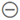

# Een dashboard of rapport delen via de mobiele Power BI-apps
Van toepassing op:

|  |  |  |  |  |
|:--- |:--- |:--- |:--- |:--- |
| iPhones |iPads |Android-telefoons |Android-tablets |Windows 10-apparaten |

>[!NOTE]
>Power BI-ondersteuning voor mobiele apps voor **telefoons met Windows 10 Mobile** wordt stopgezet op 16 maart 2021. [Meer informatie](https://go.microsoft.com/fwlink/?linkid=2121400)

Met een [Power BI Pro-licentie](../../service-features-license-type.md) kunt u anderen uitnodigen om uw dashboards en rapporten te bekijken door koppelingen te delen via de mobiele Power BI-apps. U kunt met iedereen binnen of buiten uw organisatie delen, met of zonder een zakelijk e-mailaccount. Uw ontvangers hebben ook een Power BI Pro-licentie nodig of de inhoud moet zich in een [Premium-capaciteit](../../service-premium-what-is.md) bevinden.

U kunt ook [momentopnamen van tegels, rapporten of visuele elementen van aantekeningen voorzien](mobile-annotate-and-share-a-tile-from-the-mobile-apps.md) en delen met de mobiele Power BI-app voor iOS en Android-apparaten. 

## Delen via uw iPhone of iPad

1. U kunt een dashboard of rapport delen vanuit het dashboard of rapport zelf, of via de startpagina van het dashboard of rapport:
    *  Tik vanuit een dashboard of rapport op het pictogram **Delen**  in de actiebalk onder in het dashboard of rapport.
    *  Tik op de startpagina van een dashboard of rapport op het pictogram **Info**  naast de naam van het dashboard of rapport en tik vervolgens op het pictogram **Delen**  op het tabblad Info dat wordt weergegeven.
2. Typ de namen, gescheiden door komma's, en een bericht bij de uitnodiging. Laat **Ontvangers toestaan opnieuw te delen** geselecteerd om ontvangers toe te staan uw dashboard of rapport opnieuw te delen. Als deze optie is ingeschakeld, kunnen uw collega's de e-mail met uw uitnodiging doorsturen naar anderen in uw organisatie, via het web of via de mobiele apps.
3. Tik op **Verzenden** in de rechterbovenhoek.
   
   Ontvangers krijgen een e-mailbericht met een rechtstreekse koppeling naar het dashboard of rapport. De uitnodiging verloopt na één maand. Wanneer ze de koppeling openen in de Power BI-service of in de mobiele Power BI-app, wordt het dashboard toegevoegd aan het gedeelte **Gedeeld met mij** van hun Power BI-account. U krijgt als volgt toegang tot het gedeelte Gedeeld met mij:
   
   * Tik in de mobiele Power BI-app op **Meer opties** (...) op de navigatiebalk en kies  **Gedeeld met mij**.
   * Klik in de Power BI-service op  **Gedeeld met mij** in het linkernavigatievenster.
   
   Lees meer [opmerkingen over het delen met collega's](../../service-share-dashboards.md).

### Delen opheffen via uw iPhone of iPad
U kunt het delen alleen opheffen als u de eigenaar van het dashboard of rapport bent.

1. Tik op het **deelpictogram** in de actiebalk onder in het dashboard of rapport.
2. Tik op **Gedeeld met**. Hier ziet u de lijst met collega's met wie u dit dashboard of rapport hebt gedeeld.

3. Tik op **Meer opties** (...) naast de naam van de persoon die u wilt verwijderen en kies of u alleen de toegang tot het gedeelde dashboard of ook de toegang tot alle onderliggende inhoud die wordt gebruikt, wilt verwijderen.

## Delen via uw Android-apparaat
1. U kunt een dashboard of rapport delen vanuit het dashboard of rapport zelf, of via de startpagina van het dashboard of rapport:
    *  Tik in een dashboard of rapport op **Meer opties** (...) bovenaan het dashboard of rapport en kies **Een collega uitnodigen**.
    *  Tik op de startpagina van een dashboard of rapport op **Meer opties** (...) naast de naam van het dashboard of rapport en tik vervolgens op het pictogram **Delen**  op het tabblad Info dat wordt weergegeven.
 
2. Typ de e-mailadressen en een bericht bij de uitnodiging voor uw dashboard. Anders wordt een standaardbericht verzonden door Power BI. Laat **Ontvangers toestaan dit dashboard te delen** geselecteerd om ontvangers toe te staan uw dashboard te delen. Als deze optie is ingeschakeld, kunnen uw collega's de e-mail met uw uitnodiging doorsturen naar anderen in uw organisatie, via de browser of via de mobiele apps.
   
3. Tik op het **verzendpictogram** in de rechterbovenhoek om de e-mail te verzenden.
   
    Ontvangers krijgen een e-mailbericht met een rechtstreekse koppeling naar het dashboard of rapport. De uitnodiging verloopt na één maand. Wanneer ze de koppeling openen in de Power BI-service of in de mobiele Power BI-app, wordt het dashboard toegevoegd aan het gedeelte **Gedeeld met mij** van hun Power BI-account. U krijgt als volgt toegang tot het gedeelte Gedeeld met mij:
   * Tik in de mobiele Power BI-app op **Meer opties** (...) op de navigatiebalk en kies  **Gedeeld met mij**.
   * Klik in de Power BI-service op  **Gedeeld met mij** in het linkernavigatievenster.
   
   Lees meer [opmerkingen over het delen met collega's](../../service-share-dashboards.md).

### Delen opheffen via uw Android-apparaat
U kunt het delen alleen opheffen als u de eigenaar van het dashboard of rapport bent.

1. U kunt het delen van een dashboard of rapport opheffen vanuit het dashboard of rapport zelf of via de startpagina van het dashboard of rapport:
    *  Tik in een dashboard of rapport op **Meer opties** (...) bovenaan het dashboard of rapport en kies **Een collega uitnodigen**.
    *  Tik op de startpagina van een dashboard of rapport op **Meer opties** (...) naast de naam van het dashboard of rapport en tik vervolgens op het pictogram **Delen**  op het tabblad Info dat wordt weergegeven.

2. Onderaan de pagina **Personen toevoegen** die wordt weergegeven, ziet u de lijst met collega's met wie u dit dashboard of rapport hebt gedeeld. Tik op de naam van de collega waarmee u het delen wilt opheffen.
3. Op de pagina **Wie heeft toegang** die wordt weergegeven, tikt u op het pictogram **Verwijderen**  en kiest u of u alleen de toegang tot het gedeelde dashboard of ook de toegang tot alle onderliggende inhoud die wordt gebruikt, wilt verwijderen.

## Delen via uw Windows 10-apparaat

1. U kunt een dashboard of rapport delen vanuit het dashboard of rapport zelf of via de startpagina van het dashboard of rapport:
    * Of tik in een dashboard of rapport op het pictogram **Delen** .
    * Klik op de startpagina van een dashboard of rapport met de rechtermuisknop of druk en houd ingedrukt. Kies vervolgens **Uitnodigen**.
   
   Als u de eigenaar van het dashboard of rapport bent, ziet u hier de lijst met collega's met wie u dit dashboard of rapport hebt gedeeld.

2. Typ de e-mailadressen en een bericht bij de uitnodiging. Anders wordt een standaardbericht verzonden door Power BI. Laat **Ontvangers toestaan dit dashboard te delen** geselecteerd om ontvangers toe te staan uw dashboard te delen. Als deze optie is ingeschakeld, kunnen uw collega's uw dashboard of rapport delen met anderen in uw organisatie, via de browser of via de mobiele apps.
   
3. Tik op het **verzendpictogram**.
   
    Ontvangers krijgen een e-mailbericht met een rechtstreekse koppeling naar het dashboard of rapport. De uitnodiging verloopt na één maand. Wanneer ze de koppeling openen in de Power BI-service of in de mobiele Power BI-app, wordt het dashboard toegevoegd aan het gedeelte **Gedeeld met mij** van hun Power BI-account. U krijgt als volgt toegang tot het gedeelte Gedeeld met mij:
   
   * Tik in de mobiele Power BI-app op **Meer opties** (...) op de navigatiebalk en kies  **Gedeeld met mij**.
   * Klik in de Power BI-service op  **Gedeeld met mij** in het linkernavigatievenster.
   
   Lees meer [opmerkingen over het delen met collega's](../../service-share-dashboards.md).

## Volgende stappen
* [Een tegel, rapport of visueel element van aantekeningen voorzien en er een momentopname van delen via de mobiele apps](mobile-annotate-and-share-a-tile-from-the-mobile-apps.md)
* [Een dashboard of rapport delen in Power BI](../../service-share-dashboards.md)
* Vragen? [Misschien dat de Power BI-community het antwoord weet](https://community.powerbi.com/)

