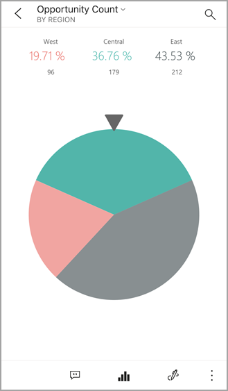
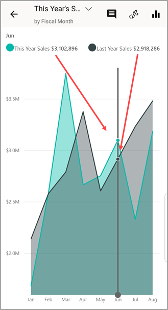

# Werken met tegels in de mobiele Power BI-apps
Van toepassing op:

|  |  |  |  |  |
|:--- |:--- |:--- |:--- |:--- |
| iPhones |iPads |Android-telefoons |Android-tablets |Windows 10-apparaten |

Tegels zijn live-momentopnamen van uw gegevens, die zijn vastgemaakt aan een dashboard. De inhoud van de tegels wordt aangepast als de onderliggende gegevens veranderen. **[U kunt tegels toevoegen aan een dashboard in de Power BI-service](../end-user-tiles.md).** 

Vervolgens kunt u ze in een mobiele Power BI-app openen in de focusmodus om ermee te werken. U kunt tegels openen met alle soorten visualisaties, waaronder tegels op basis van Bing en R.

## Tegels in de iOS-apps

1. Open een [dashboard in de mobiele app voor iOS](mobile-apps-view-dashboard.md).
2. Tik op een tegel. De tegel wordt nu geopend in de focusmodus, waar u de gegevens op de tegel eenvoudiger kunt bekijken en verkennen. In de focusmodus kunt u het volgende doen:
   
   Tik in een lijn-, staaf- of kolomdiagram om de waarden voor specifieke onderdelen van de visualisatie weer te geven.
   
    
   
   *In dit lijndiagram ziet u bijvoorbeeld de waarden voor de omzet van **augustus** dit jaar (**This Year Sales**) en vorig jaar **Last Year Sales**.*  
   
   Tik in een cirkeldiagram op een segment van de cirkel om de waarde van het segment boven de cirkel weer te geven.  
   
   
3. Tik in een kaart op het pictogram **Kaart centreren**  om op de kaart uw huidige locatie te centreren.

   

4. Tik op het potloodpictogram  om [aantekeningen te maken op een tegel](mobile-annotate-and-share-a-tile-from-the-mobile-apps.md#annotate-and-share-the-tile-report-or-visual) en vervolgens op het  om [ de tegel met anderen te delen](mobile-annotate-and-share-a-tile-from-the-mobile-apps.md#annotate-and-share-the-tile-report-or-visual).

5. [Voeg een waarschuwing toe aan de tegel](mobile-set-data-alerts-in-the-mobile-apps.md). Als de waarden boven of onder de gestelde doelen komen, krijgt u een melding van Power BI.

6. Soms heeft de maker van het dashboard een koppeling toegevoegd aan een tegel. Als dit het geval is, heeft deze een koppelingspictogram  wanneer geopend in de focusmodus:
   
    
   
    Koppelingen kunnen een ander Power BI-dashboard als bestemming hebben of een externe URL. [Tik op de koppeling](../../create-reports/service-dashboard-edit-tile.md#hyperlink) om deze te openen in de Power BI-app. Als de URL verwijst naar een externe site, moet u eerst toestemming geven om naar de site te gaan.
   
    
   
    Nadat u de koppeling hebt geopend in de Power BI-app, kunt u de koppeling kopiëren en deze openen in een browservenster.
7. [Open het rapport](mobile-reports-in-the-mobile-apps.md)  waarop de tegel is gebaseerd.
8. Als u de focusmodus wilt verlaten, tikt u op de naam van de tegel en vervolgens op de naam van het dashboard of op **Mijn werkruimte**.
   
    

## Tegels in de mobiele app voor Android-telefoons en -tablets
1. Open een [dashboard in de mobiele Power BI-app](mobile-apps-view-dashboard.md).
2. Tik op een tegel om deze te openen in de focusmodus, waar u de gegevens op de tegel eenvoudiger kunt bekijken en verkennen.
   
   
   
    In de focusmodus kunt u het volgende doen:
   
   * Tik op de grafiek om de staaf in een lijn-, staaf-, kolom- of bellendiagram te verplaatsen, of om de waarden voor een bepaald punt in de visualisatie te bekijken.  
   * Tik op het potloodpictogram  om [aantekeningen te maken op een tegel](mobile-annotate-and-share-a-tile-from-the-mobile-apps.md#annotate-and-share-the-tile-report-or-visual) en vervolgens op het  om [de tegel met anderen te delen](mobile-annotate-and-share-a-tile-from-the-mobile-apps.md#annotate-and-share-the-tile-report-or-visual).
   * Tik op het  om [het rapport weer te geven](mobile-reports-in-the-mobile-apps.md) in de mobiele app.
3. Soms heeft de maker van het dashboard een koppeling toegevoegd aan een tegel. Als u in dat geval op het verticale beletselteken ( **...** ) tikt, ziet u **Koppeling openen** :
   
    
   
    Koppelingen kunnen een ander Power BI-dashboard als bestemming hebben of een externe URL. [Tik op de koppeling](../../create-reports/service-dashboard-edit-tile.md#hyperlink) om deze te openen in de Power BI-app. Als de URL verwijst naar een externe site, moet u eerst toestemming geven om naar de site te gaan.
   
    
   
    Nadat u de koppeling hebt geopend in de Power BI-app, kunt u de koppeling kopiëren en deze openen in een browservenster.
4. Tik op de pijl in de linkerbovenhoek om de tegel te sluiten en terug te keren naar het dashboard.

## Tegels in de mobiele app voor Windows 10

>[!NOTE]
>Power BI-ondersteuning voor mobiele apps voor **telefoons met Windows 10 Mobile** wordt stopgezet op 16 maart 2021. [Meer informatie](/legal/powerbi/powerbi-mobile/power-bi-mobile-app-end-of-support-for-windows-phones)

1. Open een [dashboard in de mobiele Power BI-app](mobile-apps-view-dashboard.md) voor Windows 10.
2. Tik op de drie verticale puntjes op de tegel. Hier kunt u het volgende doen: 
   
    
   
    [Een momentopname van de tegel delen](mobile-windows-10-phone-app-get-started.md).
   
    Tik op **Rapport openen**  om [het onderliggende rapport weer te geven](mobile-reports-in-the-mobile-apps.md).
   
    [De koppeling openen](../../create-reports/service-dashboard-edit-tile.md#hyperlink), als de tegel een koppeling heeft. Koppelingen kunnen een Power BI-dashboard als bestemming hebben of een externe URL.
3. Tik op **Tegel uitvouwen** . De tegel wordt nu geopend in de focusmodus, waar u de gegevens op de tegel eenvoudiger kunt bekijken en verkennen. In deze modus kunt u het volgende doen:
   
   Een cirkeldiagram draaien om de waarden van een segment boven de cirkel weer te geven.  
   
   
   
   Tik op de grafiek om de staaf in een lijn-, staaf-, kolom- of bellendiagram te verplaatsen, of om de waarden voor een bepaald punt in de visualisatie te bekijken.  
   
   
   
   *In dit staafdiagram worden de waarden voor de staaf **Décor** boven de grafiek weergegeven.*
   
   Tik op het pictogram **Volledig scherm**  om de tegel in de modus Volledig scherm te openen zonder de navigatie- en menubalken.
   
   > [!NOTE]
   > U kunt ook [dashboards en rapporten schermvullend weergeven](mobile-windows-10-app-presentation-mode.md) in de mobiele Power BI-app voor Windows 10.
   > 
   > 
   
   Tik in een kaart op het pictogram **Kaart centreren**  om op de kaart uw huidige locatie te centreren.
   
   
   
   Tik op het pictogram Momentopname delen  om [een tegel](mobile-windows-10-phone-app-get-started.md) met anderen te delen.   
   
   Tik op het pictogram Rapport openen  om [het rapport weer te geven](mobile-reports-in-the-mobile-apps.md) waarop de tegel is gebaseerd. 
4. Tik op de pijl naar links of de knop Terug om de tegel te sluiten en terug te gaan naar het dashboard.

## Volgende stappen
* [Wat is Power BI?](../../fundamentals/power-bi-overview.md)
* Vragen? [Misschien dat de Power BI-community het antwoord weet](https://community.powerbi.com/)