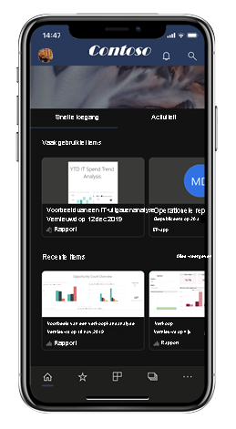
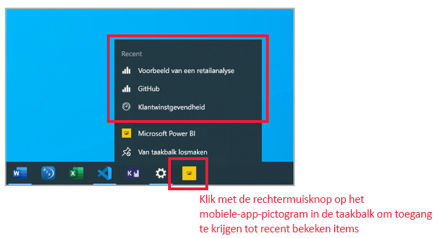
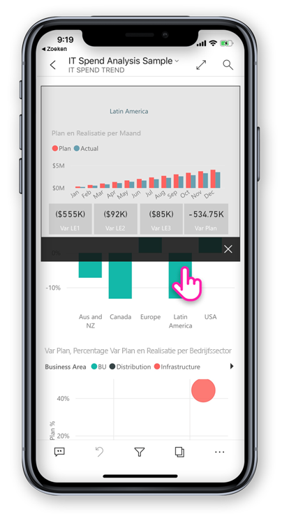

# Wat is er nieuw in de mobiele apps voor Power BI
Zie de volgende onderwerpen voor verwante informatie over nieuwe functies en mogelijkheden:

* [Power BI team blog for the mobile apps](https://powerbi.microsoft.com/blog/tag/mobile/) (Power BI-teamblog voor mobiele apps)
* [What's new in Power BI Desktop](../../fundamentals/desktop-latest-update.md) (Wat is er nieuw in Power BI Desktop)  
* [What's new in the Power BI service](../../fundamentals/service-whats-new.md) (Wat is er nieuw in de Power BI-service)

>[!NOTE]
>Power BI-ondersteuning voor mobiele apps voor **telefoons met Windows 10 Mobile** wordt stopgezet op 16 maart 2021. [Meer informatie](https://go.microsoft.com/fwlink/?linkid=2121400)

## Juni 2020
### Uw bladwijzers weergeven in diavoorstellingen (Windows)
U kunt nu rapport- en persoonlijke bladwijzers opnemen in uw diapresentaties (automatisch als onderdeel van de presentatie) om specifieke inzichten in uw gegevens uit te lichten.
[Probeer het!](mobile-windows-10-app-presentation-mode.md#use-presentation-mode)

## Mei 2020
### Er is een donkere modus toegevoegd aan Power BI - Mobiel (iOS)
Probeer de nieuwe donkere modus in de mobiele app van Power BI voor iOS13. In de donkere modus ziet u lichte tekst op een donkere achtergrond, waardoor de helderheid van het scherm wordt verkleind en de inhoud gemakkelijker wordt weergegeven. U kunt schakelen tussen thema's in de instellingen voor uiterlijk. [Meer informatie](mobile-apps-dark-mode.md)

### Bladwijzers toepassen in presentatiemodus (Windows)
Wanneer u nu een rapport in de presentatiemodus presenteert, kunt u zowel persoonlijke als rapportbladwijzers toepassen op rapportpagina's, zodat u het verhaal kunt vertellen over uw gegevens. [Probeer het!](mobile-windows-10-app-presentation-mode.md#use-presentation-mode)

## April 2020

### Delen vanuit werkruimten is nu beschikbaar
We hebben de mogelijkheid toegevoegd om rapporten en dashboards te delen vanuit werkruimten. U kunt uw inhoud nu delen vanuit Mijn werkruimte en vanuit andere werkruimten als de eigenaar van de werkruimte dit toestaat, net zoals in de Power BI-service. 

### Dashboards ondersteunen nu de modus Volledig scherm (iOS en Android)
U kunt uw dashboards voortaan weergeven in de modus Volledig scherm, zodat u meer ruimte hebt om de inhoud van de dashboards weer te geven. 

## Maart 2020

### Sneltoetsen en Google Zoeken gebruiken om uw inhoud te starten (Android)
We hebben het eenvoudiger gemaakt om uw gegevens te vinden en te starten door zowel snelkoppelingen als Google Zoeken te integreren met de Power BI-app. Maak snelkoppelingen voor eenvoudige toegang tot uw favoriete rapporten en dashboards rechtstreeks vanuit het startscherm van uw apparaat. En gebruik Google Zoeken om snel uw Power BI-inhoud te zoeken en te openen. Meer informatie over [snelkoppelingen voor Android-apps](mobile-app-quick-access-shortcuts.md) en [Google Zoeken](mobile-app-find-access-google-search.md).

### Verbeterde beveiliging met apparaatbeveiliging (preview) (Android)
Gebruik de ingebouwde beveiligingsmogelijkheden van uw apparaat om uw Power BI-app te beveiligen en de gewenste privacy te verkrijgen. Door biometrische verificatie (vingerafdruk-id) te vereisen voor toegang tot de Power BI-app zorgt u ervoor dat uw gegevens privé blijven en alleen door u worden gezien. [Meer informatie over systeemeigen beveiligde toegang](mobile-native-secure-access.md)

### Scannen is nu beschikbaar op de iPad
U kunt nu rechtstreeks vanaf uw iPad streepjescodes scannen om uw rapporten te filteren en QR-codes gebruiken om snel rapporten te openen.  

### Bijgewerkte filterervaring
Filters in de Power BI-app hebben nieuwe functionaliteit en een nieuw ontwerp. Het gaat onder meer om verbeterde zichtbaarheid van toegepaste filters die van invloed zijn op rapportvisuels en de mogelijkheid om filters te vergrendelen en zelfs te verbergen. Deze wijzigingen bieden ook betere compatibiliteit met filters in de Power BI-service.

## Februari 2020

### Modus voor meervoudige selectie (Android en iOS)

We hebben de mogelijkheid toegevoegd om meerdere gegevenspunten op een rapportpagina te selecteren. Als meervoudige selectie is ingeschakeld, wordt elk gegevenspunt waarop u tikt, toegevoegd aan de andere geselecteerde gegevenspunten. De gecombineerde resultaten worden automatisch gemarkeerd in alle visuals op de pagina. Als u de modus voor meervoudige selectie wilt inschakelen, gaat u naar de pagina [Instellingen](./mobile-app-interaction-settings.md) voor uw mobiele app.

>[!NOTE]
>De modus voor meervoudige selectie wordt ondersteund op Power BI Report Server in de volgende versie van Report Server.

### Voettekst van rapport kan nu altijd zichtbaar zijn in de mobiele app voor iPhones

Net als op uw Android-telefoon kunt u nu ook op uw iPhone kiezen of u de rapportvoettekst onderaan de rapportpagina wilt vastzetten, zodat deze altijd zichtbaar en beschikbaar is, ongeacht uw acties op de pagina. Hierdoor kunnen eenvoudig alle opties worden gebruikt. Als u de voettekst wilt vastzetten, zet u de schakeloptie **Vastgezette rapportvoettekst** op de pagina [Instellingen](./mobile-app-interaction-settings.md) van de mobiele app om.

### Ondersteuning voor PBIRS-rapporten (preview) (Windows)

U kunt nu uw PBIRS-rapporten (Power BI Report Server) openen in de Power BI-app.

### Snel toegang tot uw recente items (Windows)

Klik met de rechtermuisknop op het pictogram van de Power BI-app in de taakbalk van Windows om een lijst met al uw onlangs bekeken items weer te geven. Klik op een item in de lijst om snel terug te gaan.

## Januari 2020

### Aantekeningen delen die gemaakt zijn in de presentatiemodus (Windows)

Aantekeningen die u tijdens presentaties maakt, worden een integraal gedeelte van de presentatie en een belangrijk onderdeel van de discussie. Vanaf nu kunt u een momentopname van de rapportpagina delen met uw collega's wanneer u aantekeningen maakt in de presentatiemodus. [Meer informatie](./mobile-windows-10-app-presentation-mode.md#use-presentation-mode)

## December 2019

### Voettekst van het gedokte rapport en een knop voor vernieuwen: nieuwe ervaringen voor interactie met rapporten (Android)

We hebben van onze Android-gebruikers gehoord dat hun ervaring met rapporten niet optimaal is: het is lastig om de rapportvoettekst te gebruiken en op sommige apparaten is de functie Omlaag slepen om te vernieuwen te gevoelig. Daarom hebben we dit gedrag in deze release gewijzigd:
* **Voettekst van gedokt rapport**: als u een rapport op uw telefoon opent, vindt u de rapportvoettekst onderaan de rapportpagina, waar deze altijd zichtbaar en beschikbaar is, ongeacht uw acties op de pagina. Hierdoor kunnen eenvoudig alle opties worden gebruikt.
* **Knop Vernieuwen in koptekst van het rapport**: u vindt ook een knop Vernieuwen in de koptekst van het rapport, zodat u het rapport eenvoudig kunt vernieuwen wanneer u wilt.

Gebruikers die de voorkeur aan het vorige gedrag geven, kunnen dit gedrag herstellen via de nieuwe, uitgebreide [interactie-instellingen](./mobile-app-interaction-settings.md) in de mobiele app.

Daarnaast kunnen IT-beheerders door middel van het MDM-hulpprogramma van hun keuze via een app-configuratiebestand [de nieuwe standaardinstellingen op afstand wijzigen](./mobile-app-configuration.md#interaction-settings-ios-and-android) namens hun gebruikers. Op deze manier kan voor alle gebruikers in een organisatie hetzelfde gedrag worden geconfigureerd.

> [!NOTE]
> Interactie-instellingen voor de knop Vernieuwen en voor het dokken van de rapportvoettekst hebben momenteel geen effect op rapportserver-rapporten. Dit verandert in de release van de rapportserver in januari.

### Standaardbladwijzers instellen vanuit uw mobiele app
U kunt nu standaardbladwijzers voor uw rapporten rechtstreeks instellen vanuit uw mobiele Power BI-app. Steeds wanneer u een rapport opent, wordt de standaardbladwijzer automatisch toegepast. [Meer informatie.](./mobile-reports-in-the-mobile-apps.md#bookmarks)

### Filteren op locatie op Android-tablets
Met geo-filtering kunt u uw rapporten filteren op basis van uw huidige locatie. Deze functie is nu ook beschikbaar in de Power BI-app voor Android-tablets. [Meer informatie.](./mobile-apps-geographic-filtering.md)

## November 2019

### Het nieuwe uiterlijk van de Power BI-app is nu standaard ingeschakeld
 
Wanneer u nu de app opent, worden de nieuwe vormgeving en navigatiebalken automatisch ingeschakeld, zodat u gemakkelijker inhoud kunt zoeken en openen. Gebruik de [startpagina](mobile-apps-home-page.md) van de app als uitgangspunt; u krijgt snel toegang tot uw belangrijkste inhoud, evenals een [activiteitsfeed](mobile-apps-home-page.md#activity-feed) waarmee u op de hoogte blijft van alle meest recente waarschuwingen, meldingen en meer.

### De meeste recente Power BI-activiteiten weergeven
 
Met de activiteitsfeed kunt u in realtime bijhouden wat er gebeurt met uw Power BI-inhoud. Ga naar de startpagina van de app en open het tabblad Activiteit om alle meest recente meldingen, waarschuwingen, opmerkingen, @mentions en meer weer te geven. [Meer informatie](mobile-apps-home-page.md#activity-feed).

### Bladwijzers gebruiken in uw rapporten

De mobiele Power BI-app ondersteunt nu bladwijzers die in Power BI zijn gemaakt. Wanneer u de app opent, kunt u gebruikmaken van bladwijzers die door de auteur van het rapport zijn gemaakt en eventuele persoonlijke bladwijzers die u zelf hebt gemaakt. [Meer informatie](mobile-reports-in-the-mobile-apps.md#bookmarks).

## Oktober 2019

### Android-ondersteuning voor externe configuratie van de toegangsinstellingen van de rapportserver

Er is Android-ondersteuning toegevoegd voor de externe configuratie van de toegangsinstellingen van de rapport server van de mobiele Power BI-app. IT-beheerders kunnen nu het MDM-hulpprogramma van hun organisatie gebruiken om deze instellingen op zowel iOS- als Android-apparaten op afstand te configureren. Zie [Toegang via mobiele Power BI-apps tot rapportserver op afstand configureren](https://docs.microsoft.com/power-bi/report-server/configure-powerbi-mobile-apps-remote) voor meer informatie.

### Drillthrough voor verschillende rapporten

Deze maand hebben we ondersteuning toegevoegd voor drillthrough voor verschillende rapporten. U kunt nu op een gegevenspunt tikken om een drilldownbewerking uit te voeren voor toegang tot andere rapporten en rapportpagina's. Wanneer u een drilldownbewerking naar een doelpagina uitvoert, wordt de inhoud op die pagina gefilterd op basis van de drillthrough-instellingen.

> [!NOTE]
> Drillthrough voor meerdere rapporten is alleen beschikbaar als deze functie tijdens het maken van het rapport is ingeschakeld. [Meer informatie over drillthrough voor meerdere rapporten](https://docs.microsoft.com/power-bi/desktop-cross-report-drill-through).

### Gevoeligheidslabels voor gegevens

U kunt nu gevoeligheidslabels zien die eigenaren van inhoud hebben ingesteld in rapporten, dashboards, gegevenssets en gegevensstromen om de gevoeligheid van hun gegevens te classificeren. Gevoeligheidslabels bepalen hoe inhoud met andere gebruikers kan worden gedeeld. [Meer informatie over gevoeligheidslabels voor gegevens in Power BI](https://docs.microsoft.com/power-bi/admin/service-security-data-protection-overview).

### Ondersteuning voor aangepaste navigatie in apps (Windows)

Er is nu voor aangepaste navigatie in apps naast ondersteuning voor iOS en Android ook ondersteuning toegevoegd voor Windows-apparaten (zie [het item Wat is er nieuw? van september](#september-2019)).

## September 2019

### Ondersteuning voor aangepaste navigatie in apps (iOS en Android)

We hebben ondersteuning voor aangepaste navigatie in apps toegevoegd. Wanneer u nu een app opent in Power BI - Mobiel, kunt u gebruikmaken van de aangepaste navigatie die door de maker van de app is ontwikkeld. Navigatie in de app kan worden geordend op inhoud en kan nieuwe items bevatten, zoals koppelingen en samengevouwen secties.
Lees meer over [aangepaste navigatie](https://powerbi.microsoft.com/blog/designing-custom-navigation-for-power-bi-apps-is-now-available/).

## augustus 2019

### Maak kennis met de nieuwe look voor Power BI - Mobiel (preview) (iOS en Android)

We hebben onze app vernieuwd en nieuwe ervaringen geïntroduceerd, bijvoorbeeld een startpagina met snelle toegang tot uw veelgebruikte inhoud en nieuwe navigatievensters voor eenvoudige navigatie door de app. Met de vernieuwde en frisse ervaringen is het nog makkelijker en sneller om te zoeken wat u nodig hebt, wanneer u het nodig hebt.
Aangezien de nieuwe look nog in preview is, moet u die inschakelen om er gebruik van te maken.
Meer informatie over [de nieuwe look van Power BI - Mobiel](https://powerbi.microsoft.com/blog/introducing-power-bi-mobile-apps-new-look-preview/).

### Beveiligde toegang met Azure Active Directory-toepassingsproxy (AAD) (iOS en Android)

We zijn partner geworden met het Azure Active Directory-team om mobiele Power BI-toepassingen met Azure Active Directory-toepassingsproxy (AAD) te integreren. Met deze configuratie kunt u via een Power BI Mobile-app verbinding maken met een Report Server die binnen de bedrijfsgrenzen wordt gehost, zonder complexe on-premises configuratie te hoeven instellen. Lees meer over [de integratie van Power BI Mobile en Azure AD-toepassingsproxy](https://powerbi.microsoft.com/blog/access-on-prem-report-server-from-your-power-bi-mobile-app-with-azure-active-directory-application-proxy/). Lees meer over het [configureren van Azure AD-toepassingsproxy en Power BI](https://docs.microsoft.com/azure/active-directory/manage-apps/application-proxy-integrate-with-power-bi).

## Juli 2019

### Knopinfo rapportpagina

Knopinfo voor rapportpagina's wordt niet ondersteund bij het weergeven van rapporten in uw mobiele app. U kunt gewoon op een visual waaraan knopinfo voor rapporten is gekoppeld tikken en deze ingedrukt houden om deze knopinfo weer te gegeven.  

 
> [!NOTE]
> Knopinfo voor het rapportcanvas wordt ondersteund voor apparaten met meer pixels dan 640 en een grotere viewport dan 320. Op kleinere apparaten wordt gebruikgemaakt van standaardknopinfo.

## Juni 2019

### Het scannen van streepjescodes is nu beschikbaar in Android
U kunt nu uw Power BI-app op Android (telefoon en tablet) gebruiken om streepjescodes te scannen op producten of de schappen in de winkel om gerelateerde Power BI-rapporten weer te geven die met de gescande waarde zijn gefilterd. Meer informatie over [het filteren van gegeven met streepjescodes](mobile-apps-scan-barcode-iphone.md) (Engelstalig).

### Ondersteuning van PBIX-rapporten die worden gehost in PBI-RS via ADFS-configuratie (iOS, Android)

Power BI-rapporten (PBIX) die in PBI-RS via ADFS-configuratie worden gehost, kunnen nu ook worden geopend vanuit de mobiele Power BI-apps.

## Mei 2019

### Ondersteuning voor Siri-snelkoppelingen (iOS)
Gebruikers kunnen Siri-snelkoppelingen naar hun Power BI-rapporten en -dashboards maken en deze rechtstreeks openen via de Siri-spraakinterface. [Lees hoe u Siri-snelkoppelingen in een Power BI-iOS-app gebruikt](https://powerbi.microsoft.com/blog/introducing-siri-integration-with-power-bi-mobile-ios-app-preview/).

### Apparaat zoeken (iOS)
Power BI integreren met de iOS-functie voor het zoeken naar apparaten (Spotlight). Bij zoekopdrachten naar inhoud in een iPhone of iPad zijn nu ook Power BI-items opgenomen. Wanneer gebruikers apparaateigen zoekopdrachten uitvoeren, worden Power BI-rapporten, -dashboards, -apps, -werkruimten en personen die aan de zoekcriteria voldoen, ook in de lijst met resultaten vermeld. [Ga naar de blogpost voor meer informatie](https://powerbi.microsoft.com/blog/introducing-siri-integration-with-power-bi-mobile-ios-app-preview/).

### Interactie met het rapport met één keer tikken - algemene beschikbaarheid

Eén keer tikken is nu algemeen beschikbaar. Dit is de standaardaanraakinteractie voor nieuwe gebruikers. Gebruikers kunnen deze functie nog steeds zelf uitschakelen en dubbeltikken instellen bij de app-instellingen.

### Geavanceerde beveiliging voor voorwaardelijke toegang (iOS, Android)

Voor een betere beveiliging hebben we AAD geïntegreerd met [nieuwe voorwaardelijke toegangsmogelijkheden op basis van app-beveiliging](https://docs.microsoft.com/azure/active-directory/conditional-access/app-protection-based-conditional-access), door de toegang tot Power BI te beperken wanneer er nog geen app-beleid is toegepast.

### Apparaatbeveiliging (iOS)

Gebruikers kunnen ingebouwde apparaatbeveiliging gebruiken om Power BI te beveiligen door om een Face ID, Touch ID of wachtwoordcode te vragen voor toegang tot Power BI. Dit kan door gebruikers worden beheerd in de app-instellingen, maar ook door beheerders in Intune en andere MDM-hulpprogramma's. [Meer informatie](https://docs.microsoft.com/power-bi/consumer/mobile/mobile-ios-native-secure-access).

### Diavoorstelling van rapporten van één pagina (Windows)

Biedt nu ook ondersteuning voor automatisch vernieuwen voor rapporten van één pagina in een diavoorstelling. Als de onderliggende gegevensbron van een rapport wordt bijgewerkt, wordt deze update dus opgepakt en worden de gegevens op die pagina bijgewerkt.

## April 2019

### Visual Belangrijkste beïnvloeders 

De visual Belangrijkste beïnvloeders is nu beschikbaar in uw mobiele app. Met deze visual kunt u in slechts enkele tikken de belangrijkste drijfveren voor uw gegevens analyseren.

### Opmerkingen toevoegen aan de inhoud van rapporten (Android en iOS)

U kunt nu opmerkingen gebruiken om samen te werken en uw feedback te delen op rapportpagina's en in visuals. Lees meer over opmerkingen in rapporten in de Power BI-service en Power BI Mobile [in dit blog](https://powerbi.microsoft.com/blog/announcing-report-commenting-for-power-bi-service-and-mobile/). 

### De weergave maximaliseren met de volledig scherm-modus (Android en iOS)

We hebben een nieuwe knop toegevoegd waarmee u kunt bepalen wanneer de aandacht op uw gegevens moet zijn gericht door rapportheaders en -footers te verwijderen en u de maximale ruimte te geven om uw rapporten te bekijken.

## Maart 2019

### Ondersteuning voor externe gastgebruikers in Power BI-apps (iOS, Android)

U kunt rechtstreeks vanuit de app toegang krijgen tot Power BI-inhoud die met u is gedeeld door een andere organisatie (ook wel bekend als B2B). Lees [hier](https://powerbi.microsoft.com/blog/power-bi-mobile-apps-now-support-azure-ad-b2b-guest-users/) meer over mobiele Power BI-apps B2B.

### De presentatiemodus van Windows verbeteren met een diavoorstelling (Windows)

Met een [diavoorstelling](https://powerbi.microsoft.com/blog/enhancing-presentation-mode-with-slideshow-in-windows-power-bi-app/) kunt u openbare schermen in uw kantoor gebruiken om Power BI-rapporten op volledig scherm uit te voeren. De rapportpagina's worden indien nodig automatisch geroteerd.  

### PBI-RS-rapporten ondersteunen via ADFS- en WAP-configuratie (alleen iOS)

U hebt nu via een Power BI-iOS-app toegang tot Power BI-rapporten (PBIX) die in PBI-RS worden gehost via ADFS-configuratie.

### Interactie met één keer tikken inschakelen voor rapportvisuals

We hebben de interactie met rapporten gewijzigd: u hoeft nu slechts eenmaal op een visual, knop of slicer te tikken om direct interactief met de bijbehorende gegevens te werken. Gebruikers hoeven niet langer op een visual te tikken om deze te selecteren en nogmaals te tikken om ermee te werken. Dit kan nu met één keer tikken.

> [!NOTE]
> Bestaande gebruikers zullen dit gedrag in de app-instellingen moeten inschakelen. Zie het artikel [Rapportinteractie met één keer tikken configureren](https://docs.microsoft.com/power-bi/consumer/mobile/mobile-app-single-tap) voor meer informatie.

## Januari - februari 2019
 
### Visio-visuals

Eenmalige aanmelding (SSO) inschakelen in Visio-visuals, zodat er geen extra stappen zijn vereist voor aanmelding wanneer u in de app rapporten weergeeft met de Visio-visual. 

### Dashboardopmerkingen worden beschikbaar in de Windows-app Power BI - Mobiel

U kunt opmerkingen rechtstreeks aan dashboards en specifieke tegels toevoegen om uw gegevens te bespreken, en iedereen die het dashboard bekijkt ziet uw opmerkingen. 

## December 2018

### Filter is nu beschikbaar voor liggende rapporten 

Het filterdeelvenster van het rapport is nu beschikbaar voor liggende rapporten (naast het telefoonrapport).

## November 2018

### Moderne visualheader 

In rapporten die de nieuwe 'moderne visualheader' gebruiken, wordt geen ruimte meer toegewezen voor headers. Dit resulteert in minder lege ruimte en meer ruimte voor uw visuals.

### Verbeterde presentatiemodus (Windows)

Verbeterde presentatiemodus voor Surface Hub en Windows 10-apparaten.  Profiteer van een verbeterde Surface Hub-vergaderruimte, met verbeterde presentatie- en samenwerkingsmiddelen en een strakke, geoptimaliseerde weergave op groot scherm, zodat u zich kunt richten op uw gegevens. Presentatiemodus biedt u ook de middelen om u beter te laten presenteren en te discussiëren over uw gegevens. Lees [hier](https://powerbi.microsoft.com/blog/presentation-mode-in-power-bi-windows-app/) meer over de presentatiemodus.

### De staande rapportindeling in tablets (iOS en Android)

De telefoonrapportindeling, indien aanwezig, wordt nu gebruikt voor het weergeven van rapporten op tablets in de staande modus. Lees meer over [hoe u een telefoonindeling maakt in Power BI-service of Desktop](https://docs.microsoft.com/power-bi/desktop-create-phone-report/).

### Ondersteuning voor rapportquerytekenreeksen 

Als u een rapportkoppeling in de mobiele app opent waarin een querytekenreeks is opgenomen, wordt de koppeling eerst gefilterd op basis van de voorwaarden in de querytekenreeks. Meer informatie over [hoe u een rapport-URL met een querytekenreeks maakt](https://docs.microsoft.com/power-bi/service-url-filters/).  

### Gedeelde referenties (nu in Android)

Aanmelden bij Power BI vanuit de mobiele app was nog nooit zo eenvoudig. Met gedeelde referenties is het aanmeldingsproces vereenvoudigd, omdat de referenties van andere Microsoft 365-apps worden gebruikt op het apparaat om u te verifiëren bij de Power BI-service.

### In-app-URL's (nu in Android) 

Koppelingen in rapporten die verwijzen naar andere Power BI-artefacten, worden nu rechtstreeks in de app geopend. Hierdoor kunt u bijvoorbeeld aangepaste navigatiestromen bouwen, doordat u vanuit een rapport verwijst naar een dashboard.

### Gegevens weergeven en waarden kopiëren

Het actiemenu voor rapportvisals (...) heeft nu de optie om de onderliggende gegevens in tabelindeling weer te geven. Eenmaal in de tabel kunt u waarden ingedrukt houden om deze uit die tabel te kopiëren (ervan uitgaande dat er geen Intune-beleid is dat kopiëren beperkt).

## Oktober 2018

### Voorbeeld van gepagineerd rapport (alle apparaten)

Gepagineerde rapporten zijn nu beschikbaar in de Power BI-service. Gebruikers met toegang tot gepagineerde rapporten in de Power BI-service hebben ook toegang tot deze rapporten vanuit de mobiele app. 

Lees de Power BI-[blogpost over gepagineerde rapporten op mobiel](https://powerbi.microsoft.com/blog/power-bi-paginated-reports-also-available-in-power-bi-mobile-apps-preview/).

### Gedeelde referenties (iOS)

Aanmelden bij Power BI vanuit de mobiele app was nog nooit zo eenvoudig. Met gedeelde referenties is het aanmeldingsproces vereenvoudigd, omdat de referenties van andere Microsoft 365-apps worden gebruikt op het apparaat om u te verifiëren bij de Power BI-service.

### In-app URL's (iOS) 

Koppelingen in rapporten die verwijzen naar andere Power BI-artefacten, worden nu rechtstreeks in de app geopend. Hierdoor kunt u bijvoorbeeld aangepaste navigatiestromen bouwen, doordat u vanuit een rapport verwijst naar een dashboard.

### Ondersteuning voor iOS12 en watchOS 

De Power BI-app voor iOS is bijgewerkt en werkt nu naadloos met het nieuwe besturingssysteem op mobiele apparaten en Watch.

## September 2018

### Telefoonrapport bewerken in de browser (alle apparaten)

U kunt nu een telefoonrapportindeling maken voor een rapport dat al is gepubliceerd in de Power BI-service, en niet alleen in Power BI Desktop. U kunt deze maken in de modus Bewerken in uw browser.

### Dashboardopmerkingen (iOS en Android) 

U kunt opmerkingen rechtstreeks aan dashboards en specifieke tegels toevoegen om uw gegevens te bespreken, en iedereen die het dashboard bekijkt ziet uw opmerkingen. U kunt anderen in de organisatie toevoegen aan het gesprek met @mentioning. Degenen met @mentioned ontvangen een pushmelding met uw bericht op hun mobiele telefoon.

Op dit moment beschikbaar voor iOS en Android-apparaten. Windows ondersteuning binnenkort beschikbaar.

Lees het [blogbericht over dashboardopmerkingen](https://powerbi.microsoft.com/blog/announcing-dashboard-comments-in-power-bi/) in Power BI.

### Eenmalige aanmelding (Windows)

Eenmalige aanmelding (SSO) is een van de meest gevraagde functies voor de mobiele versie van Power BI voor Windows. U kunt nu uw primaire organisatie-account niet alleen gebruiken om u aan te melden bij de mobiele Windows-apparaten in uw domein aan te melden, maar ook om u naadloos aan te melden bij de Power BI-service. Meer informatie over [Eenmalige aanmelding en de mobiele Windows-apps](mobile-windows-10-app-single-sign-on-sso.md).

## Vorige maanden

### Juli 2018

#### Alleen iOS en Android

**Gedeelde filters**

U kunt nu rapporten met gedeelde filters en slicers ontvangen.

**Ondersteuning voor achtergrondafbeeldingen**

Wanneer u een rapport in liggende stand weergeeft op uw mobiele apparaat, kunt u dezelfde achtergrondafbeeldingen zien als in de webversie van Power BI.

### Juni 2018

#### Rapporten in volledig canvas

De actiebalken bovenaan en onderaan verdwijnen nu kort nadat het rapport is geladen, zodat u meer rapportinhoud tegelijk kunt bekijken.

#### Verbeterde canvasgrootte van rapporten op telefoon

De canvasgrootte van rapporten op een telefoon is vergroot, zodat meer visuals kunnen worden weergegeven.

### Mei 2018

#### Mobiele drillthrough: alle mobiele apps

U kunt inzoomen vanaf een geselecteerd gegevenspunt naar een andere rapportpagina in de mobiele apps, als de rapportontwerper die actie heeft gedefinieerd. 

#### De knop Terug: alle mobiele apps

Wanneer u nu door een rapport navigeert door te vegen, een rapportpagina op de actiebalk te kiezen of in te zoomen, gaat u met de knop Terug terug naar de vorige pagina die u hebt bekeken. 

#### Dashboardthema's: alle mobiele apps

Wanneer rapportontwerpers dashboardthema's in de Power BI-service aanpassen, wordt ook de vormgeving van het dashboard in de mobiele app gewijzigd. U ziet echter geen achtergrondafbeeldingen.

#### iOS: Toegang via Power BI mobiele iOS-apps tot rapportservers op afstand configureren

Uw IT-beheerder kan nu een MDM-hulpprogramma gebruiken om toegang via een Power BI mobiele iOS-app tot een rapportserver te configureren. Zie [Toegang via Power BI mobiele iOS-apps tot rapportserver op afstand configureren](../../report-server/configure-powerbi-mobile-apps-remote.md) voor meer informatie.

#### De app Power BI for Mixed Reality (preview)

De Power BI for Mixed Reality-app is nu beschikbaar in de Microsoft Store. Bekijk de dashboards en rapporten terwijl u in een virtuele omgeving werkt of plaats en bekijk deze op specifieke locaties in uw omgeving. Bekijk de nieuwe video [Kennismaking met Power BI op Hololens](https://www.youtube.com/watch?v=J_X_nOFUBss) voor context of lees het artikel over de nieuwe [Power BI for Mixed Reality-app](mobile-mixed-reality-app.md).

### April 2018

#### Mobiel in- en uitzoomen

U kunt nu met in- en uitzoomen dieper ingaan op de rapportvisuals op uw mobiele apparaat. Open deze nieuwe functie door op het menu van de knopinfo te tikken en uw vinger hierop te houden, waarna u op de knoppen voor in- en uitzoomen tikt om details voor uw gegevens weer te geven. Meer informatie over [in- en uitzoomen in mobiele apps](https://powerbi.microsoft.com/blog/drill-down-up-in-power-bi-mobile-apps/).

#### Permanente filters

We hebben onlangs rapportfilters en slicers bijgewerkt, zodat deze automatisch vanuit Power BI op het web naar de mobiele Power BI-app worden opgeslagen. Filters en slicers die u nu instelt in de mobiele app, worden automatisch opgeslagen naar Power BI op het web.

### Maart 2018

#### De app Power BI for Mixed Reality (preview)

We hebben de app Power BI for Mixed Reality gemaakt, zodat uw gegevens nog toegankelijker voor u zijn. Bekijk de dashboards en rapporten terwijl u in een virtuele omgeving werkt of plaats en bekijk deze op specifieke locaties in uw omgeving. Lees meer over de nieuwe [app Power BI for Mixed Reality](mobile-mixed-reality-app.md).

#### Rapporten en dashboards extern delen

Deel dashboards en rapporten met gebruikers buiten uw organisatie, rechtstreeks vanuit de app. Extern delen is ingeschakeld voor zowel sociale als organisatieaccounts. 

#### Permanente filters

Wanneer u filters en slicers instelt in Power BI op het web, worden uw filterkeuzes ook opgeslagen in uw mobiele app, zodat u verder kunt gaan waar u was gebleven.

#### Rapporten vernieuwen op de iPad

Power BI-rapporten hebben nu een knop Vernieuwen in de iPad-app.

### Februari 2018

#### Rapporten delen

U kunt een rapport nu rechtstreeks vanuit de mobiele apps delen. Meer informatie over het [delen van dashboards en rapporten vanuit de mobiele apps](mobile-share-dashboard-from-the-mobile-apps.md).

#### Verbeterde tooltips

Wanneer u op een visual van een rapport tikt en dit ingedrukt houdt, kunt u nu met uw vinger over de visual slepen om informatie weer te geven over elk gegevenspunt in het element.

### Januari 2018

#### Favoriete rapporten

Voeg rapporten toe aan uw favorieten zodat ze op de pagina **Favorieten** worden weergegeven. Lees meer over [favorieten in de mobiele Power BI-apps](mobile-apps-favorites.md).

#### Gedeelde rapporten bekijken

Als iemand nu een rapport met u deelt, wordt het samen met dashboards vermeld op de pagina **Gedeeld met mij**.

#### Verbeterde ondersteuning voor hyperlinks

U kunt nu op koppelingen in Power BI-visuals tikken om deze in uw mobiele browser te openen.

#### Intune-integratie (Android)

Ondersteuning voor voorwaardelijke toegang met Intune Mobile Device Management.

### December 2017

#### Verbeterd beveiligingsbeheer 

Ondersteuning voor voorwaardelijke toegang (CA) en Microsoft Intune Mobile Device Management (MDM) is op Android-apparaten toegevoegd zodat u de gegevens van uw organisatie beter kunt beveiligen. Deze functie is al beschikbaar op iOS.

#### Verbeterd beheer van machtigingen

Er zijn enkele wijzigingen aangebracht die zorgen voor nauwkeuriger beheer van gebruikersmachtigingen voor gegevenssets, dashboards en rapporten.

#### Automatisch geïnstalleerde apps

U hoeft sommige apps helemaal niet in Power BI te installeren. Auteurs van Power BI-apps in uw organisatie kunnen *apps* maken die een verzameling dashboards en rapporten bevatten. Vervolgens kunnen ze de app publiceren en instellen om deze automatisch te installeren in de Power BI-service en de mobiele Power BI-apps. Wanneer een app is ingesteld om te worden geïnstalleerd, wordt deze automatisch weergegeven in het menu **Apps**:

### November 2017
#### iPhone X-optimalisatie

De app-indeling voor iPhone X is geoptimaliseerd, zodat u uw gegevens in stijl op elk apparaat kunt verkennen.

### Oktober 2017
#### Filters voor telefoonrapporten in Android

Als u in Power BI Desktop een rapport maakt met pagina's die voor de telefoon zijn geoptimaliseerd en dat tevens filters bevat, kunt u die filters toepassen in het telefoonrapport op de Android. Lees meer over filters voor Power BI-rapporten op Android.

#### Gegevens weergeven in rapporten

U kunt nu visuele elementen in uw rapporten weergeven als een tabel om de cijfers achter de gegevens te zien. Om deze functie te benaderen, tikt u op ‘Gegevens weergeven’ in het menu ... van het visuele element op uw rapport of op het nieuwe pictogram op het actiemenu van het uitgevouwen visuele element.

### September 2017
#### Filters voor telefoonrapporten in iPhones
Als u in Power BI Desktop een rapport maakt met pagina's die voor de telefoon zijn geoptimaliseerd en dat tevens filters bevat, kunt u die filters toepassen in het telefoonrapport op de iPhone. Lees meer over [filters voor Power BI-rapporten op iPhones](https://powerbi.microsoft.com/blog/filters-coming-for-phone-reports-on-ios/) (Engelstalig).

### Augustus 2017
#### Ondersteuning voor iOS-proxyinstellingen
U kunt voortaan proxyinstellingen instellen in de mobiele Power BI iOS-app. Dit betekent dat Power BI kan werken met VPN-verbindingen op uw mobiele apparaat, waardoor meer gebruikers en organisaties onderweg veilig gebruik kunnen maken van de kracht van Power BI.

### Juli 2017
Lees het [overzicht van functies op mobiele apps van juli 2017](https://powerbi.microsoft.com/blog/power-bi-service-and-mobile-july-feature-summary/#ios-preview) (Engelstalig)

#### iOS-apparaten
**Nieuwe Q&A-mogelijkheid voor iOS (preview)** In plaats van enkel een antwoord op uw vraag te ontvangen, kunt u nu ook natuurlijke taal gebruiken om toegespitste antwoorden te krijgen. Ook als u niet weet wat u zoekt, krijgt u met Q&A proactief inzichten die relevant voor uw gegevens zijn. Het nieuwe Q&A voor mobiele apparaten, dat is ontwikkeld in samenwerking met het Microsoft-onderzoeksteam, herbergt krachtige technologieën. Doe de zelfstudie [Ask questions about your data in the iOS mobile apps](mobile-apps-ios-qna.md) (Vragen stellen over uw gegevens in de mobiele iOS-apps).

### Responsieve visuele elementen
**Responsief visueel element voor telefoonrapporten en dashboards** U kunt de visuele elementen in uw dashboard of rapport zodanig instellen dat ze *responsief* zijn. Dat wil zeggen dat ze dynamisch worden gewijzigd zodat ze de maximale hoeveelheid gegevens weergeven, ongeacht de schermgrootte. Lees de [blog over responsieve visuele elementen](https://powerbi.microsoft.com/blog/power-bi-desktop-july-feature-summary-2/#responsiveVisuals) (Engelstalig).

### Juni 2107
#### Alle apparaten
**Apps favoriet maken** U kunt al een dashboard favoriet maken. Onlangs zijn in [Power BI apps toegevoegd](../../collaborate-share/service-create-distribute-apps.md) (Engelstalig) en u kunt nu ook apps favoriet maken. 

### Mei 2017
#### Alle apparaten
**Nieuw menu: Gedeeld met mij** Ga naar Gedeeld met mij in het menu van de mobiele app om alle inhoud te zien die met u is gedeeld.

**Nieuw menu: Apps** Een app is een verzameling dashboards en rapporten die door uw organisatie is gebouwd om belangrijke metrieken te bieden zodat sneller en eenvoudiger besluiten op basis van gegevens kunnen worden gemaakt.

Lees meer over [hoe de inhoud in Power BI is georganiseerd](mobile-apps-quickstart-view-dashboard-report.md) (Engelstalig).

#### iOS- en Android-apparaten
**Power BI-rapportserver (preview)** Maak Power BI-rapporten on-premises en publiceer ze. Vervolgens [bekijkt u ze en werkt ermee in uw mobiele iOS- of Android-apparaat](mobile-app-ssrs-kpis-mobile-on-premises-reports.md) (Engelstalig). 

### April 2017
Lees het [overzicht van functies op mobiele apps van april 2017](https://powerbi.microsoft.com/blog/power-bi-mobile-apps-feature-summary-march-april-2017/) (Engelstalig)

#### Alle apparaten
**Achtergrondkleur voor telefoonrapporten** Als u een achtergrondkleur definieert voor een rapport in Power BI Desktop, heeft het telefoonrapport dezelfde achtergrondkleur. Meer informatie over [rapportpagina's voor telefoons optimaliseren](../../create-reports/desktop-create-phone-report.md) (Engelstalig).

**Ontwikkel Power BI-visuals die geschikt zijn voor mobiele apparaten** [Lees deze handleiding voor ontwikkelaars](https://github.com/Microsoft/PowerBI-visuals/blob/master/Tutorial/MobileGuideline.md) (Engelstalig) voor tips over het maken van Power BI-visuals die er goed uitzien en goed werken op mobiele apparaten.

#### iOS-apparaten
**Ga in gesprek met uw gegevens: stel vragen door te spreken** U kunt nu [vragen stellen over uw gegeven met Q&A](mobile-apps-ios-qna.md) (Engelstalig) door te spreken in plaats van te typen. 

### Maart 2017
Lees het [overzicht van functies op mobiele apps van maart 2017](https://powerbi.microsoft.com/blog/power-bi-mobile-apps-feature-summary-march-2017/) (Engelstalig).

#### Alle apparaten
**Slicerinteracties**

De interactie via aanraken met tijdslicers is verbeterd.

#### iOS-apparaten
**Stel vragen over uw gegevens met Q&A, en geef ons feedback** Stel vragen over uw gegevens met Q&A en geef een glimlachend of fronsend gezichtje weer om ons te laten wat u er van vindt.

**Gebruik 3D Touch voor veelvoorkomende acties** Houd het pictogram voor de Power BI-app op het startscherm van uw iPhone 6s (of hoger) ingedrukt om meldingen, een zoekvak of onlangs gebruikte dashboards te openen.

**Ondersteuning voor talen die van rechts naar links worden geschreven** Mobiele Power BI-apps ondersteunen nu van rechts naar links geschreven talen. In deze context verwijst 'talen die van rechts naar links worden geschreven' naar Hebreeuwse en Arabische schriften, die van rechts naar links worden geschreven en contextuele vormgeving vereisen. Zie de lijst met [ondersteunde talen in de mobiele Power BI-apps](mobile-apps-supported-languages.md) (Engelstalig).

#### Android-apparaten
**Verbinding maken met meer dan één SSRS-server** 

U kunt nu verbinding hebben met maximaal vijf SSRS-servers (SQL Server Reporting Services) tegelijk.

**Toegang vragen tot dashboards** 

Als u een QR-code scant voor een dashboard waartoe u geen toegang hebt, kunt u een aanvraag voor toegang indienen vanuit de mobiele app.

### Februari 2017
#### Alle apparaten
**Schuiven is eenvoudiger gemaakt** 

U kunt voortaan in staaf- en kolomdiagrammen in een rapport schuiven door het diagram zelf aan te raken in plaats van de schuifbalk aan de zijkant.

#### iOS-apparaten
**Vragen stellen over uw gegevens met een preview van Q&A** 

Met Q&A kunt u in uw eigen woorden vragen stellen over uw gegevens. Power BI geeft u vervolgens antwoord. Q&A is al beschikbaar in de Power BI-service op https://powerbi.com. Q&A is nu ook [beschikbaar in de mobiele app op uw iPhone of iPad](mobile-apps-ios-qna.md) (Engelstalig).

**Verbinding maken met meer dan één SSRS-server** 

U kunt nu verbinding hebben met maximaal vijf SSRS-servers (SQL Server Reporting Services) tegelijk.

#### Android-tablets
**De mobiele Power BI-app** voor Android-tablets is nu wereldwijd beschikbaar. Aan de slag met de [Power BI-app voor Android-tablets](mobile-android-app-get-started.md) (Engelstalig).

#### iOS- en Android-apparaten
**Nieuw menu voor dashboard-tegels** Navigeer naar het onderliggende rapport, vouw de tegel uit of beheer een melding - alles vanuit een menu op de tegel in een dashboard. 

Dit menu is nieuw voor iOS, Android-telefoons in de modus Liggend en Android-tablets. Het menu bestond al voor Windows- en Android-telefoons in de modus Staand.

### Januari 2017
Lees het [overzicht van functies in de blog over mobiele apps van januari 2017](https://powerbi.microsoft.com/blog/power-bi-mobile-apps-feature-summary-january-2017) (Engelstalig).

#### Alle apparaten
**Laad meer dan 100 rijen in tabellen en matrices** Als u een grote tabel of matrix in uw dashboard of rapport hebt, kunnen er vanaf nu zoveel mogelijk gegevens in de tegel worden getoond. In de focusmodus kunt u omlaag schuiven om extra rijen te laden.

**Telefoonrapport: algemene beschikbaarheid** Power BI-telefoonrapporten zijn nu algemeen beschikbaar. In Power BI Desktop kunt u een staande weergave van een bestaand rapport inrichten voor gebruikers met mobiele apparaten. Meer informatie over [telefoonrapporten ontwerpen in Power BI Desktop](../../create-reports/desktop-create-phone-report.md) en [werken met rapporten op telefoons](mobile-apps-view-phone-report.md) (beide Engelstalig).

#### iOS
**SSRS-verificatie gebruiken met ADFS (Active Directory Federation Services) (preview)** U kunt zich voortaan op uw telefoon met het account van uw organisatie aanmelden bij on-premises SQL Server Reporting Services-servers. Lees meer over [het gebruik van OAuth om verbinding te maken met SSRS-servers](mobile-oauth-ssrs.md) (Engelstalig).

#### Android
**SSRS-verificatie gebruiken met ADFS (Active Directory Federation Services) (preview)** U kunt zich voortaan op uw telefoon met het account van uw organisatie aanmelden bij on-premises SQL Server Reporting Services-servers. Lees meer over [het gebruik van OAuth om verbinding te maken met SSRS-servers](mobile-oauth-ssrs.md) (Engelstalig).

**Nieuw en verbeterd: Snel aantekeningen maken op inzichten en deze delen** Delen en aantekeningen maken zijn nu volledig functioneel op Android-apparaten. Dankzij het verbeterde menu kunt u nu makkelijker en sneller aantekeningen maken op inzichten en deze delen. U kunt ook een geannoteerd rapport delen, ook rechtstreeks vanuit de Power BI-app.

### December 2016
Lees het [overzicht van functies in de blog over mobiele apps van december 2016](https://powerbi.microsoft.com/blog/power-bi-mobile-apps-feature-summary-december-2016) (Engelstalig).

#### Alle apparaten
**Offline vernieuwen op de achtergrond**

Als u uw meest recente gegevens ook offline wilt kunnen openen, kunt u op de achtergrond vernieuwen zodat uw bedrijfsgegevens up-to-date zijn, ook als u deze al enige tijd niet hebt geopend. Markeer uw dashboards als favoriet, zodat ze altijd up-to-date zijn. Meer informatie over [offline-mogelijkheden in de mobiele Power BI-apps](mobile-apps-offline-data.md) (Engelstalig).

#### iOS-apparaten
**Aantekeningen maken en delen**

U kunt nu aantekeningen maken en tegels, rapporten of visuele elementen delen met de mobiele Power BI-app voor iOS. 

* [Op de iPhone](mobile-annotate-and-share-a-tile-from-the-mobile-apps.md)
* [Op de iPad](mobile-annotate-and-share-a-tile-from-the-mobile-apps.md)

**Toegang vragen tot dashboards**

Als u een QR-code scant voor een dashboard waartoe u geen toegang hebt, kunt u een aanvraag voor toegang indienen vanuit de mobiele app.

**Aangepaste URL op afbeeldingstegel**

Als een afbeeldingstegel een aangepaste URL bevat die is gedefinieerd door de eigenaar van het dashboard, kunt u die URL rechtstreeks openen door op de tegel te tikken. U hoeft de tegel niet in de focusmodus te openen. 

#### iPhone
**Verbeteringen aan de Apple Watch**

U kunt nu gegevens van de Apple Watch rechtstreeks met de Watch-app vernieuwen. Houd de indexpagina van het dashboard ingedrukt om de gegevens te vernieuwen. (De mobiele Power BI-app moet hiervoor op uw iPhone op de achtergrond worden uitgevoerd.)

#### Android
**Aangepaste URL op afbeeldingstegel**

Als een afbeeldingstegel een aangepaste URL bevat die is gedefinieerd door de eigenaar van het dashboard, kunt u die URL rechtstreeks openen door op de tegel te tikken. U hoeft de tegel niet in de focusmodus te openen. Lezers kunnen dankzij dashboard-tegels die vooraf gedefinieerde, aangepaste URL's bevatten, rechtstreeks naar rapporten in de app worden doorgestuurd.

### November 2016
Lees het [overzicht met functies van de mobiele Power BI-app van november 2016](https://powerbi.microsoft.com/blog/power-bi-mobile-apps-feature-summary-november-2016/) (Engelstalig).

#### Android-tablets
**Mobiele Power BI-app voor Android-tablets** Ja, de preview-versie is er.

* Probeer [Power BI op uw Android-tablet](mobile-android-app-get-started.md) (Engelstalig)
* Verken [mobiele rapporten en KPI's van Reporting Services op uw Android-tablet](mobile-app-ssrs-kpis-mobile-on-premises-reports.md) (Engelstalig)

#### Android-apparaten
**Preview: Intune Mobile Application Management** Power BI-ondersteuning voor Microsoft Intune Mobile Application Manager (MAM) is nu in preview voor Power BI Pro-gebruikers op Android-apparaten. 

**Favorieten** Tag uw favoriete dashboards op uw Android-apparaat en bekijk al uw [favoriete Power BI-dashboards en mobiele rapporten en KPI's van Reporting Services](mobile-android-app-get-started.md#view-your-favorite-dashboards-and-reports) op één handige locatie. 

#### iOS-apparaten
**Koppelingen** URL's in tegels en visuele elementen zijn nu klikbaar en worden in de browser geopend.

#### Windows-apparaten
**Een kaart centreren** om u op gegevens in de buurt te richten

### September/oktober 2016
Lees het [overzicht met functies van de mobiele Power BI-app van oktober 2016](https://powerbi.microsoft.com/blog/power-bi-mobile-apps-feature-summary-october-2016/) (Engelstalig).

#### Alle apparaten
**Favorieten als startpagina** Als u dashboards als favoriet hebt gemarkeerd, vindt u uw Favorieten vanaf de startpagina. 

**Verbeterde navigatie** Het hoofdgedeelte voor navigatie heeft een nieuw uiterlijk. Navigatie voor groepen is verplaatst naar de catalogus voor groepen. 

**Prestatieverbeteringen voor rapporten en dashboards** Het laden van rapporten en dashboards in de mobiele Power BI-apps is verbeterd

**Verbeterde waarschuwingsmeldingen** Meldingen voor gegevensgestuurde waarschuwingen bevatten nu meer informatie over waarmee en waarom de waarschuwing is geactiveerd.

#### iOS op iPhones
**Verbeteringen voor het vernieuwen van Apple Watch** De mobiele Apple Watch-app is verbeterd voor Watch OS3

#### Android-telefoons
**Handmatig tegels vernieuwen toegevoegd** U kunt nu uw dashboardtegels handmatig vernieuwen. Voor tegels op basis van DirectQuery worden hiermee de meest recente gegevens opgehaald uit het gegevensmodel.

#### Windows 10-telefoons
**Geografisch filteren** Op uw Windows 10-telefoon kunt u uw rapport nu filteren op basis van uw huidige locatie en alleen de benodigde gegevens weergeven.

**SandDance-visualisatie** Deze aangepaste visualisatie is nu beschikbaar op Surface Hub

### Augustus 2016
#### Alle telefoons
**Favorieten** U kunt uw favoriete dashboards in alle mobiele Power BI-apps bekijken en de lijst met favorieten beheren in de mobiele Power BI-apps voor iOS- en Windows 10-apparaten. Lees meer over [favorieten in de mobiele Power BI-apps](mobile-apps-favorites.md) (Engelstalig).

**Classificatie van dashboardgegevens** Bekijk de classificatie van gegevens die eigenaren van dashboards aan hun dashboards hebben toegekend. Lees meer over het [classificeren van dashboards](../../create-reports/service-data-classification.md) (Engelstalig).

**Gegevensgestuurde meldingen** Ontvang een waarschuwing wanneer uw gegevens op vooraf ingestelde manieren worden gewijzigd voor KPI-, meter- en kaarttegels. Meer informatie over:

* [Alerts on the Power BI app for Android phones](mobile-set-data-alerts-in-the-mobile-apps.md) (Meldingen op de Power BI-app voor Android-telefoons). 
* [Alerts on the Power BI apps for iOS](mobile-set-data-alerts-in-the-mobile-apps.md) (Meldingen op de Power BI-apps voor iOS). 
* [Alerts on the Power BI app for Windows 10 devices](mobile-set-data-alerts-in-the-mobile-apps.md) (Meldingen op de Power BI-app voor Windows 10-apparaten).

#### iOS op iPhones en iPads
**Tegels op iPad in focusmodus in volledig scherm** Wanneer u op een tegel op uw iPad tikt, wordt de tegel nu in volledig scherm geopend in de focusmodus. Hierdoor kunt u gebruikmaken van het volledige scherm van de iPad.

**Handmatig tegels vernieuwen** Vernieuw uw tegels handmatig door het dashboard te openen in de mobiele Power BI-app voor iOS en vanaf de bovenkant van het scherm omlaag te schuiven. 

**Ondersteuning voor Intune MAM** Er is ondersteuning toegevoegd voor MAM-mogelijkheden (Microsoft Intune Mobile Application Management).

Lees meer over [Microsoft Intune op mobiele Power BI-apps](../../admin/service-admin-mobile-intune.md) (Engelstalig).

#### Windows 10-apparaten
**Volledig scherm en presentatie** Geef rapporten in de modus Presentatie weer op Surface Hub; geef dashboards, rapporten en tegels in volledig scherm weer op Windows 10-apparaten.

### Juli 2016
#### Alle telefoons
In de Power BI-service kunt u [een weergave maken van een dashboard voor telefoons](../../create-reports/service-create-dashboard-mobile-phone-view.md) (Engelstalig) in de modus Staand. 

#### Android-telefoons
**Tabblad Favorieten** Krijg toegang tot al uw favoriete dashboards vanaf één locatie.

**Verbeterd beveiligingsbeheer** Selecteer een risicoclassificatie voor de bedrijfsgegevens die worden weergegeven op een bepaald dashboard.

**Verbeterde waarschuwingen en banners** De waarschuwingen en banners voor de mobiele app zijn verbeterd.

**QR-codes voor rapportpagina's** Een QR-code die wordt gegenereerd in de service, biedt een koppeling naar een specifieke pagina in plaats van het volledige rapport.

**Verbeterde meldingen** Gegevensgestuurde meldingen worden nu opgemaakt op basis van de landinstelling van uw apparaat.

#### iOS op iPhones en iPads
**Verbeterd beveiligingsbeheer** Selecteer een risicoclassificatie voor de bedrijfsgegevens die worden weergegeven op een bepaald dashboard.

**Mobiele inzichten** Samenvattingsgegevens (maximum, minimum en totaal) voor tegels met een gegroepeerd kolomdiagram weergeven.​

**Handmatig vernieuwen is verbeterd** U kunt nu uw dashboardtegels handmatig vernieuwen. Voor tegels op basis van DirectQuery worden hiermee de meest recente gegevens opgehaald uit het gegevensmodel.

**Verbeterde waarschuwingen en banners** De waarschuwingen en banners voor de mobiele app zijn verbeterd.

**QR-codes voor rapportpagina's** Een QR-code die wordt gegenereerd in de service, biedt een koppeling naar een specifieke pagina in plaats van het volledige rapport.

**Algemene verbeteringen** De foutberichten voor tegels in de mobiele app zijn verbeterd.

#### Windows 10-apparaten
**Verbeterd beveiligingsbeheer** Selecteer een risicoclassificatie voor de bedrijfsgegevens die worden weergegeven op een bepaald dashboard.

**Verbeterde waarschuwingen en banners** De waarschuwingen en banners voor de mobiele app zijn verbeterd.

### Juni 2016
Zie de [blogpost voor mobiele Power BI-apps van juni](https://powerbi.microsoft.com/blog/power-bi-mobile-apps-update-june-2016/) (Engelstalig) voor meer informatie.

#### QR-codes worden nu weergegeven in Augmented Reality (iOS)
Als u nu een QR-code scant die is gegenereerd door de Power BI-service, wordt de tegel in Augmented Reality weergegeven. 

Meer informatie over [gegevens verbinden in de echte wereld](mobile-apps-data-in-real-world-context.md) (Engelstalig).

#### Gegevens met streepjescodes filteren (iPhone)
U kunt vanaf nu streepjescodes scannen op producten of de schappen in de winkel om gerelateerde Power BI-rapporten weer te geven die met de gescande waarde zijn gefilterd. 

Meer informatie over [het filteren van gegeven met streepjescodes](mobile-apps-scan-barcode-iphone.md) (Engelstalig).

#### Mobiele rapporten van SQL Server 2016 Reporting Services
U kunt nu een detailanalyse uitvoeren vanuit een KPI in Reporting Services of een mobiel rapport naar een ander mobiel rapport of een willekeurige, aangepaste URL.

#### Meldingencentrum
Het meldingencentrum in de mobiele Power BI-app toont nieuwe gegevens of dashboards die met u worden gedeeld, of wijzigingen aan groepen waarvan u deel uitmaakt.

### Mei 2016
#### iOS-apparaten en Android-telefoons
* **QR-codes** zijn nu ook beschikbaar **voor rapporten**. Scan de code met uw Power BI-app om rechtstreeks naar het bijbehorende rapport te gaan zonder navigatie of zoeken.
* **Verbeterd gegevensbeheer** voor SQL Server 2016 Reporting Services: Gereduceerde laadtijden en gereduceerd gegevensverbruik op uw apparaat.
* **Mobiele rapporten van SQL Server 2016 met thema**: Bekijk thema's voor mobiele rapporten op uw apparaat.
* **Geo-filteren**: Filter rapporten op uw huidige locatie.

### April 2016
Zie het [blog voor mobiele Power BI-apps van april](https://powerbi.microsoft.com/blog/power-bi-mobile-apps-update-april-2016/) (Engelstalig) voor meer informatie.

#### Alle apps
* Selecteer meer dan één optie in een rapportslicer.

#### Mobiele Android-app
* **Mobiele rapporten van SQL Server 2016 [Reporting Services](mobile-app-ssrs-kpis-mobile-on-premises-reports.md)** (Engelstalig) nu op Android-telefoons.
* **Rapportengalerie** Open uw rapporten rechtstreeks in de rappotengalerie.
* **NTLM-verificatie** Ondersteuning voor mobiele rapporten in SQL Server 2016 Reporting Services.

#### Power BI-app voor Windows 10-apparaten
* **Presentatie** Geef Power BI-dashboards en -rapporten weer in de presentatiemodus in de Power BI-app.
* **Mobiele rapporten van SQL Server 2016 [Reporting Services](mobile-app-windows-10-ssrs-kpis-mobile-reports.md)** (Engelstalig) nu op Windows 10-telefoons.
* Bekijk **tooltips voor gegevens** als u de muisaanwijzer boven een dashboardtegel houdt.

### Maart 2016
Lees de [blog over mobiele Power BI-apps van maart 2016](https://powerbi.microsoft.com/blog/power-bi-mobile-apps-update-march-2016/) (Engelstalig).

#### Mobiele iPhone-app
**Apple Watch** Bekijk uw Power BI-tegels en KPI's op uw [Apple Watch](mobile-apple-watch.md) (Engelstalig).

**iOS 9.0 en hoger** Voor de beste prestaties en om nieuwe functies voor Power BI mogelijk te maken, worden alleen apparaten ondersteund waarop iOS 9.0 en hoger wordt uitgevoerd.

**Algemene zoekopdracht** Lijst met onlangs weergegeven items en globale zoekopdracht toegevoegd, zodat u snel de benodigde gegevens kunt vinden.

**Rapportengalerie** Open uw rapporten rechtstreeks in de rappotengalerie.

**Nieuwe gegevens offline weergeven** Met de nieuwe functie voor vernieuwen op de achtergrond worden alle gegevens in de cache automatisch bijgewerkt wanneer u online bent. Zo beschikt u altijd over de nieuwste gegevens [ook wanneer u offline bent](mobile-apps-offline-data.md). 

**Bing- en R-tegels** Open Bing- en R-tegels in de focusmodus.

#### Mobiele Android-app
**Mobiele rapporten en KPI's van SQL Server 2016** [Bekijk mobiele rapporten en KPI's van SQL Server 2016](mobile-app-ssrs-kpis-mobile-on-premises-reports.md) (Engelstalig) en navigeer tussen SSRS-mappen.

**Rapporten weergeven** Open rapporten vanaf tegels op uw dashboards.

**Nieuwe gegevens offline weergeven** Met de nieuwe functie voor vernieuwen op de achtergrond worden alle gegevens in de cache automatisch bijgewerkt wanneer u online bent. Zo beschikt u altijd over de nieuwste gegevens [ook wanneer u offline bent](mobile-apps-offline-data.md). 

#### Power BI-app voor Windows 10-apparaten
**Snelle toegang** Open snel uw dashboards, rapporten en groepen met een lijst met onlangs weergegeven items en een globale zoekopdracht, zodat u de gegevens kunt vinden die u zoekt.

**Bing- en R-tegels** Open Bing- en R-tegels in de focusmodus.

**Meer live-tegels op het startscherm** [Maak KPI's en rijkaarten aan het startscherm vast](mobile-pin-dashboard-start-screen-windows-10-phone-app.md) (Engelstalig) als live-tegels, zodat u al uw cruciale metrische gegevens in een oogopslag kunt zien.

**Knijpen voor in- of uitzoomen** Gebruik knijpen voor in- of uitzoomen op uw tablet om de details van dashboards beter te bekijken.

**Meldingen** Krijg een melding als uw gegevenssets, rapporten of dashboards met nieuwe gegevens worden bijgewerkt.

**Rapportengalerie** Open uw rapporten rechtstreeks in de rappotengalerie.

### Februari 2016
#### Android
Geef dashboards weer in [liggende modus op Android-telefoons](mobile-apps-view-dashboard.md#view-dashboards-on-your-android-phone) (Engelstalig). 

#### Power BI-app voor Windows 10-apparaten
Geef [rapporten weer op uw Windows 10-telefoon](mobile-reports-in-the-mobile-apps.md) (Engelstalig).

Sneller [inzicht in uw mobiele Windows 10-dashboards](mobile-tiles-in-the-mobile-apps.md): Deel een momentopname van een tegel of open een rapport rechtstreeks vanuit het dashboard.

### Januari 2016
Alle verbeteringen van januari zijn al aanwezig in de nieuwe [Power BI-app voor Windows 10-telefoons](mobile-windows-10-phone-app-get-started.md) (Engelstalig), uitgebracht in december 2015. Ze worden nu ook uitgebracht voor de overige Power BI-apps voor mobiele apparaten. Lees in de blogpost over deze verbeteringen.

**Ondersteuning van gegevens in realtime** Dashboards worden in realtime vernieuwd, zodat u ze niet handmatig hoeft te vernieuwen.

**Offline-indicatoren** Als u geen signaal ontvangt, ziet u een offline-indicator boven aan het dashboard.

**Toegang tot gegevens in de cache** Gegevens in de cache verlopen niet meer, zodat u er altijd toegang toe hebt als u offline hebt.

**R-tegels en webwidgets** Bekijk deze nieuwe tegeltypen in dashboards op uw mobiele apparaat.

**Bing-dashboards** In de Power BI-service kunt u nu [dashboards maken met Bing-zoekresultaten](../../connect-data/service-connect-to-services.md) (Engelstalig) en ze weergeven op uw mobiele apparaat.

**Rapportpagina's als tegels vastgemaakt aan dashboards** Nu u een hele rapportpagina aan een dashboard in de Power BI-service kunt vastmaken, kunt u rapportpagina's bekijken in de Power BI-app op uw iPhone of Android-telefoon.

### December 2015
Het Power BI-team is in 2015 hard aan het werk geweest, met diverse belangrijke toevoegingen en updates als resultaat.

#### Mobiele rapporten van SQL Server 2016 Reporting Services in iOS
Voortaan kunt u uw mobiele van SQL Server-rapporten in de Power BI-app op uw iOS-apparaat (iPad of iPhone) bekijken. Meer lezen:

* Blogpost [SQL 16 SSRS op Power BI-app voor iOS](https://powerbi.microsoft.com/blog/sql-16-ssrs-on-power-bi-app-for-ios/
) (Engelstalig)
* Bekijk de documentatie over [mobiele SQL Server-rapporten en -KPI's in de iPhone- en iPad-apps](mobile-app-ssrs-kpis-mobile-on-premises-reports.md) (Engelstalig)

#### Power BI-app voor Windows 10-telefoons
De nieuwe Power BI-app voor Windows 10-telefoons is geoptimaliseerd voor aanraakinvoer en mobiele productiviteit. Verken dasboards en rapporten, nodig collega's uit om gegevens te bekijken en deel inzichten via e-mail om uw team erbij te betrekken. Bovendien kunt u [Power BI-dashboards vastmaken aan het startscherm van uw Windows-telefoon](mobile-pin-dashboard-start-screen-windows-10-phone-app.md) (Engelstalig).

* Lees de [blogpost Power BI-app voor Windows 10-telefoons](https://powerbi.microsoft.com/blog/announcing-the-power-bi-app-for-windows-10-mobile/) (Engelstalig).
* [Aan de slag met de Power BI-app voor Windows 10-telefoons](mobile-windows-10-phone-app-get-started.md) (Engelstalig).

#### Overige toevoegingen
Lees de [blogpost voor mobiele Power BI-apps van december](https://powerbi.microsoft.com/blog/power-bi-mobile-apps-update-2d00-december-2015/) (Engelstalig) voor meer informatie.

* Ontvang meldingen als een collega een dashboard met u deelt. (iOS)
* Bekijk hele, vastgemaakte rapportpagina's in uw dashboards. (iOS en Android)
* [Scan een QR-code](https://powerbi.microsoft.com/blog/bridge-the-gap-between-your-physical-world-and-your-bi-using-qr-codes/) (Engelstalig) en ga rechtstreeks naar een relevante tegel op uw Android-telefoon.

### November 2015
Lees de [blogpost over de mobiele Power BI-apps van november 2015](https://powerbi.microsoft.com/blog/power-bi-mobile-apps-update-2d00-november-2015/) (Engelstalig).

#### Alle mobiele Power BI-apps
* Een nieuw welkom.
* Verbeterde capaciteit voor diagramgegevens.

#### Mobiele iOS- en Android-apps
* Ondernemingen kunnen voortaan [mobiele Power BI-apps configureren voor iOS en Android met Microsoft Intune](../../admin/service-admin-mobile-intune.md) (Engelstalig) om apparaten en toepassingen te beheren.

#### Mobiele iPhone-app
* [Voeg een afbeeldingstegel aan een dashboard toe](mobile-iphone-app-get-started.md) (Engelstalig), rechtstreeks op uw iPhone.
* [Maak QR-codes in de Power BI-service](../../create-reports/service-create-qr-code-for-tile.md) (Engelstalig) en scan ze op uw iPhone om de Power BI-app voor een specifieke tegel te openen.

#### Power BI-app voor Windows-apparaten
* [Rechtstreeks vanaf een tegel koppelen naar een bepaalde URL](../../create-reports/service-dashboard-edit-tile.md#hyperlink) (Engelstalig).

### Oktober 2015
Lees de [blogpost over mobiele Power BI-apps van half oktober](https://powerbi.microsoft.com/blog/power-bi-mobile-mid-october-updates-are-here/) (Engelstalig).

#### Alle mobiele Power BI-apps
* In lijndiagrammen met percentages op de Y-as wordt nu het visuele bereik berekend op basis van de werkelijke gegevens. De grafiek begint nu bij het laagste gegevenspunt in het diagram in plaats van bij een standaardwaarde.
* Lijn-, kolom- en staafdiagrammen kunnen nu gegevenslabels bevatten. 
  
    

#### iPhone
* Blijf up-to-date met de nieuwste dashboards van uw groep. Ontvang meldingen op uw iPhone als een teamlid een dashboard aan een van uw groepen toevoegt.
  
    
* U kunt dashboards nu horizontaal weergeven door de telefoon te draaien. Lees meer over [de modus Liggend in de iPhone-app](https://powerbi.microsoft.com/blog/enjoy-the-landscape-with-the-power-bi-iphone-app/) (Engelstalig).
  
    

### September 2015
Verbeteringen aan de mobiele Power BI-apps: Android, iOS (iPhone en iPad) en Windows. Lees de [blogpost over mobiele Power BI-apps van half september](https://powerbi.microsoft.com/blog/power-bi-mobile-mid-september-updates-are-here/) (Engelstalig).

#### Android
* Ondersteuning voor groepswerkruimten: Werk samen met collega's in groepswerkruimten. 
* Ondersteuning voor niet-geverifieerde gebruikers:  Voor de zeldzame gevallen wanneer gebruikers zich niet kunnen aanmelden bij de app, is er een snelle, handige manier toegevoegd om contact op te nemen met de ondersteuning en feedback te verzenden.
* Verbeterde gebruikerservaring bij het openen van dashboards met beveiliging op basis van rollen.          
* Verbeterde gegevensopmaak van grafieken en uitlijning van alle dashboardtegels. 

#### iOS (iPhone en iPad)
* Nieuwe en verbeterde navigatie: Nieuwe navigatie met lades maximaliseert de schermruimte en verbetert de navigatie in de hele app. 
* Groepswerkruimten: Werk samen met collega's in groepswerkruimten. 
* Verbetering van het verificatieproces van de app dankzij verbeteringen van de kwaliteit van het upgraden, de prestaties en de functionaliteit van het verificatieproces, inclusief ondersteuning voor SSO (eenmalige aanmelding). 
* Verbeterde weergave van gegevens van lijndiagramtegels zodat de X-as meer kan worden gecomprimeerd.
* Verbeterde gebruikerservaring in combinatie met beveiliging op basis van rollen.
* Voor aanraakinvoer geoptimaliseerde verbeteringen voor matrixgrafiektegels: U kunt nu eenvoudig door uw matrixgegevens schuiven en alle gegevens makkelijk en intuïtief weergeven.
* Verbeterde gegevensopmaak van grafieken en uitlijning van dashboardtegels. 
* Beëindigen van ondersteuning voor iOS 7: Om de hoogste beveiligingsstandaarden voor Power BI te handhaven, worden geïnstalleerde iOS 7-apparaten niet langer ondersteund. iOS 8 of hoger is vereist. 
* Verzenden van feedback en classificatie toegevoegd in app: Mogelijkheid tot verzenden van feedback en beoordelingen geven in de app toegevoegd, waarmee de invloed van de community op ons schema groter wordt en problemen makkelijk en rechtstreeks vanuit de app kunnen worden ingediend.

#### Windows
* Verbeterde weergave van kaarttegels in focusmodus om de schermruimte te maximaliseren.
* Verbeterde gebruikerservaring bij het openen van dashboards met beveiliging op basis van rollen. 
* Nieuwe mogelijkheid om heen en terug te bladeren door dashboardtegels, waardoor ze rechtstreeks in de focusmodus kunnen worden verkend zonder dat u hoeft terug te gaan naar het dashboard om de volgende tegel te selecteren.
* Verbeteringen voor extra stabiliteit en prestaties.