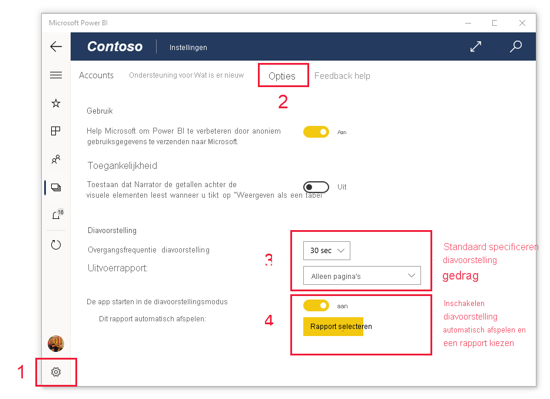

# Rapporten en dashboards weergeven in de presentatiemodus op Surface Hub en Windows 10-apparaten
U kunt de presentatiemodus gebruiken om rapporten en dashboards op Windows 10-apparaten en de Surface Hub in volledig scherm weer te geven. De presentatiemodus is handig voor het weergeven van Power BI tijdens vergaderingen, conferenties of op een specifieke projector op kantoor, of zelfs om de ruimte op een klein scherm te maximaliseren.

In presentatiemodus:
* Alle 'extra’s' (zoals de navigatie- en menubalken) verdwijnt, zodat u zich gemakkelijker kunt richten op de gegevens in uw rapport.
* Er wordt een actiewerkbalk beschikbaar gemaakt waarmee u met uw gegevens kunt werken en de presentatie kunt beheren.
* U kunt een diavoorstelling afspelen die automatisch bladert door pagina's, bladwijzers of zowel pagina's als bladwijzers.

>[!NOTE]
>Power BI-ondersteuning voor mobiele apps voor **telefoons met Windows 10 Mobile** wordt stopgezet op 16 maart 2021. [Meer informatie](/legal/powerbi/powerbi-mobile/power-bi-mobile-app-end-of-support-for-windows-phones)

## De presentatiemodus gebruiken
In de mobiele Power BI-app tikt u op het pictogram voor **volledig scherm** om de modus Volledig scherm te openen.
: alle extra's in de app verdwijnen en er wordt de actiewerkbalk onder aan het scherm (of aan de rechter- en linkerzijde) weergegeven, afhankelijk van de schermgrootte.

Via de werkbalk kunt u tikken op de opties om de volgende acties uitvoeren:

|||
|-|-|
||**Ga terug** naar de vorige pagina. Houd uw vinger lang op het pictogram en het padvenster wordt weergegeven. Hierin kunt u naar de map navigeren waar het rapport of het dashboard in staat.|
||**Schakelen tussen pagina's** om naar een andere pagina van het rapport in uw presentatie te gaan.|
||**Pas een bladwijzer toe** om de specifieke weergave van uw gegevens te presenteren die door de bladwijzer worden vastgelegd. U kunt zowel persoonlijke als rapportbladwijzers toepassen.|
||**Kies een inktkleur** als u gebruikmaakt van uw Surface-pen om op de rapportpagina te tekenen en er aantekeningen op te maken.|
||**Wis inktmarkeringen** die u mogelijk hebt aangebracht met de Surface-pen om op de rapportpagina te tekenen en er aantekeningen op te maken.          |
||**Stel opnieuw in naar de standaardweergave** en wis alle filters, slicers of andere wijzigingen in de gegevensweergave die u tijdens de presentatie hebt aangebracht.|
||**Deel** een afbeelding van de presentatieweergave met uw collega's. De afbeelding bevat aantekeningen die u tijdens de presentatie hebt gemaakt met de Surface-pen.|
||Het rapport **vernieuwen**.|
||**Speel de diavoorstelling af**, verberg de actiebalk en start de diavoorstelling. Met een selector kunt u ervoor kiezen om automatisch te draaien tussen pagina's, bladwijzers of zowel pagina's als bladwijzers. Standaard roteert de diavoorstelling automatisch elke 30 seconden tussen pagina's. U kunt deze instellingen wijzigen in [**Instellingen > Opties**](#slideshow-settings). Zie [meer details](#slideshows) over diavoorstellingen|
||Presentatiemodus **afsluiten**.|
||**Zoek** naar andere artefacten in Power BI.|

U kunt de werkbalk loskoppelen en naar een willekeurige plaats op het scherm slepen en neerzetten. Dit is handig op grote schermen, als u zich wilt richten op een specifiek gedeelte in het rapport en u de hulpprogramma's in de buurt wilt hebben. Plaats hiervoor uw vinger op de werkbalk en swipe deze naar het rapportcanvas.

## Diavoorstellingen

U kunt een diavoorstelling afspelen om de presentatie automatisch door te bladeren. U kunt de diavoorstelling zo instellen dat deze pagina's, bladwijzers of zowel pagina's als blad wijzers worden doorgebladerd.

Wanneer u de knop **Afspelen** op de actiewerkbalk selecteert, begint de diavoorstelling. Er wordt een controller weergegeven waarmee u de diavoorstelling kunt onderbreken of kunt wijzigen wat er wordt afgespeeld: pagina's, bladwijzers of zowel pagina's als bladwijzers.

 De controller toont de naam van de momenteel weergegeven weergave (pagina of bladwijzer en pagina). In de bovenstaande afbeelding zien we dat in het rapport **Verkoop**momenteel de blade **Azië en Stille Oceaan** wordt weergegeven op de pagina **Verkoopprestaties**.

Standaard bladert een diavoorstelling door alleen pagina's met een snelheid van één pagina per 30 seconden. U kunt het standaardgedrag wijzigen in de [instellingen voor de diavoorstelling](#slideshow-settings).

### Automatisch een diavoorstelling afspelen bij het opstarten

U kunt de mobiele app van Power BI instellen om automatisch een diavoorstelling te starten wanneer de app wordt gestart. Dit is een handige optie voor het maken van een kioskachtige ervaring die een rapport laat zien zonder handmatige acties. Zie de [instellingen voor de diavoorstelling](#slideshow-settings) voor meer informatie over het instellen van een rapport voor automatisch afspelen.

### Instellingen voor diavoorstelling

Standaard bladert een diavoorstelling door alleen pagina's met een snelheid van één pagina per 30 seconden. U kunt dit standaardgedrag wijzigen via **Instellingen > Opties**, zoals hieronder wordt afgebeeld. U kunt automatisch afspelen ook inschakelen en een rapport kiezen dat u wilt afspelen.

1. Selecteer het instellingenpictogram.

1. Klik op het tabblad Opties.

1. Wijzig desgewenst de standaardinstellingen voor wat de diashow zal doorlopen (pagina's, bladwijzers of beide) en hoe vaak de dia's zullen overgaan.

1. Als u wilt dat het rapport automatisch begint met afspelen wanneer de app wordt gestart, schakelt u de wisselknop in en kiest u **Rapport selecteren**. U kunt zoeken naar rapporten waartoe u toegang hebt.

## Volgende stappen
* [Dashboards en rapporten weergeven in de modus Volledig scherm van de Power BI-service](../end-user-focus.md)
* Vragen? [Misschien dat de Power BI-community het antwoord weet](https://community.powerbi.com/)