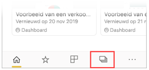
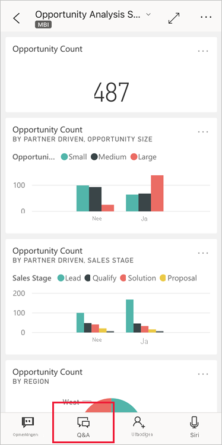
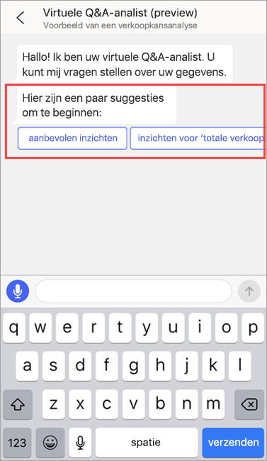
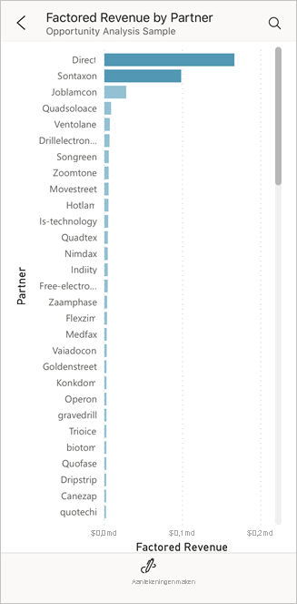
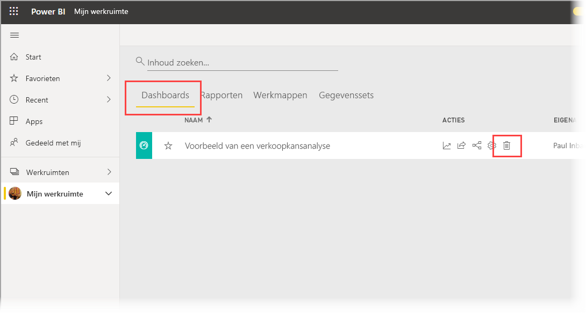
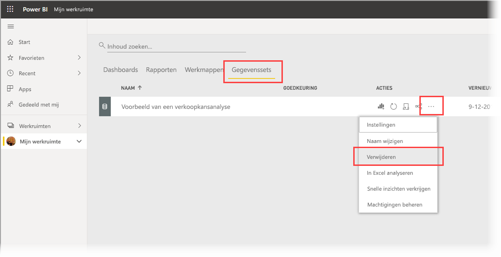

# Zelfstudie: vragen stellen over uw gegevens met de virtuele Q&A-analist in de Power BI iOS-apps

De eenvoudigste manier om inzicht te krijgen in uw gegevens is door vragen te stellen in uw eigen woorden. In deze zelfstudie stelt u vragen en bekijkt u inzichten over de voorbeeldgegevens met de virtuele Q&A-analist in de mobiele Microsoft Power BI-app op uw iPad of iPhone. 

Van toepassing op:

|  |  |
|:--- |:--- |
| iPhones |iPads |

De virtuele Q&A-analist biedt een BI-ervaring met een communicatie-interface waarin gebruik wordt gemaakt van onderliggende Q&A-gegevens in de [Power BI-service](https://powerbi.com). De virtuele analist stelt gegevensinzichten voor en u kunt uw eigen vragen typen of uitspreken.

In deze zelfstudie leert u het volgende:

> [!div class="checklist"]
> * De mobiele Power BI-app voor iOS installeren
> * Een Power BI-voorbeelddashboard en -rapport downloaden
> * De inzichten bekijken die de mobiele app voorstelt

## Vereisten

* **Registreren voor Power BI**: Als u zich niet hebt geregistreerd voor Power BI, kunt u zich hier [aanmelden voor een gratis proefversie](https://app.powerbi.com/signupredirect?pbi_source=web) voordat u begint.
* **De Power BI-app voor iOS installeren**: [Download de iOS-app](https://apps.apple.com/app/microsoft-power-bi/id929738808) via de Apple App Store op uw iPad, iPhone of iPod Touch. De volgende versies bieden ondersteuning voor de Power BI-app voor iOS:
  * iPad met iOS 11 of hoger.
  * iPhone 5 en hoger, met iOS 11 of hoger. 
  * iPod Touch met iOS 11 of hoger.
* **Voorbeeldgegevens downloaden**: De eerste stap is het downloaden van het **voorbeeld van een verkoopkansanalyse** naar de Power BI-service. Zie [Voorbeelden downloaden naar Mijn werkruimte in de Power BI-service](./mobile-apps-download-samples.md) voor instructies.

Zodra u de vereisten hebt voltooid en de voorbeeldgegevens hebt gedownload, kunt u de voorbeelden op uw iOS-apparaat bekijken.

## Inzichten bekijken
1. Open de Power BI-app op uw iPhone of iPad en meld u aan met uw referenties voor het Power BI-account (dit zijn dezelfde referenties als die u gebruikt voor de Power BI-service in de browser).

2. Tik op de navigatiebalk van de startpagina op het pictogram **Werkruimten**.

    

3. Wanneer de pagina Werkruimten wordt geopend, tikt u op **Mijn werkruimten** en vervolgens op het dashboard **Voorbeeld van een verkoopkansanalyse** om dit te openen.

3. Tik in het dashboard Voorbeeld van een verkoopkansanalyse op het pictogram virtuele Q&A-analist in het menu Actie.

    

    De virtuele analist geeft enkele suggesties om mee aan de slag te gaan.

    

3. Tik op **featured insights**.

4. De virtuele analist Q&A stelt enkele inzichten voor. Scrol naar rechts en tik op **Insight 2**.

    

   De virtuele analist Q&A laat inzicht 2 zien.

    

5. Tik op de grafiek om deze te openen in de focusmodus.

    

6. Tik op de pijl in de linkerbovenhoek om terug te gaan naar de virtuele analist.

## Resources opschonen

Als u de zelfstudie hebt voltooid, kunt u het dashboard, het rapport en de gegevensset voor het voorbeeld van een verkoopkansanalyse verwijderen.

1. Open de Power BI-service ([Power BI-service](https://app.powerbi.com)) en meld u aan.

2. Selecteer **Mijn werkruimte** in het navigatievenster.

3. Klik op het tabblad Dashboards en klik vervolgens op de prullenbak op de regel van het voorbeeld van een verkoopkansanalyse.

    

    Selecteer nu het tabblad Rapporten en doe hetzelfde.

4. Selecteer nu het tabblad Gegevenssets, klik op **Meer opties** (...) en kies **Verwijderen**.

    

## Volgende stappen

U hebt de virtuele Q&A-assistent in de mobiele Power BI-apps voor iOS geprobeerd. Lees meer over Q&A in de Power BI-service.
> [!div class="nextstepaction"]
> [Q&A in de Power BI-service](../end-user-q-and-a.md)