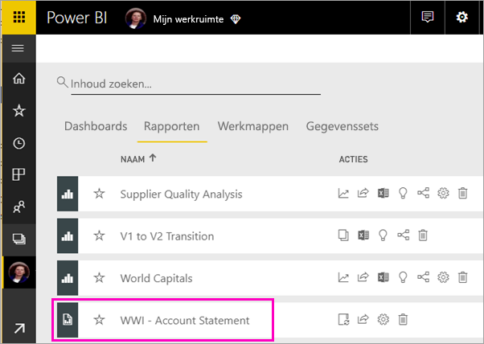
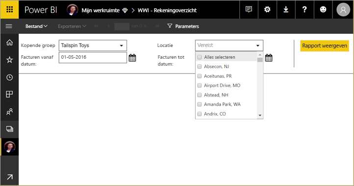
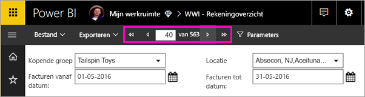
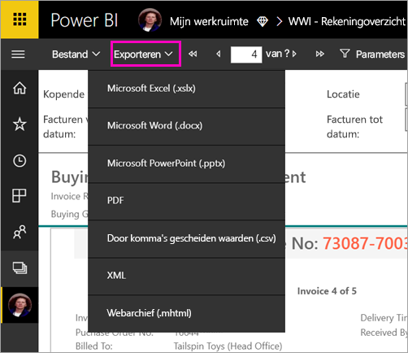

# Een gepagineerd rapport weergeven in de Power BI-service

In dit artikel leert u hoe u gepagineerde rapporten kunt weergeven in de Power BI-service. Gepagineerde rapporten zijn rapporten die zijn gemaakt in Report Builder en geüpload naar een werkruimte in een Premium-capaciteit. Ga naar het ruitvormige pictogram  naast de naam van een werkruimte. 

Gepagineerde rapporten hebben een eigen pictogram .

U kunt gepagineerde rapporten ook exporteren in een aantal indelingen: 

- Microsoft Excel
- Microsoft Word
- Microsoft PowerPoint
- PDF
- Door komma's gescheiden waarden
- XML
- Webarchief (.mhtml)

## Gepagineerd rapport bekijken

1. Selecteer het gepagineerde rapport in de werkruimte.

    

2. Als het rapport parameters bevat, zoals dit rapport hier, ziet u het rapport mogelijk niet wanneer u het de eerste keer opent. Selecteer parameters en selecteer vervolgens **Rapport weergeven**. 

     

    U kunt de parameters ook op elk gewenst moment wijzigen.

1. Blader door het rapport door de pijlen boven aan de pagina te selecteren of door een paginanummer in het vak te typen.
    
   

4. Selecteer **Exporteren** om de indeling te vinden waarin u de gepagineerde rapporten wilt exporteren.

    

## Volgende stappen

[Gepagineerde rapporten in de Power BI-service](end-user-paginated-report.md)
