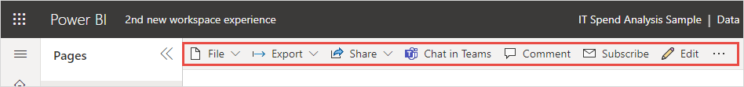

# Het nieuwe uiterlijk van de Power BI-service

De Power BI-service (app.powerbi.com) heeft een nieuwe vormgeving waarmee u uw rapporten gemakkelijker kunt weergeven en gebruiken. Het nieuwe uiterlijk is eenvoudiger en afgestemd op het uiterlijk van andere Microsoft-producten waarmee u waarschijnlijk bekend bent. In de gehele Power BI-service is de inhoud van rapporten nu het belangrijkste aandachtspunt, door het gebruik van een lichter kleurenthema en bijgewerkte pictogrammen. 

Zoekt u informatie over het nieuwe uiterlijk in **Power BI Desktop**? Zie [Het bijgewerkte lint in Power BI Desktop gebruiken](../create-reports/desktop-ribbon.md).

Hier ziet u een overzicht van de veranderingen in het nieuwe uiterlijk. Bekijk de genummerde gedeelten voor meer informatie:

Zoekt u een specifieke actie? Zie [Het nieuwe uiterlijk: Waar zijn de acties gebleven?](service-new-look-where-actions.md)

## 1. Verticale lijst met pagina's 
In de leesweergave staan de namen van rapportpagina's in een lijst in een verticaal deelvenster. Deze lijst is nadrukkelijk aanwezig en vergelijkbaar met navigatie in Word en PowerPoint. U kunt de rest van het rapportgebied vergroten of verkleinen: Wijzig de grootte van het verticale deelvenster of selecteer de dubbele pijlen om het helemaal te sluiten.

Als u voor een rapport een bewerkingsmachtiging hebt, kunt u dit zo instellen dat de paginanamen onderaan staan, zoals in de bewerkweergave voor rapporten. Zie [Het deelvenster Pagina's instellen](../create-reports/power-bi-report-settings.md#set-the-pages-pane) in het artikel Instellingen voor Power BI-rapporten wijzigen voor meer informatie.

## 2. Vereenvoudigde actiebalk 

De bijgewerkte actiebalk bovenaan bevat de meest relevante opdrachten (voor en midden) voor gebruikers van rapporten. Het is eenvoudiger om te exporteren, delen, chatten in teams en abonneren. 

## 3. Waar vind ik de rapportopdrachten?

We hebben de functionaliteit van het oude uiterlijk niet verwijderd. Selecteer **Meer opties (...)** voor andere, geavanceerdere opdrachten. Zie [Het nieuwe uiterlijk: Waar zijn de acties gebleven?](service-new-look-where-actions.md) voor meer informatie.

## 4. Nieuwe filterfunctionaliteit

Met het nieuwe uiterlijk wordt het nieuwe deelvenster Filters voor het rapport standaard weergegeven. En wanneer u met de muisaanwijzer het pictogram Filter aanwijst voor een visual, ziet u alle filters en slicers die van invloed zijn op die visual.

## Rapportdetails weergeven 

Bekijk in de bovenste banner snel details zoals de laatste vernieuwingsdatum en contactgegevens.  Open het menu om aanvullende informatie over het rapport weer te geven. U kunt zelfs een e-mailbericht naar de rapporteigenaar versturen.

## Geen wijzigingen in de bewerkingsmodus voor rapporten 

De ontwerpervaring is nog steeds vergelijkbaar met die in Desktop. De wijzigingen in het nieuwe uiterlijk zijn alleen van toepassing op de leesweergave.

## De dashboardervaring in het nieuwe uiterlijk 

Dashboards hebben ook een vereenvoudigde actiebalk. Voor een consistente ervaring is deze vergelijkbaar met rapporten en apps, maar de functionele verschillen blijven behouden. Hier ziet u een overzicht van de acties in een dashboard.
 

## Volgende stappen

- [Het bijgewerkte lint in Power BI Desktop gebruiken](../create-reports/desktop-ribbon.md)
- [Power BI voor gebruikers](end-user-consumer.md)
