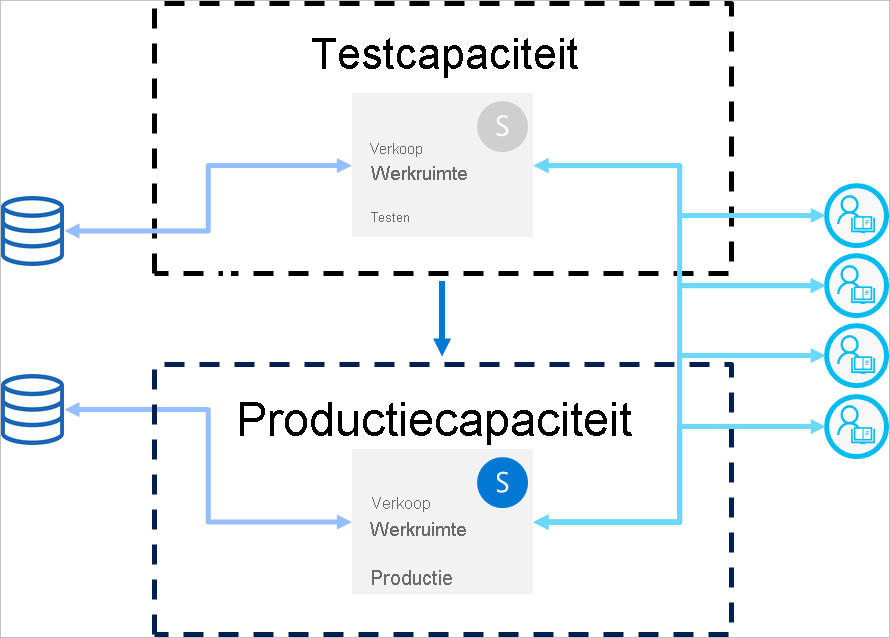

# Aanbevolen procedures voor implementatiepijplijnen (preview)

Dit artikel bevat richtlijnen voor BI-makers die hun inhoud gedurende de hele levenscyclus beheren. Het richt zich op het gebruik van implementatiepijplijnen als beheerprogramma voor levenscycli van BI-inhoud.

Het artikel is onderverdeeld in vier secties:

* **Voorbereiding van inhoud**: bereid uw inhoud voor op levenscyclusbeheer.

* **Ontwikkeling**: leer meer over de beste manieren om inhoud te maken in de ontwikkelingsfase van implementatiepijplijnen.

* **Test**: krijg inzicht in hoe u de testfase van implementatiepijplijnen gebruikt om uw omgeving te testen.

* **Productie**: gebruik de productiefase van implementatiepijplijnen om uw inhoud beschikbaar te maken voor gebruik.

## Voorbereiding van inhoud

Bereid uw inhoud voor op doorlopend beheer gedurende de bijbehorende levenscyclus. Zorg ervoor dat u de informatie in deze sectie bekijkt vóórdat u een van de volgende handelingen uitvoert:

* Uw inhoud vrijgeven voor productie

* Een implementatiepijplijn gebruiken voor een specifieke werkruimte

* Uw werk publiceren

### U kunt elke werkruimte beschouwen als een volledig pakket met analyses

In het ideale geval bevat een werkruimte een volledige weergave van één aspect (bijvoorbeeld afdeling, bedrijfseenheid, project of verticaal) in uw organisatie. Op deze manier is het eenvoudiger om machtigingen voor verschillende gebruikers te beheren, en kunnen inhoudsreleases voor de hele werkruimte worden beheerd volgens een gepland schema.  

Als u gebruikmaakt van [gecentraliseerde gegevenssets](../connect-data/service-datasets-across-workspaces.md) die in de hele organisatie worden gebruikt, raden we u aan twee typen werkruimten te maken:

* **Model- en gegevenswerkruimten**: deze werkruimten bevatten alle gecentraliseerde gegevenssets

* **Rapportagewerkruimten**: deze werkruimten bevatten alle afhankelijke rapporten en dashboards

### Uw machtigingsmodel plannen

Een implementatiepijplijn is een Power BI-object met eigen [machtigingen](deployment-pipelines-process.md#permissions). Daarnaast bevat de pijplijn werkruimten die ook hun eigen machtigingen hebben.

Plan wie toegang krijgt tot elk deel van de pijplijn om een veilige en eenvoudige werkstroom te implementeren. Enkele overwegingen om rekening mee te houden zijn:

* Wie moet toegang krijgen tot de pijplijn?

* Welke bewerkingen moeten gebruikers met pijplijntoegang in elke fase kunnen uitvoeren?

* Wie bekijkt inhoud in de testfase?

* Hebben deze personen, die inhoud in de testfase bekijken, toegang tot de pijplijn nodig?

* Wie houdt toezicht op de implementatie in de productiefase?

* Welke werkruimte wijs u toe?

* Aan welke fase wijst u de werkruimte toe?

* Moet u wijzigingen aanbrengen in de machtigingen van de werkruimte die u wilt toewijzen?

### Verschillende fasen verbinden met verschillende databases

Een productiedatabase moet altijd stabiel en beschikbaar zijn. U kunt deze database beter niet overbelasten met query's die BI-makers hebben gegenereerd voor hun ontwikkelings- of testgegevenssets. Bouw afzonderlijke databases voor ontwikkelen en testen. Dit helpt bij het beveiligen van productiegegevens en zorgt ervoor dat de ontwikkelingsdatabase niet overbelast raakt met het hele volume aan productiegegevens, wat kan zorgen voor tragere prestaties.

>[!NOTE]
>Als uw organisatie gebruikmaakt van [gedeelde gecentraliseerde gegevenssets](../connect-data/service-datasets-share.md), kunt u deze aanbeveling overslaan.

### Parameters gebruiken in uw model

U kunt gegevensbronnen van gegevenssets niet bewerken in de Power BI-service. We raden u daarom aan om [parameters](https://docs.microsoft.com/power-query/power-query-query-parameters) te gebruiken om verbindingsgegevens, zoals namen van exemplaren en databases, op te slaan, in plaats van een statische verbindingsreeks te gebruiken. Op deze manier kunt u de verbindingen in een later stadium beheren via de webportal van de Power BI-service, of [met behulp van API’s](https://docs.microsoft.com/rest/api/power-bi/datasets/updateparametersingroup).

In de implementatiepijplijnen kunt u parameterregels configureren om specifieke waarden in te stellen voor de ontwikkelings-, test- en productiefasen.

Als u geen parameters voor uw verbindingsreeks gebruikt, kunt u gegevensbronregels definiëren om een verbindingsreeks voor een bepaalde gegevensset op te geven. In implementatiepijplijnen wordt dit echter niet voor alle gegevensbronnen ondersteund. Raadpleeg [beperkingen voor gegevenssetregels](deployment-pipelines-get-started.md#dataset-rule-limitations) om te controleren of u regels voor uw gegevensbron kunt configureren.

Parameters hebben extra toepassingen, zoals het aanbrengen van wijzigingen in query's, filters en de tekst die worden weergegeven in het rapport.

## Ontwikkeling

Deze sectie biedt richtlijnen voor het werken met de ontwikkelingsfase van implementatiepijplijnen.

### Power BI Desktop gebruiken om uw rapporten en gegevenssets te bewerken

U kunt Power BI Desktop beschouwen als uw lokale ontwikkelomgeving. Met Power BI Desktop kunt u updates voor uw rapporten en gegevenssets uitproberen, verkennen en beoordelen. Zodra het werk is voltooid, kunt u de nieuwe versie uploaden naar de ontwikkelingsfase. Om de volgende redenen wordt u aangeraden om PBIX-bestanden te bewerken in de Desktop-versie (en niet in de Power BI-service):

* In de Desktop-versie kunt u eenvoudiger samenwerken met andere makers aan hetzelfde PBIX-bestand, mits alle wijzigingen worden uitgevoerd met hetzelfde hulpprogramma.

 * Bij het online aanbrengen van wijzigingen, downloaden van het PBIX-bestand en dit vervolgens opnieuw uploaden, worden duplicaten van rapporten en gegevenssets gemaakt.

* U kunt versiebeheer gebruiken om uw PBIX-bestanden up-to-date te houden.

### Versiebeheer voor PBIX-bestanden

Gebruik [automatische synchronisatie van Power BI met OneDrive](../connect-data/service-connect-to-files-in-app-workspace-onedrive-for-business.md) om de versiegeschiedenis van uw rapporten en gegevenssets te beheren. Hierdoor blijven uw bestanden bijgewerkt met de nieuwste versie. U kunt dan ook oudere versies ophalen, indien nodig.

>[!NOTE]
>Gebruik automatische synchronisatie met OneDrive (of een andere opslagplaats) alleen met de PBIX-bestanden in de ontwikkelingsfase van implementatiepijplijnen. Synchroniseer geen PBIX-bestanden in de test- en productiefasen van implementatiepijplijnen. Dit veroorzaakt problemen bij het implementeren van inhoud in de hele pijplijn.

### Ontwikkeling van modellen scheiden van de ontwikkeling van rapporten en dashboards

Voor implementaties op ondernemingsniveau wordt aangeraden om de ontwikkeling van gegevenssets en de ontwikkeling van rapporten en dashboards te scheiden. Als u wijzigingen alleen in een rapport of gegevensset wilt doorvoeren, gebruikt u de optie voor selectief implementeren in implementatiepijplijnen.  

Deze methode moet worden gestart vanuit Power BI Desktop door een afzonderlijk PBIX-bestand voor gegevenssets en rapporten te maken. U kunt bijvoorbeeld een PBIX-bestand voor een gegevensset maken en dit uploaden naar de ontwikkelingsfase. Later kunnen de auteurs van het rapport een nieuw PBIX-bestand maken, en [dit koppelen aan de gepubliceerde gegevensset](../connect-data/service-datasets-discover-across-workspaces.md) met behulp van een liveverbinding. Met deze techniek kunnen verschillende makers afzonderlijk werken aan modellen en visualisaties, en deze afzonderlijk implementeren in de productiefase.

Met [gedeelde gegevenssets](../connect-data/service-datasets-share.md) kunt u deze methode ook gebruiken in verschillende werkruimten.

### Uw modellen beheren met behulp van XMLA-mogelijkheden voor lezen en schrijven

Door de ontwikkeling van modellen te scheiden van de ontwikkeling van rapporten en dashboards, kunt u geavanceerde mogelijkheden gebruiken, zoals bronbeheer, samenvoegen van verschillende wijzigingen, en geautomatiseerde processen. Deze wijzigingen moeten worden aangebracht in de ontwikkelingsfase, zodat de definitieve inhoud kan worden geïmplementeerd in de test- en productiefasen. Hierdoor kunnen wijzigingen een uniform proces doorlopen met andere afhankelijke items vóórdat ze worden geïmplementeerd in de productiefase.

U kunt modelontwikkeling scheiden van visualisaties door een [gedeelde gegevensset](../connect-data/service-datasets-share.md) te beheren in een externe werkruimte, met behulp van XMLA-mogelijkheden voor lezen en schrijven. De gedeelde gegevensset kan verbinding maken met meerdere rapporten in verschillende werkruimten die worden beheerd in meerdere pijplijnen.

## Test

Deze sectie biedt richtlijnen voor het werken met de testfase van implementatiepijplijnen.

### Uw productieomgeving simuleren

Naast het controleren of nieuwe rapporten en dashboards er goed uitzien, is het ook belangrijk om de prestaties ervan te bekijken vanuit het perspectief van de eindgebruiker. Met de testfase van implementatiepijplijnen kunt u een echte productieomgeving simuleren voor testdoeleinden.

Zorg ervoor dat deze drie factoren worden behandeld in de testomgeving:

* Gegevensvolume

* Gebruiksvolume

* Een vergelijkbare capaciteit als in productie

Tijdens het testen kunt u dezelfde capaciteit gebruiken als in de productiefase. Dit kan er echter voor zorgen dat de productie instabiel is tijdens het testen van de belasting. Gebruik voor het testen een andere capaciteit die qua resources vergelijkbaar is met de productiecapaciteit om een instabiele productie te voorkomen. Om extra kosten te voorkomen kunt u [Azure A-capaciteit gebruiken](../developer/embedded/azure-pbie-create-capacity.md) zodat u alleen betaalt voor de testtijd.

### Gebruik gegevenssetregels met een echt bestaande gegevensbron

Als u de testfase gebruikt om echt gegevensgebruik te simuleren, wordt aanbevolen om de gegevensbronnen voor ontwikkelen en voor testen te scheiden. De ontwikkelingsdatabase moet relatief klein zijn en de testdatabase moet zoveel mogelijk overeenkomen met de productiedatabase. Gebruik [gegevensbronregels](deployment-pipelines-get-started.md#step-4---create-dataset-rules) om te schakelen tussen gegevensbronnen in de testfase.

Het is nuttig om de hoeveelheid gegevens die u importeert uit uw gegevensbron, te beheren als u een productiegegevensbron gebruikt in de testfase. U doet dit door een parameter toe te voegen aan de gegevensbronquery in Power BI Desktop. Gebruik parameterregels om de hoeveelheid geïmporteerde gegevens te beheren, of bewerk de waarde van de parameter.
U kunt deze methode ook gebruiken als u de capaciteit niet wilt overbelasten.

### Prestaties meten

Wanneer u een productiefase simuleert, [controleert u de rapportbelasting en de interacties](../guidance/monitor-report-performance.md), en kijkt u of deze worden beïnvloed door de wijzigingen die u hebt aangebracht.

U moet ook [de belasting van de capaciteit](../admin/service-admin-premium-monitor-capacity.md) controleren, zodat u extreme belastingen kunt ondervangen vóórdat ze productie bereiken.  

>[!NOTE]
>Het wordt aanbevolen om de capaciteitsbelasting opnieuw te controleren na het implementeren van updates in de productiefase.

### Gerelateerde items controleren

Gerelateerde items kunnen worden beïnvloed door wijzigingen in gegevenssets of rapporten. Controleer tijdens het testen of uw wijzigingen niet van invloed zijn op de prestaties van bestaande items, wat afhankelijk kan zijn van de bijgewerkte items.

U vindt de gerelateerde items eenvoudig met behulp van de [herkomstweergave](../collaborate-share/service-data-lineage.md) voor de werkruimte.

### Uw app testen

Als u inhoud via een app distribueert naar uw eindgebruikers, bekijkt u de nieuwe versie van de app, vóórdat deze in productie is. Aangezien elke fase van een implementatiepijplijn een eigen werkruimte heeft, kunt u een app eenvoudig publiceren en bijwerken voor de ontwikkelings- en testfasen. Hierdoor kunt u de app testen vanuit het perspectief van de eindgebruiker.

>[!IMPORTANT]
>Het implementatieproces omvat niet het bijwerken van de inhoud of instellingen van de app. Als u wijzigingen wilt aanbrengen in de inhoud of instellingen, moet u de app handmatig bijwerken in de vereiste pijplijnfase.

## Productie

Deze sectie biedt richtlijnen voor de productiefase van implementatiepijplijnen.

### Beheren wie kan implementeren in productie

Aangezien implementatie in productie zorgvuldig moet gebeuren, is het raadzaam om alleen specifieke personen deze gevoelige bewerking te laten beheren. Waarschijnlijk wilt u echter dat alle BI-makers voor een specifieke werkruimte toegang hebben tot de pijplijn. Dit kan worden beheerd via [werkruimtemachtigingen](deployment-pipelines-process.md#permissions) voor productie.  

Om inhoud te implementeren tussen fasen hebben gebruikers lid- of beheerdersmachtigingen nodig voor beide fasen. Zorg ervoor dat alleen de personen die mogen implementeren in productie, beschikken over werkruimtemachtigingen voor productie. Aan andere gebruikers kunt u de rol Bijdrager of Viewer voor de productiewerkruimte toewijzen. Zij kunnen dan inhoud in de pijplijn zien, maar ze kunnen niets implementeren.

Daarnaast moet u de toegang tot de pijplijn beperken door alleen pijplijnmachtigingen in te schakelen voor gebruikers die zich bezighouden met het maken van inhoud.

### Regels instellen om de beschikbaarheid van de productiefase te garanderen

[Gegevenssetregels](deployment-pipelines-get-started.md#step-4---create-dataset-rules) zijn een krachtige manier om ervoor te zorgen dat de gegevens in productie altijd zijn verbonden, en altijd beschikbaar zijn voor gebruikers. Zodra de gegevenssetregels zijn toegepast, kunnen implementaties worden uitgevoerd met de zekerheid dat eindgebruikers de relevante informatie zonder onderbrekingen kunnen bekijken.

Zorg ervoor dat u gegevenssetregels in productie instelt voor gegevensbronnen en parameters die zijn gedefinieerd in de gegevensset.

### De productie-app bijwerken

Bij implementatie in een pijplijn wordt de werkruimte-inhoud bijgewerkt, maar de gekoppelde app wordt niet automatisch bijgewerkt. Als u een app gebruikt voor de distributie van inhoud, vergeet dan niet om na de implementatie in productie de app bij te werken, zodat eindgebruikers meteen de nieuwste versie kunnen gebruiken.  

### Snelle oplossingen voor inhoud

Als er sprake is van fouten in productie die snel moeten worden opgelost, laat u dan niet verleiden om een nieuwe PBIX-versie rechtstreeks in de productiefase te uploaden, of om online een wijziging aan te brengen in de Power BI-service. Het is niet mogelijk om achterwaarts te implementeren in de test- en ontwikkelingsfasen, wanneer deze fasen al inhoud bevatten. Bovendien is het geen aanbevolen procedure om een oplossing te implementeren zonder deze eerst te testen. De juiste manier om dit probleem aan te pakken is daarom het implementeren van de oplossing in de ontwikkelingsfase, en deze vervolgens naar de rest van de fasen van de implementatiepijplijn te pushen. Zo kunt u controleren of de oplossing werkt vóórdat u deze implementeert in productie. Implementatie in de hele pijplijn duurt slechts enkele minuten.

## Volgende stappen

>[!div class="nextstepaction"]
>[Inleiding tot implementatiepijplijnen](deployment-pipelines-overview.md)

>[!div class="nextstepaction"]
>[Aan de slag gaan met implementatiepijplijnen](deployment-pipelines-get-started.md)

>[!div class="nextstepaction"]
>[Uitleg over het proces van implementatiepijplijnen](deployment-pipelines-process.md)

>[!div class="nextstepaction"]
>[Problemen met implementatiepijplijnen oplossen](deployment-pipelines-troubleshooting.md)
