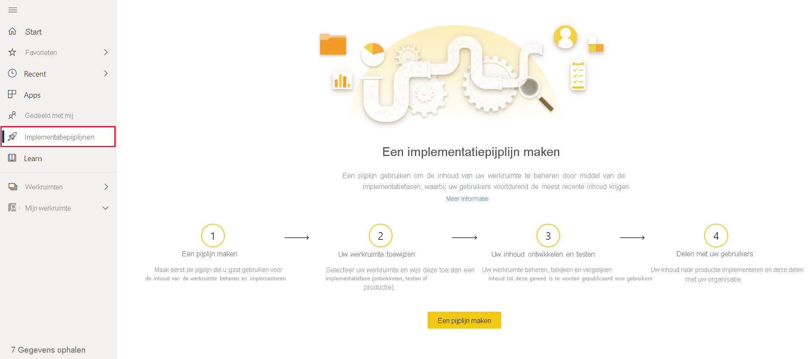
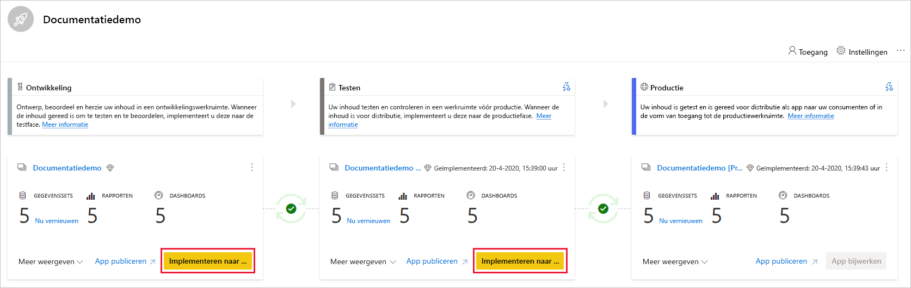
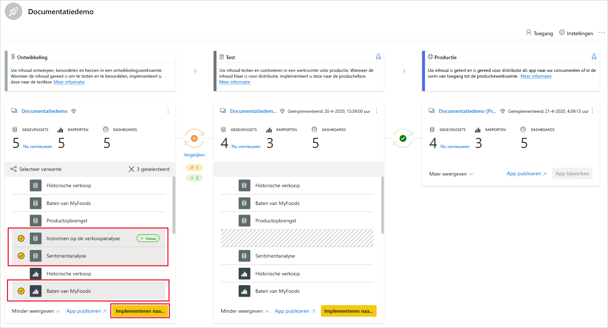
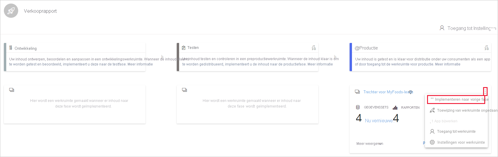
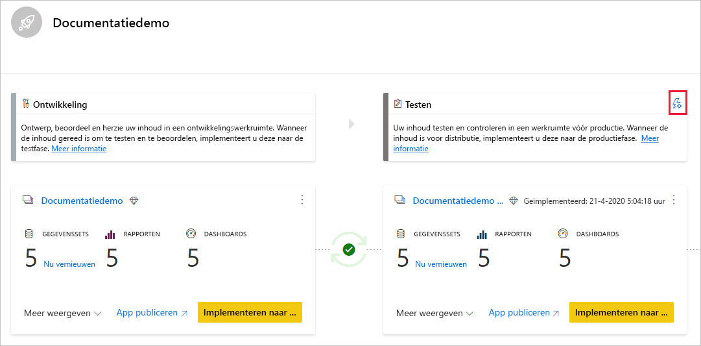
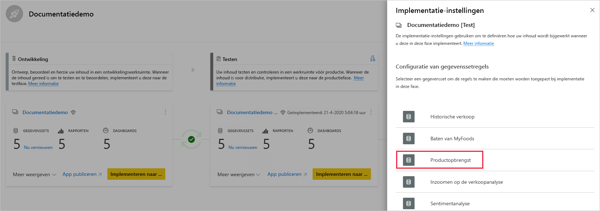
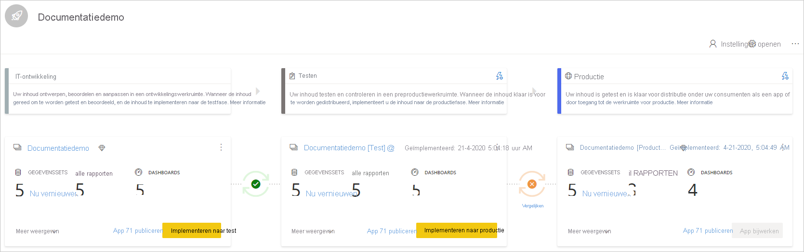
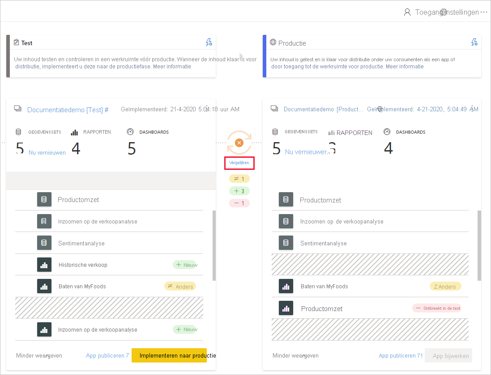
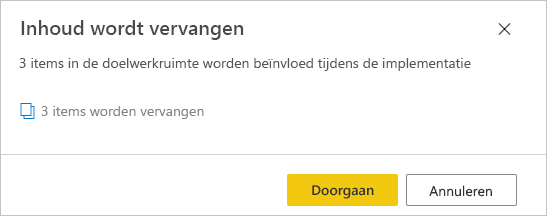

# Aan de slag gaan met implementatiepijplijnen (preview)

In dit artikel wordt u stapsgewijs door de basisinstellingen geleid die zijn vereist bij het gebruik van implementatiepijplijnen.

## Toegang tot implementatiepijplijnen

U hebt toegang tot de functie voor implementatiepijplijnen als aan de volgende voorwaarden is voldaan:

* U bent een Power BI [Pro-gebruiker](../admin/service-admin-purchasing-power-bi-pro.md)

* U maakt deel uit van een organisatie met premium-capaciteit

* U bent een beheerder van een [nieuwe werkruimte-ervaring](../collaborate-share/service-create-the-new-workspaces.md)

>[!NOTE]
> U ziet de knop voor implementatiepijplijnen ook als u eerder een pijplijn hebt gemaakt, of als een pijplijn met u is gedeeld.

## Stap 1: een implementatiepijplijn maken

Ga als volgt te werk om een implementatiepijplijn te maken:

1. Ga naar de Power BI-service en selecteer in het navigatiedeelvenster de optie **Implementatiepijplijnen**. Klik vervolgens op **Pijplijn maken**.

2. Voer in het dialoogvenster *Een implementatiepijplijn maken* een naam en beschrijving in voor de pijplijn, en klik op **Maken**.

Nadat de pijplijn is gemaakt, kunt u deze delen met andere gebruikers of de pijplijn verwijderen. Als u een pijplijn deelt met anderen, krijgen de gebruikers met wie u de pijplijn deelt, [toegang tot de pijplijn](deployment-pipelines-process.md#user-with-pipeline-access). Gebruikers die toegang tot de pijplijn hebben, kunnen deze bekijken, delen, bewerken en verwijderen.

## Stap 2: een werkruimte toewijzen aan een implementatiepijplijn

Nadat u een pijplijn hebt gemaakt, moet u de inhoud die u wilt beheren, toevoegen aan de pijplijn. U voegt inhoud toe aan de pijplijn door een werkruimte toe te wijzen aan de pijplijnfase. U kunt een werkruimte toewijzen aan elke fase. 

U kunt één werkruimte toewijzen aan een implementatiepijplijn. In de implementatiepijplijnen worden klonen van de werkruimte-inhoud gemaakt. Deze klonen worden in verschillende fasen van de pijplijn gebruikt.

Volg deze stappen om een werkruimte toe te wijzen aan een implementatiepijplijn:

1. Klik in de zojuist gemaakte implementatiepijplijn op **Een werkruimte toewijzen**.

2. Selecteer in de vervolgkeuzelijst *De werkruimte kiezen* de werkruimte waaraan u de pijplijn wilt toewijzen.

3. Selecteer de fase waaraan u de werkruimte wilt toewijzen.

### Beperkingen voor werkruimtetoewijzing

* De werkruimte moet een [nieuwe werkruimte-ervaring](../collaborate-share/service-create-the-new-workspaces.md) zijn.

* U moet een beheerder van de werkruimte zijn.

* De werkruimte mag niet zijn toegewezen aan een andere pijplijn.

* De werkruimte moet zich bevinden in een  [premium-capaciteit](../admin/service-premium-what-is.md).

* U kunt geen werkruimte met [Power BI-voorbeelden](../create-reports/sample-datasets.md) toewijzen aan een pijplijnfase.

>[!NOTE]
>Alleen werkruimten die kunnen worden gebruikt met implementatiepijplijnen, worden weergegeven in de lijst met werkruimten waaruit u kunt kiezen.

## Stap 3: implementeren in een lege fase

Elke [Pro-gebruiker](../admin/service-admin-purchasing-power-bi-pro.md) die lid of beheerder is in de bronwerkruimte, kan inhoud implementeren in een lege fase (een fase zonder inhoud). Om de implementatie te voltooien moet de werkruimte zich in een capaciteit bevinden.

Wanneer u inhoud implementeert in een lege fase, blijven de relaties tussen de items behouden. Voorbeeld: een rapport dat is gekoppeld aan een gegevensset in de bronfase, wordt naast de bijbehorende gegevensset gekloond, en de klonen worden op een vergelijkbare manier gebonden gekoppeld aan de doelwerkruimte.

Nadat de implementatie is voltooid, vernieuwt u de gegevensset. Zie [Inhoud implementeren in een lege fase](deployment-pipelines-process.md#deploying-content-to-an-empty-stage) voor meer informatie.

### Alle inhoud implementeren

Selecteer de fase vanwaaruit u wilt implementeren, en klik op de implementatieknop. Tijdens het implementatieproces wordt in de doelfase een duplicaat van de werkruimte gemaakt. Deze werkruimte bevat alle inhoud die in de huidige fase aanwezig is.

### Selectieve implementatie

Als u alleen specifieke items wilt implementeren, klikt u op de koppeling **Meer weergeven**, en selecteert u de items die u wilt implementeren. Wanneer u op de knop Implementeren klikt, worden alleen de geselecteerde items geïmplementeerd in de volgende fase.

Aangezien dashboards, rapporten en gegevenssets zijn gerelateerd en onderlinge afhankelijkheden hebben, kunt u de knop Gerelateerde selecteren gebruiken om te controleren van welke items deze items allemaal afhankelijk zijn. Voorbeeld: als u een rapport wilt implementeren in de volgende fase, en u klikt op de knop Gerelateerde selecteren, wordt de gegevensset gemarkeerd waaraan het rapport is gekoppeld, en worden beide tegelijkertijd geïmplementeerd zodat de verbinding met het rapport niet wordt verbroken.

>[!NOTE]
> * U kunt een rapport of dashboard niet in de volgende fase implementeren als de items waarvan het afhankelijk is, niet aanwezig zijn in de fase waarin u wilt implementeren.
> * U kunt onverwachte resultaten krijgen als u ervoor kiest om een rapport of dashboard te implementeren zonder de bijbehorende gegevensset. Dit kan gebeuren wanneer de gegevensset in de doelfase is gewijzigd en niet meer identiek is aan de gegevensset in de fase vanwaaruit u wilt implementeren.

### Achterwaartse implementatie

U kunt ervoor kiezen om in een vorige fase te implementeren, bijvoorbeeld in een scenario waarin u een bestaande werkruimte toewijst aan een productiefase en deze vervolgens achterwaarts implementeert, eerst in de testfase en vervolgens in de ontwikkelingsfase.

Implementeren in een vorige fase werkt alleen als de vorige fase leeg is. Wanneer u implementeert in een vorige fase, kunt u geen specifieke items selecteren. Alle inhoud in de fase wordt geïmplementeerd.

## Stap 4: gegevenssetregels maken

Wanneer u werkt in een implementatiepijplijn, kunnen verschillende fasen verschillende configuraties hebben. Elke fase kan bijvoorbeeld verschillende databases of verschillende queryparameters hebben. In de ontwikkelingsfase kunnen voorbeeldgegevens uit de database worden opgevraagd, terwijl in de test- en productiefasen de hele database wordt opgevraagd.

Wanneer u inhoud implementeert tussen pijplijnfasen, stelt het configureren van gegevenssetregels u in staat om wijzigingen in inhoud toe te staan, terwijl bepaalde instellingen intact blijven.

Gegevenssetregels worden gedefinieerd in gegevensbronnen en parameters, in elke gegevensset. Deze bepalen de waarden van de gegevensbronnen of parameters voor een specifieke gegevensset. Als u bijvoorbeeld een gegevensset in een productiefase wilt laten verwijzen naar een productiedatabase, kunt u hiervoor een regel definiëren. De regel wordt gedefinieerd in de productiefase, onder de juiste gegevensset. Zodra de regel is gedefinieerd, neemt inhoud die is geïmplementeerd van test naar productie, de waarde over die is gedefinieerd in de gegevenssetregels. De regel is altijd van toepassing zolang deze ongewijzigd en geldig is.

>[!NOTE]
> Gegevenssetregels werken alleen wanneer de bron- en doelgegevensbron hetzelfde type zijn.

### Een gegevenssetregel maken

1. Klik in de pijplijnfase waarvoor u een gegevenssetregel wilt maken, op **Implementatie-instellingen**.

    

2. Selecteer in het deelvenster Implementatie-instellingen de gegevensset waarvoor u een regel wilt maken.

    

3. Selecteer het type regel dat u wilt maken, vouw de lijst uit en klik op **Regel toevoegen**.

     

### Typen gegevenssetregels

Er zijn twee typen regels die u kunt maken:

* **Gegevensbronregels**: de lijst met gegevensbronnen wordt opgehaald uit de gegevensset van de bronpijplijnfase. Selecteer in de lijst met gegevensbronnen een gegevensbron die u wilt vervangen. Gebruik een van de volgende methoden om een waarde te selecteren ter vervanging van de waarde uit de bronfase:

    1. Selecteer uit een lijst.

    2. Klik op **Andere** en voeg handmatig de nieuwe gegevensbron toe. U kunt alleen wijzigen in een gegevensbron van hetzelfde type.

* **Parameterregels**: selecteer een parameter in de lijst met parameters (de huidige waarde wordt weergegeven). Wijzig de waarde in de waarde die u na elke implementatie wilt doorvoeren.

### Beperkingen voor gegevenssetregels

* U moet de eigenaar van de gegevensset zijn om een gegevenssetregel te kunnen maken.

* Gegevenssetregels kunnen niet worden gemaakt in de ontwikkelingsfase.

* Wanneer een item wordt weggehaald of verwijderd, worden de bijbehorende regels ook verwijderd. Dit kan niet ongedaan worden gemaakt.

* Als de gegevensbron of parameters die zijn gedefinieerd in een regel, worden gewijzigd of verwijderd uit de brongegevensset, is de regel ongeldig en mislukt de implementatie.

* Gegevensbronregels kunnen alleen worden gedefinieerd voor de volgende gegevensbronnen:
    * Azure Analysis Services
    * SQL Server Analysis Services (SSAS)
    * Azure SQL Server
    * SQL Server
    * OData-feed
    * Oracle
    * SapHana (alleen ondersteund voor de importmodus, niet directquery-modus)
    * SharePoint
    * Teradata

    Voor andere gegevensbronnen wordt u aangeraden [parameters te gebruiken om de gegevensbron te configureren](deployment-pipelines-best-practices.md#use-parameters-in-your-model).

## Stap 5: inhoud implementeren van de ene fase naar de andere

Zodra een pijplijnfase inhoud bevat, kunt u deze implementeren in de volgende fase. Het implementeren van inhoud in een andere fase wordt doorgaans gedaan nadat u een aantal acties in de pijplijn hebt uitgevoerd. Bijvoorbeeld nadat u ontwikkelingswijzigingen in inhoud hebt aangebracht in de ontwikkelingsfase, of nadat u inhoud hebt getest in de testfase. Een typische werkstroom voor het verplaatsen van inhoud van de ene fase naar de andere, is van ontwikkeling naar test, en vervolgens van test naar productie. In de sectie [Inhoud implementeren in een bestaande werkruimte](deployment-pipelines-process.md#deploy-content-to-an-existing-workspace) krijgt u meer informatie over dit proces.

Als u inhoud wilt implementeren in de volgende fase van de implementatiepijplijn, klikt u op de knop Implementeren onder aan de fase.

Bij het controleren van de test- en productiefasekaarten ziet u de tijd van de laatste implementatie. Deze tijd geeft aan wanneer voor het laatst inhoud is geïmplementeerd in de fase.

Deze implementatietijd is handig bij het bepalen wanneer een fase voor het laatst is bijgewerkt. Het kan ook nuttig zijn als u de tijd wilt bijhouden tussen de test- en productie-implementaties.

## Fasen vergelijken

Wanneer twee opeenvolgende fasen inhoud bevatten, wordt de inhoud vergeleken op basis van de metagegevens van de inhoudsitems. Deze vergelijking omvat geen vergelijking van gegevens of vernieuwingstijd tussen fasen.

 

Als u snel visueel inzicht wilt krijgen in de verschillen tussen twee opeenvolgende fasen, kijkt u naar de indicator van het vergelijkingspictogram dat tussen de fasen verschijnt. De vergelijkingsindicator heeft twee statussen:

* **Groene indicator**: de metagegevens voor elk inhoudsitem in beide fasen zijn gelijk.

* **Oranje indicator**: wordt weergegeven wanneer een van de volgende omstandigheden optreedt:
    * Sommige inhoudsitems in elke fase zijn gewijzigd of bijgewerkt (hebben verschillende metagegevens).
    * Er is een verschil in het aantal items tussen de fasen.

Wanneer twee opeenvolgende fasen niet gelijk zijn, wordt een koppeling **Vergelijken** weergegeven onder het oranje vergelijkingspictogram. Als u op de koppeling klikt, wordt de lijst met inhoudsitems in beide fasen geopend in de weergave Vergelijken. Met de weergave Vergelijken kunt u wijzigingen of verschillen tussen items bijhouden, in elke pijplijnfase. Gewijzigde items hebben een van de volgende labels:

* **Nieuw**: een nieuw item in de bronfase. Dit is een item dat niet bestaat in de doelfase. Na de implementatie wordt dit item gekloond naar de doelfase.

* **Verschilt**: een item dat zowel in de bron- als de doelfase voorkomt, waarbij een van de versies is gewijzigd sinds de laatste implementatie. Na de implementatie wordt het item in de doelfase overschreven met het item in de bronfase, ongeacht waar de wijziging is aangebracht.

* **Ontbreekt in**: dit label geeft aan dat een item wordt weergegeven in de doelfase, maar niet in de bronfase.

    >[!NOTE]
    >Implementatie heeft geen invloed op items met het label *Ontbreekt in*.

 

## Inhoud overschrijven

Wanneer u implementeert na het aanbrengen van wijzigingen in inhoud in de bronfase, wordt de inhoud die u in de doelfase hebt gewijzigd, overschreven. Nadat u op *Implementeren* hebt geklikt, ziet u een waarschuwing met hierin het aantal items dat wordt overschreven.

In [Uitleg over het implementatieproces](deployment-pipelines-process.md) vindt u meer informatie over [welke items worden gekopieerd naar de volgende fase](deployment-pipelines-process.md#deployed-items) en [welke items niet worden gekopieerd](deployment-pipelines-process.md#unsupported-items).

## Volgende stappen

>[!div class="nextstepaction"]
>[Inleiding tot implementatiepijplijnen](deployment-pipelines-overview.md)

>[!div class="nextstepaction"]
>[Uitleg over het proces van implementatiepijplijnen](deployment-pipelines-process.md)

>[!div class="nextstepaction"]
>[Problemen met implementatiepijplijnen oplossen](deployment-pipelines-troubleshooting.md)

>[!div class="nextstepaction"]
>[Best practices voor implementatiepijplijnen](deployment-pipelines-best-practices.md)
