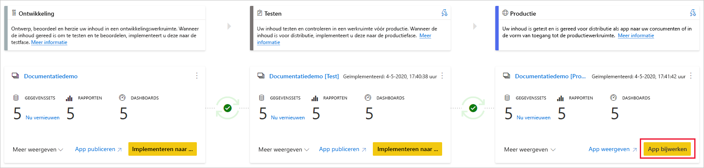

# Uitleg over het implementatieproces (preview)

Met het implementatieproces kunt u inhoud van de ene pijplijnfase klonen naar een andere. Meestal is dit van ontwikkeling naar test, of van test naar productie.

Tijdens de implementatie wordt in Power BI de inhoud van de huidige fase gekopieerd naar de doelfase. De verbindingen tussen de gekopieerde items blijven behouden tijdens het kopieerproces. In Power BI worden ook de geconfigureerde gegevenssetregels toegepast op de bijgewerkte inhoud in de doelfase. Het implementeren van inhoud kan enige tijd duren, afhankelijk van het aantal items dat wordt geïmplementeerd. Gedurende deze tijd kunt u navigeren naar andere pagina's in de Power BI-portal, maar u kunt de inhoud in de doelfase niet gebruiken.

## Inhoud implementeren in een lege fase

Wanneer u inhoud implementeert in een lege fase, worden de metagegevens van de rapporten, dashboards en gegevenssets in de werkruimte vanwaaruit u implementeert, gekopieerd naar de fase waarin u implementeert. Er wordt in een premium-capaciteit een nieuwe werkruimte gemaakt voor de fase waarin u implementeert.

Er zijn twee manieren om inhoud te implementeren van de ene fase naar de volgende. U kunt alle inhoud implementeren of u kunt [selecteren welke inhoudsitems u wilt implementeren](deployment-pipelines-get-started.md#selective-deployment).

U kunt inhoud ook achterwaarts implementeren, vanuit een latere fase in de implementatiepijplijn, naar een eerdere.

Als de implementatie is voltooid, vernieuwt u de gegevenssets zodat u de zojuist gekopieerde inhoud kunt gebruiken. Vernieuwen van de gegevensset is vereist omdat de gegevens niet van de ene fase naar de andere worden gekopieerd. Raadpleeg de sectie [Gekopieerde eigenschappen van items tijdens de implementatie](#item-properties-copied-during-deployment) als u wilt weten welke eigenschappen van items tijdens het implementatieproces wel worden gekopieerd en welke niet.

### Een werkruimte maken in een premium-capaciteit

Tijdens de eerste implementatie wordt met de implementatiepijplijnen gecontroleerd of u beschikt over machtigingen voor premium-capaciteit.  

Als u capaciteitsmachtigingen hebt, wordt de inhoud van de werkruimte gekopieerd naar de fase waarin u implementeert. Er wordt ook een nieuwe werkruimte voor deze fase gemaakt in de premium-capaciteit.

Als u geen capaciteitsmachtigingen hebt, wordt de werkruimte wel gemaakt, maar wordt de inhoud niet gekopieerd. U kunt een capaciteitsbeheerder vragen om uw werkruimte toe te voegen aan een capaciteit of u kunt vragen om toewijzingsmachtigingen voor de capaciteit. Later, wanneer de werkruimte is toegewezen aan een capaciteit, kunt u inhoud implementeren in deze werkruimte.

### Eigendom van werkruimte en inhoud

De gebruiker die implementeert wordt automatisch de gegevensseteigenaar van de gekloonde gegevenssets en de enige beheerder van de nieuwe werkruimte.

## Inhoud implementeren in een bestaande werkruimte

Voorbeelden van implementeren van inhoud in een werkende productiepijplijn, in een fase die een bestaande werkruimte bevat:

* Nieuwe inhoud als aanvulling implementeren in een fase die al inhoud bevat.

* Nieuwe inhoud die wordt geïmplementeerd ter vervanging van oude inhoud, in een huidige werkende fase.

### Implementatieproces

Inhoud van de huidige fase wordt gekopieerd naar de doelfase. In Power BI wordt bestaande inhoud in de doelfase geïdentificeerd en overschreven. Implementatiepijplijnen gebruiken de verbinding tussen het bovenliggende item en de bijbehorende klonen om te identificeren welk inhoudsitem moet worden overschreven. Deze verbinding blijft behouden wanneer nieuwe inhoud wordt gemaakt. Bij het overschrijven wordt alleen de inhoud van het item overschreven. De id, URL en machtigingen van het item blijven ongewijzigd.

In de doelfase blijven [eigenschappen van items die niet zijn gekopieerd](deployment-pipelines-process.md#item-properties-that-are-not-copied), behouden zoals ze waren vóór de implementatie. Nieuwe inhoud en nieuwe items worden uit de huidige fase gekopieerd naar de doelfase.

### De gegevensset vernieuwen​​

Gegevens in de doelgegevensset blijven waar mogelijk behouden. Als er geen wijzigingen zijn aangebracht in een gegevensset, blijven de gegevens behouden zoals ze waren vóór de implementatie.

Bij kleine wijzigingen, zoals het toevoegen van een tabel of metingen, blijven in Power BI de oorspronkelijke gegevens behouden en wordt de vernieuwing geoptimaliseerd om alleen te vernieuwen wat nodig is. Bij wijzigingen in het schema die fouten veroorzaken, of wijzigingen in de verbinding met de gegevensbron, is een volledige vernieuwing vereist.

### Vereisten voor implementatie in een fase met een bestaande werkruimte

Zolang de geïmplementeerde inhoud zich in een [premium-capaciteit](../admin/service-premium-what-is.md) bevindt, kan een gebruiker die aan de volgende voorwaarden voldoet, de inhoud implementeren in een fase met een bestaande werkruimte:

* Een [Pro-gebruikers](../admin/service-admin-purchasing-power-bi-pro.md) die lid is van beide werkruimten in de bron- en doelimplementatiefasen.

* Een eigenaar van alle gegevenssets in de doelwerkruimte die op het punt staan te worden geïmplementeerd.

Raadpleeg de sectie [Machtigingen](#permissions) voor meer informatie.

## Geïmplementeerde items

Wanneer u inhoud vanuit de ene pijplijnfase implementeert in een andere, bevat de gekopieerde inhoud de volgende Power BI-items:

* Gegevenssets

* Rapporten

* Dashboards

### Niet-ondersteunde items

Implementatiepijplijnen bieden geen ondersteuning voor de volgende items:

* Gegevenssets die niet afkomstig zijn uit een PBIX-bestand

* Rapporten die zijn gebaseerd op niet-ondersteunde gegevenssets

* De werkruimte kan geen sjabloon-app gebruiken

* Gepagineerde rapporten

* Gegevensstromen

* PUSH-gegevenssets

* Werkmappen

## Eigenschappen van items die worden gekopieerd tijdens de implementatie

Tijdens de implementatie worden de volgende eigenschappen van items gekopieerd, en worden de eigenschappen van items in de doelfase hiermee overschreven:

* Gegevensbronnen ([gegevenssetregels](deployment-pipelines-get-started.md#step-4---create-dataset-rules) worden ondersteund)

* Parameters ([gegevenssetregels](deployment-pipelines-get-started.md#step-4---create-dataset-rules) worden ondersteund)

* Rapportvisuals

* Rapportpagina's

* Update van dashboardtegels

* Modelmetagegevens

* Itemrelaties

### Eigenschappen van items die niet worden gekopieerd

De volgende eigenschappen van items worden niet gekopieerd tijdens de implementatie:

* Gegevens - Er worden geen gegevens gekopieerd, alleen metagegevens worden gekopieerd

* URL

* Id

* Machtigingen: voor een werkruimte of een specifiek item

* Werkruimte-instellingen: elke fase heeft een eigen werkruimte

* App-inhoud en -instellingen: raadpleeg [Power BI-apps implementeren](#deploying-power-bi-apps) om uw apps te implementeren

De volgende eigenschappen van gegevenssets worden niet gekopieerd tijdens de implementatie:

* Roltoewijzing
    
* Vernieuwingsschema
    
* Gegevensbronreferenties
    
* Cache-instellingen voor query's (kunnen worden overgenomen van de capaciteit)
    
* Goedkeuringsinstellingen

## Power BI-apps implementeren

[Power BI-apps](../consumer/end-user-apps.md) zijn de aanbevolen manier om inhoud te distribueren naar gebruikers van de gratis versie van Power BI. Met behulp van implementatiepijplijnen kunt u Power BI-apps beheren in een implementatiepijplijn, zodat u meer controle en flexibiliteit hebt wanneer het gaat om de levenscyclus van uw app.

Maak een app voor elke implementatiepijplijnfase, zodat u elke app-update kunt testen vanuit het perspectief van de eindgebruiker. Met een implementatiepijplijn kunt u dit proces eenvoudig beheren. Gebruik de knop Publiceren of Weergeven in de werkruimtekaart om de app te publiceren of weer te geven in een specifieke pijplijnfase.

In de productiefase wordt met de hoofdactieknop (in de rechterbenedenhoek) de pagina App bijwerken in Power BI geopend, zodat eventuele inhoudsupdates beschikbaar worden voor gebruikers van de app.

>[!IMPORTANT]
>Het implementatieproces omvat niet het bijwerken van de inhoud of instellingen van de app. Als u wijzigingen wilt aanbrengen in de inhoud of instellingen, moet u de app handmatig bijwerken in de vereiste pijplijnfase.

## Machtigingen

Pijplijnmachtigingen en werkruimtemachtigingen worden afzonderlijk verleend en beheerd. Bijvoorbeeld, een gebruiker met pijplijntoegang die niet beschikt over werkruimtemachtigingen, kan de pijplijn weergeven en delen met anderen. Deze gebruiker kan echter de inhoud van de werkruimte niet weergeven in de pijplijn, of op de werkruimtepagina, en kan geen implementaties uitvoeren.

### Gebruiker met pijplijntoegang

Gebruikers met pijplijntoegang beschikken over de volgende machtigingen:

* De pijplijn weergeven
    
* De pijplijn delen met anderen
    
* De pijplijn bewerken en verwijderen

>[!NOTE]
>Pijplijntoegang verleent geen machtigingen om de inhoud van de werkruimte weer te geven of er acties op uit te voeren.

### Werkruimteviewer

Werkruimteviewers die *pijplijntoegang* hebben, kunnen ook het volgende doen:

* Inhoud gebruiken

>[!NOTE]
>Werkruimteviewers hebben geen toegang tot de gegevensset en kunnen de inhoud van de werkruimte niet bewerken.

### Werkruimtebijdrager

Werkruimtebijdragers die *pijplijntoegang* hebben, kunnen ook het volgende doen:

* Inhoud gebruiken

* Fasen vergelijken

* Gegevenssets weergeven

### Werkruimtelid

Werkruimteleden die *pijplijntoegang* hebben, kunnen ook het volgende doen:

* Inhoud van de werkruimte weergegeven
    
* Fasen vergelijken
    
* Rapporten en dashboards implementeren

* Werkruimten verwijderen

### Werkruimtebeheerder

Werkruimtebeheerders met *pijplijntoegang* kunnen acties voor *werkruimteleden* uitvoeren, en kunnen ook het volgende doen:

* Werkruimten toewijzen

* Werkruimten verwijderen

### Eigenaar van gegevensset

Eigenaars van gegevenssets die lid of beheerder van de werkruimte zijn, kunnen ook het volgende doen:

* Gegevenssets bijwerken
    
* Regels configureren

>[!NOTE]
>In deze sectie worden gebruikersmachtigingen in implementatiepijplijnen beschreven. De machtigingen die in deze sectie worden vermeld, kunnen een andere toepassing hebben in andere Power BI-functies.

## Beperkingen

In deze sectie worden de meeste beperkingen in implementatiepijplijnen vermeld.

* De werkruimte moet zich bevinden in een  [premium-capaciteit](../admin/service-premium-what-is.md).

* Power BI-items, zoals rapporten en dashboards, met Power BI-[vertrouwelijkheidslabels](../admin/service-security-sensitivity-label-overview.md), kunnen niet worden geïmplementeerd.

* Het maximum aantal Power BI-items dat in één implementatie kan worden geïmplementeerd, is 300.

* Zie [Beperkingen voor werkruimtetoewijzing](deployment-pipelines-get-started.md#workspace-assignment-limitations) voor een lijst met beperkingen voor werkruimten.

* Zie [Niet-ondersteunde items](#unsupported-items) voor een lijst met niet-ondersteunde items.

### Beperkingen van gegevensset

* Gegevenssets die zijn geconfigureerd met [incrementeel vernieuwen](../admin/service-premium-incremental-refresh.md), kunnen niet worden geïmplementeerd.

* Er kunnen geen gegevenssets worden geïmplementeerd die gebruikmaken van realtime verbinding.

* Als de doel-dataset tijdens de implementatie gebruikmaakt van een [live-verbinding](../connect-data/desktop-report-lifecycle-datasets.md), moet de bron-gegevensset ook deze verbindingsmodus gebruiken.

* Na de implementatie wordt het downloaden van een gegevensset (vanuit het stadium war het naar is geïmplementeerd) niet ondersteund.

* Zie [Beperkingen voor gegevenssetregels](deployment-pipelines-get-started.md#dataset-rule-limitations) voor een lijst met beperkingen voor gegevenssetregels.

## Volgende stappen

>[!div class="nextstepaction"]
>[Inleiding tot implementatiepijplijnen](deployment-pipelines-overview.md)

>[!div class="nextstepaction"]
>[Best practices voor implementatiepijplijnen](deployment-pipelines-best-practices.md)

>[!div class="nextstepaction"]
>[Aan de slag gaan met implementatiepijplijnen](deployment-pipelines-get-started.md)

>[!div class="nextstepaction"]
>[Problemen met implementatiepijplijnen oplossen](deployment-pipelines-troubleshooting.md)
