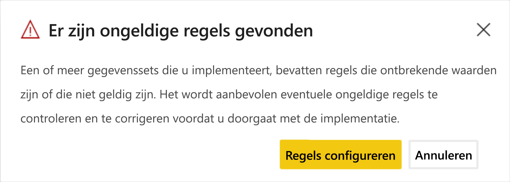

# Problemen met implementatiepijplijnen oplossen (preview)

Gebruik dit artikel om problemen in implementatiepijplijnen op te lossen.

## Algemeen

### Wat zijn implementatiepijplijnen in Power BI?

Raadpleeg het [overzicht van implementatiepijplijnen](deployment-pipelines-overview.md) voor meer informatie over wat implementatiepijplijnen in Power BI zijn.

### Hoe ga ik aan de slag met implementatiepijplijnen?

Volg de [instructiehandleiding](deployment-pipelines-get-started.md) om aan de slag te gaan met implementatiepijplijnen.

### Waarom zie ik de knop Implementatiepijplijnen niet?

Als niet aan de volgende voorwaarden is voldaan, wordt de knop Implementatiepijplijnen niet weergegeven.

* U bent een Power BI [Pro-gebruiker](../admin/service-admin-purchasing-power-bi-pro.md)

* U maakt deel uit van een organisatie met premium-capaciteit

* Een werkruimte kan slechts worden toegewezen aan één pijplijn

* U bent een beheerder van een nieuwe werkruimte

## Licentieverlening

### Welke licenties zijn nodig om te werken met implementatiepijplijnen?

Als u implementatiepijplijnen wilt gebruiken, moet u een [Pro-gebruiker](../admin/service-admin-purchasing-power-bi-pro.md) zijn met [premium-capaciteit](../admin/service-premium-what-is.md). Zie [toegang tot implementatiepijplijnen](deployment-pipelines-get-started.md#accessing-deployment-pipelines) voor meer informatie.

### Welk type capaciteit kan ik toewijzen aan een werkruimte in een pijplijn?

Alle werkruimten in een implementatiepijplijn moeten zich in een toegewezen capaciteit bevinden om de pijplijn goed te laten functioneren. U kunt echter verschillende capaciteiten gebruiken voor verschillende werkruimten in een pijplijn. U kunt ook verschillende typen capaciteiten gebruiken voor verschillende werkruimten in dezelfde pijplijn.

Voor ontwikkelen en testen kunt u een A- of EM- capaciteit gebruiken, naast een Pro Power BI-account voor elke gebruiker.

Voor productiewerkruimten hebt u een P-capaciteit nodig. Als u een ISV bent die inhoud distribueert via ingesloten toepassingen, kunt u ook A- of EM-capaciteiten gebruiken voor productie.

## Technisch

### Waarom zie ik niet al mijn werkruimten wanneer ik probeer een werkruimte toe te wijzen aan een pijplijn?

Als u een werkruimte wilt toewijzen aan een pijplijn, moet aan de volgende voorwaarden zijn voldaan:

* De werkruimte is een [nieuwe werkruimte-ervaring](../collaborate-share/service-create-the-new-workspaces.md)

* U bent een beheerder van de werkruimte

* De werkruimte mag niet zijn toegewezen aan een andere pijplijn

* De werkruimte bevindt zich in een [premium-capaciteit](../admin/service-premium-what-is.md)

Werkruimten die niet aan deze voorwaarden voldoen, worden niet vermeld in de lijst met werkruimten waaruit u kunt kiezen.

### Hoe kan ik werkruimten toewijzen aan alle fasen in een pijplijn?

U kunt één werkruimte per pijplijn toewijzen. Zodra een werkruimte is toegewezen aan een pijplijn, kunt u deze implementeren in de volgende pijplijnfasen. Tijdens de eerste implementatie wordt een nieuwe werkruimte gemaakt met kopieën van de items in de bronfase. De relaties van de gekopieerde items blijven behouden. Kijk hoe u [een werkruimte kunt toewijzen aan een implementatiepijplijn](deployment-pipelines-get-started.md#step-2---assign-a-workspace-to-a-deployment-pipeline) voor meer informatie.

### Waarom is de eerste implementatie mislukt?

De eerste implementatie kan om een aantal redenen zijn mislukt. Enkele van deze redenen worden vermeld in de onderstaande tabel.

|Fout  |Actie  |
|---------|---------|
|U hebt geen [machtigingen voor premium-capaciteit](deployment-pipelines-process.md#creating-a-premium-capacity-workspace).     |Als u machtigingen voor premium-capaciteit wilt hebben, vraagt u een capaciteitsbeheerder om uw werkruimte toe te voegen aan een capaciteit, of vraagt u om toewijzingsmachtigingen voor de capaciteit. Nadat de werkruimte zich in een capaciteit bevindt, moet u deze opnieuw implementeren.        |
|U hebt geen machtigingen voor de werkruimte.     |Als u wilt implementeren, moet u lid zijn van de werkruimte. Vraag de werkruimtebeheerder om u de juiste machtigingen te verlenen.         |
|De Power BI-beheerder heeft het maken van werkruimten uitgeschakeld.     |Neem contact op met de Power BI-beheerder voor ondersteuning.         |
|De werkruimte is geen [nieuwe werkruimte-ervaring](../collaborate-share/service-create-the-new-workspaces.md)     |Maak uw inhoud in de nieuwe werkruimte-ervaring. Als u inhoud hebt in een klassieke werkruimte, kunt u deze [upgraden](../collaborate-share/service-upgrade-workspaces.md) naar een nieuwe werkruimte-ervaring.         |
|U gebruikt [selectieve implementatie](deployment-pipelines-get-started.md#selective-deployment) en hebt niet de gegevensset van uw inhoud geselecteerd.     |Voer een van de volgende handelingen uit:   Hef de selectie op van inhoud die is gekoppeld aan uw gegevensset. De niet-geselecteerde inhoud (zoals rapporten of dashboards) wordt niet gekopieerd naar de volgende fase.   Selecteer de gegevensset die is gekoppeld aan de geselecteerde inhoud. Uw gegevensset wordt gekopieerd naar de volgende fase.         |

### Ik krijg een waarschuwing dat mijn werkruimte niet-ondersteunde artefacten bevat, wanneer ik probeer te implementeren. Hoe weet ik welke artefacten niet worden ondersteund?

Zie de volgende secties voor een uitgebreide lijst met items en artefacten die niet worden ondersteund in implementatiepijplijnen:

* [Niet-ondersteunde items](deployment-pipelines-process.md#unsupported-items)

* [Eigenschappen van items die niet worden gekopieerd](deployment-pipelines-process.md#item-properties-that-are-not-copied)

### Waarom is de implementatie mislukt vanwege beschadigde regels?

Als u problemen ondervindt met het configureren van gegevenssetregels, gaat u naar [gegevenssetregels](deployment-pipelines-get-started.md#step-4---create-dataset-rules) en zorgt u ervoor dat u de [beperkingen voor gegevenssetregels](deployment-pipelines-get-started.md#dataset-rule-limitations) volgt.

Als de implementatie eerder is geslaagd en plotseling mislukt vanwege beschadigde regels, komt dit mogelijk omdat een gegevensset opnieuw wordt gepubliceerd. De volgende wijzigingen in de brongegevensset veroorzaken een mislukte implementatie:

**Parameterregels**

* Een verwijderde parameter

* Een wijziging in de parameternaam

**Gegevensbronregels**

Er ontbreken waarden in de gegevenssetregels. Dit kan gebeuren als de gegevensset is gewijzigd.

Wanneer een eerder geslaagde implementatie mislukt vanwege beschadigde koppelingen, wordt er een waarschuwing weergegeven. U kunt klikken op **Regels configureren** om naar het deelvenster Implementatie-instellingen te gaan, waar de mislukte gegevensset is gemarkeerd. Wanneer u op de gegevensset klikt, worden de beschadigde regels gemarkeerd.

Voor een geslaagde implementatie corrigeert of verwijdert u de beschadigde regels en voert u de implementatie opnieuw uit.

### Hoe kan ik de gegevensbron wijzigen in de pijplijnfasen?

U kunt de verbinding met de gegevensbron niet wijzigen in de Power BI-service.

Als u de gegevensbron wilt wijzigen in de test- of productiefasen, kunt u [gegevenssetregels](deployment-pipelines-get-started.md#step-4---create-dataset-rules) of [API's](https://docs.microsoft.com/rest/api/power-bi/datasets/updateparametersingroup) gebruiken. Gegevenssetregels worden van kracht na de volgende implementatie.

### Ik heb een bug in productie opgelost, maar ik kan nu niet klikken op de knop Implementeren in vorige fase. Waarom wordt deze knop grijs weergegeven?

U kunt alleen achterwaarts implementeren in een lege fase. Als u inhoud in de testfase hebt, kunt u niet achterwaarts implementeren vanuit productie.

Nadat u de pijplijn hebt gemaakt, gebruikt u de ontwikkelingsfase om uw inhoud te ontwikkelen en de testfasen om deze te controleren en te testen. U kunt in deze fasen fouten corrigeren, en vervolgens de vaste omgeving implementeren in de productiefase.

>[!NOTE]
>Achterwaarts implementeren biedt alleen ondersteuning voor een [volledige implementatie](deployment-pipelines-get-started.md#deploying-all-content). Het biedt geen ondersteuning voor [selectieve implementatie](deployment-pipelines-get-started.md#selective-deployment)

### Bieden implementatiepijplijnen ondersteuning voor multi-geo?

Multi-geo wordt ondersteund. Het kan langer duren om inhoud te implementeren tussen fasen in verschillende geografische gebieden.

## Machtigingen

### Wat is het machtigingenmodel voor implementatiepijplijnen?

Het machtigingenmodel voor implementatiepijplijnen wordt beschreven in de sectie [machtigingen](deployment-pipelines-process.md#permissions).

### Wie kan inhoud tussen fasen implementeren?

Inhoud kan worden geïmplementeerd in een lege fase of in een fase die inhoud bevat. De inhoud moet zich bevinden in een [premium-capaciteit](../admin/service-premium-what-is.md).

* **Implementeren in een lege fase**: elke [Pro-gebruiker](../admin/service-admin-purchasing-power-bi-pro.md) die lid of beheerder is van de bronwerkruimte.

* **Implementeren in een fase met inhoud**: een [Pro-gebruikers](../admin/service-admin-purchasing-power-bi-pro.md) die lid of beheerder is van beide werkruimten in de bron- en doelimplementatiefasen.

* **Overschrijven van een gegevensset**: bij een implementatie wordt elke gegevensset die is opgenomen in de doelfase overschreven, zelfs als de gegevensset niet is gewijzigd. De gebruiker moet de eigenaar zijn van alle gegevenssets in de doelfase die zijn opgegeven in de implementatie.

### Welke machtigingen heb ik nodig om gegevenssetregels te configureren?

Voor het configureren van gegevenssetregels in implementatiepijplijnen moet u de eigenaar van de gegevensset zijn.

### Waarom zie ik geen werkruimten in de pijplijn?

Machtigingen voor pijplijnen en werkruimten worden afzonderlijk beheerd. Het kan zijn dat u beschikt over pijplijnmachtigingen, maar niet over werkruimtemachtigingen. Raadpleeg de sectie [Machtigingen](deployment-pipelines-process.md#permissions) voor meer informatie.

## Volgende stappen

>[!div class="nextstepaction"]
>[Inleiding tot implementatiepijplijnen](deployment-pipelines-overview.md)

>[!div class="nextstepaction"]
>[Aan de slag gaan met implementatiepijplijnen](deployment-pipelines-get-started.md)

>[!div class="nextstepaction"]
>[Uitleg over het proces van implementatiepijplijnen](deployment-pipelines-process.md)

>[!div class="nextstepaction"]
>[Best practices voor implementatiepijplijnen](deployment-pipelines-best-practices.md)