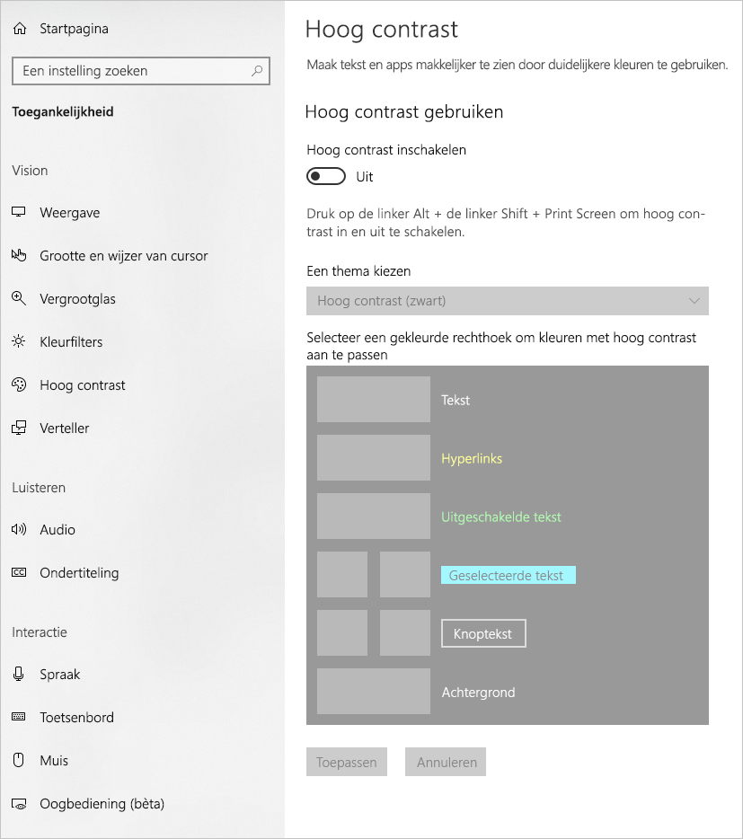
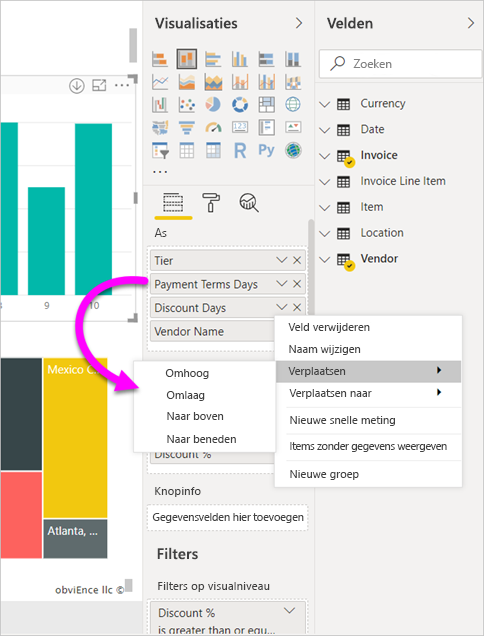
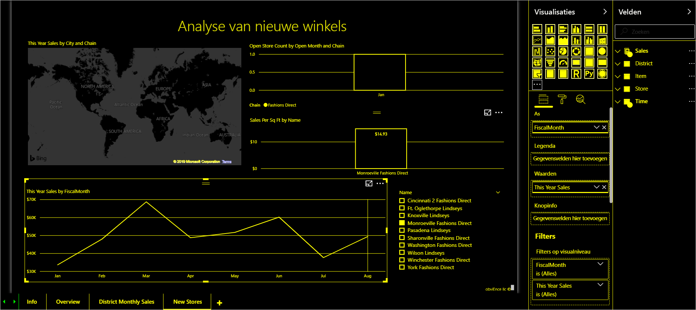
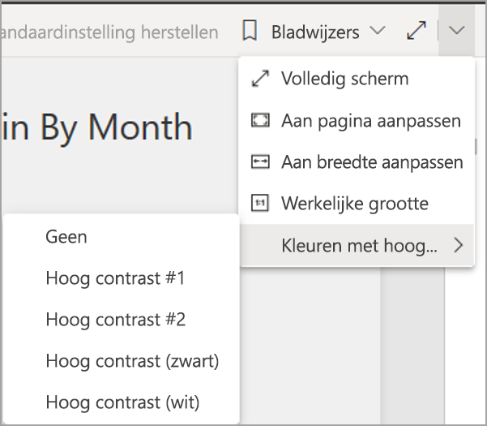
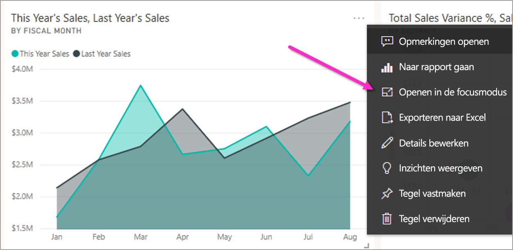
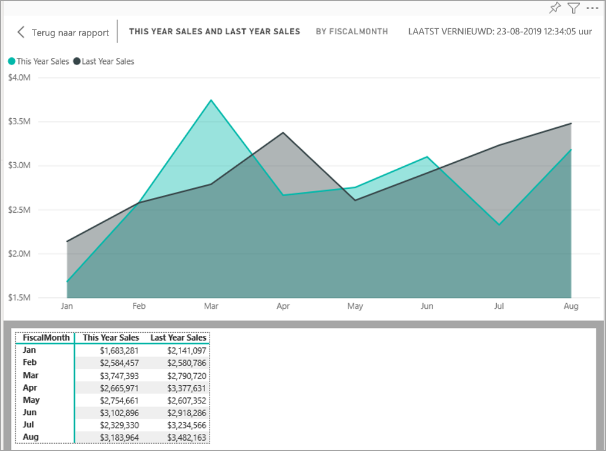
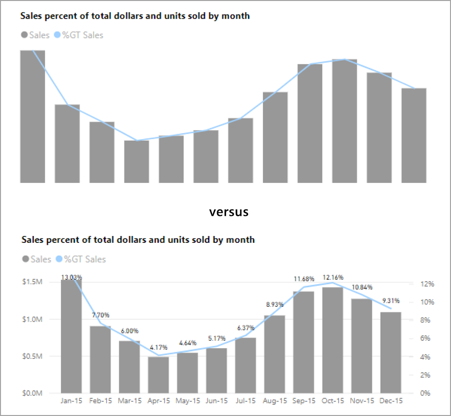
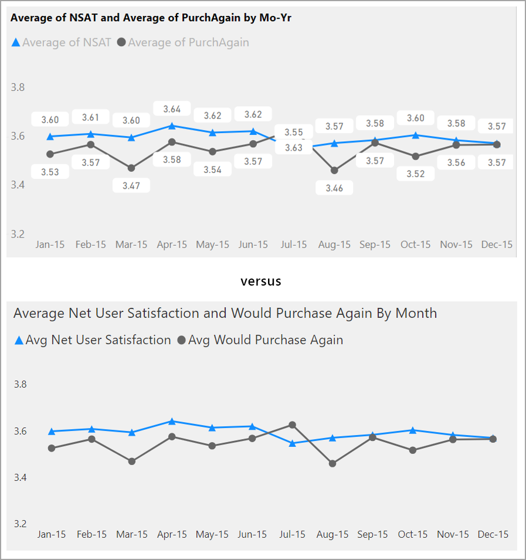
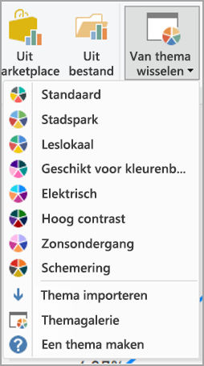

# Power BI-rapporten ontwerpen met het oog op toegankelijkheid
U kunt aantrekkelijke rapporten ontwerpen en maken waarbij ook aan toegankelijkheid wordt gedacht. Wanneer u een rapport samenstelt, ongeacht uw doelgroep, moet u uw rapporten zo maken dat ze door zoveel mogelijk mensen kunnen worden gebruikt, zonder dat u ze hoeft aan te passen aan een soort speciaal ontwerp.

In dit artikel worden de toegankelijkheidsfuncties en hulpprogramma's beschreven voor het maken van toegankelijke rapporten in Power BI.

In het algemeen is het raadzaam om de scanmodus in te schakelen of de bladermodus uit te schakelen wanneer u Power BI gebruikt met een schermlezer.

Er is een contextmenu beschikbaar om het maakproces van rapporten met schermlezers te verbeteren. Via het menu kunt u velden in de bron omhoog of omlaag verplaatsen in de lijst **Velden**. Via het menu kunt u het veld ook naar andere bronnen verplaatsen, zoals een **Legenda** of **Waarde**.

## Soorten toegankelijkheidsfuncties

Power BI biedt de mogelijkheid om toegankelijke rapporten te maken, maar als auteur van het rapport is het aan u om deze in uw rapporten op te nemen. Er zijn drie categorieën toegankelijkheidsfuncties die in dit artikel worden beschreven:

* Ingebouwde toegankelijkheidsfuncties (geen configuratie vereist)
* Ingebouwde toegankelijkheidsfuncties (configuratie vereist)
* Andere tips en overwegingen

Elk van deze categorieën wordt beschreven in de volgende secties.

## Ingebouwde toegankelijkheidsfuncties

Power BI heeft toegankelijkheidsfuncties die zijn ingebouwd in het product, waarvoor geen configuratie vereist is door de auteur van het rapport. Dit zijn de volgende functies:

* Toetsenbordnavigatie
* Compatibiliteit met schermlezer
* Kleurenweergave met hoog contrast
* Focusmodus
* Gegevenstabel weergeven

Er zijn ook functies die helpen bij de verbruikservaring van rapporten. Artikelen over deze functies vindt u in de sectie [Volgende stappen](#next-steps) aan het einde van dit artikel.

Laten we eens kijken naar elk van deze ingebouwde toegankelijkheidsfuncties. 

### Toetsenbordnavigatie

Als auteur van een rapport hoeft u zich geen zorgen te maken of uw consumenten hun toetsenbord kunnen gebruiken om door een rapport te navigeren. Power BI-visuals zijn allemaal met het toetsenbord navigeerbaar en uw rapportgebruiker kan door de gegevenspunten in visuals lopen, schakelen tussen paginatabbladen en toegang hebben tot interactieve mogelijkheden, waaronder kruislings markeren, filtering en segmentering.

Als een gebruiker door een rapport navigeert, verschijnt de focus om aan te geven waar de gebruiker zich in het rapport bevindt. Afhankelijk van de browser die wordt gebruikt, kan de focusmodus anders worden weergegeven.

Als u naar de meest gebruikte sneltoetsen wilt gaan, kunt u op *?* drukken om een dialoogvenster met sneltoetsen weer te geven. Zie voor meer informatie deze artikelen over de gebruikservaring en sneltoetsen in de sectie [Volgende stappen](#next-steps) aan het einde van dit artikel.

### Compatibiliteit met schermlezers

In het algemeen is elk object in Power BI met toetsenbordnavigatie ook geschikt voor schermlezers. Wanneer een rapportgebruiker naar een visual navigeert, leest de schermlezer de titel, het visualtype en eventuele alternatieve tekst als dit is ingesteld.

### Weergave van kleuren met hoog contrast

Power BI biedt ondersteuning voor hoge contrasten in rapporten. Als u gebruikmaakt van de modus voor hoog contrast in Windows, detecteert Power BI Desktop automatisch welk thema voor hoge contrasten in Windows wordt gebruikt. Deze instellingen worden vervolgens ook toegepast op uw rapporten. De kleuren in hoog contrast blijven zichtbaar in het rapport wanneer het via de Power BI-service of elders wordt gepubliceerd.

De Power BI-service probeert ook de instellingen voor hoge contrasten te detecteren die voor Windows zijn ingesteld, maar hoe effectief en nauwkeurig deze detectie verloopt, is afhankelijk van welke browser wordt gebruikt voor de Power BI-service. Als u het thema handmatig wilt instellen in de Power BI-service, selecteert u **V > Kleuren met hoog contrast**. Selecteer vervolgens het thema dat u wilt toepassen op het rapport.

### Focusmodus
Als een rapportgebruiker naar een visual in een dashboard kijkt, kan hij de visual uitbreiden om meer van zijn scherm te vullen door naar het contextmenu van de visual te navigeren en **In focusmodus openen** te selecteren.

### Gegevenstabel weergeven
Rapportgebruikers kunnen de gegevens ook in een visual in tabelvorm bekijken door te drukken op **Alt+Shift+F11**. Deze tabel is vergelijkbaar met het indrukken van **Gegevens weergeven** in het contextmenu van de visual, maar deze tabel is schermlezervriendelijk.

## Configuratie van ingebouwde toegankelijkheidsfuncties

Power BI heeft toegankelijkheidsfuncties die zijn ingebouwd in het product, waarvoor configuratie vereist is door de auteur van het rapport.  Deze functies zijn onder andere:

* Alternatieve tekst
* Tabvolgorde
* Titels en labels
* Markeringen
* Rapportthema's

## Alternatieve tekst

Alternatieve tekst (beschrijvingen van alternatieve tekst) wordt gebruikt om het uiterlijk en de functie van visuals en afbeeldingen op de rapportpagina voor schermlezers te beschrijven. Auteurs van rapporten moeten alternatieve tekst toevoegen aan elk object dat zinvolle informatie aan een rapport toevoegt. Door het toevoegen van alternatieve tekst zorgt u ervoor dat gebruikers van uw rapport begrijpen wat u probeert te communiceren met een visual, zelfs als ze een visual, afbeelding, vorm of tekstvak niet kunnen zien. U kunt als volgt alternatieve tekst opgeven voor elk gewenst object in een Power BI Desktop-rapport: selecteer het object (een visual, vorm enzovoort) en selecteer in het deelvenster **Visualisaties** de sectie **Opmaak**, vouw **Algemeen** uit, schuif naar beneden en vul het tekstvak **Alternatieve tekst** in. Het tekstvak **Alternatieve tekst** heeft een limiet van 250 tekens.

Alternatieve tekst moet informatie bevatten over het inzicht dat u wilt dat de rapportgebruiker uit een visual haalt. Aangezien een schermlezer de titel en het type van een visual leest, hoeft u slechts een beschrijving in te vullen. Een voorbeeld van alternatieve tekst voor de volgende visual zou kunnen zijn: *Netto gebruikerstevredenheid per kleur van het verkochte product, verder uitgesplitst naar productklasse.*

Houd er rekening mee dat het aanroepen van een inzicht of specifieke gegevenspunten mogelijk niet het beste is om statische alternatieve tekst in te stellen, omdat de gegevens in Power BI dynamisch zijn. Als u dynamische alternatieve tekst wilt gebruiken, raadpleeg dan de volgende sectie waarin de voorwaardelijke opmaak van alternatieve tekst wordt beschreven.

### Voorwaardelijke opmaak voor alternatieve tekst

Een eigenschap die Power BI zo overtuigend maakt, is dat de gegevens dynamisch zijn. U kunt DAX-metingen en voorwaardelijke opmaak gebruiken om dynamische alternatieve tekst te maken. Schermlezers kunnen dan waarden oproepen die specifiek zijn voor de gegevens die een rapportgebruiker bekijkt.

### Tabvolgorde
Door de tabvolgorde in te stellen, kunnen toetsenbordgebruikers door uw rapport navigeren in een volgorde die overeenkomt met de manier waarop gebruikers de visuals van het rapport verwerken. Als u decoratieve vormen en afbeeldingen in uw rapport opneemt, moet u deze uit de tabvolgorde verwijderen. 

Als u de tabvolgorde wilt instellen, selecteert u het tabblad **Weergeven** in het lint en selecteert u de knop **Selectiedeelvenster** om het selectiedeelvenster weer te geven.

In het **Selectiedeelvenster** selecteert u **tabvolgorde** om de huidige tabvolgorde voor uw rapport weer te geven. U kunt een object selecteren en vervolgens de pijltjestoetsen omhoog en omlaag gebruiken om het object in de hiërarchie te verplaatsen, of u kunt met de muis een object selecteren en het naar de gewenste positie in de lijst slepen. Als u op het nummer naast een object klikt, wordt het object verborgen in de tabvolgorde.

### Titels en labels
Titels van visuals en rapportpagina’s zijn belangrijke toegankelijkheidsfuncties waarmee de gebruiker van het rapport zich kan oriënteren. Vermijd het gebruik van acroniemen of jargon in uw rapporttitels; als u het rapport deelt met een nieuwe gebruiker of iemand die buiten uw organisatie staat, weten zij mogelijk niet wat uw termen of acroniemen betekenen. De volgende afbeelding bevat een visual met een acroniem in de titel (links) en een duidelijkere titel voor de visual rechts.

Zorg ervoor dat alle titels, aslabels, legendawaarden en gegevenslabels eenvoudig te lezen en te begrijpen zijn binnen een visual. Vergelijk de volgende afbeeldingen, waarbij de eerste afbeelding weinig getallen of beschrijvingen van de gegevens heeft, en de tweede juist veel.

Met gegevenslabels kunt u er zelfs voor kiezen om de labels voor elke reeks in uw visual in of uit te schakelen of deze boven of onder een reeks te plaatsen. Hoewel Power BI zijn best doet om gegevenslabels boven of onder een regel te plaatsen, is het soms niet erg duidelijk. In de volgende afbeelding zijn de gegevenslabels door elkaar gegooid en niet gemakkelijk te lezen.

Het kan helpen om uw gegevenslabels boven of onder uw reeks te plaatsen, vooral als u een lijndiagram met meerdere lijnen gebruikt. Met een paar aanpassingen zien de gegevenslabels er nu veel beter uit.

### Markeringen

Het is een best practice om te voorkomen dat kleur (met inbegrip van de functie voorwaardelijke opmaak) als de enige manier van het overbrengen van informatie wordt gebruikt. In plaats daarvan kunt u markeringen gebruiken om verschillende reeksen over te brengen.

Schakel markeringen in voor visuals (zoals een regel, gebied en keuzelijst met invoervak) en voor spreidingsdiagrammen en beldiagrammen, enzovoort, en gebruik een andere vorm van markering voor elke regel.

Als u markeringen wilt inschakelen, selecteert u de sectie Opmaak in het deelvenster Visualisaties en vouwt u de sectie **Vormen** uit. Schuif vervolgens omlaag naar de schakeloptie **Markeringen weergeven** en zet deze op **Aan**, zie onderstaande afbeelding. 

U kunt ook **Reeks aanpassen** gebruiken om de naam van elke regel (of elk gebied, als u een vlakdiagram gebruikt) te selecteren in de vervolgkeuzelijst in de sectie Vormen. Onder de vervolgkeuzelijst kunt u veel aspecten van de gebruikte markering voor de geselecteerde regel aanpassen, met inbegrip van de vorm, kleur en grootte.

Hoewel we aanraden dat auteurs van rapporten gegevenslabels en markeringen inschakelen, kan het inschakelen van al deze opties voor elke visual afleidend zijn en uw rapport minder toegankelijk maken. In de volgende afbeelding kunt u een visual vergelijken die zowel gegevenslabels als markeringen heeft, en vervolgens een beter te begrijpen versie waarin gegevenslabels zijn uitgeschakeld.

Als u niet zeker weet of uw visual of rapport te druk is, test u dat door een [squint test](https://chrome.google.com/webstore/detail/the-squint-test/gppnipfbappicilfniaimcnagbpfflpg) (loensen) te doen.  Als uw ogen meer naar de gegevenslabels worden getrokken dan naar de gegevenspunten, schakelt u de gegevenslabels uit.

### Thema's, contrast en kleurenblindvriendelijke kleuren

Zorg ervoor dat er in uw rapporten voldoende contrast is tussen tekst en de achtergrondkleuren. In het WCAG 2.1 succescriterium 1.4.3 is vastgelegd dat tekst en achtergrondkleur een contrastverhouding van minimaal 4.5:1 moeten hebben. Er zijn verschillende hulpprogramma's zoals [Color Contrast Analyzer](https://developer.paciellogroup.com/resources/contrastanalyser/), [WebAIM](https://webaim.org/resources/contrastchecker/) en [Accessible Colors](https://accessible-colors.com/) die u kunt gebruiken om de kleuren van uw rapport te controleren.

U moet ook rekening houden met het feit dat sommige rapportgebruikers tekortkomingen in hun kleurenzicht kunnen hebben. Hulpprogramma’s als [Coblis](https://www.color-blindness.com/coblis-color-blindness-simulator/) en [Vischeck](https://www.vischeck.com/vischeck/vischeckImage.php) simuleren wat rapportkijkers met verschillende kleurzichtafwijkingen zien.  Door minder kleuren of een monochroom palet in uw rapport te gebruiken, kunt u het maken van ontoegankelijke rapporten beperken.

Bepaalde kleurencombinaties zijn met name voor gebruikers met kleurzichtafwijkingen moeilijk te onderscheiden. Dit zijn onder andere de volgende combinaties: 

* groen en rood
* groen en bruin
* blauw en paars
* groen en blauw
* lichtgroen en geel
* blauw en grijs
* groen en grijs
* groen en zwart

Vermijd combinaties van deze kleuren in een grafiek of op dezelfde rapportpagina. Power BI heeft een aantal ingebouwde thema's om uw rapport toegankelijker te maken, maar het is het beste om uw rapport te controleren met enkele van de extra hulpmiddelen die in dit artikel worden voorgesteld.

## Tips en overwegingen
Deze sectie geeft enkele richtlijnen, tips en overwegingen om in gedachten te houden bij het maken van rapporten met het oog op de toegankelijkheid.

### Begrijp wat uw publiek wil

Het maken van een rapport is een iteratief proces. Voordat u visuals op de pagina plaatst, kunt u het beste met een aantal van uw rapportgebruikers praten om een beter inzicht te krijgen in de informatie die ze uit uw rapport willen halen en hoe ze deze willen zien.  

Toegankelijkheid inbouwen moet deel uitmaken van dit proces. U komt er misschien achter dat uw visie niet is wat uw rapportgebruikers in gedachten hebben. Zodra u een eerste ontwerp van uw rapport hebt opgesteld, laat het dan zien aan een gebruiker en verzamel meer feedback. Als auteur van een rapport kan het verzamelen van feedback helpen om een toekomstige stortvloed aan verzoeken om veranderingen van ongelukkige rapportgebruikers te beperken.

### Uw rapport eenvoudig en consistent houden

Houd uw rapport zo eenvoudig mogelijk. Mensen proberen vaak te veel in één visual te stoppen. Vaak is de informatie in meerdere visuals uit te splitsen, waardoor het eenvoudiger en begrijpelijker wordt. Gebruik meerdere visuals als ze verschillende facetten van de gegevens tonen en filters of visuele interacties gebruiken om een ​​rijke ervaring te creëren. Houd tegelijkertijd het aantal visuals op een pagina tot een minimum beperkt. Probeer onnodige redundantie en rommel op de pagina te voorkomen. U hebt niet twee visuals nodig om hetzelfde te laten zien. Rapportgebruikers kunnen worden overweldigd door alle informatie die wordt gegeven door te veel visuals, of mogelijk kunnen ze zich niet lang achter elkaar concentreren en worden ze snel afgeleid. Dit maakt het rapport niet alleen eenvoudiger te gebruiken, maar het kan ook zijn dat te veel visuals op een pagina de prestaties van uw rapport vertragen.

Houd uw rapport consistent door voor het lettertype dezelfde kleur en-stijl te gebruiken voor de visuals in het rapport. Gebruik dezelfde lettergrootte voor alle visual-titels, zoals u dat ook zou moeten doen voor gegevenslabels en astitels. Als u slicers op meerdere rapportpagina's gebruikt, bewaar ze dan op dezelfde locatie op elke pagina van uw rapport.

### Test op slechtziendheid

Een snelle manier om te testen hoe een rapport eruit zou zien voor gebruikers met slechter zicht is om de helderheid van uw scherm of mobiele apparaat te verlagen.  Er zijn browser-invoegtoepassingen die u kunt gebruiken die u kunnen helpen bij het uitvoeren van een squint test (loensen).

## Controlelijst voor toegankelijkheid van rapporten

Power BI biedt niet alleen toegankelijkheidshulpmiddelen en -functies, maar ook de volgende controlelijst die u kunt gebruiken bij het maken van rapporten. Met deze controlelijst maakt u uw rapporten toegankelijk en beschikbaar voor het grootste publiek, voordat u deze publiceert. 

### Alle visuals

* Zorg ervoor dat het kleurcontrast tussen de tekst van titel, aslabel en gegevenslabel en de achtergrond ten minste 4,5:1 zijn.
* Vermijd het gebruik van kleur als enige manier om informatie over te brengen. Gebruik tekst of pictogrammen om de kleur aan te vullen of te vervangen.
* Vervang onnodig jargon of acroniemen.
* Zorg ervoor dat **alternatieve tekst** wordt toegevoegd aan alle niet-decoratieve visuals op de pagina.
* Controleer of uw rapportpagina werkt voor gebruikers die kleurenblind zijn.

### Slicers
* Als u een verzameling van verschillende slicers op uw rapportpagina's hebt, zorg er dan voor dat uw ontwerp consistent is op alle pagina's. Gebruik zoveel mogelijk hetzelfde lettertype, dezelfde kleuren en ruimtelijke positie.

### Tekstvak
* Zorg ervoor dat het kleurcontrast tussen lettertype en achtergrond ten minste 4,5:1 is.
* Zorg ervoor dat u de tekstinhoud in het vakje **alternatieve tekst** plaatst, zodat de schermlezers deze kunnen lezen.

### Visualinteracties
* Is belangrijke informatie alleen toegankelijk via een interactie? Als dat zo is, herschik dan uw visuals zodat deze vooraf gefilterd zijn om de belangrijke conclusie duidelijker te maken.
* Gebruikt u bladwijzers voor navigatie? Navigeer door uw rapport met een toetsenbord om ervoor te zorgen dat de ervaring acceptabel is voor gebruikers die alleen een toetsenbord gebruiken.

### Sorteervolgorde
* Hebt u doelbewust de sorteervolgorde van elke visual op de pagina ingesteld? In de toegankelijke tabel **​​Gegevens weergeven** worden de gegevens weergegeven in de sorteervolgorde die u voor de visual hebt ingesteld.

### Knopinfo
* Gebruik geen knopinfo om belangrijke informatie over te brengen. Gebruikers met motorische problemen en gebruikers die geen muis gebruiken, zullen moeite hebben om deze te bereiken.
* Voeg wel knopinfo toe aan diagrammen als aanvullende informatie. Het is opgenomen in de toegankelijke tabel **​​Gegevens weergeven** voor elke visual.

### Video
* Vermijd video die automatisch start wanneer de pagina wordt weergegeven.
* Zorg ervoor dat uw video ondertiteling bevat of voeg een transcriptie toe.

### Audio
* Vermijd audio die automatisch start wanneer de pagina wordt weergegeven.
* Bied een transcriptie aan voor alle audio.

### Vormen
* Zorg ervoor dat alle decoratieve vormen zijn gemarkeerd als verborgen in de tabvolgorde, zodat ze niet worden aangekondigd door een schermlezer.
* Vermijd het gebruik van te veel decoratieve vormen op plekken waar deze storend zijn.
* Wanneer u vormen gebruikt om gegevenspunten op te roepen, gebruikt u **alternatieve tekst** om uit te leggen wat er wordt opgeroepen.

### Afbeeldingen
* Wanneer u afbeeldingen gebruikt om gegevenspunten op te roepen, gebruikt u **alternatieve tekst** om uit te leggen wat er wordt opgeroepen.
* Zorg ervoor dat alle decoratieve afbeeldingen zijn gemarkeerd als verborgen in tabbladen, zodat ze niet worden aangekondigd door een schermlezer.
* Vermijd het gebruik van te veel decoratieve afbeeldingen. Dit kan storend werken.

### Power BI-visuals
* Controleer de toegankelijke tabel **​​Gegevens weergeven** voor Power BI-visuals. Als de getoonde informatie niet genoeg is, zoek dan een andere visual.
* Als u de aangepaste visual *Play Axis* gebruikt, moet u ervoor zorgen dat deze niet automatisch wordt afgespeeld. Maak duidelijk dat de gebruiker op de knop voor afspelen/pauzeren moet drukken om de veranderende waarden te starten/stoppen.

### Over visuals op de pagina
* Tabvolgorde instellen en tabvolgorde uitschakelen (het item als verborgen markeren) op decoratieve items.

## Overwegingen en beperkingen
Er zijn enkele bekende problemen en beperkingen met betrekking tot de toegankelijkheidsfuncties. Beschrijvingen van deze problemen en beperkingen vindt u in de volgende lijst:

* Als u schermlezers met **Power BI Desktop** gebruikt, krijgt u de beste ervaring als u de schermlezer opent voordat u bestanden opent in **Power BI Desktop**.

## Volgende stappen

De verzameling van artikelen voor Power BI-toegankelijkheid is als volgt:

* [Overzicht van toegankelijkheid in Power BI](desktop-accessibility-overview.md) 
* [Power BI-rapporten gebruiken met hulpprogramma's voor toegankelijkheid](desktop-accessibility-consuming-tools.md)
* [Power BI-rapporten maken met hulpprogramma's voor toegankelijkheid](desktop-accessibility-creating-tools.md)
* [Sneltoetsen voor toegankelijkheid in Power BI-rapporten](desktop-accessibility-keyboard-shortcuts.md)
* [Controlelijst voor toegankelijkheid van rapporten](#report-accessibility-checklist)
