# Rapporten maken in Power BI met behulp van toegankelijkheidsprogramma’s

Voor rapportmakers die gebruikmaken van toegankelijkheidsprogramma’s om rapporten te maken, heeft Power BI veel ingebouwde mogelijkheden die kunnen helpen in het proces.

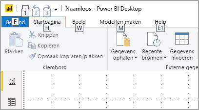

In dit artikel worden de vele typen toegankelijkheidsprogramma's beschreven die beschikbaar zijn voor makers van rapporten in Power BI Desktop.

## Navigatie op app-niveau
Bij het navigeren in Power BI Desktop kunt u de focus verplaatsen naar de hoofdgebieden van de app door op **CTRL + F6** te drukken. Een verschuiving van de focus op het hoofdgebied van Power BI Desktop verloopt in de volgende volgorde:

1. Objecten op canvas
2. Paginatabbladen
3. Deelvensters (elk afzonderlijk, van links naar rechts voor die zijn geopend)
4. Navigator weergeven
5. Voettekst
6. Aanmelden
7. Gele balk voor waarschuwing / fout / updates

In de meeste gevallen zijn **Enter** om een gebied te selecteren of gegevens in te voeren en vervolgens **ESC** om af te sluiten algemene procedures in Power BI.

## Lintnavigatie

Druk op **Alt** om de kleine vensters met de naam *KeyTips* weer te geven boven elke opdracht die beschikbaar is in de huidige weergave van het lint. Vervolgens kunt u op de letter klikken die wordt weergegeven in de *KeyTip* boven de opdracht die u wilt gebruiken. 

In de volgende afbeelding is bijvoorbeeld de **Alt**-toets ingedrukt om KeyTips weer te geven, die de letters voor beschikbare toegankelijke opdrachten bevatten. Druk vervolgens op **M** om het tabblad **Model maken** op het lint te openen.

Afhankelijk van de letter waarop u drukt, worden er mogelijk aanvullende KeyTips weergegeven. Als het tabblad **Start** bijvoorbeeld actief is en u drukt op **W**, wordt het tabblad **Weergave** weergegeven, samen met de KeyTips voor de groepen in dat linttabblad **Weergave**. U kunt doorgaan met het indrukken van de letters die in KeyTips worden weergegeven totdat u de letter indrukt van de specifieke opdracht die u wilt gebruiken. Als u wilt overschakelen naar de vorige set KeyTips, drukt u op **ESC**. Als u de huidige actie wilt annuleren en de KeyTips wilt verbergen, drukt u op de **Alt**-toets.

## Navigeren in visuele deelvensters

Als u wilt navigeren in het deelvenster **Visualisaties**, moet u eerst controleren of uw focus in het deelvenster is, door op **CTRL + F6** te drukken totdat u in het deelvenster komt. Wanneer een gebruiker door het deelvenster Visualisaties navigeert, wordt de focus eerst op de koptekst geplaatst. Vanaf de bovenkant is de tabvolgorde zoals wordt weergegeven in de volgende afbeelding:

1. De titel van de koptekst
2. Het dakje uitvouwen/samenvouwen
3. Het eerste visuele pictogram

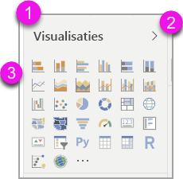

Wanneer u naar de visuals gaat, kunt u met behulp van de pijltoetsen naar een bepaalde visual navigeren en op **Enter** klikken om deze te selecteren. Als u een schermlezer gebruikt, wordt aangegeven of u een nieuwe grafiek hebt gemaakt en welk type het is, of dat u een bepaald type grafiek hebt gewijzigd in een ander type grafiek. 

Na de sectie visuals van het deelvenster verschuift de focusvolgorde vervolgens naar de deelvenster-pivots, zoals wordt weergegeven in de volgende afbeelding.

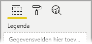

Wanneer de focus op de deelvenster-pivots is, verschijnen tabbladen alleen op het pictogram voor het geselecteerde paneel. Gebruik de pijltoetsen om naar andere deelvensters te schakelen.

## Veldbron

Als de focus op de deelvenster-pivots is, zoals beschreven in de vorige sectie, drukt u nogmaals op het tabblad om de focus naar de **veldbron** te verplaatsen. 

In de **veldbron** wordt de focusvolgorde verplaatst naar:

* de titel van elke bron (eerste)
* gevolgd door een bepaald veld in elke bron (volgende)
* de vervolgkeuzelijst om het menu Veld te openen (erna)
* en vervolgens de knop verwijderen (laatste)

In de volgende afbeelding ziet u de voortgang van de focusvolgorde.

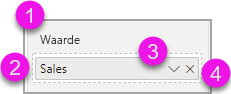

Een schermlezer leest de naam van de bron en de knopinfo voor. Voor elk veld in een bron leest een schermlezer de veldnaam en de knopinfo. Als een bron leeg is, moet de focus naar de gehele lege bron worden verplaatst. De schermlezer moet de bronnaam en knopinfo lezen, en dat deze leeg is.

Wanneer het veldmenu geopend is, kunt u zich er doorheen bewegen met **Tab** of **Shift + Tab** of de pijltoetsen **Omhoog** / **Omlaag**. Er wordt een schermlezer met de namen van de opties aangeroepen.

Als u een veld van de ene bucket in de veldbron naar een andere bucket wilt verplaatsen, kunt u uw toetsenbord gebruiken en de optie **Verplaatsen** in het veldbronmenu gebruiken, zoals weergegeven in de volgende afbeelding.

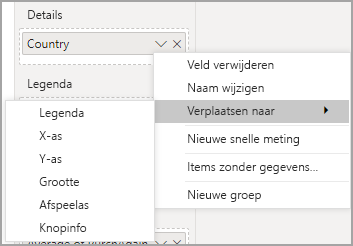

## Opmaakvenster

De focusvolgorde voor het deelvenster **Opmaak** wordt verplaatst van boven naar beneden, vervolgens omlaag, in kaartvolgorde. De focus beweegt rond de kaartnaam, gevolgd door de schakelknop **aan/uit**, indien aanwezig. Wanneer de focus op de kaartnaam is, leest een schermlezer de naam van de kaart en of de kaart is uitgevouwen of samengevouwen. U kunt op **Enter** drukken om de kaart uit te vouwen of samen te vouwen. De **Enter**-toets werkt ook om de schakelknop **aan** of **uit** te schakelen.

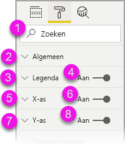

Als een kaart geopend is, wordt de **tab** door de besturingselementen in de kaart verplaatst voordat naar de volgende kaart wordt gegaan. Voor de bedieningselementen op een kaart roept een schermlezer de titel, de huidige waarde en het bedieningstype op.  

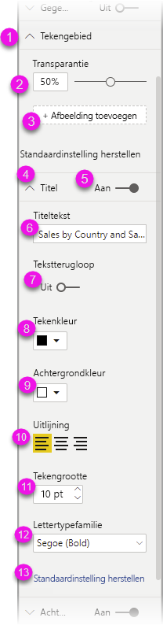

## Navigatie in lijst met velden

U kunt op **Tab** drukken om door de lijst **Velden** te navigeren. Vergelijkbaar met het opmaakvenster; als tabellen zijn samengevouwen, doorloopt de focusvolgorde in de volgende volgorde:

1. De lijstkoptekst **Velden**
2. De zoekbalk
3. Elke tabelnaam

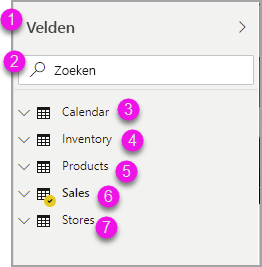

Als u alle tabellen in de bron **Velden** wilt uitvouwen, drukt u op **ALT + SHIFT + 9**. Als u alle tabellen wilt samenvouwen, drukt u op **ALT + SHIFT + 1**. Als u één tabel wilt uitvouwen, drukt u op de **pijl-rechts**. Als u één tabel wilt samenvouwen, drukt u op de **pijl-links**. Vergelijkbaar met het opmaakvenster; als een tabel is uitgevouwen, bevat deze tabbladen en kunt u navigeren door de veldenlijst inclusief de velden die worden weergegeven. Een schermlezer geeft aan of u een tabel hebt uitgevouwen of samengevouwen.

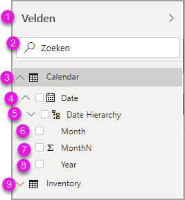

U kunt een veld aanvinken door naar het gewenste veld te navigeren en op **Enter** te drukken.   Een schermlezer roept het veld aan waarop de focus ligt en geeft aan of het veld is geselecteerd of niet.

Muisgebruikers slepen de velden meestal naar het canvas of naar de relevante filterbuckets. Als u uw toetsenbord wilt gebruiken, kunt u een veld aan een filterbucket toevoegen door het contextmenu van een veld te openen door op **Shift + F10** te drukken, met de pijltjestoetsen te navigeren naar **Toevoegen aan filters** en vervolgens op **Enter** te drukken op het type filter waaraan u het veld wilt toevoegen.

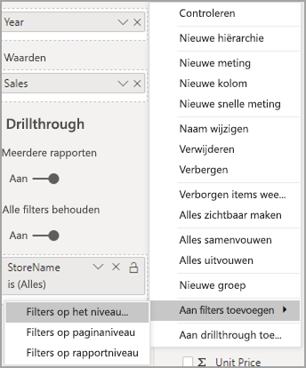

## Navigatie in selectievenster
Het deelvenster **Selectie** heeft de volgende voortgang van de focusvolgorde:

1. Titel van de koptekst
2. Knop Afsluiten
3. Wisselaar laag/tabbladvolgorde
4. Knop Omhoog in laag
5. Knop Omlaag in laag
6. Knop Weergeven
7. Knop Verbergen
8. Objecten

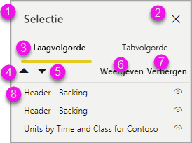

U kunt de focusvolgorde doorlopen en op **Enter** drukken om het element te selecteren waarin u bent geïnteresseerd.  

Wanneer u bij de wisselknop voor laag/tabvolgorde komt, gebruikt u de pijltoetsen links en rechts om te schakelen tussen de volgorde van de lagen en de tabvolgorde.

Wanneer u bij de objecten in het deelvenster **Selectie** komt, drukt u op **F6** om het deelvenster **Selectie** te activeren. Nadat u het deelvenster **Selectie** hebt geactiveerd, kunt u de toetsen pijl-omhoog/omlaag gebruiken om naar de verschillende objecten in het deelvenster **Selectie** te gaan.
Als u eenmaal naar een interessant object hebt genavigeerd, zijn er een paar verschillende acties die u kunt uitvoeren:

* Druk op **Ctrl + Shift + S** om een object te verbergen/weer te geven
* Druk op **Ctrl + Shift + F** om een object omhoog te verplaatsen in de laagvolgorde
* Druk op **Ctrl + Shift + B** om een object omlaag te verplaatsen in de laagvolgorde
* Druk op **Ctrl + spatie** om meerdere objecten te selecteren

## Power BI Desktop-dialoogvensters

Alle dialoogvensters in Power BI Desktop zijn toegankelijk via toetsenbordnavigatie en werken met schermlezers.

De dialoogvensters in Power BI Desktop bevatten het volgende:

* Dialoogvenster Snelle metingen
* Dialoogvenster Voorwaardelijke opmaak & gegevensbalken
* Dialoogvenster Q&A-verkenner
* Dialoogvenster Aan de slag
* Bestandsmenu en dialoogvenster Over
* Waarschuwingsbalk
* Dialoogvenster Bestand terugzetten
* Dialoogvenster Fronsen

## Ondersteuning voor hoog contrast

Als u modi met hoge contrasten gebruikt in Windows, worden de instellingen daarvoor en het kleurenpalet dat u selecteert ook toegepast op rapporten in Power BI Desktop.

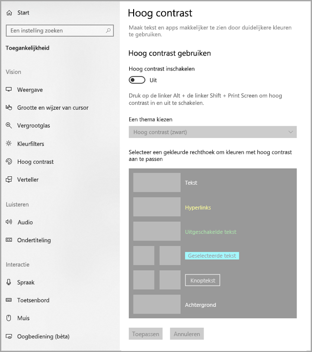

In Power BI Desktop wordt automatisch gedetecteerd welk thema met hoog contrast in Windows wordt gebruikt. Deze instellingen worden vervolgens ook toegepast op uw rapporten. De kleuren in hoog contrast blijven zichtbaar in het rapport wanneer het via de Power BI-service of elders wordt gepubliceerd.

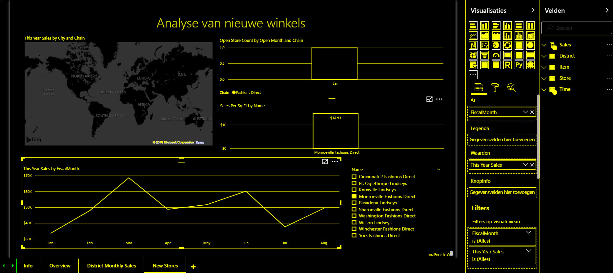

## Volgende stappen

De verzameling van artikelen voor Power BI-toegankelijkheid is als volgt:

* [Overzicht van toegankelijkheid in Power BI](desktop-accessibility-overview.md) 
* [Toegankelijke Power BI-rapporten maken](desktop-accessibility-creating-reports.md) 
* [Rapporten gebruiken in Power BI met toegankelijkheidshulpprogramma's](desktop-accessibility-consuming-tools.md)
* [Sneltoetsen voor toegankelijkheid in Power BI-rapporten](desktop-accessibility-keyboard-shortcuts.md)
* [Controlelijst voor toegankelijkheid van rapporten](desktop-accessibility-creating-reports.md#report-accessibility-checklist)

