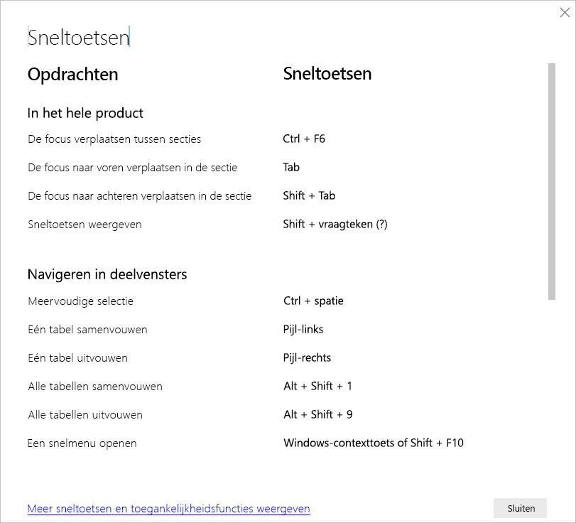

# Sneltoetsen in Power BI Desktop

Sneltoetsen zijn handig voor het navigeren in Power BI-rapporten met behulp van een toetsenbord. In de volgende tabellen in dit artikel worden de sneltoetsen beschreven die beschikbaar zijn in een Power BI-rapport. 

Wanneer u Power BI Desktop gebruikt, kunt u op **Shift + ?** drukken om sneltoetsen weer te geven (zie de volgende afbeelding).

Deze toetsenbordsneltoetsen werken niet alleen in **Power BI Desktop**, maar ook in de volgende ervaringen:

* Dialoogvenster **Q&A Explorer**
* Dialoogvenster **Aan de slag**
* Menu **Bestand** en dialoogvenster **Info**
* Balk **Waarschuwing**
* Dialoogvenster **Bestand terugzetten**
* Dialoogvenster **Fronsen**

We zetten ons voortdurend in om de toegankelijkheid te verbeteren. Bovenstaande elementen ondersteunen daarom ook schermlezers en instellingen voor hoog contrast.

## Veelgebruikte sneltoetsen
| Uit te voeren actie           | Actie                |
| :------------------- | :------------------- |
| De focus verplaatsen tussen secties  | **Ctrl+F6** |
| De focus naar voren verplaatsen in de sectie | **TAB-toets**         |
| De focus naar achteren verplaatsen in de sectie | **Shift+TAB-toets** |
| Een object selecteren of de selectie van een object wissen | **Enter** of **spatiebalk** |
| Meerdere objecten selecteren | **Ctrl+spatiebalk** |

## Op de visual
| Uit te voeren actie           | Actie                |
| :------------------- | :------------------- |
| De focus verplaatsen naar het menu van de visual | **Alt+Shift+F10** |
| Gegevens weergeven | **Alt+Shift+F11**  |
| Een visual invoeren | **Ctrl+pijl-rechts** |
| Een laag openen | **Enter** |
| Een laag of visual verlaten | **Esc** |
| Een gegevenspunt selecteren of de selectie van een gegevenspunt wissen | **Enter** of **spatiebalk** |
| Meervoudige selectie | **Ctrl+Enter** of **Ctrl+spatiebalk** |
| Klikken met de rechtermuisknop | <ul><li>Windows-toetsenbord: **Windows-contexttoets+F10**. De Windows-snelmenutoets bevindt zich tussen de linker Alt-toets en de pijl-links</li><li>Ander toetsenbord: **Shift+F10**</li></ul> |
| Selectie wissen | **Ctrl+Shift+C** |
| Knopinfo weergeven of verbergen | **Ctrl + H** |

## Navigatie in tabellen en matrices
| Uit te voeren actie          | Actie                |
| :------------------- | :------------------- |
| De focus één cel omhoog/omlaag verplaatsen (binnen alle cellen in alle gebieden)  | **Pijl-omhoog** / **Pijl-omlaag** |
| De focus één cel naar links/rechts verplaatsen (binnen alle cellen in alle gebieden)  | **Pijl-links** / **Pijl-rechts** |

## Navigeren in deelvensters
| Uit te voeren actie           | Actie                |
| :------------------- | :------------------- |
| Meervoudige selectie | **Ctrl+spatiebalk** |
| Eén tabel samenvouwen | **Pijl-links** |
| Eén tabel uitvouwen | **Pijl-rechts** |
| Alle tabellen samenvouwen | **Alt+Shift+1** |
| Alle tabellen uitvouwen | **Alt+Shift+9** |
| Een snelmenu openen | <ul><li>Windows-toetsenbord: **Windows-contexttoets+F10**.  De Windows-snelmenutoets bevindt zich tussen de linker Alt-toets en de pijl-links</li><li>Ander toetsenbord: **Shift+F10**</li></ul> |

## Slicer
| Uit te voeren actie         | Actie                |
| :------------------- | :------------------- |
| Communiceren met een slicer | **Ctrl+pijl-rechts** |

## Selectiedeelvenster
| Uit te voeren actie           | Actie                |
| :------------------- | :------------------- |
| Het selectievenster activeren | **F6** |
| Een object omhoog verplaatsen in de lagen | **Ctrl+Shift+F** |
| Een object omlaag verplaatsen in de lagen | **Alt+Shift+B** |
| Een object verbergen/weergeven (in-/uitschakelen) | **Alt+Shift+S** |

## DAX Editor
| Uit te voeren actie          | Actie                |
| :------------------- | :------------------- |
| Regel omhoog/omlaag verplaatsen | **Alt+Pijl-omhoog** / **Pijl-omlaag** |
| Regel omhoog/omlaag kopiëren | **Shift+Pijl-omhoog** / **Pijl-omlaag** |
| Regel onder invoegen | **Ctrl+Enter** |
| Regel boven invoegen | **Ctrl+Shift+Enter** |
| Ga naar overeenkomend haakje | **Ctrl+Shift+**  \ |
| Regel inspringen/regel uitbreiden naar de marge | **Ctrl + ]**  /  **[** |
| Cursor invoegen | **Alt+klikken** |
| Huidige regel selecteren | **Ctrl+I** |
| Selecteer alle instanties van de huidige selectie | **Ctrl+Shift+L** |
| Alle instanties van het huidige woord selecteren | **Ctrl+F2** |

## Gegevens invoeren
| Uit te voeren actie           | Actie                |
| :------------------- | :------------------- |
| Bewerkbaar raster afsluiten | **Ctrl+TAB-toets** |

## Overwegingen en beperkingen
Er zijn enkele bekende problemen en beperkingen met betrekking tot de toegankelijkheidsfuncties. Beschrijvingen van deze problemen en beperkingen vindt u in de volgende lijst:

* Als u schermlezers met **Power BI Desktop** gebruikt, krijgt u de beste ervaring als u de schermlezer opent voordat u bestanden opent in **Power BI Desktop**.
* Als u Verteller gebruikt, zijn er enkele beperkingen wanneer u door **Gegevens weergeven** als HTML-tabel navigeert.

## Volgende stappen

De verzameling van artikelen voor Power BI-toegankelijkheid is als volgt:

* [Overzicht van toegankelijkheid in Power BI](desktop-accessibility-overview.md) 
* [Toegankelijke Power BI-rapporten maken](desktop-accessibility-creating-reports.md) 
* [Rapporten gebruiken in Power BI met toegankelijkheidshulpprogramma's](desktop-accessibility-consuming-tools.md)
* [Power BI-rapporten maken met hulpprogramma's voor toegankelijkheid](desktop-accessibility-creating-tools.md)
* [Controlelijst voor toegankelijkheid van rapporten](desktop-accessibility-creating-reports.md#report-accessibility-checklist)

Wellicht bent u ook geïnteresseerd in het volgende:

* [Rapportthema's gebruiken in Power BI Desktop](desktop-report-themes.md)

