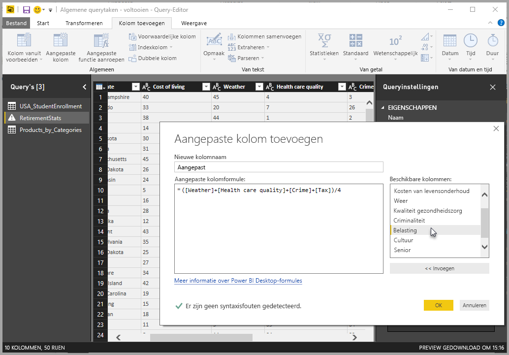
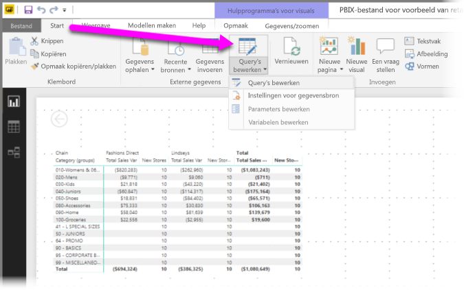
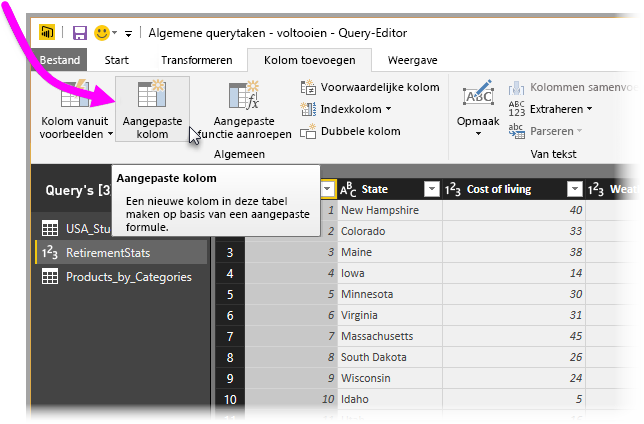
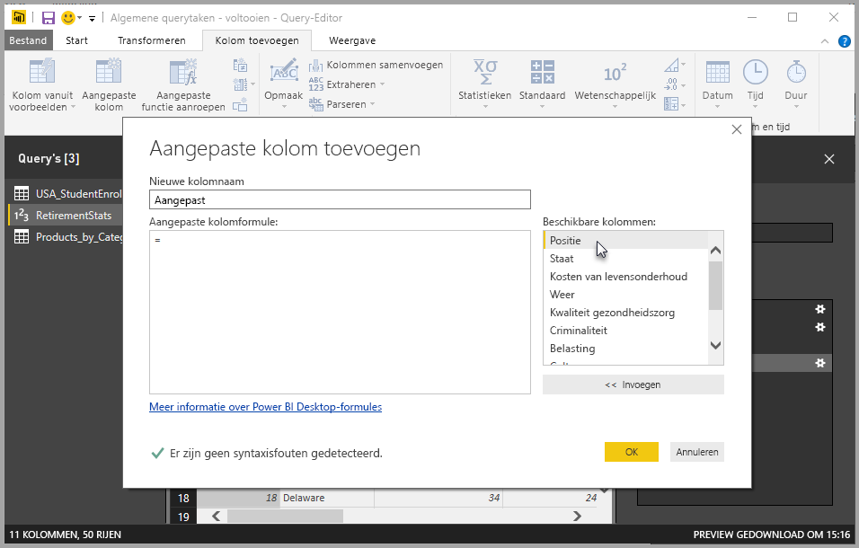
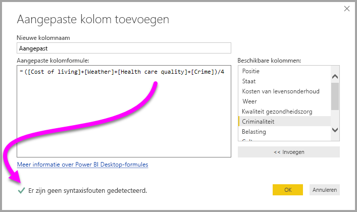
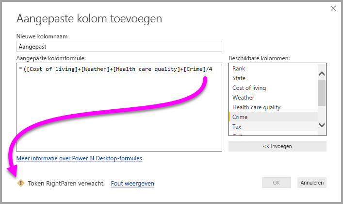
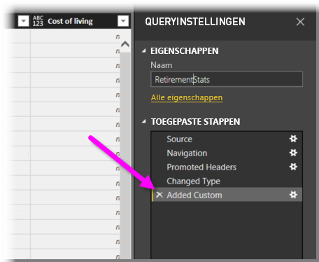
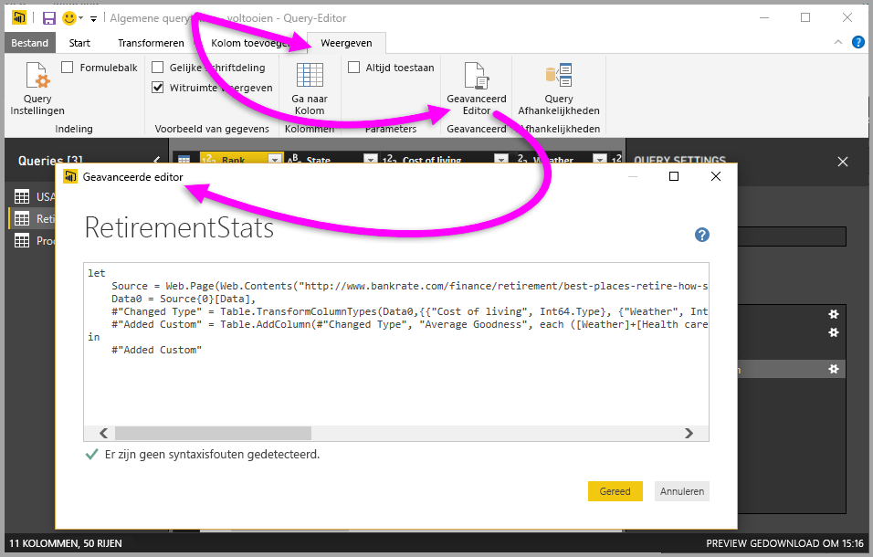

# Aangepaste kolommen toevoegen in Power BI Desktop

In Power BI Desktop kunt u eenvoudig een nieuwe aangepaste kolom met gegevens aan uw model toevoegen door Queryeditor te gebruiken. Met Queryeditor maakt u de aangepaste kolom en wijzigt u de naam van deze kolom voor het maken van [PowerQuery M-formulequery's](https://docs.microsoft.com/powerquery-m/quick-tour-of-the-power-query-m-formula-language) om uw aangepaste kolom te definiëren. PowerQuery M-formulequery's beschikken over een [uitgebreide naslag met functiebeschrijvingen](https://docs.microsoft.com/powerquery-m/power-query-m-function-reference). 

Wanneer u een aangepaste kolom maakt in Queryeditor, wordt deze door Power BI Desktop toegevoegd als een **toegepaste stap** in de **queryinstellingen** van de query. Deze kan op elk gewenst moment worden gewijzigd, verplaatst of aangepast.

## Queryeditor gebruiken om een aangepaste kolom toe te voegen

Als u een aangepaste kolom wilt gaan maken, voert u de onderstaande stappen uit:

1. Start Power BI Desktop en laad wat gegevens.

2. Selecteer op het tabblad **Start** op het lint de optie **Query's bewerken** en selecteer vervolgens **Query's bewerken** in het menu.

   

   Het venster **Queryeditor** wordt weergegeven. 

2. Selecteer op het tabblad **Kolom toevoegen** op het lint de optie **Aangepaste kolom**.

   

   Het venster **Aangepaste kolom toevoegen** wordt weergegeven.

## Het venster Aangepaste kolom toevoegen

Het venster **Aangepaste kolom toevoegen** bevat de volgende items: 
- Een lijst met beschikbare kolommen in de lijst **Beschikbare kolommen** aan de rechterkant.

- De oorspronkelijke naam van de aangepaste kolom in het vak **Nieuwe kolomnaam**. U kunt de naam van deze kolom wijzigen.

- [PowerQuery M-formulequery's](https://docs.microsoft.com/powerquery-m/power-query-m-function-reference) in het vak **Formule voor aangepaste kolom**. U maakt deze query's door de formule samen te stellen waarmee uw nieuwe aangepaste kolom is gedefinieerd. 

   

## Formules maken voor de aangepaste kolom

1. Selecteer een kolom in de lijst **Beschikbare kolommen** aan de rechterkant en selecteer vervolgens onder de lijst de optie **Invoegen** om de kolom toe te voegen aan de formule voor de aangepaste kolom. U kunt ook een kolom toevoegen door hierop in de lijst dubbel te klikken.

2. Let bij het invoeren van de formule en het maken van de kolom op de indicator onderaan het venster **Aangepaste kolom toevoegen**. 

   Als er geen fouten zijn, worden een groen vinkje en het bericht *Er zijn geen syntaxisfouten gedetecteerd* weergegeven.

   

   Als er een syntaxisfout is gedetecteerd, wordt er een geel waarschuwingspictogram weergegeven, samen met een koppeling naar de locatie waar de fout in de formule is opgetreden.

   

3. Selecteer **OK**. 

   Power BI Desktop voegt uw aangepaste kolom toe aan het model en voegt de stap **Aangepaste kolom toegevoegd** toe aan de lijst **Toegepaste stappen** in **Queryinstellingen**.

   

4. Als u de aangepaste kolom wilt wijzigen, dubbelklikt u op de stap **Aangepaste kolom toegevoegd** in de lijst **Toegepaste stappen**. 

   Het venster **Aangepaste kolom toevoegen** wordt weergegeven met de formule voor de aangepaste kolom die u hebt gemaakt.

## De geavanceerde editor voor aangepaste kolommen gebruiken

Nadat u de query hebt gemaakt, kunt u met de **geavanceerde editor** ook een stap van uw query wijzigen. Volg hiervoor de onderstaande stappen:

1. Selecteer in het venster **Queryeditor** het tabblad **Weergeven** op het lint. 

2. Selecteer **Geavanceerde editor**.

   De pagina **Geavanceerde editor** wordt weergegeven die u volledig beheer over uw query biedt. 

   

   
## Volgende stappen

- U kunt een aangepaste kolom op andere manieren maken, bijvoorbeeld door een kolom te maken op basis van voorbeelden die u aan Queryeditor opgeeft. Zie [Een kolom uit een voorbeeld toevoegen in Power BI Desktop](desktop-add-column-from-example.md) voor meer informatie.

- Zie [Power Query M function reference](/powerquery-m/power-query-m-function-reference) (Naslag met beschrijvingen van Power Query M-functies) voor naslaginformatie over Power Query M.

