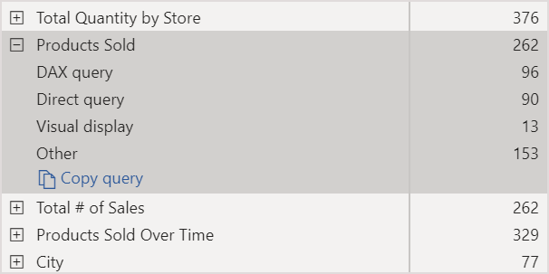

# Automatische paginavernieuwing in Power BI

Bij het bewaken van kritieke gebeurtenissen is het belangrijk dat gegevens worden vernieuwd zodra de brongegevens worden bijgewerkt. In de productiebranche is het bijvoorbeeld belangrijk te weten wanneer een machine defect is, of op het punt staat kapot te gaan. Als u signalen zoals sociale media bewaakt, wilt u over plotselinge wijzigingen weten zodra ze zich voordoen.

Automatische paginavernieuwing in Power BI zorgt ervoor dat de actieve rapportpagina met een vooraf gedefinieerde frequentie nieuwe gegevens ophaalt voor [DirectQuery-bronnen](../connect-data/desktop-directquery-about.md).

## Vernieuwingstypen

Wanneer u automatische paginavernieuwing gebruikt, zijn er twee vernieuwingstypen beschikbaar: vast interval en wijzigingsdetectie.

### Vast interval

Met dit vernieuwingstype kunt u alle visuals op een rapportpagina bijwerken op basis van een constant interval zoals één seconde of vijf minuten. Wanneer dat specifieke interval wordt bereikt, verzenden alle visuals op die pagina een updatequery naar de gegevensbron en wordt de pagina dienovereenkomstig bijgewerkt.

### Wijzigingsdetectie

Met dit vernieuwingstype kunt u visuals op een pagina vernieuwen op basis van het detecteren van wijzigingen in de gegevens in plaats van op basis van een specifiek vernieuwingsinterval. Hierbij wordt in het bijzonder naar wijzigingen in uw [DirectQuery-bron](../connect-data/desktop-directquery-about.md) gezocht. Naast het definiëren van het vernieuwingstype moet u ook selecteren hoe vaak Power BI Desktop op wijzigingen moet controleren. Wanneer u naar de service publiceert, wordt dit vernieuwingstype alleen ondersteund in werkruimten die deel uitmaken van een Premium-capaciteit.

## Rapporten schrijven met automatische paginavernieuwing in Power BI Desktop

Automatische paginavernieuwing is alleen beschikbaar voor [DirectQuery-bronnen](../connect-data/desktop-directquery-about.md) en is dus alleen beschikbaar wanneer u met een DirectQuery-gegevensbron bent verbonden. Deze beperking geldt voor beide vernieuwingstypen.

Als u automatische paginavernieuwing in Power BI Desktop wilt gebruiken, selecteert u de rapportpagina waarvoor u automatische paginavernieuwing wilt inschakelen. Selecteer in het deelvenster **Visualisaties** de knop **Opmaak** (een verfroller) en zoek de sectie **Pagina vernieuwen** onderaan het deelvenster.

1. Hiermee schakelt u het vernieuwen van pagina's in of uit.
2. Vernieuwingstype
3. Invoer en informatie (afhankelijk van vernieuwingstype)

De kaart **Pagina vernieuwen** is alleen beschikbaar als u met een [DirectQuery-bron](../connect-data/desktop-directquery-about.md) bent verbonden. Om automatische paginavernieuwing in te schakelen, moet u de wisselknop in de Aan-positie zetten. De benodigde invoer en verstrekte informatie zijn afhankelijk van het geselecteerde vernieuwingstype.

### Instelling met vast interval

Wanneer u **Vast interval** als het vernieuwingstype selecteert, moet u het gewenste vernieuwingsinterval opgeven. De standaardwaarde is 30 minuten. (Het minimale vernieuwingsinterval is één seconde.) Het vernieuwen van uw rapport begint op het interval dat u hebt ingesteld.

Wanneer u op ‘Details weergeven’ klikt, biedt Power BI verdere informatie over:

- Of de functie is ingeschakeld door uw beheerder (alleen wanneer u bent aangemeld bij uw Power BI-account)
- Het minimale interval dat uw beheerder toestaat (alleen wanneer u bent aangemeld bij uw Power BI-account)
- Het daadwerkelijke vernieuwingsinterval (meestal langer dan uw geselecteerde interval)
- Recentste vernieuwingstijd

### Instelling met wijzigingsdetectie

Wanneer u **Wijzigingsdetectie** als uw vernieuwingstype selecteert, krijgt u een koppeling naar **Wijzigingsdetectie toevoegen** te zien. U kunt het venster **Wijzigingsdetectie** ook openen via het tabblad Modellering op het lint. Klik vervolgens op het pictogram **Wijzigingsdetectie** in de sectie **Pagina vernieuwen**. Tot slot kunt u met de rechtermuisknop klikken of de vervolgkeuzepijl naast een waarde in de bron Waarden selecteren en vervolgens **Wijzigingsdetectie** in het menu selecteren.

Zodra het venster is geopend, krijgt u de optie **Meettype** te zien, waar u een bestaande meting kunt selecteren of een nieuwe meting kunt maken. Wanneer u een bestaande meting selecteert, moet u de gewenste meting gewoon in de lijst met velden selecteren of slepen en neerzetten in de sectie **Bestaande meting kiezen**. Wanneer u een nieuwe meting maakt, kunt u **Een berekening selecteren** voor de meting: Aantal, Aantal afzonderlijke waarden, Minimum, Maximum en Som. U kunt ‘Aantal afzonderlijke waarden’ bijvoorbeeld gebruiken om het aantal klant-id’s te tellen en de pagina alleen te vernieuwen wanneer een nieuwe klant aan de lijst wordt toegevoegd. Zodra u een meting hebt geselecteerd, moet u definiëren hoe vaak Power BI zal **Controleren op wijzigingen**. Dat is het interval waarmee Power BI de meting zal berekenen en op wijzigingen zal controleren. Zodra u op ‘Toepassen’ klikt, wordt er een nieuwe meting met het pictogram Wijzigingsdetectie weergegeven in uw lijst met velden.

In de sectie ‘Pagina vernieuwen’ ziet u vervolgens de meting die voor wijzigingsdetectie wordt gebruikt, en het gedefinieerde interval.

> [!NOTE]
> Er is slechts één wijzigingsdetectiemeting per model toegestaan.

## Het vernieuwingsinterval bepalen

Als Pagina automatisch vernieuwen is ingeschakeld, verzendt Power BI Desktop voortdurend query's naar uw DirectQuery-bron. Nadat de query is verzonden, duurt het even voordat gegevens worden geretourneerd. Voor korte vernieuwingsintervallen moet u dus bevestigen dat query's de opgehaalde gegevens binnen het geconfigureerde interval hebben kunnen retourneren. Als er binnen het interval geen gegevens worden geretourneerd, worden de visuals minder vaak bijgewerkt dan u hebt geconfigureerd.

Deze overwegingen gelden voor beide vernieuwingstypen: vast interval en wijzigingsdetectie. Het voornaamste verschil voor wijzigingsdetectie is dat er slechts één query met een vast interval naar de bron wordt verzonden en de visual alleen wordt vernieuwd wanneer de waarde van de wijzigingsdetectiemeting verandert.

Als aanbevolen procedure geldt dat het vernieuwingsinterval ten minste moet overeenkomen met de verwachte snelheid waarmee de nieuwe gegevens worden ontvangen:

* Als er elke 20 minuten nieuwe gegevens binnenkomen bij de bron, mag het vernieuwingsinterval niet korter zijn dan 20 minuten.
* Als er elke seconde nieuwe gegevens worden ontvangen, stelt u het interval in op één seconde.

Voor lage vernieuwingsintervallen, zoals één seconde, moet u rekening houden met de volgende factoren:

- Het type DirectQuery-gegevensbron
- De werkbelasting van uw query's
- De afstand van uw rapportlezers tot het datacentrum van de capaciteit

U kunt retourtijden schatten met behulp van [Performance Analyzer](desktop-performance-analyzer.md) in Power BI Desktop en het menu ‘Details weergeven’ in de sectie ‘Pagina vernieuwen’ voor het vernieuwingstype ‘Vast interval’. Met Performance Analyzer kunt u controleren of elke visualquery voldoende tijd heeft om de resultaten van de bron te retourneren. U kunt hiermee ook bepalen waaraan de tijd wordt besteed. Op basis van de resultaten van Performance Analyzer kunt u de gegevensbron aanpassen of u kunt experimenteren met andere visuals en meetwaarden in uw rapport.

In deze afbeelding ziet u de resultaten van een DirectQuery-bron in Performance Analyzer:

Laten we eens kijken wat andere kenmerken van deze gegevensbron zijn:

- Gegevens worden elke 2 seconden ontvangen
- In Performance Analyzer wordt een maximale queryduur + weergavetijd van ongeveer 4,9 seconden (4,688 milliseconden) weergegeven
- De gegevensbron is geconfigureerd om ongeveer 1.000 gelijktijdige query's per seconde te verwerken
- U verwacht dat er ongeveer 10 gebruikers het rapport gelijktijdig zullen bekijken

Dat levert de volgende vergelijking op:

- **5 visuals x 10 gebruikers = ongeveer 50 query's**

Het resultaat van deze berekening toont aan dat de belasting veel hoger uitvalt dan de gegevensbron aankan. De snelheid waarmee gegevens worden ontvangen is elke twee seconden, zodat dit dus de vernieuwingsfrequentie moet zijn. Maar omdat het ongeveer vijf seconden duurt om de query uit te voeren, moet u deze op meer dan vijf seconden instellen.

Houd er ook rekening mee dat dit resultaat anders kan zijns wanneer u uw rapport naar de service publiceert. Dit verschil treedt op omdat in het rapport het Azure Analysis Services-exemplaar wordt gebruikt dat wordt gehost in de cloud. Mogelijk wilt u de vernieuwingsfrequentie aanpassen.

Power BI houdt rekening met tijden voor query's en vernieuwingsacties door de query voor vernieuwen pas uit te voeren wanneer alle resterende query's voor vernieuwen zijn voltooid. Zelfs als het vernieuwingsinterval korter is dan de tijd die nodig is om uw query's te verwerken, vernieuwt Power BI pas weer als de resterende query's zijn voltooid.

Deze overwegingen gelden ook voor het vernieuwingstype Wijzigingsdetectie. De [Performance Analyzer](desktop-performance-analyzer.md) toont u ook de resultaten voor de query van de wijzigingsdetectiemeting, hoewel deze niet overeenkomt met een visual in uw rapport. We hebben deze mogelijkheid voor u geboden zodat u problemen met dit type meting kunt oplossen door dezelfde stappen te volgen die we eerder hebben vermeld. Het voornaamste verschil voor dit vernieuwingstype is dat er slechts één query naar de gegevensbron wordt verzonden in plaats van alle query’s uit alle visuals. Dit is nog steeds het geval als meerdere gebruikers het rapport bekijken.

Voor hetzelfde scenario dat we eerder hebben besproken:

- **1 query voor de wijzigingsdetectiemeting voor 5 visuals genereert slechts één query voor een willekeurig aantal kijkers**

- **Wanneer de wijzigingsdetectiemeting een update activeert uitgaande van hetzelfde scenario als eerder met 5 visuals x 10 gebruikers = ongeveer 50 query’s**

Samengevat: wanneer u wijzigingsdetectie gebruikt, wordt er slechts één query naar de gegevensbron verzonden totdat er een wijziging wordt gedetecteerd. Wanneer dat gebeurt, geldt dezelfde logica die voor het vernieuwingstype ‘Vast interval’ wordt gebruikt, waarbij alle visuals voor alle gebruikers worden bijgewerkt en hetzelfde aantal query’s wordt gegenereerd. Deze benadering zou op de lange termijn efficiënter moeten zijn.

Nu gaan we kijken hoe u als capaciteitsbeheerder prestatieproblemen zou kunnen detecteren en diagnosticeren. Verderop in dit artikel kunt u ook het gedeelte [Veelgestelde vragen](#frequently-asked-questions) raadplegen voor meer vragen en antwoorden over prestaties en het oplossen van problemen.

## Automatisch pagina vernieuwen in de Power BI-service

U kunt automatische paginavernieuwing ook instellen voor rapporten die naar de Power BI-service zijn gepubliceerd, zolang de gegevensbron [DirectQuery](../connect-data/desktop-directquery-about.md) is.

U configureert automatische paginavernieuwing voor rapporten in de Power BI-service via vergelijkbare stappen als die in Power BI Desktop. Wanneer het automatisch vernieuwen van pagina's is geconfigureerd in de Power BI-service, wordt dit ook ondersteund voor [ingesloten Power BI-inhoud](../developer/embedded/embedding.md). Deze afbeelding toont de configuratie voor **Pagina vernieuwen**  voor de Power BI-service:

1. Hiermee schakelt u het vernieuwen van pagina's in of uit.
2. Vernieuwingstype
3. Invoer en informatie (afhankelijk van vernieuwingstype)

> [!NOTE]
> Als u het rapport waarvoor u het automatisch vernieuwen van pagina's hebt ingeschakeld, van Power BI Desktop naar de service publiceert, moet u de referenties voor de DirectQuery-gegevensbron opgeven in het menu met gegevenssetinstellingen. U kunt de referenties zodanig instellen dat rapportlezers toegang tot deze gegevensbron krijgen met hun eigen identiteiten, waarbij beveiligingsinstellingen bij de bron worden gerespecteerd. In het geval van de wijzigingsdetectiemeting wordt deze altijd geëvalueerd met de referenties van de auteur.

### Intervallen voor Pagina vernieuwen

De vernieuwingstypen en intervallen die in de Power BI-service zijn toegestaan, worden beïnvloed door het type werkruimte van het rapport. Dit geldt voor deze scenario’s:

* Een rapport publiceren naar een werkruimte waarvoor Pagina automatisch vernieuwen is ingeschakeld
* Het vernieuwingsinterval van een pagina bewerken die al in een werkruimte voorkomt
* Een rapport rechtstreeks in de service maken

Er bestaan in Power BI Desktop geen beperkingen voor het vernieuwingsinterval; het kan een frequentie van elke seconde hebben. Als er echter rapporten worden gepubliceerd naar de Power BI-service, zijn bepaalde beperkingen van toepassing. Deze worden beschreven in de volgende secties.

### Beperkingen voor vernieuwingsintervallen

In de Power BI-service gelden beperkingen voor automatische paginavernieuwing op basis van de werkruimte waar het rapport wordt gepubliceerd, of u Premium-services gebruikt, en de beheerdersinstellingen van Premium-capaciteit.

Om te verduidelijken hoe deze beperkingen werken, beginnen we met wat achtergrondinformatie over capaciteiten en werkruimten.

*Capaciteiten* zijn een belangrijk concept in Power BI. Ze vertegenwoordigen bepaalde resources (opslag, processor en geheugen) die worden gebruikt om Power BI-inhoud te hosten en te leveren. Capaciteiten worden gedeeld of zijn toegewezen. Een *gedeelde capaciteit* wordt gedeeld met andere klanten van Microsoft. Een *toegewezen capaciteit* wordt volledig gereserveerd voor één klant. Zie [Premium-capaciteiten beheren](../admin/service-premium-capacity-manage.md) voor een introductie tot toegewezen capaciteiten.

Met gedeelde capaciteit worden workloads uitgevoerd via rekenresources die met andere klanten worden gedeeld. Omdat de capaciteit resources moet delen, worden er beperkingen opgelegd om ervoor te zorgen dat alles *op een rechtvaardige basis* gebeurt, bijvoorbeeld door het instellen van een maximale modelgrootte (1 GB) en van een maximale vernieuwingsfrequentie per dag (acht keer per dag).

Power BI-*werkruimten* bevinden zich in capaciteiten. Ze vertegenwoordigen de containers voor beveiliging, samenwerking en implementatie. Elke Power BI-gebruiker heeft een persoonlijke werkruimte die **Mijn werkruimte** heet. Er kunnen extra werkruimten worden gemaakt om samenwerking en implementatie mogelijk te maken. Deze worden *werkruimten* genoemd. Werkruimten, met inbegrip van persoonlijke werkruimten, worden standaard gemaakt in de gedeelde capaciteit.

Hier volgen enkele details met betrekking tot de twee werkruimtescenario's:

**Gedeelde werkruimten**. Voor reguliere werkruimten (werkruimten die geen deel uitmaken van een Premium-capaciteit), heeft automatische paginavernieuwing een minimum interval van 30 minuten (het kleinste interval dat is toegestaan). Het vernieuwingstype Wijzigingsdetectie is niet beschikbaar in gedeelde capaciteiten.

**Premium-werkruimten**. De beschikbaarheid van automatische paginavernieuwing in Premium-werkruimten (zowel voor vast interval als wijzigingsdetectie) is afhankelijk van de workloadinstellingen die uw Premium-beheerder voor de Power BI Premium-capaciteit heeft ingesteld. Er zijn twee variabelen die van invloed kunnen zijn op de mogelijkheid om het automatisch vernieuwen van pagina's in te stellen:

 - **Functie aan/uit**. Als uw capaciteitsbeheerder heeft besloten de functie uit te schakelen, kunt u geen type paginavernieuwing instellen in het door u gepubliceerde rapport. Vast interval en wijzigingsdetectie kunnen afzonderlijk van elkaar worden in- en uitgeschakeld.

 - **Minimaal vernieuwingsinterval**. Wanneer u ‘Vast interval’ inschakelt, moet uw capaciteitsbeheerder een minimaal vernieuwingsinterval instellen (de standaardwaarde is vijf minuten). Als uw interval kleiner is dan het minimum, wordt het interval door de Power BI-service overschreven om prioriteit te geven aan het minimale interval dat is ingesteld door de capaciteitsbeheerder.

 - **Minimaal uitvoeringsinterval**. Wanneer u ‘Wijzigingsdetectie’ inschakelt, moet uw capaciteitsbeheerder een minimaal uitvoeringsinterval instellen (de standaardwaarde is vijf seconden). Als uw interval kleiner is dan het minimum, wordt het interval door de Power BI-service overschreven om prioriteit te geven aan het minimale interval dat is ingesteld door de capaciteitsbeheerder.

In deze tabel wordt gedetailleerder beschreven waar deze functie beschikbaar is en wat de beperkingen zijn voor elk capaciteitstype en elke [opslagmodus](../connect-data/service-dataset-modes-understand.md):

| Opslagmodus | Toegewezen capaciteit | Gedeelde capaciteit |
| --- | --- | --- |
| DirectQuery | **VI ondersteund**: Ja  **WD ondersteund**: Ja  **Minimum**: 1 seconde  **Overschrijving beheerder**: Ja | **VI ondersteund**: Ja  **WD ondersteund**: Nee  **Minimum**: 30 minuten  **Overschrijving beheerder**: Nee |
| Importeren | **VI ondersteund**: Nee  **WD ondersteund**: Nee  **Minimum**: N.v.t.  **Overschrijving beheerder**: N.v.t. | **VI ondersteund**: Nee  **WD ondersteund**: Nee  **Minimum**: N.v.t.  **Overschrijving beheerder**: N.v.t. |
| Gemengde modus (DirectQuery en andere gegevensbronnen) | **VI ondersteund**: Ja  **WD ondersteund**: Ja  **Minimum**: 1 seconde  **Overschrijving beheerder**: Ja | **VI ondersteund**: Ja  **WD ondersteund**: Nee  **Minimum**: 30 minuten  **Overschrijving beheerder**: Nee |
| Live Connect AS | **VI ondersteund**: Nee  **WD ondersteund**: Nee  **Minimum**: N.v.t.  **Overschrijving beheerder**: N.v.t. | **VI ondersteund**: Nee  **WD ondersteund**: Nee  **Minimum**: N.v.t.  **Overschrijving beheerder**: N.v.t. |
| Live connect PBI | **VI ondersteund**: Nee  **WD ondersteund**: Nee  **Minimum**: N.v.t.  **Overschrijving beheerder**: N.v.t. | **VI ondersteund**: Nee  **WD ondersteund**: Nee  **Minimum**: N.v.t.  **Overschrijving beheerder**: N.v.t. |

*Tabellegenda:*
1. *VI: Vast interval*
2. *WD: Wijzigingsdetectie*

> [!WARNING]
> Als dit is ingeschakeld in uw gegevensset, wordt er door de meting voor wijzigingsdetectie een verbinding met uw DirectQuery-gegevensbron geopend om de meting te berekenen en te controleren op wijzigingen. Deze verbinding wijkt af van de vernieuwingsverbindingen met lage prioriteit die Power BI al opzet.

## Overwegingen en beperkingen

Er is een aantal dingen waar u aan moet denken als u het automatisch vernieuwen van pagina's gebruikt in Power BI Desktop of in de Power BI-service:

* De opslagmodi Importeren, LiveConnect en Push worden niet ondersteund voor Pagina automatisch vernieuwen.  
* Samengestelde modellen met minimaal één DirectQuery-gegevensbron worden ondersteund.
* Er zijn geen beperkingen voor vernieuwingsintervallen in Power BI Desktop. Het interval kan voor zowel vast interval als wijzigingsdetectie zo vaak zijn als elke seconde. Als er echter rapporten worden gepubliceerd naar de Power BI-service, zijn bepaalde beperkingen van toepassing, zoals [eerder](#restrictions-on-refresh-intervals) in dit artikel is beschreven.
* U kunt slechts één wijzigingsdetectiemeting per gegevensset hebben.
* In een Power BI-tenant kunnen er maximaal slechts 10 modellen met de wijzigingsdetectiemeting bestaan.

### Diagnostische gegevens over prestaties

Pagina automatisch vernieuwen is nuttig voor het bewaken van scenario's en het verkennen van gegevens die snel veranderen. Soms kan dit de capaciteit of de gegevensbron onnodig zwaar belasten.

In Power BI kan op de volgende manieren worden voorkomen dat gegevensbronnen onnodig worden belast:

- Alle query's die voor het automatisch vernieuwen van pagina's worden uitgevoerd, krijgen een lagere prioriteit zodat interactieve query's (zoals voor het laden van pagina's en visuals voor kruislings filteren) voorrang krijgen.
- Als een query niet is voltooid voordat de volgende vernieuwingscyclus start, start Power BI geen nieuwe vernieuwingsquery's totdat alle eerdere query's zijn voltooid. Als u een vernieuwingsinterval hebt van één seconde en uw query's gemiddeld vier seconden duren, start Power BI in feite alleen om de vier seconden een query.

Er zijn twee gebieden waar u nog steeds knelpunten tegenkomt die de prestaties beïnvloeden:

1. **De capaciteit**. De query bereikt eerst de Premium-capaciteit waardoor de DAX-query die van de rapportvisualisaties zijn gemaakt, wordt samengevouwen en geëvalueerd.
2. **Het type DirectQuery-gegevensbron**. de vertaalde query's uit de vorige stap worden dan op de bron uitgevoerd. Mogelijke bronnen zijn uw SQL-servers-exemplaren, SAP Hana-bronnen, enzovoort.

Met behulp van de [app Premium Capacity Metrics](../admin/service-admin-premium-monitor-capacity.md) (metrische gegevens voor Premium-capaciteit), die beschikbaar is voor beheerders, kunt u visualiseren hoeveel van de capaciteit wordt gebruikt door query's met een lage prioriteit.

Query's met een lage prioriteit zijn onder andere query's voor het automatisch vernieuwen van pagina's en query's voor het vernieuwen van modellen. Er bestaat momenteel geen manier om een onderscheid te maken tussen de belasting die wordt gevormd door query's voor het automatisch vernieuwen van pagina's en die voor het vernieuwen van modellen.

Als u merkt dat uw capaciteit overbelast wordt door query's met een lage prioriteit, kunt u een aantal dingen doen:

- Vraag een grotere Premium-SKU aan.
- Vraag de eigenaar van het rapport om het vernieuwingsinterval te verkleinen.
- In de portal voor de capaciteitsbeheerder kunt u het volgende doen:
   - Pagina automatisch vernieuwen voor die capaciteit uitschakelen.
   - Het minimale vernieuwingsinterval verhogen, wat gevolgen heeft voor alle rapporten in die capaciteit.

### Veelgestelde vragen

**Ik ben een rapportauteur. Ik heb het vernieuwingsinterval van mijn rapport in Power BI Desktop ingesteld op één seconde, maar nadat mijn rapport is gepubliceerd wordt het niet vernieuwd in de service.**

* Zorg ervoor dat Pagina automatisch vernieuwen is ingeschakeld voor de pagina. Omdat deze instelling per pagina geldt, moet u ervoor zorgen dat deze is ingeschakeld voor elke pagina in het rapport die u wilt vernieuwen.
* Controleer of u het rapport hebt geüpload naar een werkruimte met een gekoppelde Premium-capaciteit. Als u dat niet hebt gedaan, wordt uw vernieuwingsinterval vergrendeld op 30 minuten voor vast interval en is het niet beschikbaar voor wijzigingsdetectie.
* Als uw rapport zich in een Premium-werkruimte bevindt, vraagt u uw beheerder of deze functie voor de gekoppelde capaciteit is ingeschakeld. Zorg er ook voor dat het minimale vernieuwingsinterval voor de capaciteit gelijk is aan of kleiner is dan het interval voor uw rapport. Dit geldt afzonderlijk voor zowel vast interval als wijzigingsdetectie

**Ik ben een capaciteitsbeheerder. Ik heb de instellingen voor mijn automatische paginavernieuwingsinterval gewijzigd, maar de wijzigingen worden niet weergegeven. Met andere woorden, rapporten worden nog steeds vernieuwd met een onjuiste snelheid, of worden helemaal niet vernieuwd, zelfs nadat ik Pagina automatisch vernieuwen had ingeschakeld.**

* Het kan wel vijf minuten duren voordat gewijzigde instellingen in de gebruikersinterface voor de capaciteitsbeheerder in rapporten merkbaar zijn.
* Behalve dat u de functie Pagina automatisch vernieuwen voor de capaciteit moet inschakelen, moet u deze ook inschakelen voor de pagina's in een rapport waar u wilt dat dit zichtbaar is.
* Beide vernieuwingstypen worden afzonderlijk van elkaar beheerd, dus zorg ervoor dat het vernieuwingstype dat u wilt gebruiken is ingeschakeld.

**Mijn rapport wordt in de gemengde modus uitgevoerd. (Gemengde modus betekent dat het rapport een DirectQuery-verbinding en een gegevensbron voor importeren heeft.) Sommige visuals worden niet vernieuwd.**

- Als uw visuals naar importtabellen verwijzen, is dit gedrag normaal. Pagina automatisch vernieuwen wordt niet ondersteund voor importeren.
- Zie de eerste vraag in deze sectie.

**Mijn rapport werd correct vernieuwd in de service, maar plotseling stopte het.**

* Vernieuw de pagina om te zien of het probleem zich vanzelf oplost.
* Neem contact op met uw capaciteitsbeheerder. Mogelijk heeft de beheerder de functie uitgeschakeld of het minimale vernieuwingsinterval verhoogd. (Zie de tweede vraag in deze sectie.)

**Ik ben een rapportauteur. Mijn visuals worden niet vernieuwd met de frequentie die ik heb opgegeven. Ze worden met een lagere snelheid vernieuwd.**

* Als uw query's langer duren, vertraagt het vernieuwingsinterval. Pagina automatisch vernieuwen wacht totdat alle query's zijn voltooid voordat nieuwe query's worden gestart.
* Uw capaciteitsbeheerder heeft mogelijk een minimaal vernieuwingsinterval ingesteld dat hoger is dan wat u voor uw rapport hebt ingesteld. Vraag uw capaciteitsbeheerder het minimale vernieuwingsinterval te verlagen.

**Maken query's voor het automatisch vernieuwen van pagina's gebruik van de cache?**

* Nee. Alle query's voor het automatisch vernieuwen van pagina's maken geen gebruik van gegevens in de cache.

**Mijn wijzigingsdetectiemeting activeert geen updates**

* Zorg ervoor dat wijzigingsdetectie is ingeschakeld voor de pagina. Omdat deze instelling per pagina geldt, moet u ervoor zorgen dat deze is ingeschakeld voor elke pagina in het rapport die u wilt vernieuwen.
* Controleer of u het rapport hebt geüpload naar een werkruimte met een gekoppelde Premium-capaciteit. Als u dat niet hebt gedaan, werkt wijzigingsdetectie niet.
* Als uw rapport zich in een Premium-werkruimte bevindt, vraagt u uw beheerder of deze functie voor de gekoppelde capaciteit is ingeschakeld. Zorg er ook voor dat het minimale uitvoeringsinterval voor de capaciteit gelijk is aan of kleiner is dan het interval voor uw rapport.
* Als u hebt gecontroleerd op alle items die we eerder hebben vermeld, controleert u in Power BI Desktop of in de bewerkingsmodus of de meting verandert. Hiertoe sleept u de meting naar het canvas en controleert u of de waarde verandert. Zo niet, dan is de meting mogelijk geen goede keuze om gegevensbronwijzigingen te peilen.

## Volgende stappen

Raadpleeg deze artikelen voor meer informatie:

* [DirectQuery gebruiken in Power BI](../connect-data/desktop-directquery-about.md)
* [Samengestelde modellen in Power BI Desktop gebruiken](../transform-model/desktop-composite-models.md)
* [Performance Analyzer gebruiken om prestaties van rapportelementen te onderzoeken](desktop-performance-analyzer.md)
* [Power BI Premium-capaciteiten implementeren en beheren](../guidance/whitepaper-powerbi-premium-deployment.md)
* [Gegevensbronnen in Power BI Desktop](../connect-data/desktop-data-sources.md)
* [Gegevens vormgeven en combineren in Power BI Desktop](../connect-data/desktop-shape-and-combine-data.md)
* [Connect to Excel workbooks in Power BI Desktop](../connect-data/desktop-connect-excel.md) (Verbinding maken met Excel-werkmappen in Power BI Desktop)   
* [Enter data directly into Power BI Desktop](../connect-data/desktop-enter-data-directly-into-desktop.md) (Rechtstreeks gegevens in Power BI Desktop invoeren)   
