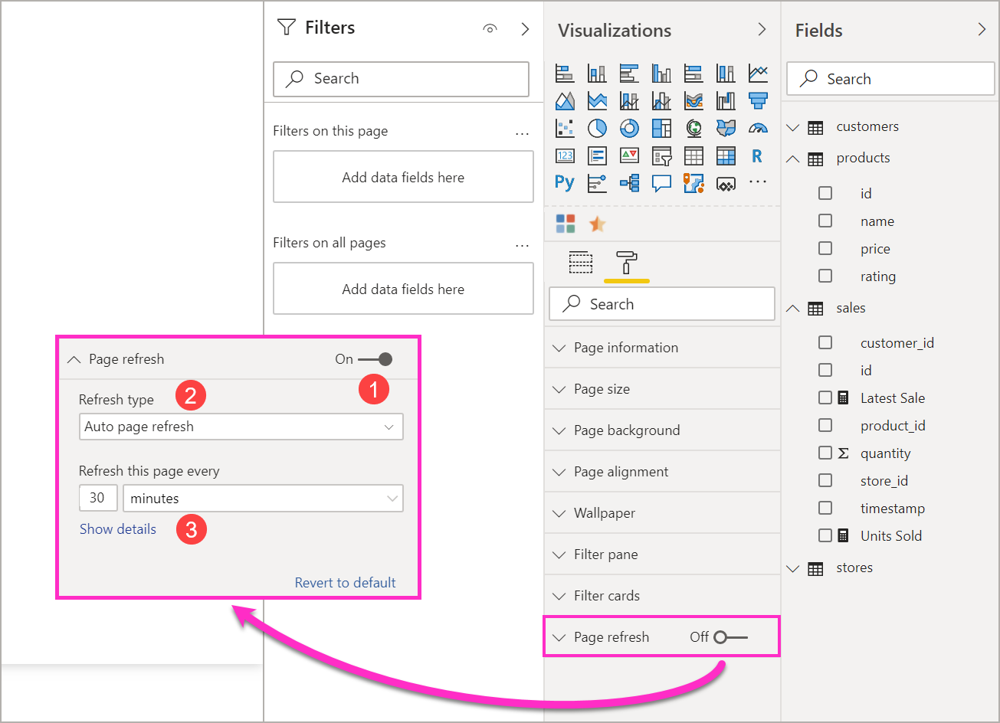

# Automatisch pagina vernieuwen in Power BI Desktop (preview-versie)

Bij het bewaken van kritieke gebeurtenissen is het belangrijk dat de gegevens worden vernieuwd zodra de brongegevens worden bijgewerkt. In de productiebranche is het bijvoorbeeld belangrijk te weten wanneer een machine defect is, of op het punt staat kapot te gaan.

De functie Pagina automatisch vernieuwen in Power BI zorgt ervoor dat de actieve rapportpagina met een vooraf gedefinieerde frequentie nieuwe gegevens ophaalt voor [DirectQuery-bronnen ](https://docs.microsoft.com/power-bi/desktop-directquery-about).

## Het gebruik van Pagina automatisch vernieuwen

Voor deze preview-versie moet u de functie Pagina automatisch vernieuwen inschakelen in Power BI Desktop. Ga naar **Bestand > Opties en Instellingen**, selecteer vervolgens **Opties** en selecteer **Preview-functies** in het linkerdeelvenster. Schakel het selectievakje in naast *Pagina automatisch vernieuwen* om de functie in te schakelen. Het automatisch vernieuwen van pagina's is alleen beschikbaar voor gegevensbronnen van DirectQuery.

Als u automatisch vernieuwen van pagina's wilt gebruiken, selecteert u de rapportpagina waarvoor u vernieuwen wilt inschakelen. Selecteer in het deelvenster **Visualisaties** het **opmaakpictogram** (een verfroller) en zoek naar **Pagina vernieuwen** onder aan het deelvenster. 

Op de volgende afbeelding is het tabblad **Pagina vernieuwen** te zien. Uitleg van de genummerde elementen wordt in de volgende alinea's gegeven:

1.    Schuifregelaar voor Automatisch pagina vernieuwen: voor het in- of uitschakelen van de functie Pagina vernieuwen
2.    Intervalwaarde voor Pagina vernieuwen: numerieke waarde voor het vernieuwingsinterval
3.    Intervaleenheid voor Pagina vernieuwen: eenheid voor het interval tussen pogingen om pagina's te vernieuwen

Hier kunt u Pagina vernieuwen inschakelen en de duur van de vernieuwingsactie selecteren. De standaardwaarde is 30 minuten, het minimale vernieuwingsinterval is één seconde. Het vernieuwen van uw rapport begint op het interval dat u hebt ingesteld. 

## Het interval voor Pagina vernieuwen bepalen

Als Pagina automatisch vernieuwen is ingeschakeld, verzendt Power BI Desktop voortdurend query's naar uw DirectQuery-bron. Er is een vertraging tussen het moment waarop de query wordt verzonden en het moment waarop gegevens worden geretourneerd, dus voor korte vernieuwingsintervallen moet u bevestigen dat query's de opgehaalde gegevens binnen het geconfigureerde interval hebben kunnen retourneren. Als er binnen het interval geen gegevens worden geretourneerd, ontstaan er situaties waarin visuals minder vaak worden bijgewerkt dan er is geconfigureerd.

Als aanbevolen procedure geldt dat het vernieuwingsinterval ten minste moet overeenkomen met de verwachte snelheid waarmee de nieuwe gegevens worden ontvangen:

* Als er elke 20 minuten nieuwe gegevens binnenkomen bij de bron, mag het vernieuwingsinterval niet korter zijn dan 20 minuten. 

* Als er elke seconde nieuwe gegevens worden ontvangen, moet het interval worden ingesteld op één seconde. 

Voor korte vernieuwingsintervallen zoals één seconde moet u ook rekening houden met het type gegevensbron van de directe query, met de mate waarin uw query's die belasten, met de afstand tussen uw rapportviewers en het datacentrum waarin zich de capaciteit bevindt, enzovoort. 

U kunt dit inschatten met behulp van de Performance Analyzer in Power BI Desktop, waarmee u kunt bevestigen of elke visualquery voldoende tijd heeft om resultaten te retourneren van de bron, en waar de tijd is besteed. Op basis van de resultaten van Performance Analyzer kunt u de gegevensbron aanpassen en wijzigen, of u kunt experimenteren met andere visuals en meetwaarden in uw rapport.

Op de volgende afbeelding ziet u de resultaten van een DirectQuery in Performance Analyzer:

Laten we eens kijken wat andere kenmerken van deze gegevensbron zijn. 

1.    Gegevens worden elke twee seconden ontvangen. 
2.    In Performance Analyzer wordt een maximale queryduur + weergavetijd van ongeveer 4,9 seconden (4688 milliseconden) weergegeven. 
3.    De gegevensbron is geconfigureerd om ongeveer 1000 gelijktijdige query's per seconde te verwerken. 
4.    U verwacht dat er ongeveer 10 gebruikers het rapport gelijktijdig zullen bekijken.

Dat leidt tot het volgende resultaat:

* **5 visuals x 10 gebruikers = ongeveer 50 query's**

Het resultaat van deze berekening toont aan dat de belasting veel hoger uitvalt dan de gegevensbron aankan. De snelheid waarmee gegevens worden ontvangen is elke twee seconden, zodat dit dus de vernieuwingsfrequentie moet zijn. Omdat het ongeveer vijf seconden duurt om de query uit te voeren, moet u deze op meer dan vijf seconden instellen. 

Houd er ook rekening mee dat dit resultaat mogelijk anders is wanneer u uw rapport naar de service publiceert, omdat het rapport het Analysis Services exemplaar gebruikt dat in de Cloud wordt gehost. Mogelijk wilt u de vernieuwingsfrequentie aanpassen. 

Power BI houdt rekening met tijden voor query's en vernieuwingsacties door de query voor vernieuwen pas uit te voeren wanneer alle resterende query's voor vernieuwen zijn voltooid. Zelfs als het vernieuwingsinterval korter is dan de tijd die nodig is om uw query's te verwerken, vernieuwt Power BI pas weer als de resterende query's zijn voltooid. 

We gaan nu kijken hoe u als capaciteitsbeheerder prestatieproblemen zou kunnen detecteren en diagnosticeren. Verderop in dit artikel kunt u ook het gedeelte **Veelgestelde vragen over Pagina automatisch vernieuwen** raadplegen voor meer vragen en antwoorden over prestaties en het oplossen van problemen.

## Automatisch pagina vernieuwen in de Power BI-service

U kunt ook intervallen voor het automatisch vernieuwen van pagina's instellen voor rapporten die zijn gemaakt in Power BI Desktop en die naar de Power BI-service zijn gepubliceerd. 

Pagina automatisch vernieuwen voor rapporten is in de Power BI-service geconfigureerd met behulp van stappen die vergelijkbaar zijn met de configuratiestappen in Power BI Desktop. Wanneer het automatisch vernieuwen van pagina's is geconfigureerd in de Power BI-service, wordt dit ook ondersteund voor [ingesloten Power BI-inhoud](../developer/embedded/embedding.md). De volgende afbeelding toont de configuratie voor **Pagina vernieuwen**  voor de Power BI-service:

1.    Schuifregelaar voor Automatisch pagina vernieuwen: voor het in- of uitschakelen van de functie Pagina vernieuwen
2.    Intervalwaarde voor Pagina vernieuwen: numerieke waarde voor het vernieuwingsinterval. Moet een geheel getal zijn.
3.    Intervaleenheid voor Pagina vernieuwen: eenheid voor het interval tussen pogingen om pagina's te vernieuwen

### Intervallen voor Pagina vernieuwen

Welke intervallen er voor Pagina vernieuwen in de Power BI-service zijn toegestaan, wordt beïnvloed door het type werkruimte van het rapport. Dit geldt voor alle volgende rapporten:

* Een rapport publiceren naar een werkruimte waarvoor Pagina automatisch vernieuwen is ingeschakeld
* Het vernieuwingsinterval van een pagina bewerken die al in een werkruimte voorkomt
* Een rapport rechtstreeks in de service maken

Er bestaan in Power BI Desktop geen beperkingen voor het vernieuwingsinterval; het kan als frequentie elke seconde hebben. Als er echter rapporten worden gepubliceerd naar de Power BI-service, zijn bepaalde beperkingen van toepassing. Deze worden beschreven in de volgende secties.

### Beperkingen voor vernieuwingsintervallen

In de Power BI-service gelden beperkingen voor het automatisch vernieuwen van pagina's op basis van factoren zoals de werkruimte en of er Premium-services worden gebruikt.

Om te verduidelijken hoe dit werkt, beginnen we met wat achtergrondinformatie over capaciteiten en werkruimten:

**Capaciteiten**  zijn een kernconcept van Power BI en vertegenwoordigen een aantal resources (opslag, processor en geheugen) die wordt gebruikt om Power BI-inhoud te hosten en te leveren. Capaciteiten worden gedeeld of zijn toegewezen. Een **Gedeelde capaciteit** wordt gedeeld met andere Microsoft-klanten, terwijl een **Toegewezen capaciteit** volledig voor één klant is bestemd. Toegewezen capaciteiten worden geïntroduceerd in het artikel [Premium-capaciteiten beheren](../admin/service-premium-capacity-manage.md).

Met gedeelde capaciteit worden workloads uitgevoerd via rekenresources die met andere klanten worden gedeeld. Omdat de capaciteit resources moet delen, worden er beperkingen opgelegd om ervoor te zorgen dat alles *op een rechtvaardige basis* gebeurt, bijvoorbeeld door het instellen van een maximale modelgrootte (1 GB) en van een maximale vernieuwingsfrequentie per dag (acht keer per dag).

Power BI-**werkruimten** bevinden zich in capaciteiten en vertegenwoordigen beveiligings-, samenwerkings- en implementatiecontainers. Elke Power BI-gebruiker heeft een persoonlijke werkruimte die **Mijn werkruimte** heet. Er kunnen extra werkruimten worden gemaakt om samenwerking en implementatie mogelijk te maken; deze worden **werkruimten** genoemd. Werkruimten, met inbegrip van persoonlijke werkruimten, worden standaard gemaakt in de **gedeelde capaciteit**.

Hier volgen enkele details met betrekking tot de twee werkruimtescenario's:

**Gedeelde werkruimten** : voor reguliere werkruimten (werkruimten die geen deel uitmaken van een Premium-capaciteit), heeft automatische paginavernieuwing een minimum interval van 30 minuten (het kleinste interval dat is toegestaan).

**Premium-werkruimten** : de beschikbaarheid van automatische paginavernieuwing in Premium-werkruimten is afhankelijk van de workloadinstellingen die uw Premium-beheerder voor de Power BI Premium-capaciteit heeft ingesteld. Er zijn twee variabelen die van invloed kunnen zijn op de mogelijkheid om het automatisch vernieuwen van pagina's in te stellen:

 1. *Functie aan/uit* : als uw capaciteitsbeheerder heeft besloten de functie uit te schakelen, kunt u geen type paginavernieuwing instellen in het door u gepubliceerde rapport.

 2. *Minimaal vernieuwingsinterval* : als u de functie inschakelt, moet uw capaciteitsbeheerder een minimaal vernieuwingsinterval instellen. Als uw interval kleiner is dan het minimum, wordt het interval door de Power BI-service overschreven om prioriteit te geven aan het minimale interval dat is ingesteld door de capaciteitsbeheerder.

In de volgende tabel wordt gedetailleerder beschreven waar deze functie beschikbaar is en wat de beperkingen zijn voor elk capaciteitstype en elke [opslagmodus](../connect-data/service-dataset-modes-understand.md)

| Opslagmodus | Toegewezen capaciteit | Gedeelde capaciteit |
| --- | --- | --- |
| DirectQuery | **Ondersteund** : ja.  **Minimaal vernieuwingsinterval**: 1 seconde  **Overschrijving capaciteitsbeheerder** : ja. | **Ondersteund** : ja.  **Minimaal vernieuwingsinterval**: 30 minuten  **Overschrijving capaciteitsbeheerder** : nee. |
| Importeren | **Ondersteund** : nee.  **Minimaal vernieuwingsinterval**: n.v.t.  **Overschrijving capaciteitsbeheerder** : n.v.t. | **Ondersteund** : nee.  **Minimaal vernieuwingsinterval**: n.v.t.  **Overschrijving capaciteitsbeheerder** : n.v.t. |
| Gemengde modus (DQ en andere) | **Ondersteund** : ja.  **Minimaal vernieuwingsinterval**: 1 seconde  **Overschrijving capaciteitsbeheerder** : ja. | **Ondersteund** : ja.  **Minimaal vernieuwingsinterval**: 30 minuten  **Overschrijving capaciteitsbeheerder** : nee. |
| Live Connect AS | **Ondersteund** : nee.  **Minimaal vernieuwingsinterval**: n.v.t.  **Overschrijving capaciteitsbeheerder** : n.v.t. | **Ondersteund** : nee.  **Minimaal vernieuwingsinterval**: n.v.t.  **Overschrijving capaciteitsbeheerder** : n.v.t. |
| Live connect PBI | **Ondersteund** : nee.  **Minimaal vernieuwingsinterval**: n.v.t.  **Overschrijving capaciteitsbeheerder** : n.v.t. | **Ondersteund** : nee.  **Minimaal vernieuwingsinterval**: n.v.t.  **Overschrijving capaciteitsbeheerder** : n.v.t. |

> [!NOTE]
> Als u uw rapport waarvoor u het automatisch vernieuwen van pagina's hebt ingeschakeld, van Power BI Desktop naar de service publiceert, moet u de referenties voor de DirectQuery-gegevensbron opgeven in het menu met gegevenssetinstellingen.

## Overwegingen en beperkingen

Er zijn een aantal dingen waar u aan moet denken als u het automatisch vernieuwen van pagina's gebruikt in Power BI Desktop of in de Power BI-service.

* Importeren, de opslagmodi LiveConnect- en Push worden niet ondersteund voor Pagina automatisch vernieuwen.  
* Samengestelde modellen met minimaal één DirectQuery-gegevensbron worden ondersteund.
* Er bestaan in Power BI Desktop geen beperkingen voor het vernieuwingsinterval; het kan een frequentie van elke seconde hebben. Als er echter rapporten worden gepubliceerd naar de Power BI-service, zijn bepaalde beperkingen van toepassing, zoals eerder in dit document is beschreven.

### Diagnostische gegevens over prestaties

Pagina automatisch vernieuwen is nuttig voor het bewaken van scenario's en het verkennen van gegevens die snel veranderen. Dit kan de capaciteit of de gegevensbron echter onnodig zwaar belasten.

Power BI kan op de volgende manieren voorkomen dat gegevensbronnen onnodig worden belast:

1. Alle query's die voor het automatisch vernieuwen van pagina's worden uitgevoerd, krijgen een **lagere** prioriteit zodat interactieve query's (zoals voor het laden van pagina's en visuals voor kruislings filteren) voorrang krijgen.
2. Als uw query niet is voltooid voordat de volgende vernieuwingscyclus start, start Power BI geen nieuwe vernieuwingsquery's totdat alle eerdere query's zijn voltooid. Als u een vernieuwingsinterval hebt van één seconde en uw query's gemiddeld vier seconden duren, start Power BI in feite alleen om de vier seconden een query.

Er zijn twee gebieden waar u nog steeds knelpunten tegenkomt die de prestaties beïnvloeden:

1. **De capaciteit:** de query bereikt eerst de Premium-capaciteit waardoor de DAX-query die van de rapportvisualisaties zijn gemaakt, wordt samengevouwen en geëvalueerd.
2. **De Direct Query -gegevensbron:** de vertaalde query's uit de vorige stap worden dan op de bron uitgevoerd. Dit zijn uw SQL-servers-, SAP Hana-bronnen, enzovoort zijn.

Met behulp van de [app voor metrische gegevens van Premium](../admin/service-admin-premium-monitor-capacity.md), die beschikbaar is voor beheerders, kunt u visualiseren hoeveel van de capaciteit wordt gebruikt door query's met een lage prioriteit.

Query's met een lage prioriteit zijn onder andere query's voor het automatisch vernieuwen van pagina's en query's voor het vernieuwen van modellen. Er bestaat momenteel geen manier om een onderscheid te maken tussen de belasting die wordt gevormd door query's voor het automatisch vernieuwen van pagina's en die voor het vernieuwen van modellen.

Als u merkt dat uw capaciteit overbelast wordt door query's met een lage prioriteit, kunt u een aantal dingen doen:

1. Vraag een grotere Premium-SKU aan.
2. Neem contact op met de eigenaar van het rapport en vraag of deze het vernieuwingsinterval kan verkleinen.
3. In de portal voor de capaciteitsbeheerder kunt u het volgende doen:
  1. Pagina automatisch vernieuwen voor die capaciteit uitschakelen
  2. Het minimale vernieuwingsinterval verhogen, wat gevolgen heeft voor alle rapporten in die capaciteit.

### Veelgestelde vragen

In deze sectie vindt u veelvoorkomende vragen en antwoorden voor 

1. Ik ben een rapportauteur. Ik heb het vernieuwingsinterval van mijn rapport op het Bureaublad voor 1 seconde gedefinieerd, maar nadat mijn rapport is gepubliceerd wordt het niet vernieuwd in de service.

    * Controleer of Pagina automatisch vernieuwen is ingeschakeld voor de pagina. Omdat deze instelling per pagina geldt, moet u ervoor zorgen dat deze is ingeschakeld voor elke pagina in het rapport die u wilt vernieuwen.
    * Controleer of u hebt geüpload naar een werkruimte waaraan een Premium-capaciteit is gekoppeld. Als dat niet het geval is, wordt uw vernieuwingsinterval op 30 minuten vastgezet.
    * Als uw rapport zich in een Premium-werkruimte bevindt, moet u uw beheerder vragen of hij deze functie voor de gekoppelde capaciteit heeft ingeschakeld. Zorg er bovendien voor dat het minimale vernieuwingsinterval voor de capaciteit kleiner is dan of gelijk is aan die van uw rapport.

2. Ik ben een capaciteitsbeheerder. Ik heb mijn instellingen voor het interval dat wordt gebruikt bij het automatisch vernieuwen van pagina's, gewijzigd, maar ze werken niet. Met andere woorden, rapporten worden nog steeds vernieuwd met een onjuiste snelheid, of worden helemaal niet vernieuwd, zelfs nadat ik de functie had ingeschakeld.

    * Het kan wel vijf minuten duren voordat gewijzigde instellingen in de gebruikersinterface voor de capaciteitsbeheerder in rapporten merkbaar zijn.
    * Behalve dat u de functie Pagina automatisch vernieuwen voor de capaciteit moet inschakelen, moet u deze ook inschakelen voor pagina's in een rapport waar u wilt dat dit zichtbaar is.

3. Mijn rapport wordt in de gemengde modus (DQ + Import) uitgevoerd. Niet alle visuals worden vernieuwd.

    * Als uw visuals naar importtabellen verwijzen, is dit normaal. Pagina automatisch vernieuwen wordt niet ondersteund voor importeren.
    * Zie vraag 1 in deze sectie.

4. Mijn rapport werd correct vernieuwd in de service, en plotseling stopte dat.

    * Vernieuw de pagina om te zien of het probleem zich vanzelf oplost.
    * Vraag uw capaciteitsbeheerder of deze misschien de functie heeft uitgeschakeld of dat hij het minimale vernieuwingsinterval heeft verhoogd (zie vraag 2).

5. Ik ben een rapportauteur. Mijn visuals worden niet vernieuwd met de frequentie die ik heb opgegeven. Ze worden met een lagere snelheid vernieuwd.

    * Als uw query's langer duren, vertraagt de vernieuwingsinterval. Pagina automatisch vernieuwen wacht totdat alle query's zijn uitgevoerd voordat nieuwe query's worden gestart.
    * Uw capaciteitsbeheerder heeft mogelijk een minimaal vernieuwingsinterval ingesteld dat hoger is dan wat u voor uw rapport hebt ingesteld. Vraag of uw capaciteitsbeheerder deze verkleinen.

6. Maken query's voor het automatisch vernieuwen van pagina's gebruik van de cache?

    * Nee, alle query's voor het automatisch vernieuwen van pagina's maken geen gebruik van gegevens in de cache.

## Volgende stappen

Raadpleeg voor meer informatie de volgende artikelen:

* [DirectQuery gebruiken in Power BI](../connect-data/desktop-directquery-about.md)
* [Performance Analyzer gebruiken om prestaties van rapportelementen te onderzoeken](desktop-performance-analyzer.md)
* [Power BI Premium-capaciteiten implementeren en beheren](../guidance/whitepaper-powerbi-premium-deployment.md)
* [Data Sources in Power BI Desktop](../connect-data/desktop-data-sources.md) (Gegevensbronnen in Power BI Desktop)
* [Shape and Combine Data with Power BI Desktop](../connect-data/desktop-shape-and-combine-data.md) (Gegevens vormgeven en combineren met Power BI Desktop)
* [Connect to Excel workbooks in Power BI Desktop](../connect-data/desktop-connect-excel.md) (Verbinding maken met Excel-werkmappen in Power BI Desktop)   
* [Enter data directly into Power BI Desktop](../connect-data/desktop-enter-data-directly-into-desktop.md) (Rechtstreeks gegevens in Power BI Desktop invoeren)   
