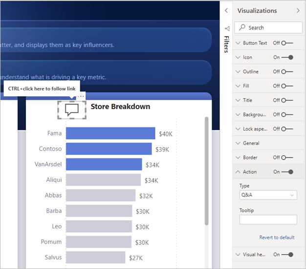
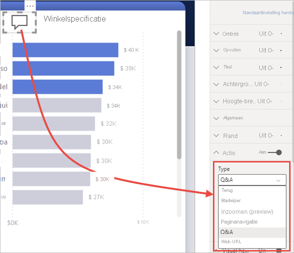
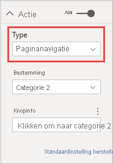
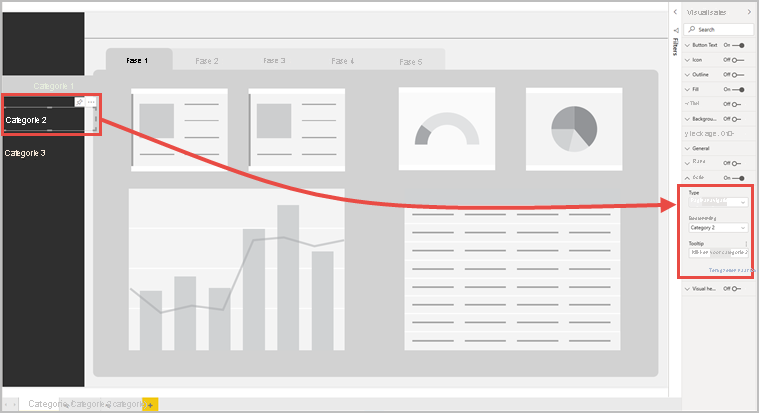

# Knoppen gebruiken in Power BI
Met behulp van **knoppen** in Power BI kunt u rapporten maken die zich als apps gedragen en daarmee voor een aantrekkelijke omgeving zorgen, zodat gebruikers met de muisaanwijzer over Power BI-inhoud kunnen bewegen, erop kunnen klikken en op andere manieren met deze inhoud kunnen communiceren. U kunt knoppen toevoegen aan rapporten in **Power BI Desktop** en in **Power BI-service**. Wanneer u uw rapporten in de Power BI-service deelt, bieden ze uw gebruikers een app-achtige ervaring.

## Knoppen maken in rapporten

### Een knop maken in Power BI Desktop

Als u een knop in **Power BI Desktop** wilt maken, selecteert u **Knoppen** op het lint **Invoegen**, waarna een vervolgkeuzelijst wordt weergegeven, waarin u de gewenste knop kunt selecteren uit een verzameling opties, zoals wordt weergegeven in de volgende afbeelding. 

### Een knop maken in de Power BI-service

Als u een knop wilt maken in de **Power BI-service**, opent u het rapport in de Bewerkweergave. Selecteer **Knoppen** in de menubalk bovenaan en er wordt een vervolgkeuzelijst weergegeven. Hierin kunt u de gewenste knop selecteren uit een verzameling opties, zoals wordt weergegeven in de volgende afbeelding. 

## Een knop aanpassen

Of u de knop nu maakt in Power BI Desktop of de Power BI-service, de rest van het proces is hetzelfde. Wanneer u de knop selecteert op het rapportcanvas, toont het deelvenster **Visualisaties** u de vele manieren waarop u de knop aan uw behoeften kunt aanpassen. U kunt bijvoorbeeld de **knoptekst** in- of uitschakelen, door de schuifregelaar in deze kaart van het deelvenster **Visualisaties** om te schakelen. U kunt ook het pictogram van de knop, de opvulling van de knop, de titel en de actie wijzigen die moet worden uitgevoerd wanneer gebruikers de knop selecteren in een rapport of ander functies uitvoeren.

## Knopeigenschappen instellen wanneer deze inactief is, een muisaanwijzer erover wordt bewogen of wanneer deze wordt geselecteerd

Knoppen in Power BI beschikken over drie statussen: standaard (zoals ze worden weergegeven wanneer u niet de muisaanwijzer erover beweegt of deze selecteert), wanneer u de muisaanwijzer erover beweegt, of wanneer u deze selecteert (vaak aangeduid met *erop geklikt*). Vele kaarten in het deelvenster **Visualisaties** kunnen afzonderlijk worden gewijzigd op basis van deze drie statussen, wat voor een grote mate van flexibiliteit zorgt om de knoppen aan te passen.

Bij de volgende kaarten in het deelvenster **Visualisaties** kunt u de opmaak of het gedrag van een knop aanpassen op basis van de drie statussen:

* Knoptekst
* Pictogram
* Omtrek
* Opvullen

Als u wilt selecteren hoe de knop moet worden weergegeven voor elke status, vouwt u een van deze kaarten open en selecteert u de vervolgkeuzelijst die wordt weergegeven aan de bovenkant van de kaart. In de volgende afbeelding ziet u de kaart **Pictogram** uitgevouwen met de vervolgkeuzelijst die is geselecteerd om de drie statussen te tonen.

## De actie voor een knop selecteren

U kunt selecteren welke actie wordt uitgevoerd wanneer een gebruiker een knop in Power BI selecteert. U kunt de opties voor knopacties van de kaart **Actie** openen in het deelvenster **Visualisaties**.

Dit zijn de opties voor knopacties:

- Met **Terug** keert de gebruiker terug naar de vorige pagina van het rapport. Dit is handig voor analysepagina's.
- Met **Bladwijzer** wordt de rapportpagina weergegeven die aan een bladwijzer is gekoppeld die is gedefinieerd voor het huidige rapport. Meer informatie over [bladwijzers in Power BI](desktop-bookmarks.md). 
- Met **Analyseren** navigeert de gebruiker naar een analysepagina die is gefilterd op zijn selectie, zonder gebruik van bladwijzers. Meer informatie over [analyseknoppen in rapporten](desktop-drill-through-buttons.md).
- Met **paginanavigatie** navigeert de gebruiker naar een andere pagina in het rapport, ook zonder bladwijzers te gebruiken. Zie [Paginanavigatie maken](#create-page-navigation) in dit artikel voor meer informatie.
- Met **Q&A** opent u een **Q&A Explorer**-venster. 

Bepaalde knoppen hebben een standaardactie die automatisch wordt geselecteerd. Bijvoorbeeld bij een knop van het type **Q & A** wordt automatisch **Q & A** als standaardactie geselecteerd. U kunt meer lezen over **Q & A Explorer** door [dit blogbericht](https://powerbi.microsoft.com/blog/power-bi-desktop-april-2018-feature-summary/#Q&AExplorer) te lezen.

U kunt de knoppen uitproberen of testen die u voor uw rapport hebt gemaakt door *CTRL + klik* in te toetsen op de knop die u wilt gebruiken. 

## Paginanavigatie maken

Met het **Actie**-type **Paginanavigatie** kunt u een volledige navigatie-ervaring bouwen zonder dat u bladwijzers hoeft op te slaan of te beheren.

Als u een paginanavigatieknop wilt instellen, maakt u een knop met **Paginanavigatie** als actietype en selecteert u de pagina **Doel**.

U kunt een aangepast navigatiedeelvenster maken en er navigatieknoppen aan toevoegen. U hoeft geen bladwijzers te bewerken en te beheren als u wilt wijzigen welke pagina's in het navigatiedeelvenster worden weergegeven.

Daarnaast kunt u de knopinfo voorwaardelijk opmaken zoals u ook kunt doen met andere knoptypen.

## Het navigatiedoel voorwaardelijk instellen

U kunt voorwaardelijke opmaak gebruiken om het navigatiedoel in te stellen op basis van de uitvoer van een meting. U kunt bijvoorbeeld ruimte besparen op het canvas van een rapport door één knop beschikbaar te stellen om naar andere pagina's te gaan op basis van de selectie van de gebruiker.

:::image type="content" source="media/desktop-buttons/button-navigate-go.png" alt-text="Navigeren met een Ga naar-knop":::
 
Als u het voorbeeld dat hierboven wordt weergegeven, wilt maken, begint u met het maken van een tabel met één kolom met de namen van de navigatiedoelen:

:::image type="content" source="media/desktop-buttons/button-create-table.png" alt-text="Maak een tabel":::

Power BI gebruikt een exacte overeenkomende tekenreeks om het analysedoel in te stellen. Controleer dus of de ingevoerde waarden exact overeenkomen met de namen van uw analysepagina's.

Nadat u de tabel hebt gemaakt, voegt u deze toe aan de pagina als een slicer met één selectie:

:::image type="content" source="media/desktop-buttons/button-navigate-slicer.png" alt-text="Navigatieslicer":::

Maak vervolgens een paginanavigatieknop en selecteer de optie Voorwaardelijke opmaak voor het doel:

:::image type="content" source="media/desktop-buttons/button-set-page-nav-destination.png" alt-text="Paginanavigatieknop":::
 
Selecteer de naam van de kolom die u hebt gemaakt, in dit geval **Selecteer een doel**:

:::image type="content" source="media/desktop-buttons/button-select-destination.png" alt-text="Selecteer een doel":::

Nu kunt u met de knop naar verschillende pagina's navigeren, afhankelijk van de selectie van de gebruiker.

:::image type="content" source="media/desktop-buttons/button-navigate-go.png" alt-text="Navigeren met een Ga naar-knop":::
 
### Vormen en afbeeldingen voor navigatie

De actie Paginanavigatie wordt ondersteund voor vormen en afbeeldingen, niet alleen voor knoppen. Hier volgt een voorbeeld waarin een van de ingebouwde vormen wordt gebruikt:

:::image type="content" source="media/desktop-buttons/button-navigation-arrow.png" alt-text="Een pijl gebruiken voor navigatie":::
 
Hier volgt een voorbeeld waarin een afbeelding wordt gebruikt:

:::image type="content" source="media/desktop-buttons/button-navigation-image.png" alt-text="Een afbeelding gebruiken voor navigatie":::
 
## Knoppen bieden ondersteuning voor opvulafbeeldingen

Knoppen bieden ondersteuning voor opvulafbeeldingen. U kunt het uiterlijk van een knop aanpassen met opvulafbeeldingen in combinatie met de ingebouwde knopstatussen: standaard, bij aanwijzen, bij indrukken en uitgeschakeld (voor analyse).

:::image type="content" source="media/desktop-drill-through-buttons/drill-through-fill-images.png" alt-text="Opvulafbeeldingen voor analyseknop":::

Stel **Opvullen-** in op **Aan** en maak vervolgens afbeeldingen voor de verschillende statussen.

:::image type="content" source="media/desktop-drill-through-buttons/drill-through-fill-state-settings.png" alt-text="Instellingen voor afbeeldingen":::

## Volgende stappen
Raadpleeg de volgende artikelen voor meer informatie over functies die vergelijkbaar zijn of samenwerken met knoppen:

* [Analyseren gebruiken in Power BI-rapporten](desktop-drillthrough.md)
* [Bladwijzers gebruiken om inzichten te delen en verhalen te vertellen in Power BI](desktop-bookmarks.md)
* [Een analyseknop maken](desktop-drill-through-buttons.md)

