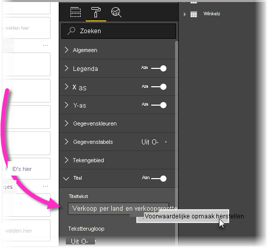
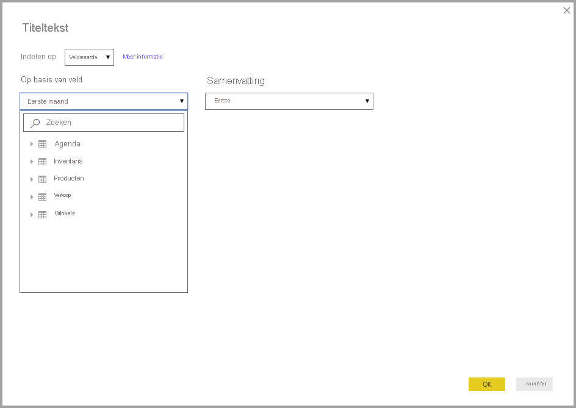

# <a name="expression-based-titles-in-power-bi-desktop"></a>Titels op basis van expressies in Power BI Desktop

U kunt dynamische, aangepaste titels maken voor uw Power BI-visuals. Door DAX-expressies (expressies voor gegevensanalyse) te maken op basis van velden, variabelen of andere programmatische elementen, kunnen de titels van uw visuals indien nodig automatisch worden aangepast. Deze wijzigingen worden gebaseerd op filters, selecties of andere gebruikersinteracties en configuraties.



Het maken van dynamische titels, ook wel *op expressies gebaseerde titels* genoemd, is vrij eenvoudig. 

## <a name="create-a-field-for-your-title"></a>Een veld maken voor uw titel

Wanneer u een op expressies gebaseerde titel maakt, moet u eerst een veld in uw model maken dat u voor de titel wilt gebruiken. 

U kunt in de titel van uw visual op vele creatieve manieren laten zien wat u ermee wilt zeggen of uitdrukken. Laten we eens wat voorbeelden bekijken.

U kunt een expressie maken die wordt gewijzigd op basis van de filtercontext die de visual ontvangt voor de merknaam van het product. In de volgende afbeelding ziet u de DAX-formule voor een dergelijk veld.


Een ander voorbeeld is het gebruik van een dynamische titel die wordt gewijzigd op basis van de taal of cultuur van de gebruiker. U kunt taalspecifieke titels in een DAX-meting maken door de functie `USERCULTURE()` te gebruiken. Met deze functie wordt de culturele code voor de gebruiker geretourneerd op basis van het besturingssysteem of de browserinstellingen. U kunt de volgende DAX-schakelinstructie gebruiken om de juiste vertaalde waarde te selecteren. 

```
SWITCH (
  USERCULTURE(),
  "de-DE", “Umsatz nach Produkt”,
  "fr-FR", “Ventes par produit”,
  “Sales by product”
)
```

Of u kunt de tekenreeks ontvangen vanuit een opzoektabel met alle vertalingen. U plaatst die tabel in uw model. 

Dit zijn slechts een aantal voorbeelden die u kunt gebruiken om dynamische, op expressies gebaseerde titels voor uw visuals te maken in Power BI Desktop. De mogelijkheden die u met uw titels kunt bereiken zijn eindeloos, en worden alleen beperkt door uw fantasie en uw model.


## <a name="select-your-field-for-your-title"></a>Uw veld voor uw titel selecteren

Zodra u de DAX-expressie hebt gemaakt voor het veld dat u in uw model hebt gemaakt, moet u deze expressie toepassen op de titel van uw visual.

Ga naar het deelvenster **Visualisaties** om het veld te selecteren en toe te passen. Selecteer **Titel** in het gebied **Indeling** om de titelopties voor de visual weer te geven. 

Wanneer u met de rechtermuisknop op **Titeltekst** klikt, wordt een contextmenu weergegeven waarin u **<em>fx</em>Voorwaardelijke opmaak** kunt selecteren. Wanneer u dat menu-item selecteert, wordt het dialoogvenster **Titeltekst** weergegeven. 



Vanuit dat venster kunt u het veld selecteren dat u voor gebruik voor uw titel hebt gemaakt.

## <a name="limitations-and-considerations"></a>Beperkingen en overwegingen

De huidige implementatie van op expressies gebaseerde titels voor visuals kent een aantal beperkingen:

* Op expressies gebaseerde opmaak wordt momenteel niet ondersteund voor Python-visuals, R-visuals of the visual Belangrijkste beïnvloeders.
* Het veld dat u voor de titel maakt, moet van het gegevenstype Tekenreeks zijn. Metingen waardoor getallen of datum/tijd (of andere gegevenstypen) worden geretourneerd, worden momenteel niet ondersteund.
* Op expressies gebaseerde titels worden niet overgedragen wanneer u een visual aan een dashboard vastmaakt.

## <a name="next-steps"></a>Volgende stappen

In dit artikel wordt beschreven hoe u DAX-expressies kunt maken waardoor de titels van uw visuals in dynamische velden worden omgezet die kunnen wijzigen wanneer gebruikers uw rapporten gebruiken. Mogelijk vindt u de volgende artikelen ook interessant.

* [Voorwaardelijke opmaak in tabellen](desktop-conditional-table-formatting.md)
* [Drillthrough voor meerdere rapporten gebruiken in Power BI Desktop](desktop-cross-report-drill-through.md)
* [Drillthrough gebruiken in Power BI Desktop](desktop-drillthrough.md)
