# Voorwaardelijke opmaak in tabellen gebruiken 

Met voorwaardelijke opmaak voor tabellen in Power BI Desktop kunt u aangepaste celkleuren opgeven, inclusief kleurovergangen, op basis van veldwaarden. U kunt ook celwaarden weergeven met gegevensbalken of KPI-pictogrammen, of als actieve webkoppelingen. U kunt voorwaardelijke opmaak toepassen op elk tekst- of gegevensveld, mits u de opmaak baseert op een veld met numerieke waarden, kleurnamen, hexadecimale code of web-URL-waarden. 

Als u voorwaardelijke opmaak wilt toepassen, selecteert u een **tabel**- of **matrix**-visualisatie in Power BI Desktop. Klik in het gedeelte **Velden** van het deelvenster **Visualisaties** met de rechtermuisknop, of selecteer de pijl-omlaag naast het veld in **Waarden**, waarop u opmaak wilt toepassen. Selecteer **Voorwaardelijke opmaak** en selecteer vervolgens het type opmaak dat moet worden toegepast.

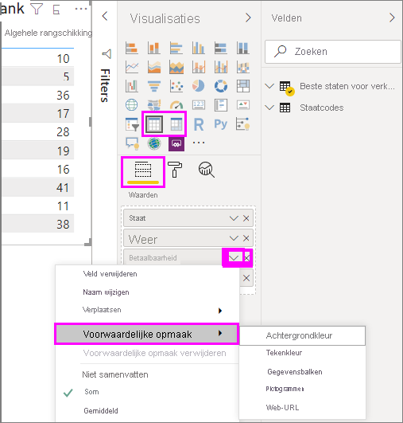

> [!NOTE]
> Met voorwaardelijke opmaak overschrijft u elke aangepaste achtergrond- of tekstkleur die u toepast op de cel met voorwaardelijke opmaak.

Als u voorwaardelijke opmaak uit een visualisatie wilt verwijderen, klikt u op **Voorwaardelijke opmaak verwijderen** in het vervolgkeuzemenu van het veld. Selecteer vervolgens het type opmaak dat u wilt verwijderen.

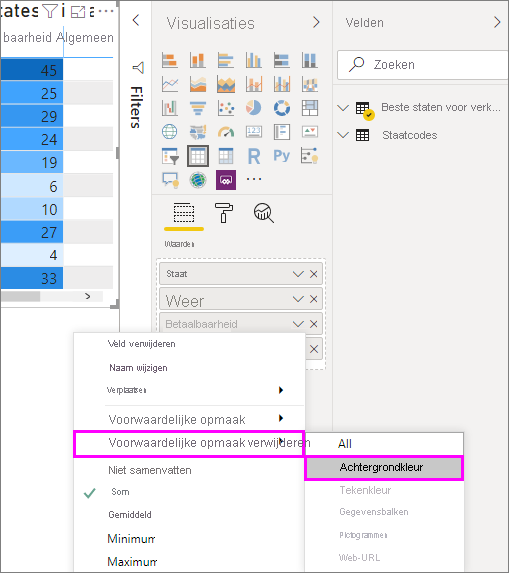

In de volgende gedeelten worden de voorwaardelijke-opmaakopties behandeld. U kunt meer dan één optie combineren in een tabelkolom.

## Achtergrond- of tekstkleur opmaken

Als u de achtergrond- of tekstkleur van een cel wilt opmaken, selecteert u **Voorwaardelijke opmaak** voor een veld en selecteert u vervolgens **Achtergrondkleur** of **Tekstkleur** in het vervolgkeuzemenu. 

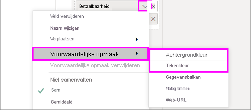

Het dialoogvenster **Achtergrondkleur** of **Tekstkleur** wordt geopend, met de naam van het veld dat u wilt opmaken in de titel. Nadat u opties voor voorwaardelijke opmaak hebt geselecteerd, selecteert u **OK**. 

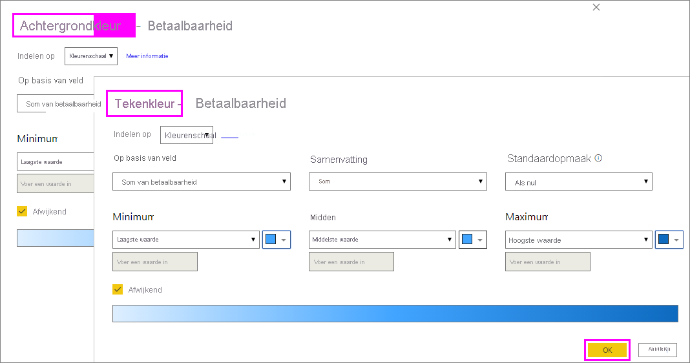

De opties **Achtergrondkleur** en **Tekstkleur** zijn hetzelfde, maar beïnvloeden respectievelijk de achtergrondkleur en tekstkleur van de cel. U kunt dezelfde of een andere voorwaardelijke opmaak toepassen op de tekstkleur en de achtergrondkleur van een veld. Als u de tekst van een veld en de achtergrond dezelfde kleur geeft, is de tekst niet meer te zien en ziet u in de tabelkolom dus alleen kleuren.

## Kleuren op basis van kleurschaal

Als u de achtergrond- of tekstkleur wilt opmaken op basis van de kleurschaal, selecteert u in het dialoogvenster **Opmaken op** van **Achtergrondkleur** of **Tekstkleur** de optie **Kleurenschaal**. Selecteer onder **Op basis van veld** het veld waarop u de opmaak wilt baseren. U kunt de opmaak baseren op het huidige veld of op een willekeurig veld in uw model met numerieke gegevens of kleurgegevens. 

Geef onder **Samenvatting** het aggregatietype op dat u wilt gebruiken voor het geselecteerde veld. Selecteer onder **Standaardopmaak** een opmaak die op lege waarden moet worden toegepast. 

Kies onder **Minimum** en **Maximum** of het kleurenschema moet worden toegepast op basis van de laagste en hoogste veldwaarden, of op aangepaste waarden die u invoert. Open de vervolgkeuzelijst en selecteer de kleurstalen die u wilt toepassen op de minimale en maximale waarden. Schakel het selectievakje **Afwijken** in om ook een **middelste** waarde en kleur op te geven. 

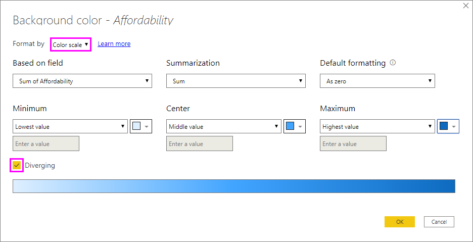

Een voorbeeldtabel met de kleurenschaalachtergrond als opmaakoptie in de kolom **Betaalbaarheid** ziet er als volgt uit:

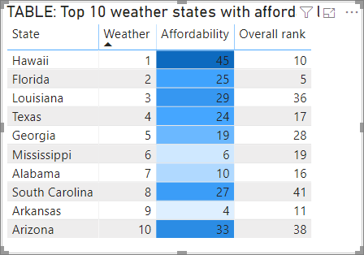

De voorbeeldtabel met de kleurenschaaltekst als opmaakoptie in de kolom **Betaalbaarheid** ziet er als volgt uit:

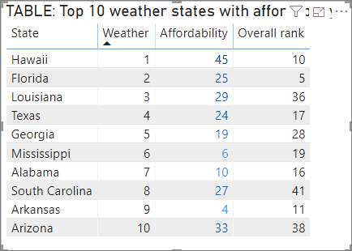

## Kleur op regels

Als u de achtergrond- of tekstkleur wilt opmaken op basis van regels, selecteert u in het dialoogvenster **Opmaken op** van **Achtergrondkleur** of **Tekstkleur** de optie **Regels**. Nogmaals: in **Op basis van veld** ziet u het veld waarop u de opmaak wilt baseren en in **Samenvatting** ziet u het aggregatietype voor het veld. 

Voer onder **Regels** een of meer waardebereiken in en stel voor elk bereik een kleur in. Elk waardebereik heeft een voorwaarde met een *If-waarde*, een voorwaarde met een *And-waarde* en een kleur. Celachtergronden en teksten binnen elk waardebereik krijgen de opgegeven kleur. Het volgende voorbeeld bevat drie regels:

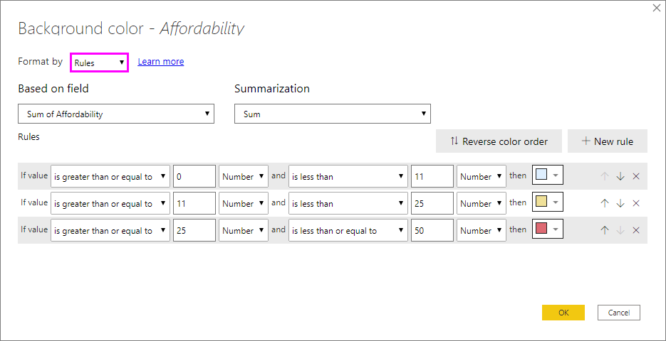

Een voorbeeldtabel met een op regels gebaseerde achtergrondkleur in de kolom **Betaalbaarheid** ziet er als volgt uit:

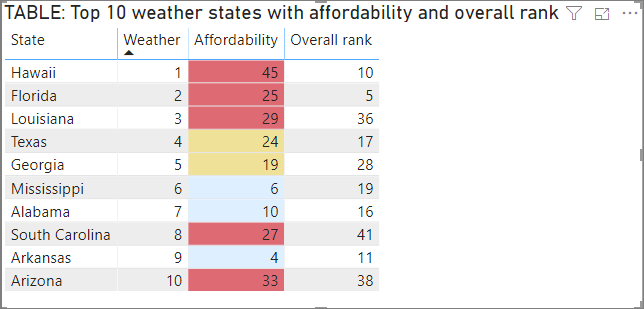

## Kleuren op basis van kleurwaarden

Als u een veld of meting hebt met gegevens over de kleurnaam of hexadecimale waarde, kunt u voorwaardelijke opmaak gebruiken om deze kleuren automatisch toe te passen op de achtergrond of tekstkleur van een kolom. U kunt ook aangepaste logica gebruiken om kleuren toe te passen op de tekst of de achtergrond.

In het veld kunnen alle kleurwaarden worden gebruikt die in de CSS-kleurenspecificaties staan op [https://www.w3.org/TR/css-color-3/](https://www.w3.org/TR/css-color-3/). Deze kleurwaarden kunnen bestaan uit:
- hexadecimale codes van 3, 6 of 8 cijfers. Voorbeeld: #3E4AFF. Zorg ervoor dat u het symbool # aan het begin van de code opneemt. 
- RGB- of RGBA-waarden, zoals RGBA(234, 234, 234, 0.5).
- HSL- of HSLA-waarden, zoals HSLA(123, 75%, 75%, 0.5).
- Kleurnamen, zoals Green, SkyBlue of PeachPuff. 

In de volgende tabel is er een kleurnaam gekoppeld aan elke status: 

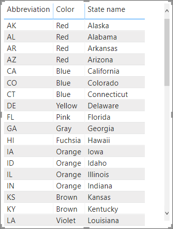

Als u de kolom **Kleur** wilt opmaken op basis van de veldwaarden, selecteert u **Voorwaardelijke opmaak** voor het veld **Kleur** en selecteert u vervolgens **Achtergrondkleur** of **Tekstkleur**. 

Selecteer in het dialoogvenster **Achtergrondkleur** of **Tekstkleur** de optie **Veldwaarde** van de vervolgkeuzelijst **Opmaken op**.

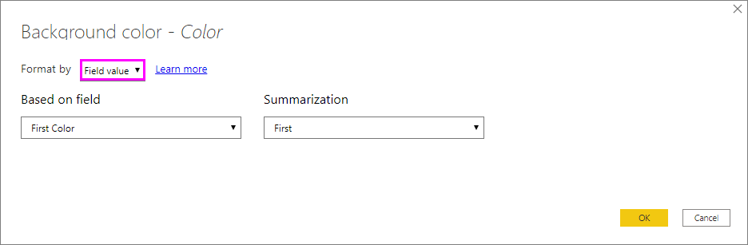

Een voorbeeldtabel met een op kleurveldwaarden gebaseerde **achtergrondkleur** in het veld **Kleur** ziet er als volgt uit:

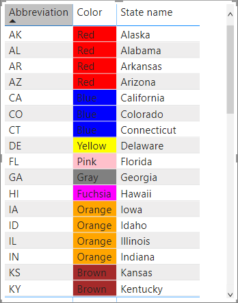

Als u ook **Veldwaarde** gebruikt voor het opmaken van de **tekstkleur** van de kolom, is het resultaat een effen kleur in de kolom **Kleur**:

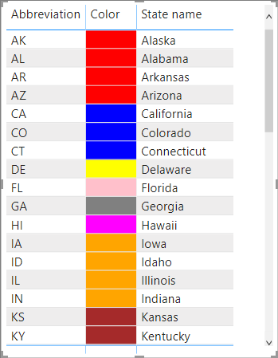

## Kleur op basis van een berekening

U kunt een berekening maken die verschillende waarden oplevert op basis van de bedrijfslogicavoorwaarden die u selecteert. Het maken van een formule gaat meestal sneller dan het maken van meerdere regels in het dialoogvenster voor voorwaardelijke opmaak. 

Met de volgende formule worden hexadecimale kleurwaarden bijvoorbeeld toegepast op een nieuwe **kolom voor de betaalbaarheid**, op basis van bestaande kolomwaarden voor **betaalbaarheid**:

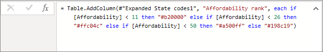

Als u de kleuren wilt toepassen, kiest u voor voorwaardelijke opmaak in **Achtergrondkleur** of **Tekstkleur** voor de kolom **Betaalbaarheid**. Baseer de opmaak op de **veldwaarde** van de kolom **Betaalbaarheidspositie**. 

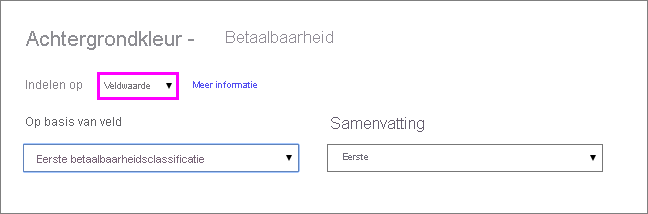

De voorbeeldtabel met een achtergrondkleur voor **Betaalbaarheid** die wordt gebaseerd op de berekende **betaalbaarheidspositie** ziet er als volgt uit:

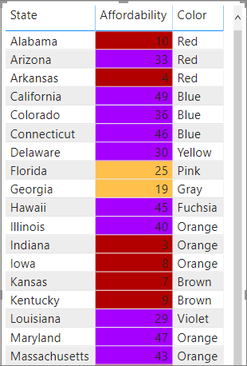

Er zijn veel meer variaties die u kunt maken door gewoon gebruik te maken van uw eigen verbeelding en enkele berekeningen.

## Gegevensbalken toevoegen

Als u gegevensbalken wilt weergeven op basis van celwaarden, selecteert u **Voorwaardelijke opmaak** voor het veld **Betaalbaarheid**. Selecteer dan **Gegevensbalken** in het vervolgkeuzemenu. 

In het dialoogvenster **Gegevensbalken** is de optie **Alleen balk weergeven** standaard niet ingeschakeld; de tabelcellen tonen dus zowel de balken als de daadwerkelijke waarden. Als u alleen de gegevensbalken wilt weergeven, schakelt u het selectievakje bij **Alleen balk weergeven** in.

U kunt **minimale** en **maximale** waarden opgeven, net als gegevensbalkkleuren en -richtingen en askleuren. 

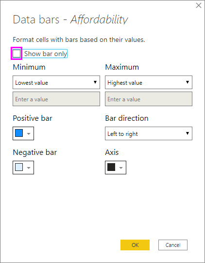

Als er gegevensbalken zijn toegepast op de kolom **Betaalbaarheid**, ziet de voorbeeldtabel er als volgt uit:

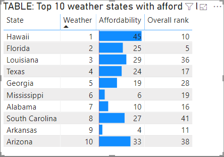

## Pictogrammen toevoegen

Als u pictogrammen wilt weergeven op basis van celwaarden, selecteert u **Voorwaardelijke opmaak** voor het veld en selecteert u vervolgens **Pictogrammen** in de vervolgkeuzelijst. 

Selecteer in het dialoogvenster **Pictogrammen** onder **Opmaken op** de optie **Regels** of **Veldwaarde**. 

Als u wilt opmaken op basis van regels, selecteert u de methode **Op basis van veld** of **Samenvatting** en selecteert u het pictogram **Indeling**, **Uitlijning** of **Stijl** en een of meer **regels**. Voer onder **Regels** een of meer regels in met een voorwaarde met een *If-waarde* en een *And-waarde*. Selecteer dan een pictogram dat op elke regel moet worden toegepast. 

Als u wilt opmaken op basis van veldwaarden, selecteert u de methode **Op basis van veld** of **Samenvatting** en selecteert u het pictogram **Indeling** en **Uitlijning**.

In het volgende voorbeeld worden pictogrammen toegevoegd op basis van drie regels:

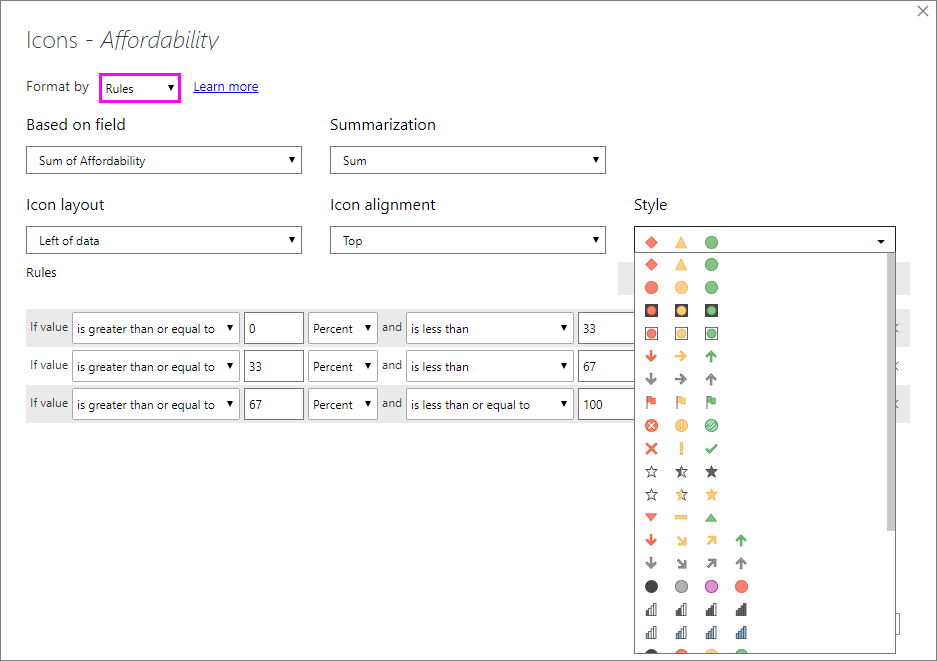

Selecteer **OK**. Als er pictogrammen zijn toegepast op de kolom **Betaalbaarheid** op basis van regels, ziet de voorbeeldtabel er als volgt uit:

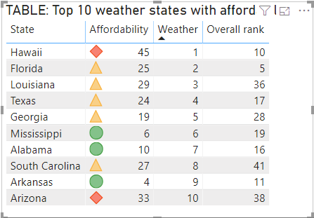

## Opmaken als web-URL's

Als u een kolom of meting hebt die website-URL's bevat, kunt u voorwaardelijke opmaak gebruiken om deze URL's toe te passen op velden als actieve koppelingen. De volgende tabel bevat bijvoorbeeld de kolom **Website** met website-URL's voor elke status:

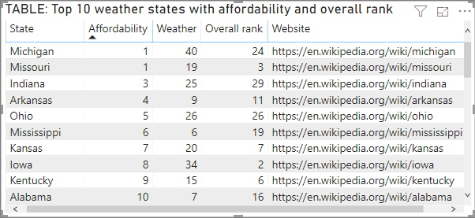

Als u elke statusnaam als een actieve koppeling wilt weergeven op de website, selecteert u **Voorwaardelijke opmaak** voor het veld **Status** en selecteert u vervolgens **Web-URL**. Selecteer in het dialoogvenster **Web-URL** onder **Op basis van veld** de optie **Website**. Selecteer vervolgens **OK**. 

Als er **Web-URL**-opmaak wordt toegepast op het veld **Status**, is elke statusnaam een actieve koppeling naar de bijbehorende website. In de volgende voorbeeldtabel is er **web-URL**-opmaak toegepast op de kolom **Status**. Er worden ook voorwaardelijke **gegevensbalken** en **achtergrondkleuren** toegepast op de kolom **Betaalbaarheid**. 

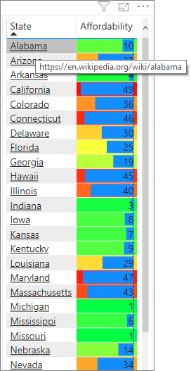

## Totalen en subtotalen

Vanaf de release van april 2020 kunt u regels voor Voorwaardelijke opmaak toepassen op totalen en subtotalen voor zowel tabel- als matrixvisuals. 

U past de regels voor Voorwaardelijke opmaak toe met behulp van de vervolgkeuzelijst **Toepassen op** in Voorwaardelijke opmaak, zoals wordt weergegeven in de volgende afbeelding.

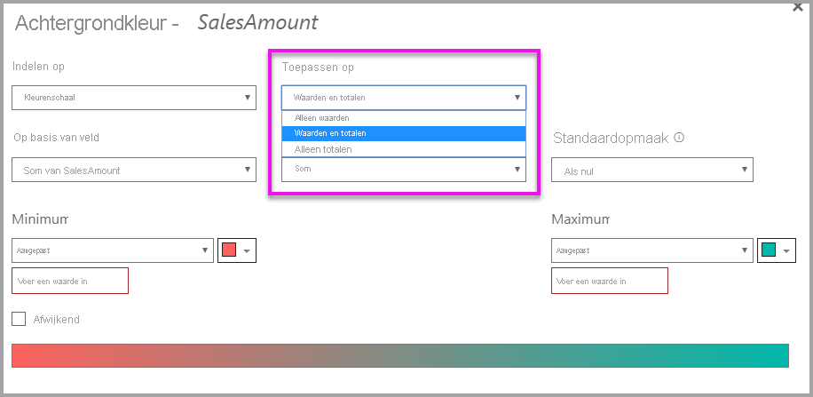

U moet de drempelwaarden en bereiken voor de regels voor Voorwaardelijke opmaak handmatig instellen. Voor matrices verwijzen **Waarden** naar het laagste zichtbare niveau van de matrixhiërarchie.

## Overwegingen en beperkingen
Er zijn enkele overwegingen voor het werken met voorwaardelijke tabelopmaak:

- Voorwaardelijke opmaak wordt alleen toegepast op de waarden van tabel- en matrixvisuals en is niet van toepassing op subtotalen, eindtotalen en de rij **Totaal**. 
- Tabellen zonder groepering worden weergegeven als één rij die geen ondersteuning biedt voor voorwaardelijke opmaak.
- U kunt geen opmaak met kleurovergangen toepassen met automatische maximale en minimale waarden (en ook geen op regels gebaseerde opmaak met percentageregels) als uw gegevens *NaN*-waarden bevatten. NaN betekent 'geen getal', meestal veroorzaakt door een fout met delen door nul. U kunt de [DIVIDE () DAX-functie](/dax/divide-function-dax) gebruiken om deze fouten te voorkomen.
- Voor voorwaardelijke opmaak moet een aggregatie of meting worden toegepast op de waarde. Daarom ziet u 'eerste' of 'laatste' in het voorbeeld **Kleuren met waarde**. Als u een rapport maakt op basis van een multidimensionale kubus van Analysis Service, kunt u geen kenmerk voor voorwaardelijke opmaak gebruiken, tenzij de eigenaar van de kubus een meting heeft gebouwd waarmee de waarde wordt aangeleverd.

## Volgende stappen

Zie [Tips en trucs voor het gebruik van kleuren in Power BI](../visuals/service-tips-and-tricks-for-color-formatting.md) voor meer informatie over kleuropmaak