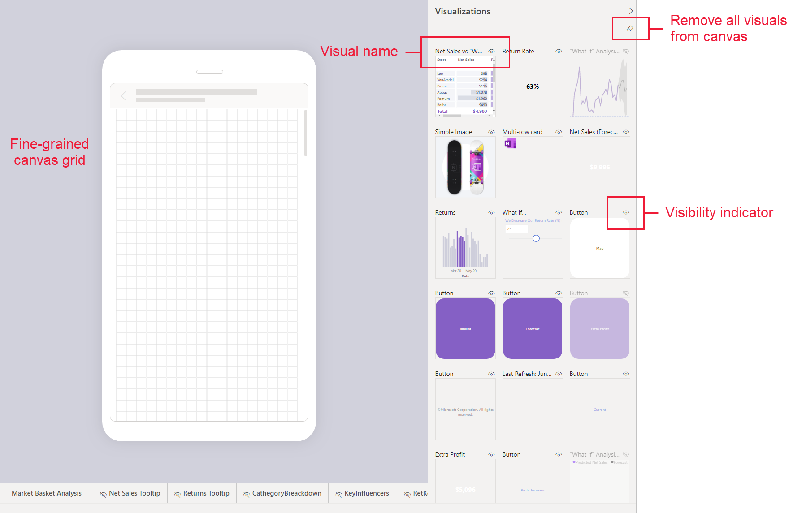
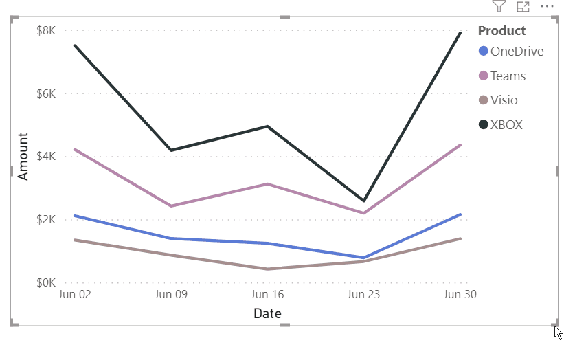
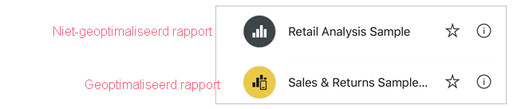
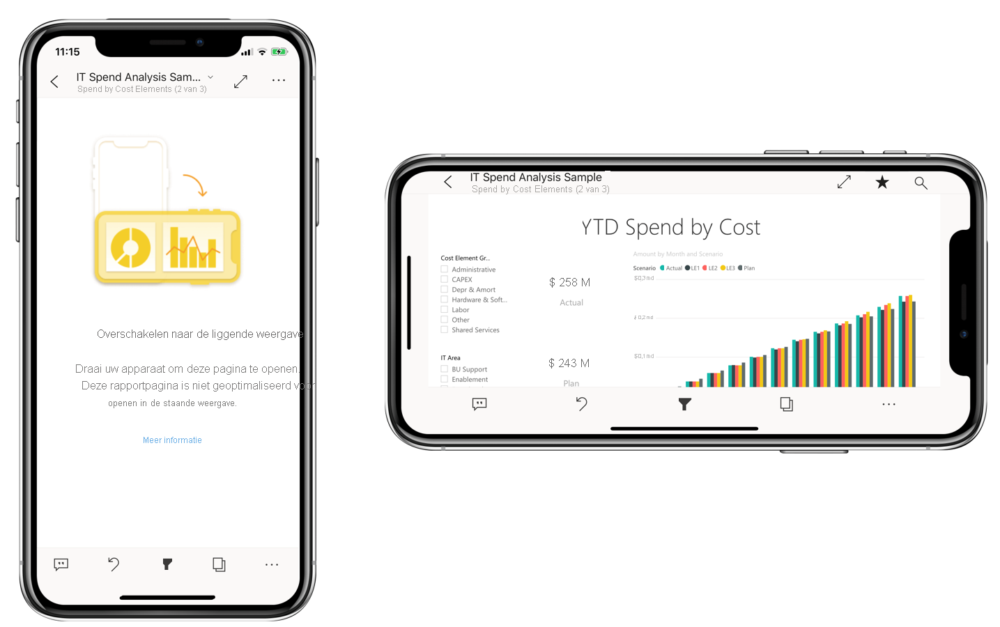

# Power BI-rapporten optimaliseren voor de mobiele app
Mobiele gebruikers kunnen elke Power BI-rapportpagina weergeven in de stand liggend. Ontwerpers van rapporten kunnen echter een extra weergave maken die is geoptimaliseerd voor mobiele apparaten en wordt weergegeven in de staande stand. Deze ontwerpoptie, die beschikbaar is in zowel Power BI Desktop als in de Power BI-service, stelt auteurs in staat om alleen die visuele elementen te selecteren en opnieuw in te delen die van belang zijn voor mobiele gebruikers.

.

Power BI biedt een aantal functies om u te helpen bij het maken van versies van uw rapporten die geoptimaliseerd zijn voor mobiel:
* Een weergave voor mobiele indeling waarin u uw mobiele, geoptimaliseerde rapport kunt maken door visuele elementen te slepen en neer te zetten op een canvas dat lijkt op een telefoon.
* Visuele elementen en slicers die kunnen worden geoptimaliseerd voor gebruik op kleine, mobiele schermen.

Met deze mogelijkheden kunt u aantrekkelijke, interactieve, geoptimaliseerde rapporten ontwerpen en bouwen.

## Een op een hoger geoptimaliseerde, staande versie van een rapportpagina maken

De eerste stap is het ontwerpen en maken van het rapport in de standaard webweergave. Nadat u een rapport hebt gemaakt, kunt u dit optimaliseren voor telefoons en tablets.

Als u de weergave die is geoptimaliseerd voor mobiel wilt maken, opent u de weergave voor mobiele indeling:
   * Selecteer in Power BI Desktop het lint **Weergave** **Mobiele indeling**.
   * Kies in de Power BI-service **Meer opties (...) > Rapport bewerken > Indeling voor mobiel**.

   U ziet een blad dat kan worden weergegeven als een telefoon en een deelvenster **Visualisaties** met alle visuals die zich op de oorspronkelijke rapportpagina bevinden.

   .

* Elke visual in het deelvenster **Visualisaties** wordt weergegeven met de naam ervan voor eenvoudige identificatie.
* Elke visual heeft ook een zichtbaarheidsindicator. De zichtbaarheidsindicator van een visual verandert, afhankelijk van de zichtbaarheidsstatus van de visual in de huidige status van de weergave webrapport. De zichtbaarheidsindicator is handig bij het werken met bladwijzers.

## Visuals toevoegen aan het canvas voor mobiele indeling
Als u een visueel element aan de mobiele indeling wilt toevoegen, sleept u het vanuit het deelvenster **Visualisaties** naar het telefooncanvas. Wanneer u de visual naar het canvas sleept, wordt deze op het raster uitgelijnd. U kunt ook dubbelklikken op het visuele element in het deelvenster visualisatie en de visual wordt toegevoegd aan het canvas.

U kunt enkele of alle visuele elementen van de webrapportpagina toevoegen aan de rapportpagina voor mobiel. U kunt elk visuele element slechts één keer gebruiken. U hoeft ze niet allemaal op te nemen.

>[!NOTE]
> U kunt verborgen visuals slepen en neerzetten op het canvas. Ze worden geplaatst, maar niet weergegeven, tenzij de zichtbaarheidsstatus wordt gewijzigd in de huidige webrapportweergave.

Visuele elementen kunnen boven op elkaar worden gestapeld om interactieve rapporten te maken met behulp van bladwijzers, of om aantrekkelijke rapporten te bouwen door visuele elementen te stapelen over afbeeldingen.

Zodra u een visual op het canvas hebt geplaatst, kunt u het formaat ervan wijzigen door aan de handvatten te trekken die rond de rand van de visual worden weergegeven wanneer u het selecteert. Als u de hoogte-breedte verhouding van het visuele element wilt behouden tijdens het wijzigen van de grootte, drukt u op de toets **Shift** tijdens het slepen van de formaathandvatten.

De onderstaande afbeelding illustreert het slepen en neerzetten van visuals uit het deelvenster **Visualisaties** op het canvas, en het formaat en het lagen van een gedeelte ervan.

   

De schaal van het telefoonrapportraster kan worden aangepast aan telefoons van verschillende groottes. Het rapport ziet er dus goed uit op telefoons met een klein scherm en telefoons met een groot scherm.

## Visuals verwijderen uit het canvas voor mobiele indeling
Als u een visueel element wilt verwijderen uit de indeling voor mobiel, klikt u op de **X** in de rechterbovenhoek van de visual op het telefooncanvas of selecteert u het en drukt u op **Verwijderen**.

U kunt alle visualisaties verwijderen van het canvas door te klikken op de gum in het deelvenster **Visualisatie**.

Als u visuals verwijdert uit de mobiele indeling, worden ze alleen van het canvas verwijderd. De visuals worden nog steeds weergegeven in het deelvenster Visualisatie en het oorspronkelijke rapport blijft ongewijzigd.

## Visuals en slicers configureren voor gebruik in voor mobiel geoptimaliseerde rapporten

### Visuals

Standaard zijn veel visuals, met name visuals van het type grafiek, responsief.  Dat betekent dat ze dynamisch kunnen veranderen zodat de maximale hoeveelheid gegevens en inzichten wordt weergegeven, ongeacht de schermgrootte.

Als de grootte van een visual verandert, geeft Power BI de prioriteit aan de gegevensweergave. Zo kan, bijvoorbeeld, de opvulling automatisch worden verwijderd en de legenda naar de bovenkant van het visuele element worden verplaatst, zodat het visuele element informatief blijft, ook als het kleiner wordt.

 
Als u de reactiesnelheid wilt uitschakelen, kunt u dat doen in het gedeelte **Algemeen** van de indelingsinstellingen van de visuals.

### Slicers

Met slicers kunt u rapportgegevens op het canvas filteren. Wanneer u slicers ontwerpt in de normale rapportontwerpmodus, kunt u enkele slicerinstellingen wijzigen zodat ze beter geschikt zijn voor gebruik in rapporten die zijn geoptimaliseerd voor mobiel:
* U kunt bepalen of u rapportlezers toestaat om slechts één item of meerdere items te selecteren.
* U kunt de slicer verticaal, horizontaal of responsief maken (responsieve slicers moeten horizontaal zijn).

Als u de slicer responsief maakt, worden er meer of minder opties weergegeven wanneer u het formaat en de vorm wijzigt. Hij kan lang, kort, breed of smal zijn. Als u de slicer klein genoeg maakt, wordt op de rapportpagina alleen nog een filterpictogram weergegeven.

 
Lees meer over [responsieve slicers maken](power-bi-slicer-filter-responsive.md).

## Een rapport geoptimaliseerd voor mobiel publiceren
Als u een voor mobiel geoptimaliseerde versie van een rapport wilt publiceren, kunt u [Het hoofdrapport publiceren van Power BI Desktop naar de Power BI-service](desktop-upload-desktop-files.md). Hiermee publiceert u tegelijkertijd de voor mobiel geoptimaliseerde versie.

## Geoptimaliseerde en niet-geoptimaliseerde rapporten weergeven op een telefoon of tablet

In de mobiele Power BI-apps worden rapporten die zijn geoptimaliseerd voor mobiel aangeduid met een speciaal pictogram.

Op telefoons detecteert de app automatisch of het rapport is geoptimaliseerd voor mobiel of niet.
* Als er sprake is van een rapport geoptimaliseerd voor mobiel, opent de app het rapport automatisch in de modus geoptimaliseerd voor mobiel.
* Als er geen voor mobiel geoptimaliseerd rapport bestaat, wordt het rapport geopend in de niet-geoptimaliseerde liggende weergave.

Wanneer u de richting van de telefoon wijzigt naar liggend, wordt het rapport in de niet-geoptimaliseerde weergave geopend met de oorspronkelijke rapportindeling, ongeacht of het rapport nu wel of niet is geoptimaliseerd.

Als u slechts enkele pagina's optimaliseert, worden de lezers gewaarschuwd om over te schakelen naar de liggende weergave. Als ze de telefoon of tablet zijwaarts draaien, kunnen ze de pagina in de liggende modus zien. [Lees meer over het gebruiken van geoptimaliseerde Power BI-rapporten voor de staande modus](../consumer/mobile/mobile-apps-view-phone-report.md).

## Aandachtspunten voor wanneer u indelingen maakt die voor mobiel zijn geoptimaliseerd
* U kunt alle pagina's of enkele optimaliseren voor rapporten met meerdere pagina's.
* Als u een achtergrondkleur voor een rapportpagina hebt gedefinieerd, heeft het rapport dat voor mobiel is geoptimaliseerd dezelfde achtergrondkleur.
* U kunt de indelingsinstellingen niet alleen wijzigen voor het rapport dat is geoptimaliseerd voor mobiel. De opmaak is consistent tussen de hoofdindeling en de indeling voor mobiel. De tekengrootten zijn bijvoorbeeld hetzelfde.
* Als u een visueel element wilt wijzigen, bijvoorbeeld de opmaak, gegevensset, filters of een ander kenmerk, keert u terug naar de webrapportontwerpmodus.

## Volgende stappen
* [Een telefoonweergave van een dashboard maken in Power BI](service-create-dashboard-mobile-phone-view.md).
* [Voor uw telefoon geoptimaliseerde Power BI-rapporten weergeven](../consumer/mobile/mobile-apps-view-phone-report.md).
* [Power BI-documentatie over het maken van rapporten en dashboards](./index.yml).
* Hebt u nog vragen? [Misschien dat de Power BI-community het antwoord weet](https://community.powerbi.com/).