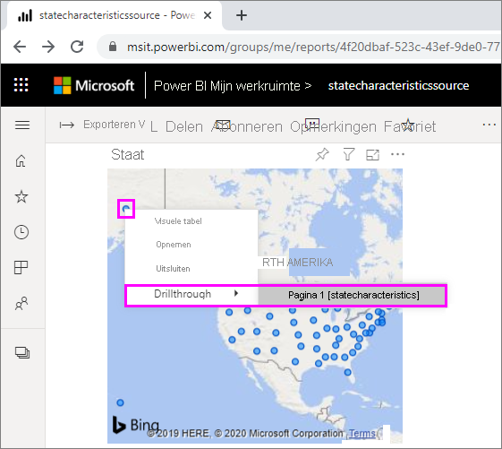
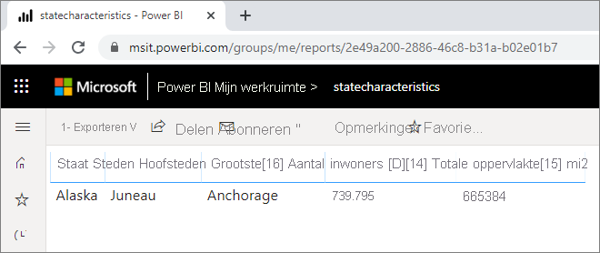
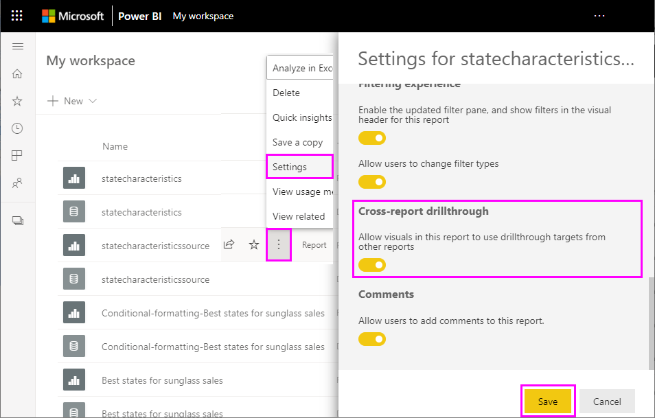
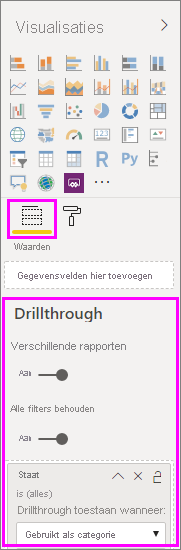

# Drillthrough voor verschillende rapporten gebruiken in Power BI

Met de functie *Drillthrough voor verschillende rapporten* in Power BI kunt u contextafhankelijk van het ene rapport naar een ander rapport gaan in dezelfde werkruimte of app van de Power BI-service. U kunt drillthrough gebruiken voor verschillende rapporten om twee of meer rapporten met gerelateerde inhoud te verbinden, en filtercontext samen met de verbinding voor de rapporten door te geven. 

Als u een drillthrough voor verschillende rapporten wilt starten, selecteert u een gegevenspunt in een *bronvisual* van een *bronrapport* en selecteert u vervolgens het doel van de **drillthrough** voor verschillende rapporten in het contextmenu. 

Met de actie Drillthrough wordt de *doelpagina* in het *doelrapport* geopend. 

Dit artikel laat u zien hoe u een drillthrough voor verschillende rapporten kunt instellen en gebruiken voor Power BI-rapporten.

> [!NOTE]
> U kunt geen drillthrough voor verschillende rapporten gebruiken met persoonlijk gedeelde [Gedeeld met mij-rapporten](../collaborate-share/service-share-dashboards.md#share-a-dashboard-or-report). Als u een drillthrough voor verschillende rapporten wilt gebruiken, moet u toegang hebben tot rapporten in werkruimten waarvan u lid bent.

## Drillthrough voor meerdere rapporten inschakelen

De eerste stap voor het inschakelen van drillthrough voor verschillende rapporten is het valideren van de gegevensmodellen voor de bron- en doelrapporten. Hoewel de schema's in elk rapport niet gelijk hoeven te zijn, moeten de velden die u wilt doorgeven zich in beide gegevensmodellen bevinden. De namen van de velden en de namen van de tabellen waarvan deze deel uitmaken, moeten identiek zijn. De tekenreeksen moeten overeenkomen en zijn hoofdlettergevoelig.

Als u bijvoorbeeld een filter wilt doorgeven voor het veld **Staat** in de tabel **Staten van de V.S.** , moeten beide modellen de tabel **Staten van de V.S.** en het veld **Staat** in die tabel bevatten. Anders moet u de veld- of tabelnaam in het onderliggende model bijwerken. Het bijwerken van de weergavenaam van de velden werkt niet goed voor drillthrough voor meerdere rapporten.

Nadat u uw modellen hebt gevalideerd, zorgt u ervoor dat het bronrapport gebruik kan maken van een drillthrough voor verschillende rapporten. 

1. Ga in de Power BI Desktop naar **Bestand** > **Opties en instellingen** > **Opties**. 
1. Selecteer in het navigatievenster links **Opties** onderaan de sectie **Huidig bestand** de optie **Rapportinstellingen**. 
1. Selecteer rechtsonder onder **Drillthrough voor verschillende rapporten** **Visuals in dit rapport toestaan om drillthrough-doelen van andere rapporten te gebruiken**. 
1. Selecteer **OK**. 
   
   

U kunt ook een drillthrough voor verschillende rapporten inschakelen vanuit de Power BI-service.
1. In Power BI-service selecteert u de werkruimte die uw doel- en bronrapporten bevat.
1. Naast de naam van het bronrapport in de lijst met werkruimten selecteert u het symbool **Meer opties** en selecteert u vervolgens **Instellingen**. 
1. Selecteer onderaan het deelvenster **Instellingen** onder **Drillthrough voor verschillende rapporten** **Visuals in dit rapport toestaan om drillthrough-doelen van andere rapporten te gebruiken** en selecteer dan **Opslaan**.
   
   

## Een drillthrough-doel voor verschillende rapporten instellen

Het instellen van een doelpagina voor een drillthrough voor verschillende rapporten is vergelijkbaar met het instellen van een drillthrough in een rapport. Wanneer u drillthrough inschakelt op de doelpagina, kunnen andere visuals de pagina die is ingeschakeld voor drillthrough bereiken. Zie [Drillthrough gebruiken in Power BI Desktop](desktop-drillthrough.md) voor het maken van een drillthrough-actie binnen één rapport.

U kunt een doel instellen voor drillthrough voor verschillende rapporten in Power BI Desktop of de Power BI-service. 
1. Bewerk het doelbestand en selecteer op de doelpagina van het doelrapport de sectie **Velden** van het deelvenster **Visualisaties**. 
1. Stel onder **Drillthrough** de wisselknop **Voor verschillende rapporten** in op **Aan**. 
1. Sleep de velden die u wilt gebruiken als drillthrough-doelen naar **Hier drillthrough-velden toevoegen**. Selecteer voor elk veld of u drillthrough wilt toestaan wanneer het veld wordt gebruikt als categorie of wanneer deze wordt samengevat als meting. 
1. Geef aan of u wilt dat **alle filters voor de visual worden behouden**. Als u geen op de bronvisual toegepaste filters wilt doorgeven aan uw doelvisual, selecteert u **Uit**.
   
   
   
1. Als u de pagina alleen gebruikt voor drillthrough voor verschillende rapporten, moet u de automatisch aan het canvas toegevoegde knop **Terug** verwijderen. De knop **Terug** werkt alleen voor navigatie binnen een rapport. 
1. Nadat u de doelpagina hebt geconfigureerd, moet u het rapport opslaan als u gebruikmaakt van de Power BI-service, of het rapport opslaan en publiceren als u Power BI Desktop gebruikt.

Dat is alles. Uw rapporten zijn gereed voor drillthrough voor verschillende rapporten. 

## Drillthrough in verschillende rapporten gebruiken

Selecteer, als u drillthrough voor verschillende rapporten wilt gebruiken, het bronrapport in de Power BI-service en selecteer vervolgens een visual die gebruikmaakt van het drillthrough-veld op de manier die u hebt opgegeven bij het instellen van de doelpagina. Klik met de rechtermuisknop op een gegevenspunt om het contextmenu van de visual te openen, selecteer **Drillthrough** en selecteer vervolgens het drillthrough-doel. Drillthrough-doelen voor verschillende rapporten zijn ingedeeld als **Paginanaam [Rapportnaam]** .

U ziet de resultaten op de doelpagina voor de drillthrough voor verschillende rapporten, precies zoals u deze hebt ingesteld tijdens het maken van het doel. De resultaten worden gefilterd op basis van de drillthroughinstellingen.

> [!IMPORTANT]
> Drillthroughdoelen voor meerdere rapporten worden in de Power BI-cache opgeslagen. Zorg, als u wijzigingen aanbrengt, dat u uw browser vernieuwt als de drillthrough-doelen niet worden weergegeven zoals u verwacht. 

Als u **Alle filters behouden** instelt op **Aan** bij het instellen van de doelpagina, kan de filtercontext van de bronvisual het volgende omvatten: 

- Filters op rapport-, pagina- en visualniveau die van invloed zijn op de bronvisual 
- Kruisfilters en kruismarkeringen die van invloed zijn op de bronvisual 
- Slicers en synchronisatieslicers op de pagina
- URL-parameters

Wanneer u naar het doelrapport voor de drillthrough bent geleid, worden in Power BI alleen filters toegepast op velden waarvan de tekenreeksen voor de veldnaam en tabelnaam exact overeenkomen. 

Met Power BI worden geen sticky-filters van het doelrapport toegepast, maar wel uw persoonlijke standaardbladwijzer als u er een hebt. Bijvoorbeeld: als uw persoonlijke standaardbladwijzer het rapportfilter *Land = NL* bevat, wordt in Power BI dat filter toegepast voordat de filtercontext van de bronvisual wordt toegepast. 

Voor een drillthrough voor verschillende rapporten wordt in Power BI de filtercontext doorgegeven aan standaardpagina's in het doelrapport. Er wordt geen filtercontext doorgegeven voor knopinfo-pagina's, omdat knopinfo-pagina's worden gefilterd op basis van de bronvisual die de knopinfo aanroept.

Als u wilt terugkeren naar het bronrapport na de drillthroughactie voor meerdere rapporten, gebruikt u de knop **Terug**. 

## Volgende stappen

Wellicht bent u ook geïnteresseerd in de volgende artikelen:

- [Slicers in Power BI](../visuals/power-bi-visualization-slicers.md)
- [Drillthrough gebruiken in Power BI Desktop](desktop-drillthrough.md)
