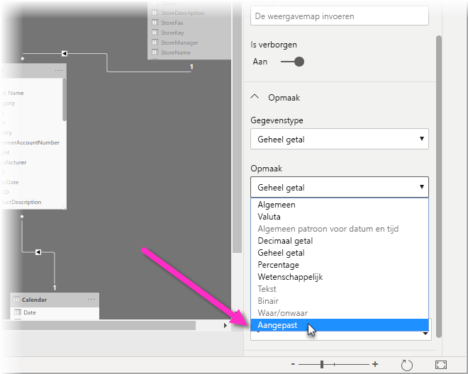
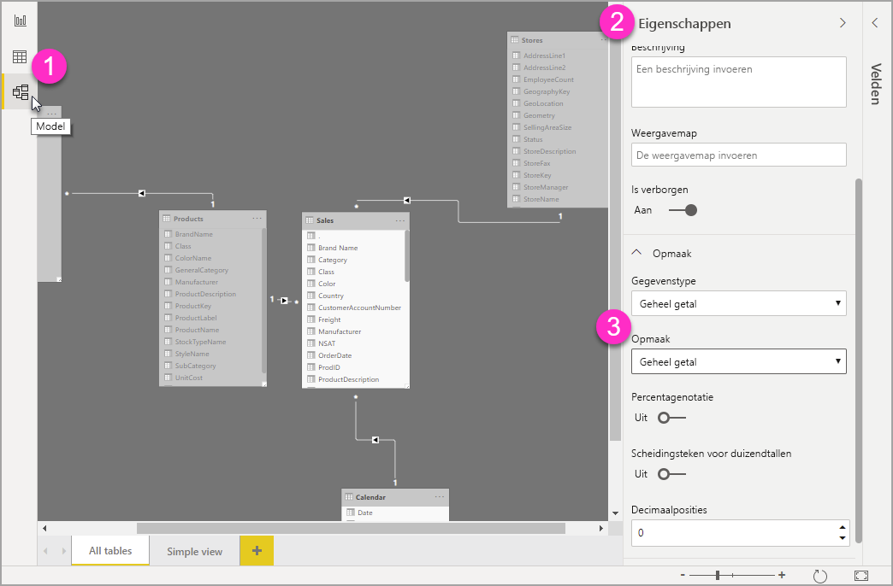
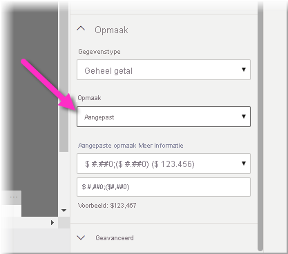

# Tekenreeksen met aangepaste indeling gebruiken in Power BI Desktop

Met tekenreeksen met een aangepaste indeling in **Power BI Desktop** kunt u aanpassen hoe velden worden weergegeven in visuals en ervoor zorgen dat uw rapporten er precies zo uitzien als u wilt.

## Het gebruik van tekenreeksen met een aangepaste indeling

Als u tekenreeksen met een aangepaste indeling wilt maken, selecteert u het veld in de **Modelweergave** en selecteert u vervolgens **Indeling** in het deelvenster **Eigenschappen**.

Zodra u **Aangepast** hebt geselecteerd in de vervolgkeuzelijst **Indeling**, kunt u een keuze maken uit de lijst met veelgebruikte indelingen voor tekenreeksen. 

## Ondersteunde syntaxis voor aangepaste indelingen

Voor tekenreeksen met een aangepaste indeling gebruikt u de syntaxis van VBA, die ook gangbaar is in Excel en andere producten van Microsoft. De syntaxis die wordt gebruikt in andere producten, wordt echter niet altijd ondersteund. 

In de volgende tabellen ziet u welke syntaxis wordt ondersteund in Power BI.

In de volgende tabel worden ondersteunde **datumsymbolen** weergegeven:

| **Symbool** | **Bereik** |
| --- | --- |
| _d_ | 1-31 (dag van de maand, zonder voorloopnul) |
| _dd_ | 01-31 (dag van de maand, met voorloopnul) |
| _m_ | 1-12 (maand van het jaar, zonder voorloopnul, beginnend bij januari = 1) |
| _mm_ | 01-12 (maand van het jaar, met voorloopnul, beginnend bij januari = 01) |
| _mmm_ | Verkorte namen van maanden weergeven (Hijri-maandnamen hebben geen afkortingen) |
| _mmmm_ | Volledige namen van maanden weergeven |
| _yy_ | 00-99 (laatste twee cijfers van het jaar) |
| _yyyy_ | 100-9999 (jaar met drie of vier cijfers) |

In de volgende tabel worden ondersteunde **tijdsymbolen** weergegeven:

| **Symbool** | **Bereik** |
| --- | --- |
| _h_ | 0-23 (1-12 met &quot;AM&quot; of &quot;PM&quot; erachter) (uur van de dag, zonder voorloopnul) |
| _hh_ | 00-23 (01-12 met &quot;AM&quot; of &quot;PM&quot; erachter) (uur van de dag, met voorloopnul) |
| _n_ | 0-59 (minuut van het uur, zonder voorloopnul) |
| _nn_ | 00-59 (minuut van het uur, met voorloopnul) |
| _m_ | 0-59 (minuut van het uur, zonder voorloopnul). Alleen indien voorafgegaan door _h_ of _hh_ |
| _mm_ | 00-59 (minuut van het uur, met voorloopnul). Alleen indien voorafgegaan door _h_ of _hh_ |
| _s_ | 0-59 (seconde van de minuut, zonder voorloopnul) |
| _ss_ | 00-59 (seconde van de minuut, met voorloopnul) |

Bekijk desgewenst een [voorbeeld](/office/vba/language/reference/user-interface-help/format-function-visual-basic-for-applications#example) van het opmaken van tekenreeksen met aangepaste waarden.

Een door de gebruiker gedefinieerde expressie voor opmaak van getallen kan bestaan uit een tot drie secties, van elkaar gescheiden door puntkomma's. Als u puntkomma's in de expressie opneemt met niets ertussen, wordt de ontbrekende sectie niet weergegeven (bijvoorbeeld &quot;&quot;). Als er geen puntkomma wordt opgegeven, wordt de indeling met een positief getal gebruikt.

Hier volgen enkele voorbeelden van verschillende indelingen voor tekenreeksen met verschillende waarden:

|   | **Tekenreeksen voor opmaak** |   |   |   |
| --- | --- | --- | --- | --- |
| **Waarden** | **0,00;-0,0; &quot;Nul&quot;** | **0,00;;** | **0,00;-0,0;** | **0,00;** |
| **-1,234** | -1,2 | &quot;&quot; | -1,2 | &quot;&quot; |
| **0** | &quot;Nul&quot; | &quot;&quot; | &quot;&quot; | 0,00 |
| **1,234** | 1,23 | 1,23 | 1,23 | 1,23 |

De volgende tabel bevat de vooraf gedefinieerde **benoemde datum- en tijdnotaties**:

| **Naam van notatie** | **Beschrijving** |
| --- | --- |
| **Standaard datumnotatie** | Een datum en/of tijd weergeven, bijvoorbeeld 4/3/93 05:34 PM. Als er geen breukdeel is, wordt alleen een datum weergegeven, bijvoorbeeld 4/3/93. Als er geen geheel getal is, wordt alleen de tijd weergegeven, bijvoorbeeld 05:34 PM. De datumweergave wordt bepaald door de systeeminstellingen. |
| **Lange datumnotatie** | Een datum weergeven in de lange datumnotatie van uw systeem. |
| **Korte datumnotatie** | Een datum weergeven in de korte datumnotatie van uw systeem. |
| **Lange tijdnotatie** | Een tijd weergeven in de lange tijdnotatie van het systeem, met uren, minuten en seconden. |
| **Korte tijdnotatie** | Een tijd weergeven in de 24-uurs notatie, bijvoorbeeld 17:45. |

Benoemde getalnotaties

De volgende tabel bevat de vooraf gedefinieerde **benoemde getalnotaties**:

| **Naam van notatie** | **Beschrijving** |
| --- | --- |
| **Standaard getalnotatie** | Een getal zonder scheidingsteken voor duizendtallen weergeven. |
| **Valuta** | Een getal weergeven met scheidingstekens voor duizendtallen, indien van toepassing, en twee cijfers rechts van het decimaalteken. De uitvoer is gebaseerd op de landinstellingen van het systeem. |
| **Vast** | Een getal weergeven met minste één cijfer links en twee cijfers rechts van het decimaalteken. |
| **Standaard** | Een getal weergeven met scheidingstekens voor duizendtallen en ten minste één cijfer links en twee cijfers rechts van het decimaalteken. |
| **Percentage** | Een getal weergeven, vermenigvuldigd met 100 en een procentteken ( **%** ) erachter, en altijd twee cijfers rechts van het decimaalteken. |
| **Wetenschappelijk** | De standaard wetenschappelijke notatie gebruiken. |

De volgende tabel bevat de tekens die u kunt gebruiken voor het maken van **door de gebruiker gedefinieerde datum-/tijdnotaties**.

| **Teken** | **Beschrijving** |
| --- | --- |
| ( **:** ) | Tijdscheidingsteken. In sommige landen kunnen andere tekens worden gebruikt als tijdscheidingsteken. Het tijdscheidingsteken wordt gebruikt om uren, minuten en seconden te scheiden bij het opmaken van tijdwaarden. Het werkelijke teken dat wordt gebruikt als tijdscheidingsteken in de opgemaakte uitvoer wordt bepaald door de systeeminstellingen. |
| ( **/** ) | Datumscheidingsteken. In sommige landen kunnen andere tekens worden gebruikt als datumscheidingsteken. Het datumscheidingsteken wordt gebruikt om de dag, de maand en het jaar te scheiden bij het opmaken van datumwaarden. Het werkelijke teken dat wordt gebruikt als datumscheidingsteken in de opgemaakte uitvoer wordt bepaald door de systeeminstellingen. |
| d | De dag weergeven als een getal zonder voorloopnul (1-31). |
| dd | De dag weergeven als een getal met voorloopnul (01-31). |
| ddd | De dag weer als een afkorting (zo-za). Gelokaliseerd. |
| dddd | De dag weergeven als een volledige naam (zondag-zaterdag). Gelokaliseerd. |
| m | De maand weergeven als een getal zonder voorloopnul (1-12). Als m direct volgt op h of hh, wordt de minuut weergegeven in plaats van de maand. |
| mm | De maand weergeven als een getal met voorloopnul (01-12). Als m direct volgt op h of hh, wordt de minuut weergegeven in plaats van de maand. |
| mmm | De maand weergeven als een afkorting (jan-dec). Gelokaliseerd. |
| mmmm | De maand weergeven als een volledige naam (januari-december). Gelokaliseerd. |
| yy | Het jaar weergeven als een getal van 2 cijfers (00-99). |
| yyyy | Het jaar weergeven als een getal van 4 cijfers (100-9999). |
| h | Het uur weergeven als een getal zonder voorloopnul (0-23). |
| hh | Het uur weergeven als een getal met voorloopnul (00-23). |
| n | De minuut weergeven als een getal zonder voorloopnul (0-59). |
| nn | De minuut weergeven als een getal met voorloopnul (00-59). |
| s | De seconde weergeven als een getal zonder voorloopnul (0-59). |
| ss | De seconde weergeven als een getal met voorloopnul (00-59). |
| AM/PM | De 12-uurs klok gebruiken en AM in hoofdletters weergeven bij elk uur vóór 12 uur 's middags en PM in hoofdletters bij elk uur tussen twaalf uur 's middags en 23:59 uur. |

De volgende tabel bevat de tekens die u kunt gebruiken voor het maken van **door de gebruiker gedefinieerde getalnotaties**.

| **Teken** | **Beschrijving** |
| --- | --- |
| Geen | Het getal zonder opmaak weergeven. |
| ( **0** ) | Tijdelijke aanduiding voor cijfer. Een cijfer of een nul weergeven. Als de expressie een cijfer bevat op de positie waar de 0 wordt weergegeven in de notatietekenreeks, dat cijfer weergeven, anders een nul op die positie weergeven. Als het getal minder cijfers bevat dan nullen (voor of na het decimaal) in de notatie-expressie, voorloopnullen of volgnullen weergeven. Als het getal rechts van het decimaalteken meer cijfers bevat dan nullen rechts van het decimaalteken in de notatie-expressie, het getal afronden op zo veel decimaalposities als er nullen zijn. Als het getal links van het decimaalteken meer cijfers bevat dan nullen links van het decimaalteken in de notatie-expressie, de extra cijfers weergeven zoals ze zijn. |
| ( **#** ) | Tijdelijke aanduiding voor cijfer. Een cijfer of niets weergeven. Als de expressie een cijfer bevat op de positie waar de # wordt weergegeven in de notatietekenreeks, dat cijfer weergeven, anders niets op die positie weergeven. Dit symbool werkt zoals de tijdelijke aanduiding voor het cijfer 0, behalve dat er geen voorloop-en volgnullen worden weergegeven als het getal even veel of minder cijfers bevat dan #-tekens links of rechts van het decimaalteken in de notatie-expressie. |
| ( **.** ) | Tijdelijke aanduiding voor decimalen. In sommige landen wordt een komma gebruikt als decimaalteken. De tijdelijke aanduiding voor decimalen bepaalt hoeveel cijfers er links en rechts van het decimaalteken worden weergegeven. Als de notatie-expressie alleen hekjes bevat links van dit symbool, beginnen getallen die kleiner zijn dan 1 met een decimaalteken. Als u een voorloopnul wilt weergeven voor breuken, gebruikt u 0 als tijdelijke aanduiding voor het eerste cijfer links van het decimaalteken. Het werkelijke teken dat wordt gebruikt als tijdelijke aanduiding voor decimalen in de opgemaakte uitvoer is afhankelijk van de getalnotatie die wordt herkend door uw systeem. |
| ( **%)** | Tijdelijke aanduiding voor percentage. De expressie wordt vermenigvuldigd met 100. Het procentteken ( **%** ) wordt ingevoegd op de positie waar het staat in de notatietekenreeks. |
| ( **,** ) | Scheidingsteken voor duizendtallen. In sommige landen wordt een punt gebruikt als scheidingsteken voor duizendtallen. Het scheidingsteken voor duizendtallen scheidt duizendtallen van honderdtallen in een getal met vier of meer cijfers links van het decimaalteken. Standaardgebruik van het scheidingsteken voor duizendtallen wordt opgegeven als de notatie een scheidingsteken bevat dat is omgeven door tijdelijke aanduidingen voor cijfers ( **0**  of  **#** ). Twee opeenvolgende scheidingstekens voor duizendtallen of een scheidingsteken voor duizendtallen direct links van het decimaalteken (afhankelijk van of er een decimaal is opgegeven), betekent dat &quot;het getal wordt geschaald door het te delen door 1000 en wordt zo nodig afgerond&quot;. Bijvoorbeeld: u kunt de notatietekenreeks &quot;##0,,&quot; gebruiken om het getal 100.000.000 weer te geven als 100. Getallen die kleiner zijn dan 1.000.000 worden weergegeven als 0. Twee aangrenzende scheidingstekens voor duizendtallen op een andere positie dan direct links van het decimaalteken worden behandeld als het gebruik van een scheidingsteken voor duizendtallen. Het werkelijke teken dat wordt gebruikt als scheidingsteken voor duizendtallen in de opgemaakte uitvoer is afhankelijk van de getalnotatie die wordt herkend door uw systeem. |
| ( **:** ) | Tijdscheidingsteken. In sommige landen kunnen andere tekens worden gebruikt als tijdscheidingsteken. Het tijdscheidingsteken wordt gebruikt om uren, minuten en seconden te scheiden bij het opmaken van tijdwaarden. Het werkelijke teken dat wordt gebruikt als tijdscheidingsteken in de opgemaakte uitvoer wordt bepaald door de systeeminstellingen. |
| ( **/** ) | Datumscheidingsteken. In sommige landen kunnen andere tekens worden gebruikt als datumscheidingsteken. Het datumscheidingsteken wordt gebruikt om de dag, de maand en het jaar te scheiden bij het opmaken van datumwaarden. Het werkelijke teken dat wordt gebruikt als datumscheidingsteken in de opgemaakte uitvoer wordt bepaald door de systeeminstellingen. |
| ( **E- E+ e- e+** ) | Wetenschappelijke notatie. Als de notatie-expressie ten minste één tijdelijke aanduiding voor een cijfer ( **0** of **#** ) rechts van E-, E+, e- of e+ bevat, wordt het getal weergegeven in de wetenschappelijke notatie en wordt E of e ingevoegd tussen het getal en de exponent. Het aantal tijdelijke aanduidingen voor cijfers aan de rechterkant bepaalt het aantal cijfers in de exponent. Gebruik E- of e- voor het plaatsen van een minteken naast negatieve exponenten. Gebruik E+ of e+ voor het plaatsen van een minteken naast negatieve exponenten en een plusteken naast positieve exponenten. |
| **- + $**  ( ) | Een literal-teken weergeven. Als u een ander teken dan een van de vermelde tekens wilt weergeven, plaatst u een backslash (\) ervoor of plaatst u het tussen dubbele aanhalingstekens (&quot; &quot;). |
| ( * *\** ) | Het volgende teken in de notatietekenreeks weergeven. Als u een teken met een speciale betekenis als literal-teken wilt weergeven, plaatst u een backslash (\) ervoor. De backslash zelf wordt niet weergegeven. Een backslash gebruiken is hetzelfde als het volgende teken tussen dubbele aanhalingstekens plaatsen. Als u een backslash wilt weergeven, gebruikt u twee backslashes (\\). Voorbeelden van tekens die niet kunnen worden weergegeven als literal-tekens zijn de tekens voor het opmaken van datum- en tijdnotaties (a, c, d, h, m, n, p, q, s, t, w, / en :), de tekens voor het opmaken van getalnotaties (#, 0, %, E, e, komma en punt), en de tekens voor het opmaken van tekenreeksen (@, &amp;, \&lt;, \&gt; en !). |
| (&quot;ABC&quot;) | De tekenreeks tussen dubbele aanhalingstekens (&quot; &quot;) weergeven. |

## Volgende stappen
Wellicht bent u ook geïnteresseerd in de volgende artikelen:

* [Tekenreeksen in VBA-indeling](/office/vba/language/reference/user-interface-help/format-function-visual-basic-for-applications#example)
* [Metingen in Power BI Desktop](../transform-model/desktop-measures.md)
* [Gegevenstypen in Power BI Desktop](../connect-data/desktop-data-types.md)
* [Voorwaardelijke opmaak in tabellen](desktop-conditional-table-formatting.md)