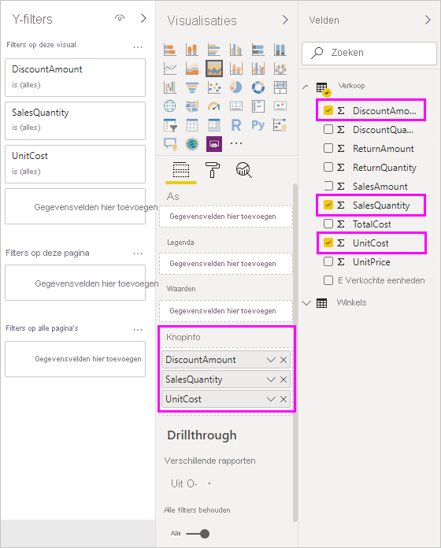

# Knopinfo in Power BI Desktop aanpassen

Knopinfo vormt een handige manier om meer contextuele informatie en details aan gegevenspunten in een visueel element te verstrekken. Op de volgende afbeelding wordt knopinfo weergegeven die is toegepast op een grafiek in Power BI Desktop.

Wanneer een visualisatie is gemaakt, geeft de standaardknopinfo de waarde en categorie van het gegevenspunt weer. Er zijn veel momenten waarop het handig is om de knopinfo aan te passen. Het aanpassen van knopinfo biedt aanvullende context en informatie voor gebruikers die de visual bekijken. Met aangepaste knopinfo kunt u aanvullende gegevenspunten opgeven die als onderdeel van de knopinfo worden weergegeven.

## Knopinfo aanpassen

Als u aangepaste knopinfo wilt maken, sleept u in het gedeelte **Velden** van het deelvenster **Visualisaties** een veld naar de bucket **Knopinfo**, zoals op de volgende afbeelding wordt weergegeven. Op de volgende afbeelding zijn drie velden in de bucket **Knopinfo** geplaatst.

Zodra knopinfo is toegevoegd aan **Knopinfo**, kunt u met de muis over een gegevenspunt in de visualisatie bewegen om de waarden voor deze velden te bekijken.

## Knopinfo aanpassen met aggregatie of snelle metingen

U kunt knopinfo verder aanpassen door een aggregatiefunctie of een *snelle meting* te selecteren. Selecteer de pijl naast het veld in de bucket **Knopinfo**. Selecteer vervolgens een van de beschikbare opties.

Er zijn veel manieren om, met behulp van elk veld dat beschikbaar is in uw gegevensset, Knopinfo aan te passen om zo snel informatie en inzichten te bieden aan gebruikers die de dashboards en rapporten bekijken.
