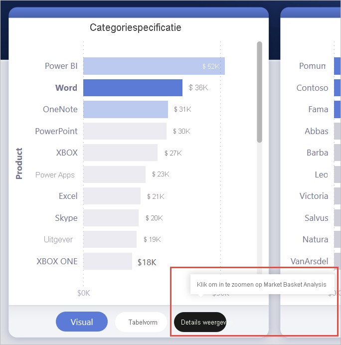
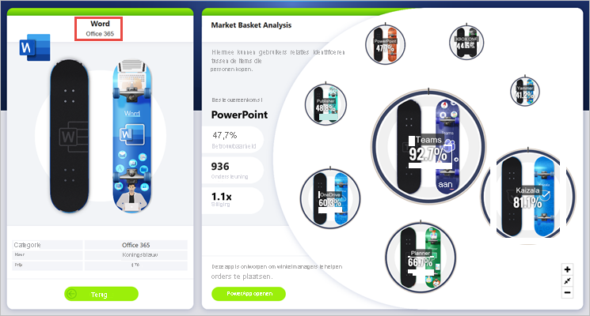
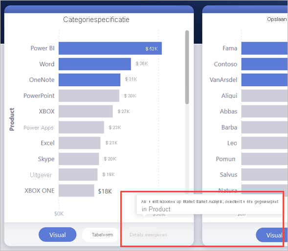
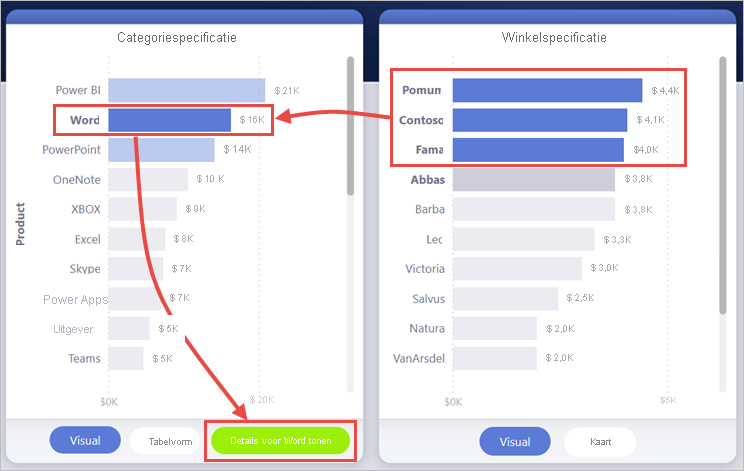
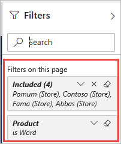
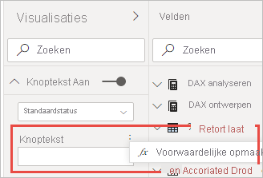
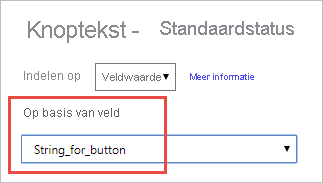
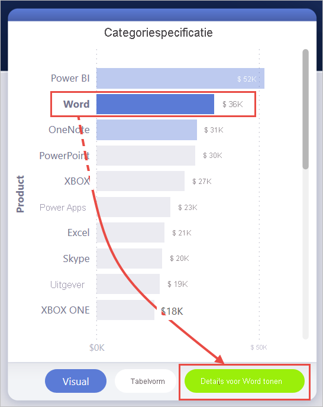
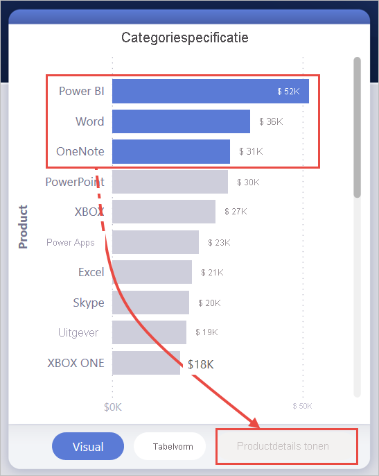

# <a name="create-a-drill-through-button-in-power-bi"></a>Een analyseknop maken in Power BI

U kunt een *analyseknop* maken in Power BI. Dit is een knop waarmee u inzoomt op een pagina met details die worden gefilterd op een specifieke context.

Een van de manieren om op een rapport in te zoomen, is door met de rechtermuisknop in een visual te klikken. Als u wilt dat de inzoomactie duidelijker wordt, kunt u in plaats daarvan een analyseknop maken. Met deze knop kunt u de detectie van belangrijke analysescenario's in uw rapporten vergroten. U kunt ook veel van hoe de knop er uitziet en reageert voorwaardelijk bepalen. U kunt bijvoorbeeld andere tekst op de knop weergeven als aan bepaalde voorwaarden wordt voldaan. Lees verder voor meer informatie. 

In dit voorbeeld wordt de knop **Details weergeven** ingeschakeld, nadat de u de Word-balk in de grafiek hebt geselecteerd.



Wanneer u de knop **Details weergeven** selecteert, zoomt u in op de pagina Market Basket Analysis. Zoals u kunt zien in de visual aan de linkerkant, wordt de analysepagina nu gefilterd op Word.



## <a name="set-up-a-drill-through-button"></a>Een analyseknop instellen

Als u een analyseknop wilt instellen, moet u eerst [een geldige analysepagina instellen](desktop-drillthrough.md) in uw rapport. Vervolgens maakt u een knop met **Analyseren** als het actietype en selecteert u de analysepagina als **Doel**.

Omdat de analyseknop twee statussen heeft (wanneer analyseren is ingeschakeld versus uitgeschakeld), ziet u twee opties voor de knopinfo.


Als u de vakken voor knopinfo leeg laat, genereert Power BI automatisch knopinfo. Deze knopinfo is gebaseerd op het doel en analyseveld(en).

Hier volgt een voorbeeld van de automatisch gegenereerde knopinfo wanneer de knop is uitgeschakeld:

'Als u wilt inzoomen op de analyse van de Market Basket Analyse [de doelpagina], selecteert u één gegevenspunt in Product [het analyseveld].'



En hier volgt een voorbeeld van de automatisch gegenereerde knopinfo wanneer de knop is ingeschakeld:

'Klik om in te zoomen op Market Basket Analysis [de doelpagina].'


Als u echter aangepaste knopinfo wilt opgeven, kunt u altijd een statische tekenreeks invoeren. U kunt ook [voorwaardelijke opmaak op knopinfo](#set-formatting-for-tooltips-conditionally) toepassen.

## <a name="pass-filter-context"></a>Filtercontext doorgeven

De knop werkt zoals bij normaal analyseren: u kunt filters doorgeven aan extra velden door de visuals die het analyseveld bevatten kruislings te filteren. Als u bijvoorbeeld **Ctrl** + **klik** en kruislings filteren gebruikt, kunt u meerdere filters in de Store doorgeven aan de analysepagina, omdat uw selecties kruislings filteren op de visual die Product bevat, het analyseveld:



Als u de analyseknop selecteert, ziet u dat filters voor zowel winkel als product worden doorgegeven aan de doelpagina:



### <a name="ambiguous-filter-context"></a>Dubbelzinnige filtercontext

Omdat de analyseknop niet is gekoppeld aan een enkele visual, wordt de knop uitgeschakeld als de selectie dubbelzinnig is.

In dit voorbeeld is de knop uitgeschakeld omdat twee visuals beide één selectie van Product bevatten. Er is dubbelzinnigheid over het gegevenspunt waarvan de analyseactie moet worden gebonden aan:


## <a name="customize-formatting-for-disabled-buttons"></a>Opmaak voor uitgeschakelde knoppen aanpassen
U kunt de opmaakopties voor uitgeschakelde analyseknoppen aanpassen.


:::image type="content" source="media/desktop-drill-through-buttons/drill-through-customize-disabled-button.png" alt-text="Opmaak van uitgeschakelde knop aanpassen":::
 
Deze opmaakopties zijn onder meer:
- **Besturingselementen voor tekst op de knop**: tekst, kleur, opvulling, uitlijning, grootte en lettertypefamilie

    :::image type="content" source="media/desktop-drill-through-buttons/drill-through-disabled-button-text.png" alt-text="Tekst van uitgeschakelde knop opmaken":::

- **Besturingselementen voor knopopvulling**: kleur, transparantie en *nieuwe* opvulafbeelding (meer hierover in de volgende sectie)

    :::image type="content" source="media/desktop-drill-through-buttons/drill-through-disabled-button-fill.png" alt-text="Opvulling voor uitgeschakelde knop":::

- **Besturingselementen voor pictogram**: vorm, opvulling, uitlijning, lijnkleur, transparantie en gewicht

    :::image type="content" source="media/desktop-drill-through-buttons/drill-through-disabled-button-icon.png" alt-text="Pictogrammen voor uitgeschakelde knop":::

- **Besturingselementen voor omtrek**: kleur, transparantie, gewicht, ronde randen

     :::image type="content" source="media/desktop-drill-through-buttons/drill-through-disabled-button-outline.png" alt-text="Omtrek van uitgeschakelde knop":::

## <a name="set-formatting-for-button-text-conditionally"></a>Opmaak voor knoptekst voorwaardelijk instellen
U kunt voorwaardelijke opmaak gebruiken om de knoptekst te wijzigen op basis van de geselecteerde waarde van een veld. Hiervoor moet u een meting maken waarmee de gewenste tekenreeks wordt uitgevoerd op basis van de DAX-functie SELECTEDVALUE.

Hier volgt een voorbeeldmeting waarmee 'Zie productgegevens' als uitvoer wordt weergegeven als één productwaarde NIET is geselecteerd. Anders wordt de waarde 'Zie details voor [het geselecteerde product]' weergegeven:

```dax
String_for_button = If(SELECTEDVALUE('Product'[Product], 0) == 0, "See product details", "See details for " & SELECTEDVALUE('Product'[Product]))
```

Wanneer u deze meting hebt gemaakt, selecteert u de optie **Voorwaardelijke opmaak** voor de knoptekst:



Vervolgens selecteert u de meting die u hebt gemaakt voor de knoptekst:



Wanneer één product is geselecteerd, staat de volgende tekst op de knop:

'Details voor Word tonen'



Als er geen producten zijn geselecteerd of als er meer dan één product is geselecteerd, wordt de knop uitgeschakeld. De volgende tekst staat op de knop:

'Productdetails tonen'



## <a name="set-formatting-for-tooltips-conditionally"></a>Opmaak voor knopinfo voorwaardelijk instellen

U kunt de knopinfo voor de analyseknop voorwaardelijk opmaken wanneer deze is ingeschakeld of uitgeschakeld. Als u voorwaardelijke opmaak hebt gebruikt om het analysedoel dynamisch in te stellen, wilt u mogelijk dat de knopinfo voor de knopstatus meer informatief van aard is, op basis van de selectie van uw eindgebruiker. Hier ziet u een aantal voorbeelden:

- U kunt de knopinfo voor een uitgeschakelde status per geval prescriptief maken op basis van een aangepaste meting. Als u bijvoorbeeld wilt dat de gebruiker één product *en* één winkel selecteert voordat deze kan inzoomen op de marktanalysepagina, kunt u een meting maken met de volgende logica:

    Als de gebruiker niet één product of één winkel heeft geselecteerd, geeft de meting dit als resultaat: 'Selecteer één product en Ctrl + klik om ook één winkel te selecteren.'

    Als de gebruiker één product, maar niet één winkel heeft geselecteerd, geeft de meting dit als resultaat: 'Ctrl + klik om ook één winkel te selecteren.'

- Op dezelfde manier kunt u de knopinfo voor een ingeschakelde knop instellen op basis van de selectie van de gebruiker. Als u bijvoorbeeld wilt dat de gebruiker weet op welk product en welke winkel de analysepagina wordt gefilterd, kunt u een meting maken die het volgende als resultaat geeft:

    'Klik om in te zoomen op [naam analysepagina] voor meer informatie over de verkoop voor [productnaam] in [winkelnaam].'


## <a name="set-the-drill-through-destination-conditionally"></a>Het analysedoel voorwaardelijk instellen

U kunt voorwaardelijke opmaak gebruiken om het analysedoel in te stellen op basis van de uitvoer van een meting.

Hier volgen enkele scenario's waarin u mogelijk wilt dat het analysedoel van de knop voorwaardelijk is:

- U wilt inzoomen op een pagina alleen inschakelen **als aan meerdere voorwaarden is voldaan**. Anders is de knop uitgeschakeld.

    U wilt bijvoorbeeld dat gebruikers één product *en* één winkel selecteren voordat ze kunnen inzoomen op de pagina met marktdetails. Anders is de knop uitgeschakeld.

    :::image type="content" source="media/desktop-drill-through-buttons/drill-through-select-product-store.png" alt-text="Een product en winkel selecteren":::
 
- U wilt dat de knop **ondersteuning biedt voor meerdere analysedoelen** op basis van selecties van de gebruiker.

    Stel bijvoorbeeld dat u meerdere doelen hebt (marktdetails en winkeldetails) waarop gebruikers kunnen inzoomen. U kunt ze dan een specifiek doel laten selecteren om op in te zoomen voordat de knop wordt ingeschakeld voor dat analysedoel.

    :::image type="content" source="media/desktop-drill-through-buttons/drill-through-select-product-destination.png" alt-text="Product en doel selecteren":::
 
- Mogelijk hebt u ook interessante **gevallen voor een hybride scenario** voor het ondersteunen van zowel meerdere analysedoelen als specifieke voorwaarden waarvoor u de knop wilt uitschakelen. Lees verder voor meer informatie over deze drie opties.

### <a name="disable-the-button-until-multiple-conditions-are-met"></a>De knop uitschakelen totdat aan meerdere voorwaarden wordt voldaan

Laten we eens kijken naar het eerste geval, waarin u de knop uitgeschakeld wilt laten totdat aan aanvullende voorwaarden wordt voldaan. U moet een eenvoudige DAX-meting maken die een lege teken reeks ("") uitvoert, tenzij aan de voorwaarde is voldaan. Wanneer aan de voorwaarde wordt voldaan, wordt de naam van de pagina van het analysedoel uitgevoerd.

Hier volgt een voorbeeld van een DAX-meting waarvoor een winkel moet worden geselecteerd voordat de gebruiker op een product kan inzoomen op winkeldetails:

```dax
Destination logic = If(SELECTEDVALUE(Store[Store], “”)==””, “”, “Store details”)
```

Wanneer u de meting hebt gemaakt, selecteert u de knop voor voorwaardelijke opmaak (fx) naast het **doel** voor de knop:

:::image type="content" source="media/desktop-drill-through-buttons/drill-through-select-formula.png" alt-text="De knop voor voorwaardelijke opmaak selecteren":::
 
Voor de laatste stap selecteert u de DAX-meting die u hebt gemaakt als de veldwaarde voor het doel:

:::image type="content" source="media/desktop-drill-through-buttons/drill-through-based-formula.png" alt-text="Doel op basis van veld"::: 

U ziet nu dat de knop is uitgeschakeld, zelfs wanneer er één product is geselecteerd, omdat u voor de meting ook één winkel moet selecteren:

:::image type="content" source="media/desktop-drill-through-buttons/drill-through-button-disabled.png" alt-text="Analyseknop is uitgeschakeld":::

### <a name="support-multiple-destinations"></a>Ondersteuning voor meerdere doelen
 
Voor het andere veelvoorkomende geval waarbij u meerdere doelen wilt ondersteunen, begint u met het maken van een tabel met één kolom met de namen van de analysedoelen:

:::image type="content" source="media/desktop-drill-through-buttons/drill-through-create-table.png" alt-text="Een tabel maken":::

Power BI gebruikt een exacte overeenkomende tekenreeks om het analysedoel in te stellen. Controleer dus of de ingevoerde waarden exact overeenkomen met de namen van uw analysepagina's.

Nadat u de tabel hebt gemaakt, voegt u deze toe aan de pagina als een slicer met één selectie:

:::image type="content" source="media/desktop-drill-through-buttons/drill-through-slicer.png" alt-text="Analyseslicer":::
 
Als u meer verticale ruimte nodig hebt, converteert u de slicer naar een vervolgkeuzelijst. Verwijder de koptekst van de slicer en voeg een tekstvak toe met de titel ernaast:

:::image type="content" source="media/desktop-drill-through-buttons/drill-through-drop-down-slicer.png" alt-text="Analyseslicer zonder koptekst":::
 
U kunt de richting van lijstslicer ook van verticaal in horizontaal wijzigen:

:::image type="content" source="media/desktop-drill-through-buttons/drill-through-horizontal-slicer.png" alt-text="Horizontale slicer":::

Voor de doelinvoer voor de analyseactie selecteert u de knop voor voorwaardelijke opmaak (fx) naast het **doel** voor de knop:

:::image type="content" source="media/desktop-drill-through-buttons/drill-through-select-formula.png" alt-text="De knop voor voorwaardelijke opmaak selecteren":::
 
Selecteer de naam van de kolom die u hebt gemaakt, in dit geval **Selecteer een doel**:

:::image type="content" source="media/desktop-drill-through-buttons/drill-through-select-destination.png" alt-text="Selecteer een doel":::
 
U ziet nu dat de analyseknop alleen wordt ingeschakeld wanneer u een product *en* een doel hebt geselecteerd:

:::image type="content" source="media/desktop-drill-through-buttons/drill-through-select-product-destination.png" alt-text="Product en doel selecteren":::
 
### <a name="hybrid-of-the-two-scenarios"></a>Hybride van de twee scenario's

Als u geïnteresseerd bent in een hybride van de twee scenario's, kunt u een DAX-meting maken en ernaar verwijzen om extra logica toe te voegen voor de doelselectie.

Hier volgt een voorbeeld van een DAX-meting waarvoor de gebruiker een winkel moet selecteren voordat de gebruiker op een product kan inzoomen op een van de analysepagina’s:

```dax
Destination logic = If(SELECTEDVALUE(Store[Store], “”)==””, “”, SELECTEDVALUE(‘Table'[Select a destination]))
```

Vervolgens selecteert u de DAX-meting die u hebt gemaakt als de veldwaarde voor het doel.
In dit voorbeeld moet de gebruiker een product, een winkel *en* een doelpagina selecteren voordat de analyseknop wordt ingeschakeld:

:::image type="content" source="media/desktop-drill-through-buttons/drill-through-product-store-destination.png" alt-text="Product, winkel en doel selecteren":::

## <a name="limitations"></a>Beperkingen

- Met deze knop zijn meerdere doelen niet toegestaan met één knop.
- Deze knop ondersteunt alleen analyseren binnen hetzelfde rapport. Met andere woorden, het biedt geen ondersteuning voor het analyseren van meerdere rapporten.
- De opmaak van de uitgeschakelde status voor de knop is gekoppeld aan de kleurklassen in het rapportthema. Meer informatie over [kleurklassen](desktop-report-themes.md#setting-structural-colors).
- De analyseactie werkt voor alle ingebouwde visuals en werkt met *sommige* visuals die zijn geïmporteerd uit AppSource. Het werkt echter niet gegarandeerd met *alle* visuals die zijn geïmporteerd uit AppSource.

## <a name="next-steps"></a>Volgende stappen
Raadpleeg de volgende artikelen voor meer informatie over functies die vergelijkbaar zijn of samenwerken met knoppen:

* [Knoppen maken](desktop-buttons.md)
* [Analyseren gebruiken in Power BI-rapporten](desktop-drillthrough.md)
* [Bladwijzers gebruiken om inzichten te delen en verhalen te vertellen in Power BI](desktop-bookmarks.md)

