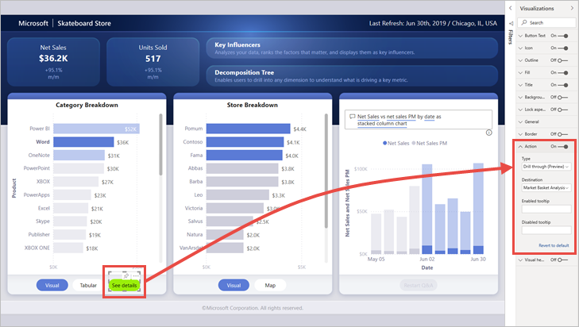
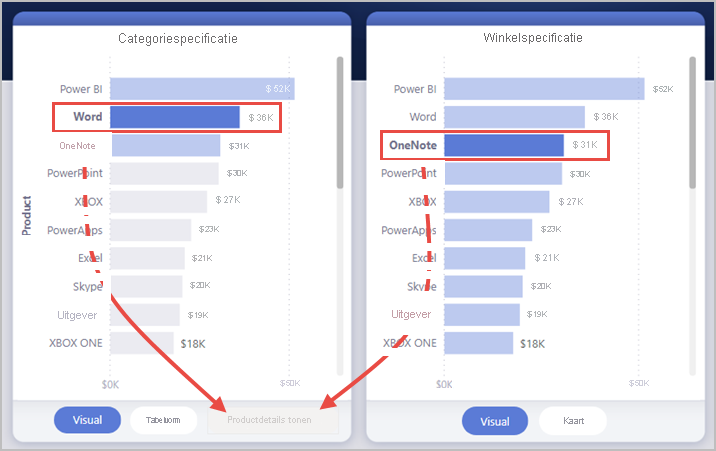

# <a name="create-a-drill-through-button-in-power-bi-preview"></a>Een analyseknop maken in Power BI (preview-versie)

Wanneer u een knop maakt in Power BI, kunt u de actie **Analyseren (preview)** selecteren. Met dit actietype maakt u een knop die inzoomt op een pagina met focus om details weer te geven die zijn gefilterd op een specifieke context.

Een analyseknop kan handig zijn als u de detectie van belangrijke analysescenario's in uw rapporten wilt vergroten.

In dit voorbeeld wordt de knop **Details weergeven** ingeschakeld, nadat de gebruiker de Word-balk in de grafiek heeft geselecteerd.


Wanneer de gebruiker de knop **Details weergeven** selecteert, wordt er ingezoomd op de pagina Market Basket Analysis. Zoals u kunt zien in de visual aan de linkerkant, wordt de analysepagina nu gefilterd op Word.


## <a name="set-up-a-drill-through-button"></a>Een analyseknop instellen

Als u een analyseknop wilt instellen, moet u eerst [een geldige analysepagina instellen](desktop-drillthrough.md) in uw rapport. Vervolgens maakt u een knop met **Analyseren** als het actietype en selecteert u de analysepagina als **Doel**.

Omdat de analyseknop twee statussen heeft (wanneer analyseren is ingeschakeld versus uitgeschakeld), ziet u dat er twee opties voor de knopinfo zijn.



Als u de vakken voor knopinfo leeg laat, genereert Power BI automatisch knopinfo. Deze knopinfo is gebaseerd op het doel en analyseveld(en).

Hier volgt een voorbeeld van de automatisch gegenereerde knopinfo wanneer de knop is uitgeschakeld:

'Als u wilt inzoomen op de analyse van de Market Basket Analyse (de doelpagina), selecteert u één gegevenspunt in Product (het analyseveld).'


En hier volgt een voorbeeld van de automatisch gegenereerde knopinfo wanneer de knop is ingeschakeld:

'Klik om in te zoomen op Market Basket Analysis (de doelpagina).'


Als u echter aangepaste knopinfo wilt opgeven, kunt u altijd een statische tekenreeks invoeren. We ondersteunen nog geen voorwaardelijke opmaak voor knopinfo.

U kunt voorwaardelijke opmaak gebruiken om de knoptekst te wijzigen op basis van de geselecteerde waarde van een veld. Hiervoor moet u een meting maken waarmee de gewenste tekenreeks wordt uitgevoerd op basis van de DAX-functie SELECTEDVALUE.

Hier volgt een voorbeeldmeting waarmee 'Zie productgegevens' als uitvoer wordt weergegeven als één productwaarde NIET is geselecteerd. Anders wordt de waarde 'Zie details voor [het geselecteerde product]' weergegeven:

```
String_for_button = If(SELECTEDVALUE('Product'[Product], 0) == 0), "See product details", "See details for " & SELECTEDVALUE('Product'[Product]))
```

Wanneer u deze meting hebt gemaakt, selecteert u de optie **Voorwaardelijke opmaak** voor de knoptekst:


Vervolgens selecteert u de meting die u hebt gemaakt voor de knoptekst:


Wanneer één product is geselecteerd, staat de volgende tekst op de knop:

'Details voor Word tonen'


Als er geen producten zijn geselecteerd of als er meer dan één product is geselecteerd, wordt de knop uitgeschakeld en staat de volgende tekst op de knop:

'Productdetails tonen'


## <a name="pass-filter-context"></a>Filtercontext doorgeven

De knop werkt zoals bij normaal analyseren, zodat u ook filters kunt doorgeven aan extra velden door de visuals die het analyseveld bevatten kruislings te filteren. Als u bijvoorbeeld **Ctrl** + **klik** en kruislings filteren gebruikt, kunt u meerdere filters in de Store doorgeven aan de analysepagina, omdat uw selecties kruislings filteren op de visual die Product bevat, het analyseveld:


Wanneer u de analyseknop selecteert, ziet u dat filters voor zowel Store als Product worden doorgegeven aan de doelpagina:


### <a name="ambiguous-filter-context"></a>Dubbelzinnige filtercontext

Omdat de analyseknop niet is gekoppeld aan een enkele visual, wordt de knop uitgeschakeld als de selectie dubbelzinnig is.

In dit voorbeeld is de knop uitgeschakeld omdat twee visuals beide één selectie van Product bevatten. Er is dubbelzinnigheid over het gegevenspunt waarvan de analyseactie moet worden gebonden aan:



## <a name="limitations"></a>Beperkingen

- Met deze knop zijn meerdere doelen niet toegestaan met één knop.
- Deze knop ondersteunt alleen analyseren binnen hetzelfde rapport. Met andere woorden, het biedt geen ondersteuning voor het analyseren van meerdere rapporten.
- De opmaak van de uitgeschakelde status voor de knop is gekoppeld aan de kleurklassen in het rapportthema. Meer informatie over [kleurklassen](desktop-report-themes.md#setting-structural-colors).
- De analyseactie werkt voor alle ingebouwde visuals en werkt met *sommige* visuals die zijn geïmporteerd uit AppSource. Het werkt echter niet gegarandeerd met *alle* visuals die zijn geïmporteerd uit AppSource.

## <a name="next-steps"></a>Volgende stappen
Raadpleeg de volgende artikelen voor meer informatie over functies die vergelijkbaar zijn of samenwerken met knoppen:

* [Knoppen maken](desktop-buttons.md)
* [Analyseren gebruiken in Power BI-rapporten](desktop-drillthrough.md)
* [Bladwijzers gebruiken om inzichten te delen en verhalen te vertellen in Power BI](desktop-bookmarks.md)

