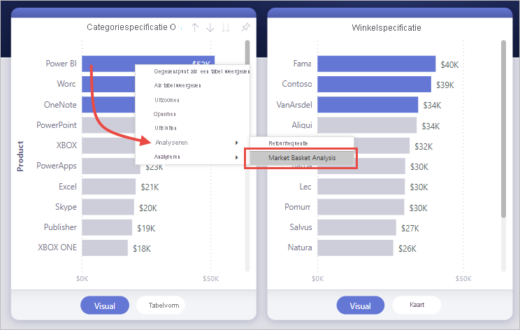
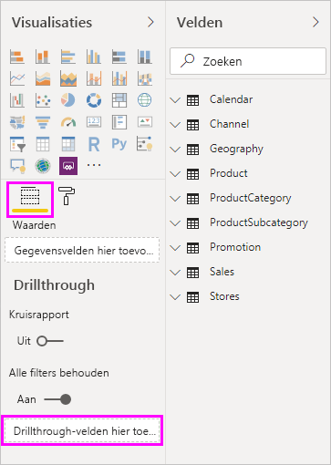
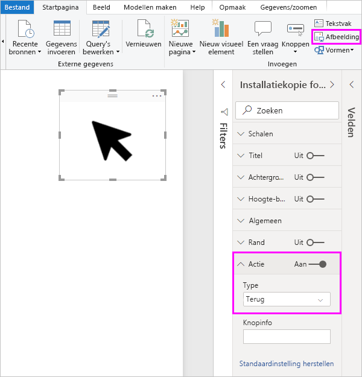
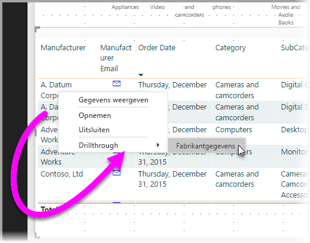
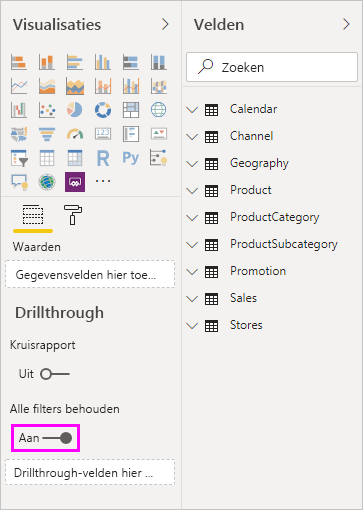
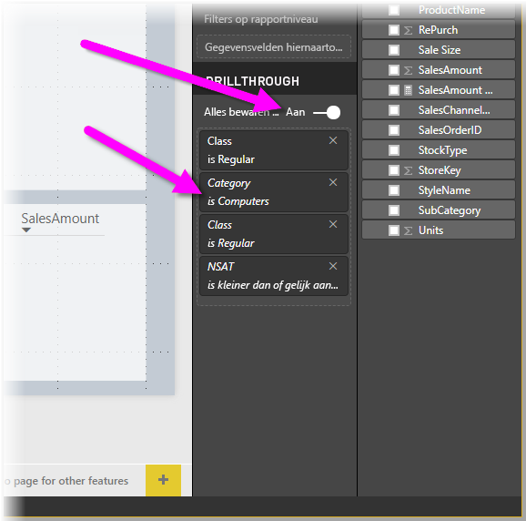
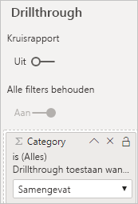

# Analyseren instellen in Power BI-rapporten
Met *analyseren* in Power BI-rapporten kunt u een pagina in uw rapport maken die zich richt op een bepaalde entiteit, zoals een leverancier, klant of fabrikant. Wanneer lezers van uw rapport analyseren gebruiken, klikken ze met de rechtermuisknop op een gegevenspunt in andere rapportpagina's en zoomen ze in op die specifieke pagina voor details die zijn gefilterd op die context. U kunt ook [een knop maken die inzoomt](desktop-drill-through-buttons.md) op details wanneer ze erop klikken.

U kunt analyseren instellen in uw rapporten in Power BI Desktop of de Power BI-service.

## De doelpagina voor de analyse instellen
1. Als u analyseren wilt gebruiken, maakt u een rapportpagina die de gewenste visuals bevat voor het type entiteit waarop u analyses wilt toepassen. 

    Stel dat u wilt analyseren op fabrikanten. U kunt in dat geval een analysepagina maken met visuals die de totale omzet, het totale aantal verzonden eenheden, omzet per categorie of per regio, enzovoort tonen. Als u vervolgens op die pagina inzoomt, ziet u de visuals die specifiek zijn voor de fabrikant die u hebt geselecteerd.

2. Op de gedetailleerde pagina gaat u vervolgens naar de sectie **Velden** van het deelvenster **Visualisaties** en sleept u het veld waarvoor u analyses wilt inschakelen eveneens naar de bron **Analysefilters**.

    

    Als u een veld toevoegt aan de bron **Analysefilters**, wordt in Power BI automatisch de knop *Terug* als visual gemaakt. Deze visual wordt een knop in gepubliceerde rapporten. Gebruikers die uw rapport gebruiken in de Power BI-service, kunnen deze knop gebruiken om naar de rapportpagina terug te gaan van waar ze vandaan komen.

    

> [!IMPORTANT]
> U kunt een drillthrough voor een pagina in hetzelfde rapport configureren en uitvoeren, maar niet voor een pagina in een ander rapport.  

## Uw eigen afbeelding gebruiken voor een knop Terug    
 Omdat de knop Terug een afbeelding is, kunt u de afbeelding van die visual vervangen door elke andere gewenste afbeelding. Deze blijft gewoon werken als de knop Terug, zodat gebruikers van het rapport terug kunnen gaan naar hun oorspronkelijke pagina. 

Als u uw eigen afbeelding wilt gebruiken voor de knop Terug, volgt u deze stappen:

1. Ga naar het tabblad **Start** en selecteer de optie **Afbeelding**. Zoek vervolgens de afbeelding en plaats deze op de analysepagina.

2. Selecteer de nieuwe afbeelding op de analysepagina. In het deelvenster **Afbeelding opmaken** stelt u de schuifregelaar **Actie** in op **Aan** en stelt u het **Type** in op **Terug**. De afbeelding fungeert nu als een knop Terug.

    

    
     Nu kunnen gebruikers met de rechtermuisknop op een gegevenspunt in uw rapport klikken om een contextmenu te openen dat ondersteuning biedt om in te zoomen op die pagina. 

    

    Als rapportgebruikers willen inzoomen, wordt de pagina zo gefilterd dat informatie wordt weergegeven over het gegevenspunt waarop met de rechtermuisknop is geklikt. Stel, de gebruiker heeft met de rechtermuisknop geklikt op een gegevenspunt over Contoso, een fabrikant, en heeft drillthrough geselecteerd. De analysepagina die wordt weergegeven, is gefilterd op Contoso.

## Alle filters in analyse goedkeuren

U kunt alle toegepaste filters doorgeven aan het analysevenster. U kunt bijvoorbeeld alleen een bepaalde categorie van producten selecteren, waarna de visuals worden gefilterd voor die categorie. Daarna kunt u analyseren selecteren. U bent wellicht geïnteresseerd in hoe een analyse eruit ziet wanneer al deze filters worden toegepast.

Als u alle toegepaste filters wilt behouden, gaat u naar de sectie **Analyseren** van het deelvenster **Visualisaties** en stelt u **Alle filters behouden** in op **Aan**. 

Wanneer u drillthrough toepast op een visual, kunt u zien welke filters er zijn toegepast als resultaat van tijdelijke filters die op de bronvisual zijn toegepast. In de sectie **Analyseren** van het deelvenster **Visualisatie** worden deze tijdelijke filters cursief weergegeven. 

U kunt dit doen met tooltips-pagina’s, maar dat zou een vreemde ervaring zijn omdat de tooltip niet correct zou werken. Om deze reden wordt het gebruik van tooltips voor dit doel dus niet aanbevolen.

## Een meting aan analyseren toevoegen

Naast het doorgeven van alle filters aan het analysevenster, kunt u ook een meting (of een samengevatte numerieke kolom) toevoegen aan het analysegebied. Sleep het analyseveld naar de kaart **Analyseren** om het toe te passen. 

Wanneer u een meting of samengevatte numerieke kolom toevoegt, kunt u inzoomen op de pagina als het veld wordt gebruikt in het gebied *Waarde* van een visual.

Meer hoeft u niet te doen om analyses in uw rapporten te gebruiken. Het is een uitstekende manier om een uitgebreid overzicht te krijgen van de entiteitsgegevens die u voor uw analysefilter hebt geselecteerd.

## Volgende stappen

Wellicht bent u ook geïnteresseerd in de volgende artikelen:

* [Analyseren gebruiken voor meerdere rapporten in Power BI-rapporten](desktop-cross-report-drill-through.md)
* [Slicers Power BI Desktop gebruiken](../visuals/power-bi-visualization-slicers.md)
