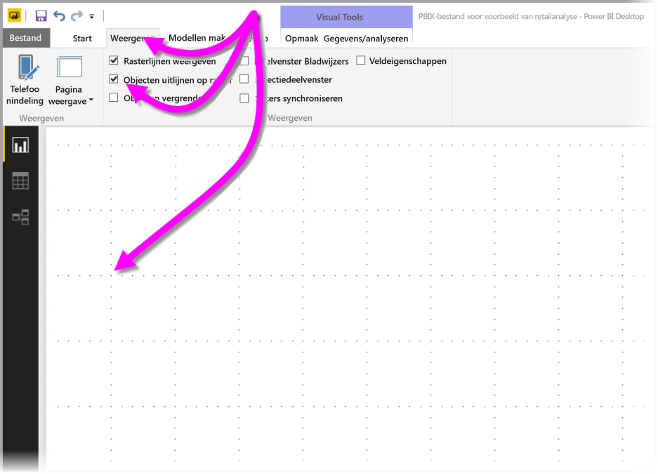
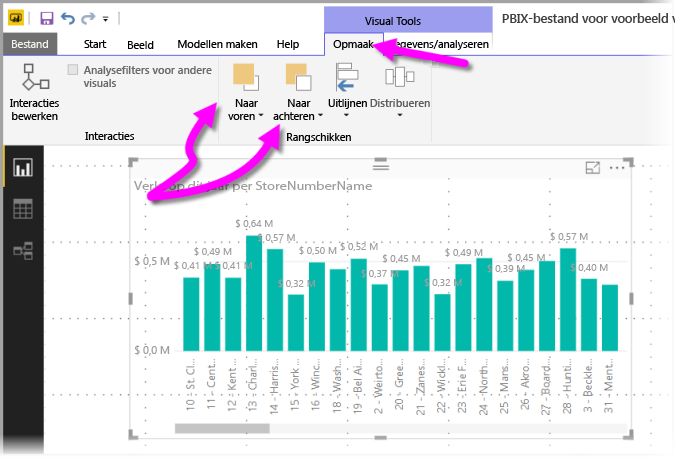
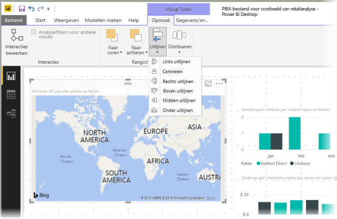
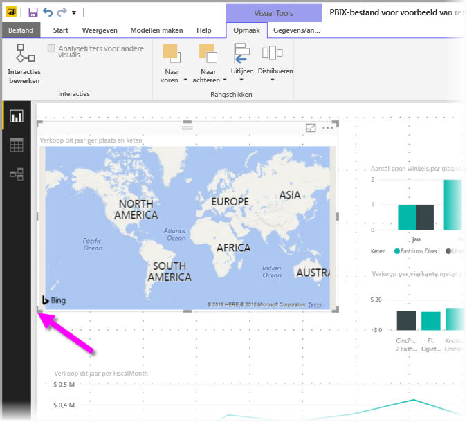
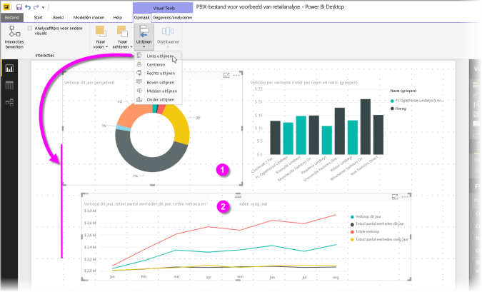

# Rasterlijnen en Uitlijnen op raster gebruiken in Power BI Desktop-rapporten
Op het canvas van het **Power BI Desktop**-rapport vindt u rasterlijnen waarmee u visuals netjes op een rapportpagina kunt uitlijnen en de functie Uitlijnen op raster kunt gebruiken, waarmee u de visuals in uw rapporten op gelijkmatige afstand kunt zetten en ze een professioneel en uitgelijnd uiterlijk geven.

In **Power BI Desktop** kunt u ook de z-volgorde van objecten in een rapport wijzigen (naar voren of naar achteren). U kunt tevens geselecteerde visuals op het canvas uitlijnen of gelijkmatig verdelen.

## Rasterlijnen en Uitlijnen op raster inschakelen
Als u Rasterlijnen en Uitlijnen op raster wilt inschakelen, selecteert u het lint **Weergave** en schakelt u de selectievakjes in bij **Rasterlijnen weergeven** en **Objecten uitlijnen op raster**. U kunt één optie of beide opties inschakelen. Ze werken onafhankelijk van elkaar.

> [!NOTE]
> Als **Rasterlijnen weergeven** en **Objecten uitlijnen op raster** zijn uitgeschakeld, kunt u ze weer inschakelen door verbinding te maken met een gegevensbron.

## Rasterlijnen gebruiken
Rasterlijnen zijn zichtbare hulplijnen waarmee u uw visuals uitlijnt. Wanneer u wilt bepalen of twee (of meer) visuals horizontaal of verticaal zijn uitgelijnd, gebruikt u de rasterlijnen om vast te stellen of de randen zijn uitgelijnd.

Met Ctrl+klik selecteert u meerdere visuals tegelijk. Hiermee worden alle geselecteerde randen van de visuals weergegeven, zodat u kunt zien of de visuals goed zijn uitgelijnd.

### Rasterlijnen binnen visuele elementen gebruiken
In Power BI zijn ook rasterlijnen binnen visuals aanwezig, waarmee u over visuele hulplijnen beschikt voor het vergelijken van gegevenspunten en waarden. Sinds de release van **Power BI Desktop** in september 2017 kunt u rasterlijnen binnen visuele elementen beheren met behulp van de kaarten **X-as** of **Y-as** (te gebruiken afhankelijk van het type visuele element). Deze vindt u in de sectie **Indeling** van het deelvenster **Visualisaties**. U kunt de volgende elementen van rasterlijnen binnen een visueel element beheren:

* Rasterlijnen in- of uitschakelen
* De kleur van rasterlijnen wijzigen
* De streek (breedte) van rasterlijnen aanpassen
* De lijnstijl van de rasterlijnen in het visuele element selecteren, bijvoorbeeld ononderbroken, onderbroken of gestippeld

Het wijzigen van bepaalde elementen van rasterlijnen kan met name handig zijn in rapporten waar een donkere achtergrond voor visuele elementen wordt gebruikt. De volgende afbeelding toont de sectie **Rasterlijnen** in de kaart **Y-as**.

## Uitlijnen op raster gebruiken
Wanneer u **Objecten uitlijnen op raster** inschakelt, worden alle visuele elementen op het **Power BI Desktop**-canvas die u verplaatst (of van grootte verandert) automatisch uitgelijnd met de meest nabije rasteras. Hierdoor kunt u veel makkelijker zien of twee of meer visuele elementen zijn uitgelijnd met dezelfde horizontale of verticale locatie (of grootte).

Meer hebt u niet nodig als u **Rasterlijnen** en **Objecten uitlijnen op raster** wilt gebruiken om ervoor te zorgen dat de visuals in uw rapporten netjes zijn uitgelijnd.

## Z-volgorde, Uitlijnen en Verdelen gebruiken
U kunt de volgorde beheren waarin visuals van voor naar achteren in een rapport worden weergegeven. Dit wordt de *Z-volgorde* van de elementen genoemd. Met deze functie kunt u visuals elkaar in een willekeurige volgorde laten overlappen, waarna u de volgorde van voor naar achteren kunt aanpassen. De volgorde van de visuals stelt u in met de knoppen **Naar voren** and **Naar achteren** in de sectie **Schikken** van het lint **Indeling**. Het lint **Indeling** wordt weergegeven zodra u een of meer visuals op de pagina selecteert.

Met het lint **Indeling** kunt u uw visuals op veel verschillende manieren uitlijnen. Zo zorgt u ervoor dat de visuals op de beste manier op de pagina worden weergegeven.

Met de knop **Uitlijnen** lijnt u een geselecteerde visual uit met de rand (of het midden) van het rapportcanvas, zoals weergegeven in de volgende afbeelding.

Als u twee of meer visuals hebt geselecteerd, worden ze samen uitgelijnd en wordt de bestaande, uitgelijnde grens van de visuals voor de uitlijning hiervan gebruikt. Als u bijvoorbeeld twee visuals hebt geselecteerd en de knop **Links uitlijnen** selecteert, worden de visuals uitgelijnd met de meest linkse begrenzing van alle geselecteerde visuals.

U kunt uw visuele elementen ook gelijkmatig over het rapportcanvas verdelen, zowel verticaal als horizontaal. Gebruik hiervoor de knop **Verdelen** op het lint **Indeling**.

Met slechts enkele selecties van deze hulpmiddelen kunt u uw rapporten er naar eigen wens laten uitzien.

