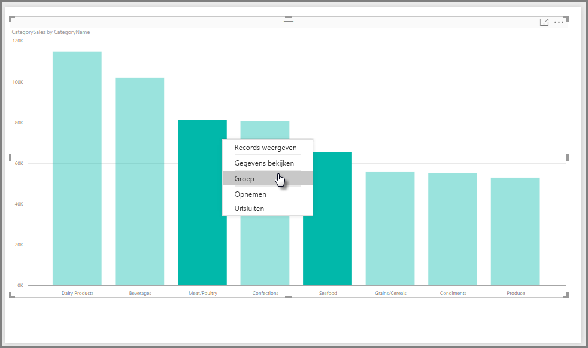
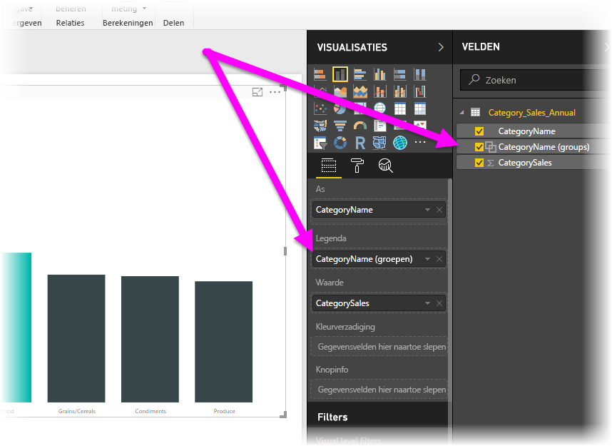
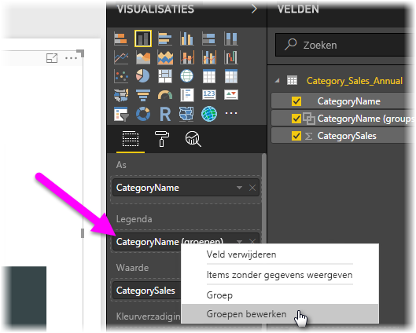
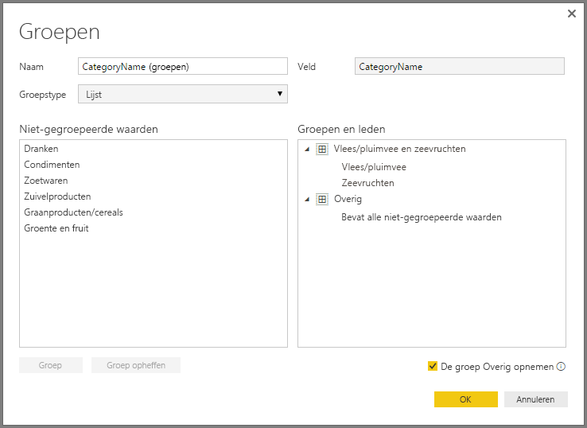
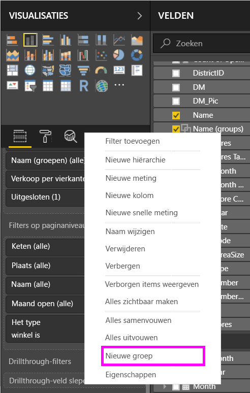
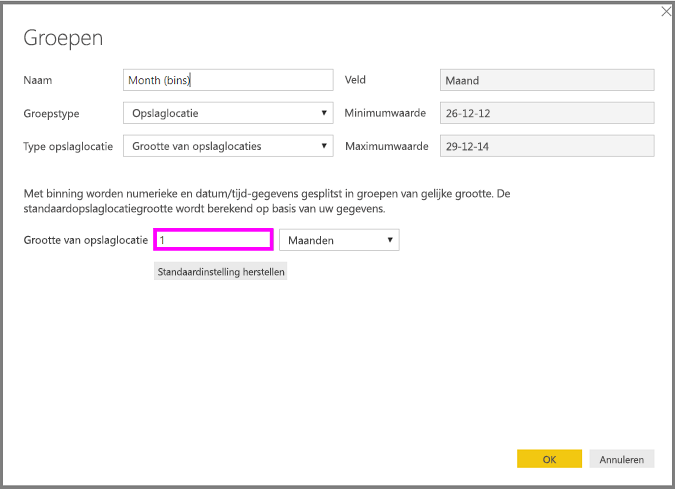
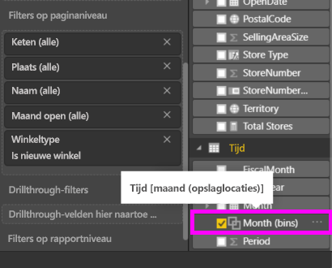

# Groeperen en binning in Power BI Desktop gebruiken
Als in Power BI Desktop visuals worden gemaakt, worden uw gegevens in segmenten (of groepen) geaggregeerd op basis van waarden die in de onderliggende gegevens worden aangetroffen. Dat gaat vaak goed, maar het kan voorkomen dat u de manier waarop deze segmenten worden gepresenteerd, wilt verfijnen. Stel dat u drie categorieën met producten in één grotere categorie wilt onderbrengen (één *groep*). Of u wilt bijvoorbeeld verkoopcijfers zien in groepen van 1.000.000 euro in plaats van in delen van 923.983 euro.

In Power BI Desktop kunt u gegevenspunten *groeperen*, zodat u gegevens en trends in uw visuele elementen beter kunt weergeven, analyseren en onderzoeken. U kunt ook de *grootte van de opslaglocatie* definiëren, zodat u waarden in groepen van gelijke grootte kunt plaatsen. Op die manier kunt u uw gegevens beter en zinvoller visualiseren. Deze actie wordt vaak *binning* genoemd.

## Groeperen
Als u groeperen wilt gebruiken, selecteert u twee of meer elementen van een visual. Gebruik Ctrl+klikken om meerdere elementen te selecteren. Klik vervolgens met de rechtermuisknop op een van de elementen voor meervoudige selectie en kies **Groeperen** in het snelmenu.

Zodra de groep is gemaakt, wordt deze toegevoegd aan de bucket **Legenda** voor de visual. De groep wordt ook weergegeven in de lijst **Velden**.

Zodra u een groep hebt, kunt u de leden van die groep eenvoudig bewerken. Klik met de rechtermuisknop op het veld in de bucket **Legenda** of in de lijst **Velden** en kies vervolgens **Groepen bewerken**.

In het dialoogvenster **Groepen** kunt u nieuwe groepen maken of bestaande groepen aanpassen. U kunt ook *de naam wijzigen* van elke groep. Dubbelklik in het vak **Groepen en leden** op de groepstitel en voer een nieuwe naam in.

U kunt verschillende dingen met groepen doen. U kunt items aan een nieuwe of een bestaande groep toevoegen vanuit de lijst **Niet-gegroepeerde waarden**. Als u een nieuwe groep wilt maken, selecteert u twee of meer items (met Ctrl+klikken) in het vak **Niet-gegroepeerde waarden** en klikt u op de knop **Groeperen** onder dat vak.

U kunt een niet-gegroepeerde waarde aan een bestaande groep toevoegen. Selecteer hiervoor een van de **Niet-gegroepeerde waarden**, selecteer vervolgens de bestaande groep waaraan u de waarde wilt toevoegen en klik op de knop **Groeperen**. Als u een item uit een groep wilt verwijderen, selecteert u het in het vak **Groepen en leden** en klikt u vervolgens op **Groep opheffen**. U kunt de niet-gegroepeerde categorieën ook verplaatsen naar de groep **Andere** of de categorieën niet groeperen.

> [!NOTE]
> U kunt groepen maken voor elk veld in het veld **Velden**, zonder dat u meerdere items voor een bestaande visual hoeft te selecteren. Klik met de rechtermuisknop in het veld en selecteer **Nieuwe groep** in het menu dat wordt weergegeven.

## Binning
In **Power BI Desktop** kunt u de grootte van de opslaglocatie voor numerieke en tijdvelden instellen. U kunt binning gebruiken om de gegevens die in Power BI Desktop worden weergegeven de juiste grootte te geven.

Als u een opslaglocatie een bepaalde grootte wilt geven, klikt u met de rechtermuisknop op een **veld** en selecteert u **Nieuwe groep**.

Stel in het dialoogvenster **Groepen** de optie **Grootte van opslaglocatie** in op de gewenste grootte.

Als u **OK** selecteert, ziet u dat er in het deelvenster **Velden** een nieuw veld verschijnt, waaraan **(opslaglocaties)** is toegevoegd. Vervolgens kunt u dit veld naar het canvas slepen om de grootte van de opslaglocatie in een visueel element te gebruiken.

Bekijk deze *video* als u wilt zien hoe [binning](https://www.youtube.com/watch?v=BRvdZSfO0DY) werkt.

Dat is alles wat u moet weten over *binning* en *groeperen* om ervoor te zorgen dat de visuele elementen in uw rapport uw gegevens weergeven zoals u dat wilt.
