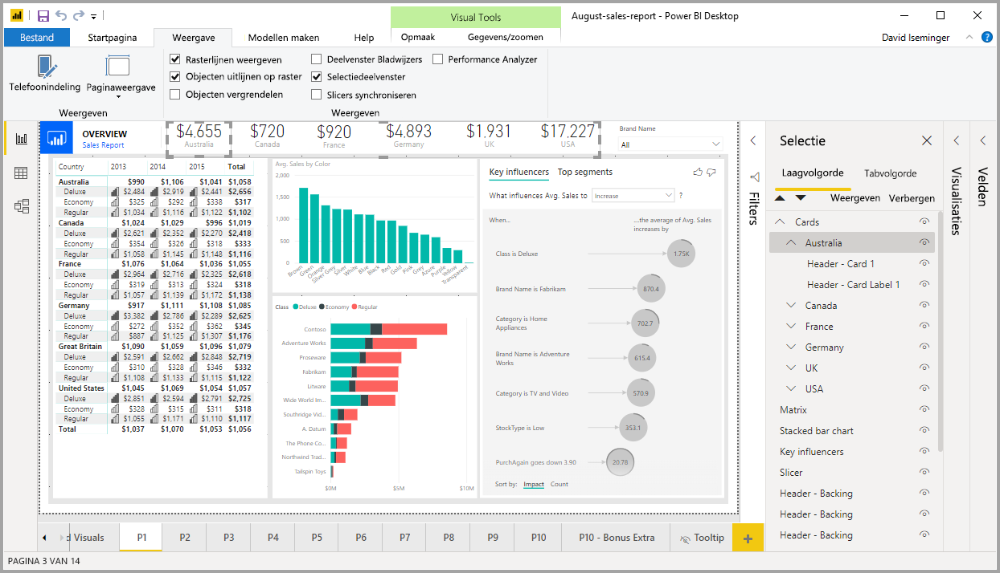
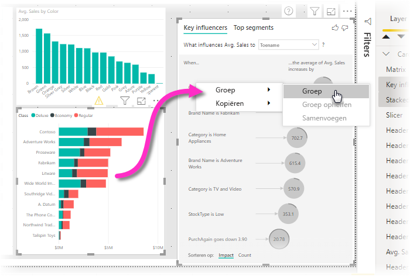
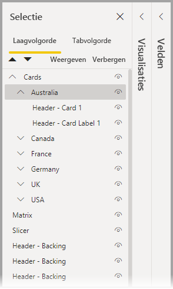
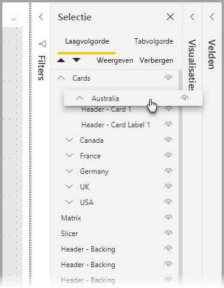
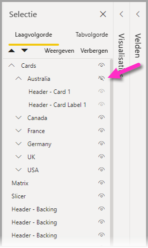
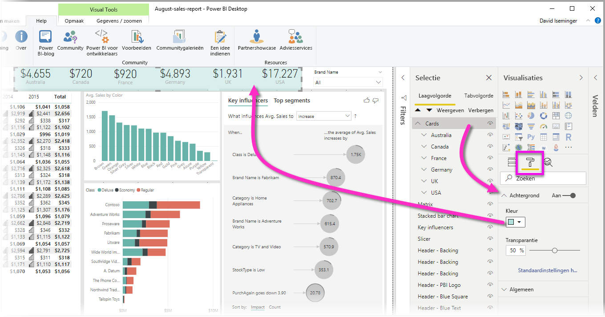

# Visuals groeperen in Power BI Desktop-rapporten
Met **groeperen** in **Power BI Desktop** kunt u visuals in uw rapport groeperen, zoals knoppen, tekstvakken, vormafbeeldingen en andere visual die u maakt, net zoals u items in PowerPoint zou groeperen. Door visuals in een rapport te groeperen, kunt u de groep als één object behandelen, zodat u eenvoudiger, sneller en intuïtiever lagen in uw rapport kunt verplaatsen en gebruiken en de grootte ervan kunt aanpassen.

## Groepen maken

Als u een groep visuals in Power BI Desktop wilt maken, selecteert u de eerste visual vanuit het canvas. Houd dan de CTRL-knop ingedrukt, klik op een of meer extra visuals die u in de groep wilt plaatsen en klik vervolgens met de rechtermuisknop op de verzameling visuals en selecteer **Groep** in het menu dat wordt weergeven.

Groepen worden weergegeven in het deelvenster **Selectie**. U kunt zoveel groepen met visuals maken als u voor uw rapport nodig hebt en u kunt ook groepen met visuals nesten. In de volgende afbeelding is de groep *Australië* genest onder de groep *Kaarten*. U kunt een groep uitvouwen door de caret naast de groepsnaam te selecteren en samenvouwen door nogmaals de caret te selecteren. 

In het deelvenster **Selectie** kunt u ook afzonderlijke visuals slepen en neerzetten om ze in een groep te plaatsen, ze uit een groep te verwijderen, een groep te nesten of een groep of afzonderlijke visual uit een nest te verwijderen. U hoeft de visual die wilt aanpassen alleen maar naar de gewenste locatie te verslepen. Het aanbrengen van lagen in visuals wordt, indien ze overlappen, bepaald door hun volgorde in de lijst *Laagvolgorde*.

Als u een groep wilt opheffen, selecteert u de groep, klikt u met de rechtermuisknop en selecteert u **Groep opheffen** in het menu dat wordt weergeven.

## Visuals of groepen verbergen en weergeven

U kunt groepen eenvoudig verbergen of weergeven met behulp van het deelvenster **Selectie**. Als u een groep wilt verbergen, selecteert u de oogknop naast de groepsnaam (of van een afzonderlijke visual) om te wisselen tussen het verbergen en weergeven van de visual of groep. In de volgende afbeelding is de groep *Australië* verborgen en de rest van de groepen die in de groep *Kaarten* is genest, wordt weergegeven.

Wanneer u een groep verbergt, worden alle visuals in die groep verborgen, wat wordt aangegeven doordat hun oogknop grijs wordt weergegeven (niet beschikbaar om te wisselen, omdat de hele groep wordt verborgen). Als u slechts bepaalde visuals in een groep wilt verbergen, wisselt u de oogknop naast die visual; alleen die visual in de groep wordt dan verborgen.

## Visuals in een groep selecteren

Er zijn een aantal manieren om te navigeren en items in een groep met visuals te selecteren. In de volgende lijst wordt het gedrag beschreven:

* Als u op een lege ruimte in een groep klikt (zoals een spatie tussen visuals), wordt er niets geselecteerd
* Als u op een visual in een groep klikt, wordt de hele groep geselecteerd. Als u nogmaals klikt, wordt de afzonderlijke visual geselecteerd
* Als u een groep en vervolgens nog een object op het rapportcanvas selecteert en daarna **Groep** in het contextmenu selecteert, wordt een geneste groep gemaakt
* Als u twee groepen selecteert en vervolgens op de rechtermuisknop klikt, wordt een optie weergegeven om de geselecteerde groepen samen te voegen in plaats van ze te nesten

## Een achtergrondkleur toepassen

U kunt ook een achtergrondkleur op een groep toepassen met behulp van de sectie **Opmaak** van het deelvenster **Visualisaties** (zie de volgende afbeelding). 

Zodra u een achtergrondkleur toepast en op de ruimte tussen visuals in de groep klikt, wordt de groep geselecteerd (vergelijk dit met klikken op de ruimte tussen visuals in een groep, waarmee de groep niet wordt geselecteerd). 

## Volgende stappen
Raadpleeg de volgende video voor meer informatie over groeperen:

* [Groeperen in Power BI Desktop - video](https://youtu.be/sf4n7VXoQHY?t=10)

Wellicht bent u ook geïnteresseerd in de volgende artikelen:

* [Drillthrough voor meerdere rapporten gebruiken in Power BI Desktop](desktop-cross-report-drill-through.md)
* [Slicers Power BI Desktop gebruiken](../visuals/power-bi-visualization-slicers.md)
