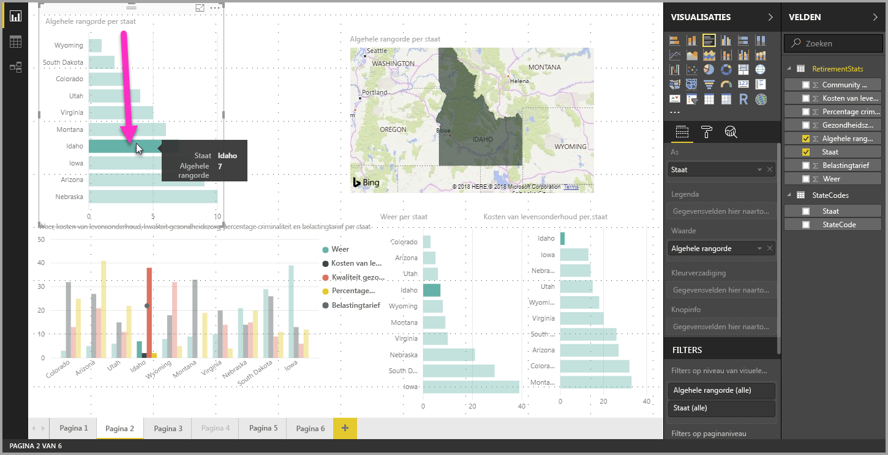
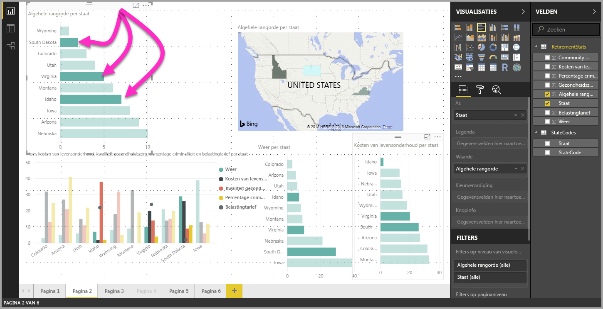

# Meerdere gegevenselementen, gegevenspunten en visuals selecteren in Power BI Desktop

U kunt meerdere gegevenselementen selecteren in één visual, meerdere gegevenspunten in een visual of meerdere visuals in een rapport met behulp van Power BI Desktop. In de volgende gedeelten worden deze mogelijkheden beschreven.

## Meerdere gegevenspunten selecteren

In Power BI Desktop kunt u een gegevenspunt in een visual markeren door op het gegevenspunt in de visual te klikken. Bijvoorbeeld als u een belangrijke balk of een belangrijk grafiekelement hebt en u wilt dat andere visuals op de rapportpagina gegevens markeren op basis van uw selectie. Dan kunt u op het gegevenselement in één visual klikken, waarna de resultaten in andere visuals op de pagina worden weergegeven. Dit is markering met standaardselectie, oftewel enkelvoudige selectie. De volgende afbeelding toont een standaardselectie. 

Met meervoudige selectie kunt u nu meer dan één gegevenspunt selecteren op uw **Power BI Desktop**-rapportpagina en de resultaten markeren in alle visuals op de pagina. Dit is vergelijkbaar met een **en**-instructie, of -functionaliteit, zoals 'resultaten markeren voor Idaho **en** Virginia'. Als u meerdere gegevenspunten wilt selecteren in visuals, houdt u **Ctrl ingedrukt en klikt** u om meerdere gegevenspunten te selecteren. Op de volgende afbeelding ziet u dat er **meerdere gegevenspunten** zijn geselecteerd (meervoudige selectie).

Deze functie lijkt misschien eenvoudig, maar biedt wel allerlei mogelijkheden voor het maken en delen van rapporten en voor interactie met rapporten. 

## Meerdere elementen selecteren met behulp van een selectierechthoek (preview)

U kunt meerdere gegevenselementen selecteren in een visual, of meerdere visuals in een rapport, met behulp van een selectierechthoek. Dit wordt ook wel *gegevenspuntlasso selecteren* genoemd. 

### Meerdere visuals op het canvas selecteren

Selecteer meerdere visuals en andere rapportelementen door op het canvas te klikken en vervolgens te slepen om een rechthoekige lasso te maken. Alle visuals die volledig worden omsloten door de lasso, worden geselecteerd. Als u op de toets *Ctrl* of *Shift* drukt (voor meervoudige selectie door Ctrl ingedrukt te houden terwijl u op afzonderlijke visuals klikt), voegt u met verdere lassoselecties visuals toe aan de huidige meervoudige selectie. 

Als er al een visual is geselecteerd en door een lasso is omsloten, kunt u die selectie met *Ctrl* of *Shift* in en uitschakelen. De lasso selecteert geen losse visuals in groepen, maar kan groepen selecteren door de hele groep te omsluiten.

Het canvas schuift niet automatisch mee met de rechthoekige lassoselectie. 

### Meerdere gegevenspunten selecteren in een visual

U kunt meerdere gegevenspunten in een visual selecteren met behulp van dezelfde stappen voor het maken van een rechthoekige lasso. Houd de *Ctrl*-toets ingedrukt terwijl u binnen een visual sleept om meerdere gegevenspunten te selecteren. Wanneer u de muisknop loslaat, worden alle punten die overlappen met de selectierechthoek geselecteerd. Eventuele eerdere lassoselecties blijven ook behouden. Als u met de lasso een gebied selecteert dat eerder geselecteerde punten bevat en u *Ctrl* indrukt tijdens het selecteren, wordt de selectie van deze gegevenspunten ongedaan gemaakt. Het gebruik van de lasso heeft hetzelfde effect als het klikken op elk afzonderlijk punt met *Ctrl* ingedrukt. 

Wanneer u de *Shift*-toets gebruikt tijdens het maken van een lasso, blijven eerdere selecties behouden en blijven al geselecteerde gegevenspunten geselecteerd. Als u *Shift* dus gebruikt tijdens het maken van een lassoselectie, worden er alleen gegevenspunten aan uw selectie toegevoegd. Er worden dan geen gegevenspunten in het geselecteerde gebied in- of uitgeschakeld.

U kunt de huidige selectie wissen door te klikken op een lege ruimte in het tekengebied zonder een toets in te drukken.

Ga voor meer informatie naar het [blogbericht over de release van deze functie](https://powerbi.microsoft.com/blog/power-bi-desktop-august-2020-feature-summary/#_Data_point).

Er gelden enkele beperkingen en overwegingen voor het selecteren van meerdere gegevenspunten binnen een visual:

* Lijn-, vlak- en spreidingsdiagrammen, treemaps en kaarten ondersteunen lassoselectie
* Het maximum aantal gegevenspunten dat u tegelijk kunt selecteren is 300
* Wanneer u een rapport bekijkt in de Power BI-service, wordt rechthoekselectie alleen ingeschakeld als de lassofunctie was ingeschakeld toen het rapport werd opgeslagen en gepubliceerd

## Volgende stappen

Wellicht bent u ook geïnteresseerd in de volgende artikelen:

* [Rasterlijnen en Uitlijnen op raster gebruiken in Power BI Desktop-rapporten](desktop-gridlines-snap-to-grid.md)
* [Over filters en markeren in Power BI-rapporten](power-bi-reports-filters-and-highlighting.md)

