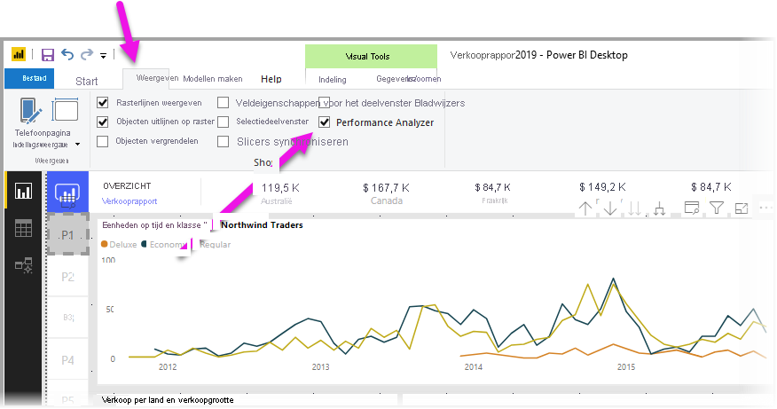
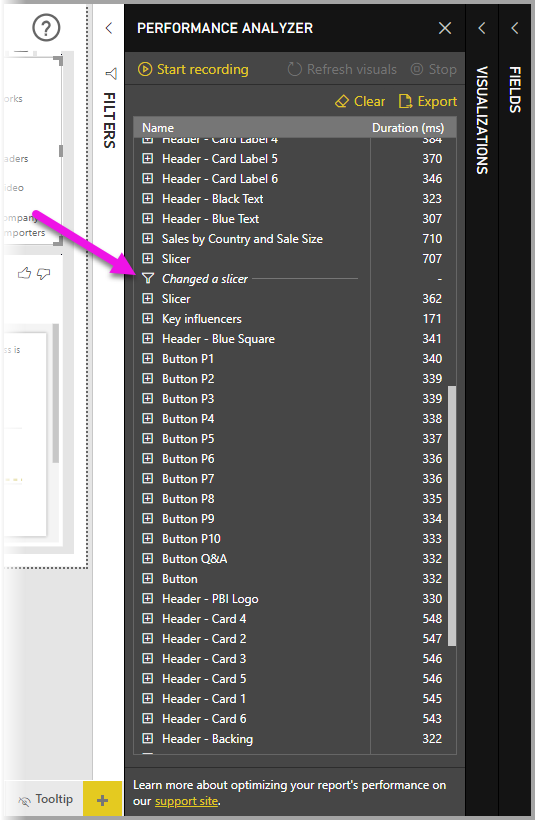

# Performance Analyzer gebruiken om prestaties van rapportelementen te onderzoeken

In **Power BI Desktop** kunt u zien hoe elk van de rapportelementen, zoals visuals en DAX-formules, worden uitgevoerd. Met de **Performance Analyzer** kunt u logboeken weergeven en vastleggen die meten hoe elk van uw rapportelementen wordt uitgevoerd wanneer gebruikers ermee communiceren, en welke aspecten van de prestaties het meest (of minst) resource-intensief zijn.

Performance Analyzer inspecteert en geeft de duur weer die nodig is voor het bijwerken of vernieuwen van alle visuals die door de gebruikersinteracties zijn gestart, en geeft de informatie weer zodat u de resultaten kunt bekijken, exporteren of erop kunt inzoomen. Met Performance Analyzer kunt u visuele elementen identificeren die van invloed zijn op de prestaties van uw rapporten en de reden hiervan achterhalen.

## Het deelvenster Performance Analyzer weergeven

Selecteer in **Power BI Desktop** het lint **Beeld**. In het gebied **Tonen** van het lint **Beeld** kunt u het selectievakje naast **Performance Analyzer** selecteren om het deelvenster Performance Analyzer weer te geven.

Zodra de Performance Analyzer is geselecteerd, wordt deze weergegeven in een eigen deelvenster, rechts van het rapportcanvas.

## Performance Analyzer gebruiken

Met Performance Analyzer wordt de verwerkingstijd gemeten (inclusief de tijd voor het maken of bijwerken van een visual) die nodig is om rapportelementen bij te werken die zijn gestart als gevolg van een gebruikersinteractie die resulteert in het uitvoeren van een query. Als u bijvoorbeeld een slicer aanpast, moet de slicer visueel worden gewijzigd, moet een query worden verzonden naar het gegevensmodel en moeten de betrokken visuals worden bijgewerkt als gevolg van de nieuwe instellingen. 

Als u wilt dat Performance Analyzer begint met opnemen, selecteert u **Beginnen met het vastleggen van gegevens**

Acties die u in het rapport uitvoert, worden weergegeven en vastgelegd in het deelvenster Performance Analyzer, in de volgorde waarin de visual is geladen door Power BI. Mogelijk hebt u bijvoorbeeld een rapport dat volgens gebruikers lang duurt om te vernieuwen. Of het duurt lang voordat bepaalde visuals in een rapport worden weergegeven wanneer een schuifregelaar wordt aangepast. Met de Performance Analyzer kunt u zien welke visual hiervoor verantwoordelijk is, en wordt geïdentificeerd welke aspecten van de visual het langst duren om te verwerken. 

Zodra u het vastleggen van gegevens hebt gestart, wordt de knop **Beginnen met het vastleggen van gegevens** grijs weergegeven (inactief omdat u bent gestart met het vastleggen van gegevens) en is de knop **Stoppen** actief. 

De prestatiemetinggegevens worden in realtime door Performance Analyzer verzameld en weergegeven. Telkens wanneer u op een visual klikt, een slicer verplaatst of op een andere manier communiceert, worden de prestatieresultaten direct weergegeven in het deelvenster van Performance Analyzer.

Als het deelvenster meer informatie bevat dan kan worden weergegeven, verschijnt er een schuifbalk om naar aanvullende informatie te navigeren.

Elke interactie heeft een sectie-id in het deelvenster, met een beschrijving van de actie die aanleiding heeft gegeven tot de logboekvermeldingen. Op de volgende afbeelding bestaat de interactie uit het wijzigen van een slicer door een gebruiker.

De logboekgegevens van elke visual bevatten de tijd die is besteed (duur) aan het voltooien van de volgende categorieën taken:

* **DAX-query**: als een DAX-query vereist is, is dit de tijd tussen de visual die de query verzendt en het retourneren van de resultaten door Analysis Services.
* **Weergave van visual**: de tijd die nodig is om de visual op het scherm te tekenen, inclusief de tijd die nodig is om webafbeeldingen of geocodering op te halen. 
* **Overig**: de tijd die de visual nodig heeft om query's voor te bereiden, te wachten tot andere visuals zijn voltooid of een verwerking op de achtergrond uit te voeren.

De waarden voor **Duur (ms)** geven het verschil aan tussen het tijdstempel van de *begintijd* en *eindtijd* van elke bewerking. De meeste canvasbewerkingen en visuals worden sequentieel uitgevoerd op één gebruikersinterfacethread, die wordt gedeeld door meerdere bewerkingen. De gerapporteerde duur omvat ook de tijdsduur in de wachtrij tijdens de uitvoering van andere bewerkingen. Het [Performance Analyzer-voorbeeld](https://github.com/microsoft/powerbi-desktop-samples/tree/master/Performance%20Analyzer) op GitHub en de bijbehorende [documentatie](https://github.com/microsoft/powerbi-desktop-samples/blob/master/Performance%20Analyzer/Power%20BI%20Performance%20Analyzer%20Export%20File%20Format.docx) biedt informatie over hoe in visuals gegevens worden opgevraagd en hoe deze worden weergegeven.

Nadat u hebt gecommuniceerd met elementen van het rapport dat u wilt meten met Performance Analyzer, kunt u de knop **Stoppen** selecteren. De informatie over prestaties blijft in het deelvenster aanwezig nadat u **Stoppen** hebt geselecteerd, zodat u de informatie kunt analyseren.

Als u de gegevens in het deelvenster Performance Analyzer wilt wissen, selecteert u **Wissen**. Wanneer u **Wissen** selecteert, worden alle gegevens gewist en worden deze niet opgeslagen. Zie de volgende sectie voor informatie over het opslaan van gegevens in logboeken. 

## Visuals vernieuwen

U kunt **Visuals vernieuwen** selecteren in het deelvenster Performance Analyzer om alle visuals op de huidige pagina van het rapport te vernieuwen, en daarmee Performance Analyzer informatie over al deze visuals te laten verzamelen.

U kunt ook afzonderlijke visuals vernieuwen. Wanneer Performance Analyzer bezig is met het vastleggen van gegevens, kunt u **Deze visual vernieuwen** selecteren in de rechterbovenhoek van elke visual om die visual te vernieuwen en de prestatiegegevens ervan vast te leggen.

## Prestatiegegevens opslaan

U kunt de informatie die wordt gemaakt door de Performance Analyzer over een rapport opslaan door de knop **Exporteren** te selecteren. Als u **Exporteren** selecteert, wordt een JSON-bestand met informatie uit het deelvenster Performance Analyzer gemaakt. 

## Volgende stappen
Lees de volgende artikelen voor meer informatie over **Power BI Desktop** en hoe u aan de slag kunt.

* [Wat is Power BI Desktop?](../fundamentals/desktop-what-is-desktop.md)
* [Queryoverzicht met Power BI Desktop](../transform-model/desktop-query-overview.md)
* [Gegevensbronnen in Power BI Desktop](../connect-data/desktop-data-sources.md)
* [Connect to Data in Power BI Desktop](../connect-data/desktop-connect-to-data.md) (Verbinding maken met gegevens in Power BI Desktop)
* [Gegevens vormgeven en combineren met Power BI Desktop](../connect-data/desktop-shape-and-combine-data.md)
* [Algemene querytaken in Power BI Desktop](../transform-model/desktop-common-query-tasks.md)   

Bekijk de volgende resources voor meer informatie over het Performance Analyzer-voorbeeld.

* [Performance Analyzer-voorbeeld](https://github.com/microsoft/powerbi-desktop-samples/tree/master/Performance%20Analyzer)
* [Documentatie voor het Performance Analyzer-voorbeeld](https://github.com/microsoft/powerbi-desktop-samples/blob/master/Performance%20Analyzer/Power%20BI%20Performance%20Analyzer%20Export%20File%20Format.docx)
