# <a name="use-r-powered-power-bi-visuals-in-power-bi"></a>Met R gemaakte Power BI-visuals gebruiken in Power BI

In **Power BI Desktop** en de **Power BI-service** kunt u met R gemaakte Power BI-visuals gebruiken zonder enige kennis van R en zonder R-scripts te gebruiken. Zo kunt u gebruikmaken van de krachtige visuele analyse-elementen van R, en R-scripts, zonder R te hoeven leren of zelf te moeten programmeren.

Als u met R gemaakte Power BI-visuals wilt gebruiken, selecteert en downloadt u eerst de aangepaste R-visual die u wilt gebruiken vanuit de [**AppSource**](https://appsource.microsoft.com/marketplace/apps?product=power-bi-visuals&page=1)-galerie met **Power BI-visuals** voor Power BI.

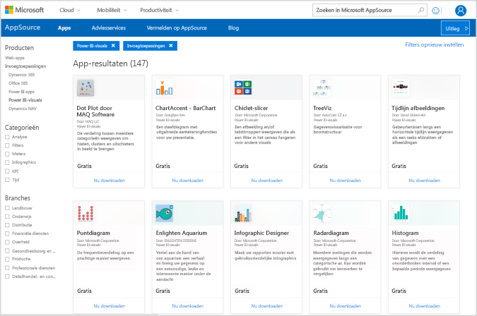

In de volgende secties wordt beschreven hoe u met R gemaakte visuele elementen kunt selecteren, laden en gebruiken in **Power BI Desktop**.

## <a name="use-r-power-bi-visuals"></a>Met R gemaakte Power BI-visuals gebruiken

Als u met R gemaakte Power BI-visuals wilt gebruiken, downloadt u deze uit de bibliotheek met **Power BI-visuals**. Vervolgens kunt u de visuals gebruiken zoals elk ander type visual in **Power BI Desktop**. Er zijn twee manieren om Power BI-visuals op te halen: u kunt ze downloaden van de **AppSource**-website of zoeken en ophalen in **Power BI Desktop**. 

### <a name="get-power-bi-visuals-from-appsource"></a>Power BI-visuals ophalen in AppSource

Hieronder worden de stappen beschreven voor het bladeren en selecteren van visuals van de website van **AppSource**:

1. Navigeer naar de bibliotheek met visuals voor Power BI op [https://appsource.microsoft.com](https://appsource.microsoft.com/). Schakel het selectievakje *Power BI-apps* onder *Verfijnen op product* in, en selecteer de koppeling **Alles weergeven**.

   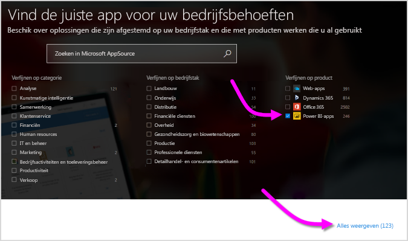

2. Selecteer op de pagina [Power BI-visuals](https://appsource.microsoft.com/marketplace/apps?product=power-bi-visuals&page=1) de optie **Power BI-visuals** in de lijst met invoegtoepassingen in het linkerdeelvenster.

   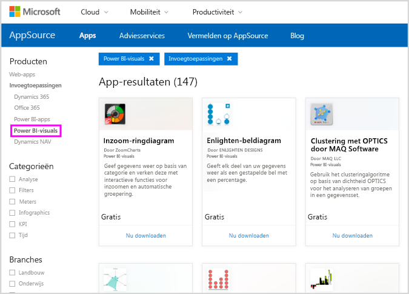

3. Selecteer het gewenste **visuele element** in de galerie. Er wordt een pagina weergegeven met een beschrijving van het visuele element. Selecteer de knop **Nu downloaden** om het element te downloaden.

   > [!NOTE]
    > Om te kunnen ontwerpen in **Power BI Desktop**, moet R zijn geïnstalleerd op uw lokale computer. Maar om een met R gemaakte visual in de **Power BI-service** te bekijken, hoeft R niet lokaal geïnstalleerd te zijn.

   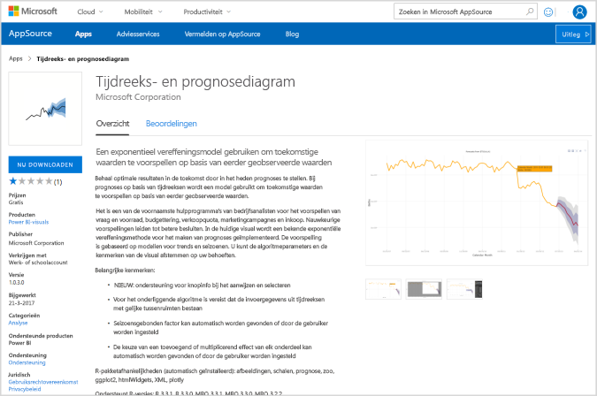

   U hoeft R niet te installeren om met R gemaakte Power BI-visuals te kunnen gebruiken in de **Power BI-service**. Als u echter met R gemaakte Power BI-visuals wilt gebruiken in **Power BI Desktop**, *moet* u R installeren op uw lokale computer. U kunt R downloaden van de volgende websites:

   * [CRAN](https://cran.r-project.org/)
   * [MRO](https://mran.microsoft.com/)

4. Nadat u de visual hebt gedownload (zoals bij elk ander bestand dat u downloadt in uw browser), gaat u naar **Power BI Desktop** en klikt u op **Meer opties** (...) in het deelvenster **Visualisaties**. Vervolgens selecteert u **Importeren vanuit bestand**.

   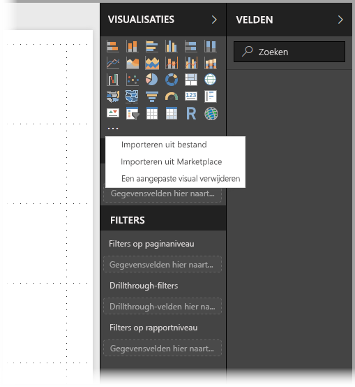
5. Er wordt een waarschuwing weergegeven voor het importeren van een aangepaste visual, zoals wordt weergegeven in de volgende afbeelding:

   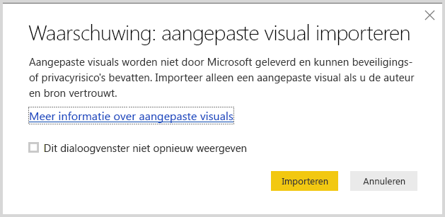
6. Navigeer naar de locatie waar het bestand van het visuele element is opgeslagen en selecteer het bestand. Aangepaste visuele elementen hebben de extensie .pbiviz in **Power BI Desktop**.

   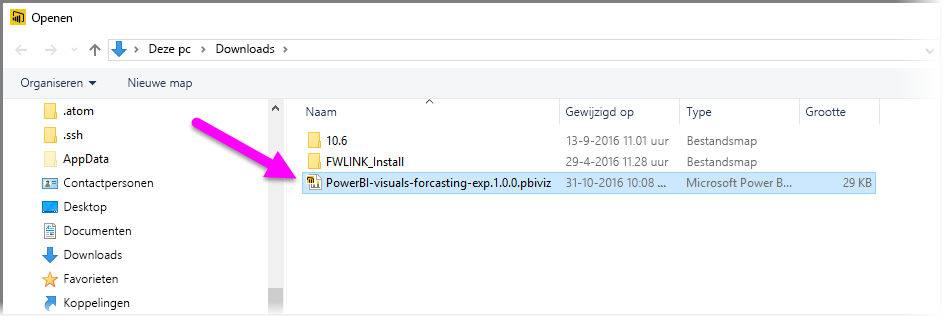
7. Wanneer u terug gaat naar Power BI Desktop, kunt u het nieuwe visuele element zien in het deelvenster **Visualisaties**.

   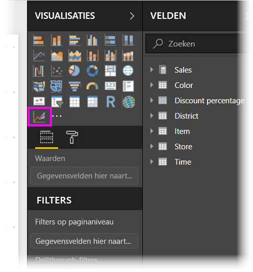
8. Wanneer u de nieuwe visual importeert (of een rapport opent dat een met R gemaakte aangepaste visual bevat), worden de vereiste R-pakketten in **Power BI Desktop** geïnstalleerd.

   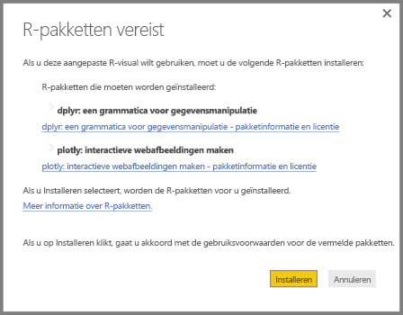

9. Vervolgens kunt u in **Power BI Desktop** gegevens aan het visuele element toevoegen, net zoals bij elk ander visueel element in Power BI Desktop. Als u klaar bent, kunt u het voltooide visuele element weergeven op het canvas. In het volgende voorbeeld is het met R gemaakte visuele element **Forecasting** (prognose) gebruikt in combinatie met het visuele element aan de linkerkant, de verwachte geboortecijfers van de Verenigde Naties (VN).

    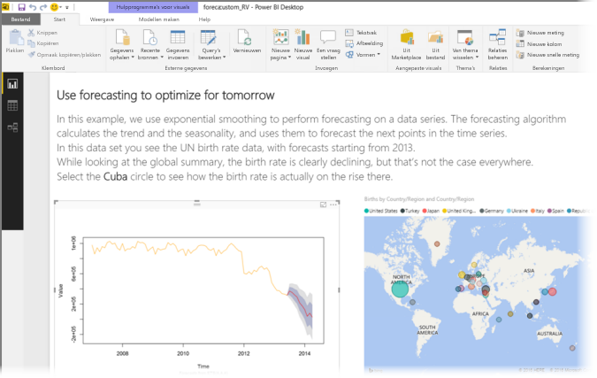

    Zoals bij elk ander visueel element in **Power BI Desktop**, kunt u dit rapport, inclusief de met R gemaakte visuele elementen, naar de **Power BI-service** publiceren en met anderen delen.

    Bezoek de bibliotheek regelmatig, want er worden voortdurend nieuwe visuele elementen aan toegevoegd.

### <a name="get-power-bi-visuals-from-within-power-bi-desktop"></a>Power BI-visuals ophalen vanuit **Power BI Desktop**

1. U kunt ook Power BI-visuals ophalen vanuit **Power BI Desktop**. Klik in **Power BI Desktop** op het beletselteken (...) in het deelvenster **Visualisaties** en selecteer **Importeren van marketplace**.

   

2. Het dialoogvenster **Power BI-visuals** wordt weergegeven. In dit dialoogvenster kunt u door de lijst met beschikbare Power BI-visuals bladeren en de gewenste visual selecteren. U kunt zoeken op naam, een categorie selecteren, of gewoon bladeren in de lijst met beschikbare visuals. Wanneer u klaar bent, selecteert u **Toevoegen** om de aangepaste visuele elementen toe te voegen aan **Power BI Desktop**.

   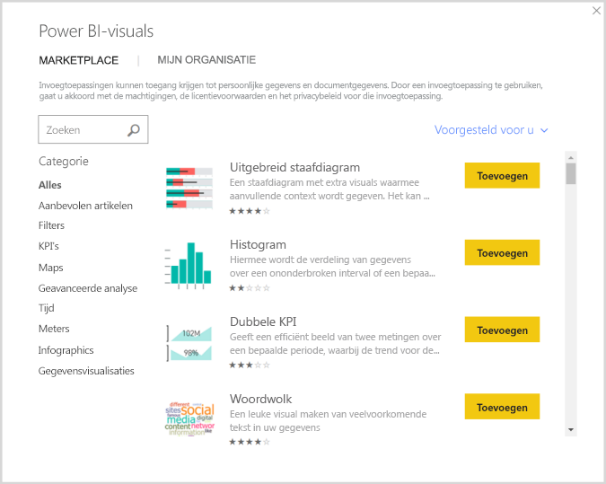

## <a name="contribute-r-powered-power-bi-visuals"></a>Met R gemaakte Power BI-visuals bijdragen

Als u zelf in R visuals hebt gemaakt voor gebruik in rapporten, kunt u die met anderen delen door uw aangepaste visuals toe te voegen aan de  **Power BI-visualgalerie**. Bijdragen moeten worden aangeleverd via GitHub. Het proces daarvoor wordt beschreven op de volgende locatie:

* [Bijdragen aan de Power BI-visualgalerie die met R zijn gemaakt](https://github.com/PowerBi-Projects/PowerBI-visuals#building-r-powered-custom-visual-corrplot)

## <a name="troubleshoot-r-powered-power-bi-visuals"></a>Problemen met Power BI-visuals die zijn gemaakt met R oplossen

Met R gemaakte Power BI-visuals moeten voldoen aan bepaalde afhankelijkheden, anders werken ze niet correct. Als met R gemaakte Power BI-visuals niet correct worden uitgevoerd of geladen, heeft dat probleem meestal een van de volgende oorzaken:

* De R-engine ontbreekt
* Fouten in het R-script waarop het visuele element is gebaseerd
* R-pakketten ontbreken of zijn verouderd

In de volgende sectie wordt beschreven welke stappen u kunt ondernemen om problemen op te lossen.

### <a name="missing-or-outdated-r-packages"></a>Ontbrekende of verouderde R-pakketten

Wanneer u probeert een met R gemaakte aangepaste visual te installeren, kunnen er fouten optreden als sommige R-pakketten ontbreken of als deze zijn verouderd. Oorzaken hiervan zijn:

* De installatie van R is niet compatibel met het R-pakket
* R kan geen verbinding met internet maken vanwege de firewall, antivirussoftware of proxy-instellingen
* De internetverbinding is traag of er is een probleem met de internetverbinding

Het Power BI-team werkt actief aan oplossingen voor deze problemen voordat ze zich bij u voordoen. De volgende versie van Power BI Desktop bevat updates om deze problemen te verhelpen. Tot die tijd kunt u een of meer van de volgende stappen uitvoeren om de kans op problemen te verminderen:

1. Verwijder het aangepaste visuele element en installeer het opnieuw. Hierdoor worden ook de R-pakketten opnieuw geïnstalleerd.
2. Als de installatie van R niet up-to-date is, voert u een upgrade van de installatie van R uit. Vervolgens verwijdert u de aangepaste visual en installeert u deze opnieuw, zoals beschreven in de vorige stap.

   Ondersteunde versies van R worden vermeld in de beschrijving van elk met R gemaakt aangepast visueel element, zoals weergegeven in de volgende afbeelding.

     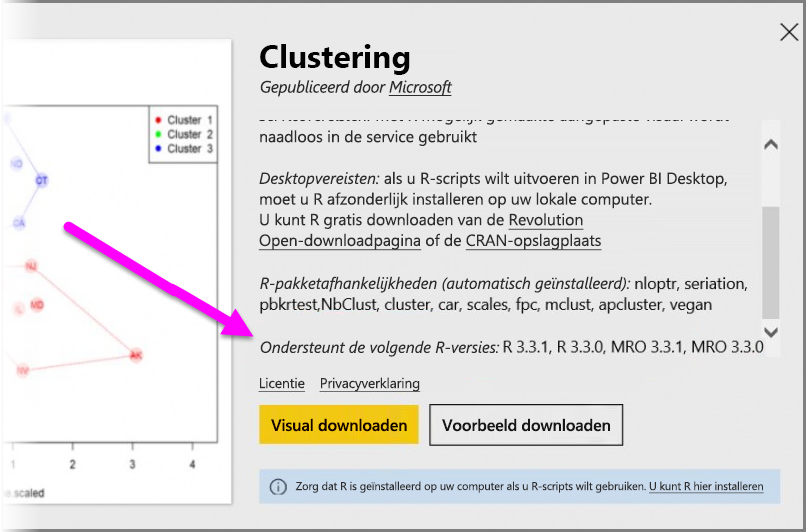
    > [!NOTE]
    > U kunt de oorspronkelijke installatie van R behouden en Power BI Desktop alleen koppelen aan de huidige versie die u installeert. Ga naar **Bestand > Opties en instellingen > Opties > R-script**.

3. Installeer R-pakketten handmatig, met behulp van een R-console. De stappen voor deze methode luiden als volgt:

   a. Download het installatiescript voor de met R gemaakte visual en sla dat bestand op een lokaal station op.

   b. Voer de volgende opdrachtregel uit vanuit de R-console:

      ```console
      source("C:/Users/david/Downloads/ScriptInstallPackagesForForecastWithWorkarounds.R")
      ```

   Typische standaardlocaties voor installatie zijn de volgende:

   ```console
       c:\Program Files\R\R-3.3.x\bin\x64\Rterm.exe (for CRAN-R)
       c:\Program Files\R\R-3.3.x\bin\x64\Rgui.exe (for CRAN-R)
       c:\Program Files\R\R-3.3.x\bin\R.exe (for CRAN-R)
       c:\Program Files\Microsoft\MRO-3.3.x\bin\R.exe (for MRO)
       c:\Program Files\Microsoft\MRO-3.3.x\bin\x64\Rgui.exe (for MRO)
       c:\Program Files\RStudio\bin\rstudio.exe (for RStudio)
   ```

4. Als de vorige stappen niet werken, probeert u het volgende:

   a. Gebruik **R Studio** en voer stap 3 b. uit, zoals hierboven beschreven (voer de scriptopdrachtregel uit vanuit de R-console).

   b. Als de vorige stap niet werkt, gaat u naar **Tools > Global Options > Packages** in **R Studio**, en schakelt u het selectievakje **Use Internet Explorer library/proxy for HTTP** in. Voer vervolgens stap 3 b. nogmaals uit (zie de vorige stappen).

## <a name="next-steps"></a>Volgende stappen

Raadpleeg de volgende aanvullende informatie over R in Power BI.

* [Power BI-visualgalerie](https://app.powerbi.com/visuals/)
* [R-scripts uitvoeren in Power BI Desktop](../connect-data/desktop-r-scripts.md)
* [Visuele R-elementen maken in Power BI Desktop](desktop-r-visuals.md)
* [Gebruik een externe R IDE met Power BI](../connect-data/desktop-r-ide.md)
