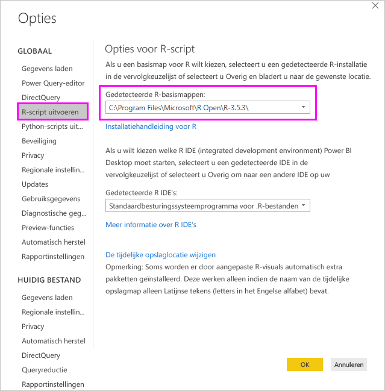
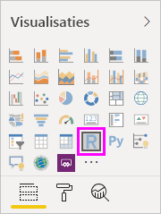
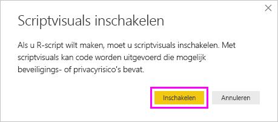
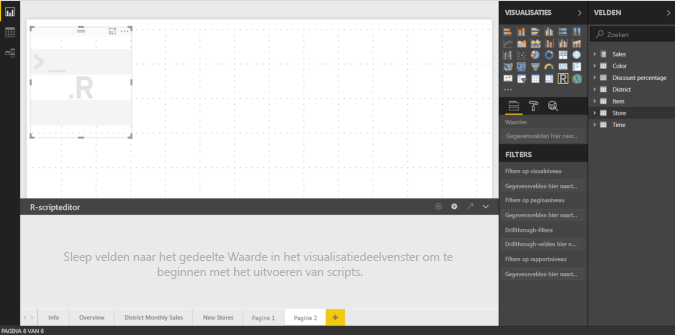
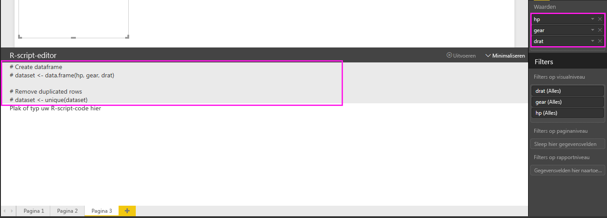
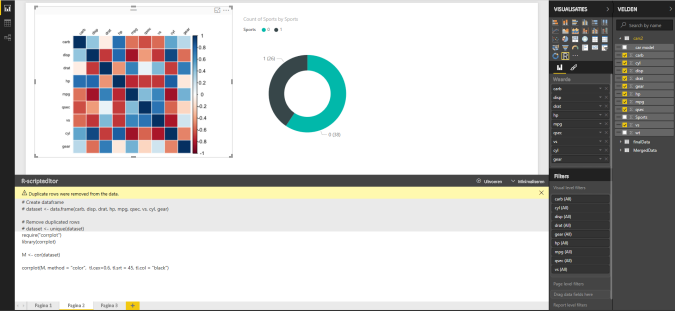
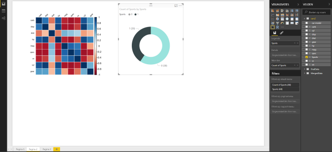
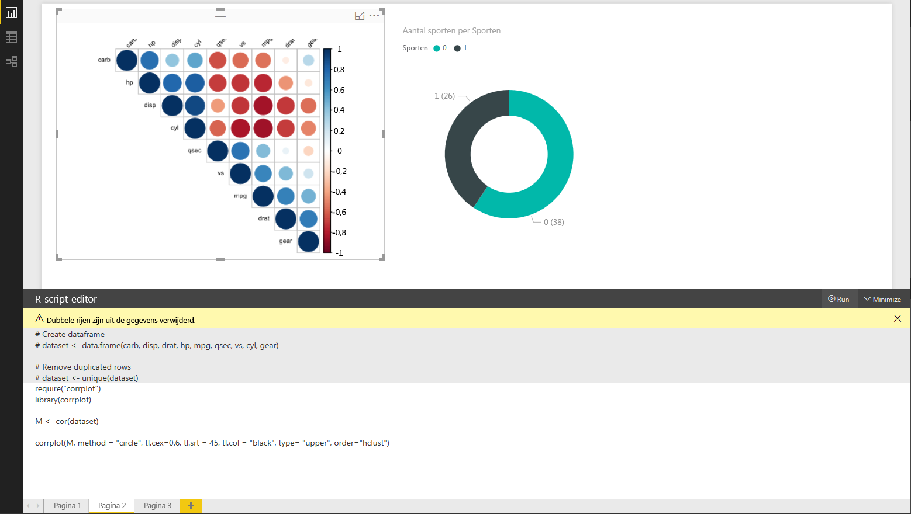
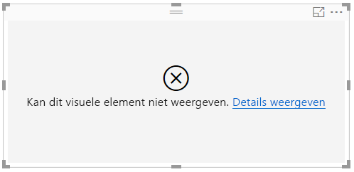

# <a name="create-power-bi-visuals-using-r"></a>Power BI-visuals maken met R
In combinatie met Power BI Desktop kunt u *R* gebruiken om uw gegevens te visualiseren. [R](https://mran.revolutionanalytics.com/documents/what-is-r) is een taal en omgeving voor statistische berekeningen en grafische weergave.

## <a name="install-r"></a>R installeren
Standaard maakt de R-engine geen deel uit van Power BI Desktop en kan deze engine niet met Power BI Desktop worden geïmplementeerd of geïnstalleerd. Als u R-scripts wilt uitvoeren in Power BI Desktop, moet u R afzonderlijk installeren op uw lokale computer. U kunt R gratis downloaden en installeren vanaf tal van locaties, waaronder de [Revolution Open-downloadpagina](https://mran.revolutionanalytics.com/download/) en de [CRAN-opslagplaats](https://cran.r-project.org/bin/windows/base/). De huidige release van R-scripts in Power BI Desktop biedt ondersteuning voor Unicode-tekens en spaties (lege tekens) in het installatiepad.

## <a name="enable-r-visuals-in-power-bi-desktop"></a>R-visuals inschakelen in Power BI Desktop
Nadat u R hebt geïnstalleerd, wordt deze taal automatisch door Power BI Desktop ingeschakeld. Volg deze stappen om te controleren of R door Power BI Desktop op de juiste locatie is ingeschakeld: 

1. Vanuit het Power BI Desktop-menu selecteert u **Bestand** > **Opties en instellingen** > **Opties**. 

2. Aan de linkerkant van de pagina **Opties** selecteert u **R-script** onder **Algemeen**. 

3. Onder **Opties voor R-script** controleert u of uw lokale R-installatie is opgegeven in **Gedetecteerde R-basismappen** en of hiermee de lokale R-installatie die u in Power BI Desktop wilt gebruiken, goed wordt weergegeven. In de volgende afbeelding is **C:\Program Files\R Open\R-3.5.3\\** het pad naar de lokale installatie van R.
   
   

Nadat u uw R-installatie hebt gecontroleerd, kunt u aan de slag met het maken van R-visuals.

## <a name="create-r-visuals-in-power-bi-desktop"></a>R-visuals maken in Power BI Desktop
1. Selecteer het pictogram **R-visual** in het deelvenster **Visualisatie** om een R-visual toe te voegen.
   
   

2. In het venster **Scriptvisuals inschakelen** dat wordt weergegeven, selecteert u **Inschakelen**.

   

   Wanneer u een R-visual aan een rapport toevoegt, brengt Power BI Desktop de volgende wijzigingen aan:
   
   - Een tijdelijke aanduiding voor een R-visual wordt weergegeven op het rapportcanvas.
   
   - De **R-scripteditor** wordt onderin het middelste deelvenster weergegeven.
   
   

3. In de sectie **Waarden** van het deelvenster **Visualisatie** versleept u velden van het deelvenster **Velden** dat u in uw R-script wilt gebruiken, net zoals met andere Power BI Desktop-visuals. U kunt ook de velden rechtstreeks in het deelvenster **Velden** selecteren.
    
    Alleen velden die u aan de sectie **Waarden** toevoegt, zijn beschikbaar voor uw R-script. U kunt nieuwe velden toevoegen of onnodige velden verwijderen uit de sectie **Waarden** terwijl u aan uw R-script werkt in de **R-script-editor**. Power BI Desktop detecteert automatisch welke velden u hebt toegevoegd of verwijderd.
   
   > [!NOTE]
   > Het standaardtype voor aggregatie voor R-visuals is *niet samenvatten*.
   > 
   > 
   
4. U kunt nu de gegevens gebruiken die u hebt geselecteerd voor het maken van een diagram: 

    - As u velden selecteert, genereert de **R-script-editor** ondersteunende bindingcode voor R-scripts voor die velden in de grijze sectie aan de bovenkant van het editordeelvenster.
    - Als u een veld verwijdert, wordt de ondersteunende code voor dat veld automatisch verwijderd met de **R-script-editor**.
   
   In het voorbeeld in de volgende afbeelding zijn drie velden geselecteerd: hp, gear en drat. Op basis van deze selectie genereert de R-script-editor bindingcode, die als volgt wordt samengevat:
   
   * Maak een gegevensframe met de naam **gegevensset**, dat uit de verschillende velden bestaat die door de gebruiker zijn geselecteerd.
   * Het standaardaggregatietype is: *Niet samenvatten*.
   * Net als bij tabelvisuals worden velden gegroepeerd en komen dubbele rijen slechts eenmaal voor.
   
   
   
   > [!TIP]
   > In bepaalde gevallen wilt u geen automatische groepering of wilt u dat alle rijen worden weergegeven, met inbegrip van duplicaten. In dat geval voegt u een indexveld aan uw gegevensset toe dat ervoor zorgt dat alle rijen als uniek worden beschouwd en groepering wordt voorkomen.
   > 
   > 
   
   Het gegenereerde gegevensframe wordt een **gegevensset** genoemd en de geselecteerde kolommen zijn toegankelijk op basis van hun respectieve namen. Het veld gear is bijvoorbeeld toegankelijk door *dataset$gear* aan uw R-script toe te voegen. Voor velden met spaties of speciale tekens gebruikt u enkele aanhalingstekens.

5. Met behulp van het gegevensframe dat automatisch wordt gegenereerd door de velden die u hebt geselecteerd, kunt u een R-script schrijven dat door Power BI Desktop naar het R-standaardapparaat wordt geplot. Nadat u het script hebt voltooid, selecteert u **Script uitvoeren** rechts van de titelbalk van de **R-script-editor**.
   
    Wanneer u **Script uitvoeren** selecteert, identificeert Power BI Desktop de plot en wordt deze op het canvas weergegeven. Omdat het proces wordt uitgevoerd op uw lokale R-installatie, moet u ervoor zorgen dat de vereiste pakketten zijn geïnstalleerd.
   
   Power BI Desktop plot het visuele element opnieuw wanneer een van de volgende gebeurtenissen optreedt:
   
   * U selecteert **Script uitvoeren** in de titelbalk van de **R-script-editor**.
   * Wanneer gegevens worden vernieuwd, gefilterd of gemarkeerd, vindt een gegevenswijziging plaats.

     De volgende afbeelding toont een voorbeeld van de plotcode van de correlatie, waarmee de correlatie tussen kenmerken van verschillende typen auto's wordt getoond.

     

6. Als u een grotere weergave van de visualisaties wilt, minimaliseert u de **R-script-editor**. Net zoals bij andere visuals in Power BI Desktop kunt u de correlatieplot kruislings filteren door een specifieke sectie (zoals sportauto's) te selecteren in de ringgrafiek (de ronde visual aan de rechterkant).

    

7. Pas het R-script aan om het visuele element aan te passen en R in te zetten door parameters toe te voegen aan de plotting-opdracht.

    De oorspronkelijke plotting-opdracht is:

    ```
    corrplot(M, method = "color",  tl.cex=0.6, tl.srt = 45, tl.col = "black")
    ```

    Wijzig het R-script zodat de plotting-opdracht er als volgt uitziet:

    ```
    corrplot(M, method = "circle", tl.cex=0.6, tl.srt = 45, tl.col = "black", type= "upper", order="hclust")
    ```

    Als gevolg hiervan plot de R-visual nu cirkels, houdt daarbij alleen rekening met het bovenste gedeelte en wijzigt de volgorde van de matrix om gecorreleerde kenmerken te clusteren.

    

    Wanneer u een R-script uitvoert dat tot een fout leidt, wordt een foutmelding op het canvas weergegeven in plaats van op de R-visual-plot. Als u meer wilt weten over de fout, selecteert u **Details bekijken** in de fout op de R-visual.

    

## <a name="r-scripts-security"></a>Beveiliging van R scripts 
R-visuals worden gemaakt van R-scripts, die code kunnen bevatten met beveiligings- of privacyrisico's. Wanneer een gebruiker voor het eerst een R-visual probeert weer te geven of ermee probeert te werken, wordt er een beveiligingswaarschuwing weergegeven. Schakel R-visuals alleen in als u de auteur en bron vertrouwt, of nadat u het R-script hebt bekeken en begrijpt.


## <a name="known-limitations"></a>Bekende beperkingen
R-visuals in Power BI Desktop kennen de volgende beperkingen:

* Gegevensgrootten: gegevens die voor een R-visual worden gebruikt voor plotting zijn beperkt tot 150.000 rijen. Als er meer dan 150.000 rijen zijn geselecteerd, worden alleen de bovenste 150.000 rijen gebruikt en wordt er een bericht weergegeven op de afbeelding.

* Uitvoergrootte: Voor een R-visual geldt een maximale uitvoergrootte van 2 MB.

* Resolutie: alle R-visuals worden weergegeven bij 72 dpi.

* Plotting-apparaat: Alleen plotting naar het standaardapparaat wordt ondersteund. 

* Berekeningstijden: als de berekening voor een R-visual langer duurt dan vijf minuten, wordt een time-outfout weergegeven.

* Relaties: net als bij andere Power BI Desktop-visuals geldt dat als er gegevensvelden uit verschillende tabellen zonder gedefinieerde relatie worden geselecteerd, er een fout optreedt.

* Aantal vernieuwingen: R-visuals worden vernieuwd op het moment dat gegevens worden bijgewerkt, gefilterd en gemarkeerd. De afbeelding zelf is echter niet interactief en kan niet de bron van kruislings filteren zijn.

* Hoogtepunten: R-visuals reageren als u andere visuals markeert, maar u kunt geen elementen in de R-visual visualiseren om kruislings te filteren op andere elementen.

* Apparaten weergeven: Alleen plots die worden weergegeven op het standaard-R-apparaat voor weergave worden correct weergegeven op het canvas. Vermijd expliciet het gebruik van een ander R-apparaat voor weergave.

* De naam van de kolom wijzigen: R-visuals bieden geen ondersteuning voor het wijzigen van de naam van invoerkolommen. Tijdens het uitvoeren van scripts wordt naar kolommen verwezen met de oorspronkelijke naam.

* RRO-installaties: In deze release worden RRO-installaties niet automatisch geïdentificeerd door de 32 bitsversie van Power BI Desktop; u moet het pad naar de R-installatiemap handmatig opgeven in **Opties en instellingen** > **Opties** > **R-script**.

## <a name="next-steps"></a>Volgende stappen
Zie de volgende artikelen voor meer informatie over R in Power BI:

* [R-scripts uitvoeren in Power BI Desktop](../connect-data/desktop-r-scripts.md)
* [Een externe R IDE met Power BI gebruiken](../connect-data/desktop-r-ide.md)
