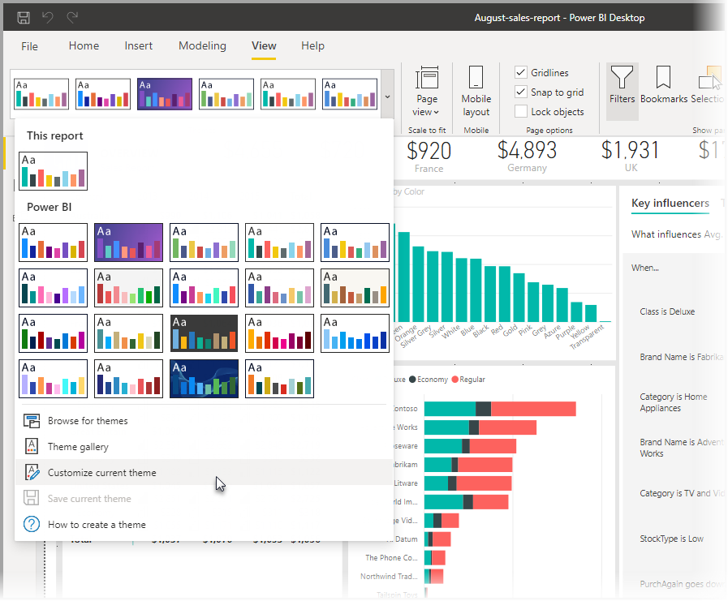
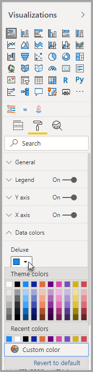
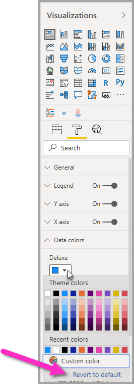

# <a name="use-report-themes-in-power-bi-desktop"></a>Rapportthema's gebruiken in Power BI Desktop

Met *rapportthema's* in Power BI Desktop past u ontwerpwijzigingen toe op uw hele rapport. U kunt bijvoorbeeld uw bedrijfskleuren gebruiken, pictogrammen wijzigen, of een nieuwe indeling voor visuals toepassen. Wanneer u een rapportthema toepast, worden voor alle visuals in het rapport de standaardkleuren en -indeling van het geselecteerde thema gebruikt. Er zijn enkele uitzonderingen van toepassing, die later in dit artikel worden beschreven.

Rapportthema's kunnen worden geselecteerd door naar het lint **Weergave** te navigeren en vervolgens de vervolgkeuzepijl in de sectie **Thema's** van het lint te selecteren en vervolgens het gewenste thema te selecteren. Beschikbare thema's zijn vergelijkbaar met thema's in andere Microsoft-producten, zoals Microsoft PowerPoint.



Er zijn twee typen rapportthema's, ingebouwde rapportthema's en aangepaste rapportthemabestanden.

- **Ingebouwde** rapportthema's bieden verschillende soorten vooraf gedefinieerde kleurenschema's die zijn geïnstalleerd met Power BI Desktop. U selecteert ingebouwde rapportthema's rechtstreeks vanuit het Power BI Desktop-menu.

- **Aangepaste** rapportthema's worden gemaakt door een huidig thema aan te passen en het vervolgens op te slaan als een aangepast thema of om uw eigen thema aan te passen met behulp van een JSON-bestand. Het JSON-bestand biedt gedetailleerde controle over veel aspecten van een rapportthema, zoals verderop in dit artikel wordt beschreven. 

Laten we bespreken hoe rapportthema's werken en vervolgens ingaan op hoe u aangepaste rapportthema's maakt.


## <a name="how-report-themes-work"></a>Hoe rapportthema's werken

Als u een rapportthema wilt toepassen op een Power BI-bureaubladrapport, kunt u kiezen uit de volgende opties:

* Maak een keuze uit de [beschikbare rapportthema's](#built-in-report-themes) die zijn ingebouwd in Power BI Desktop
* Een thema aanpassen met behulp van het dialoogvenster **Thema aanpassen**
* [Een JSON-bestand voor een aangepast thema importeren](#import-custom-report-theme-files).

We zullen achtereenvolgens elk van deze opties bekijken.

### <a name="built-in-report-themes"></a>Ingebouwde rapportthema’s

Ga als volgt te werk om beschikbare ingebouwde rapportthema’s te selecteren:

1. Selecteer de vervolgkeuzeknop **Thema** **Thema wisselen** op het lint **Weergave**.

   

2. Selecteer een van de opgenomen thema's in de vervolgkeuzelijst.

   

   Het rapportthema wordt nu toegepast op het rapport.

    De volgende tabel bevat de beschikbare ingebouwde rapportthema's.
    
    | Ingebouwd rapportthema | Standaardkleurenschema |
    |------ |---------- |
    | Standaard | |
    | Highrise | |
    | Leidinggevende | |
    | Frontier| |
    | Innoveren | |
    | Bloei | |
    | Tidal| |
    | Temperatuur | |
    | Zonlicht| |
    | Divergent | |
    | Storm | |
    | Klassiek | |
    | Stadspark | |
    | Leslokaal | |
    | Geschikt voor kleurenblindheid | |
    | Elektrisch | |
    | Hoog contrast | |
    | Zonsondergang | |
    | Schemering | |
    
3. U kunt ook bladeren door de verzameling thema's die zijn gemaakt door leden van de Power BI-community door **Themagalerie** te selecteren in de vervolgkeuzelijst Thema's.

   

    In de galerie kunt u een thema selecteren dat u wilt en het bijbehorende JSON-bestand downloaden. 

    Als u het gedownloade bestand wilt installeren, selecteert u **Bladeren naar thema's** in de vervolgkeuzelijst **Thema's**, navigeert u naar de locatie waar u het JSON-bestand hebt gedownload en selecteert u het om het thema als nieuw thema in Power BI Desktop te importeren.

    Als dit is gelukt, geeft Power BI een dialoogvenster weer met de bevestiging dat het importeren is gelukt.

   

## <a name="customize-report-themes"></a>Rapportthema's aanpassen

U kunt bijna alle elementen die worden vermeld in de sectie **Opmaak** van het deelvenster **Visualisaties**, aanpassen en standaardiseren. Dit doet u door aanpassingen rechtstreeks door te voeren in Power BI Desktop of via een JSON-rapportthemabestand. Het doel is om u volledige en gedetailleerde controle te bieden over het standaarduiterlijk van uw rapporten.

De twee manieren om rapportthema's aan te passen, zijn de volgende:

- [Een thema maken en aanpassen in Power BI Desktop](#create-and-customize-a-theme-in-power-bi-desktop)
- [Een aangepast JSON-rapportthemabestand maken en aanpassen](#introduction-to-report-theme-json-files)

Laten we elk van deze benaderingen op zijn beurt bekijken in de volgende secties.

### <a name="create-and-customize-a-theme-in-power-bi-desktop"></a>Een thema maken en aanpassen in Power BI Desktop

Als u een thema rechtstreeks wilt aanpassen in Power BI Desktop, kunt u een thema selecteren dat in de buurt komt van wat u wilt en een paar aanpassingen uitvoeren. Selecteer eerst het thema dat in de buurt komt van wat u wilt (of begin gewoon met een willekeurig thema en pas daar vanaf aan) en neem de volgende stappen:

1. Selecteer in het lint **Weergave** de vervolgkeuzeknop **Thema's** en selecteer **Huidig thema aanpassen**.

   

2. Er verschijnt een dialoogvenster waarin u allerlei wijzigingen in het huidige thema kunt aanbrengen en vervolgens uw instellingen als een nieuw thema kunt opslaan.

   

Aanpasbare thema-instellingen komen voor in de volgende categorieën, zoals is te zien in het venster **Thema aanpassen**:

- **Naam en kleuren**: De instellingen voor themanaam en -kleur omvatten [themakleuren](#how-report-theme-colors-stick-with-your-reports), gevoelskleuren, uiteenlopende kleuren en [structurele kleuren (geavanceerd)](#setting-structural-colors).
- **Text**: De tekstinstellingen bestaan onder andere uit het lettertype, de lettergrootte en -kleur, waarmee [de standaardwaarden voor de primaire tekstklasse worden ingesteld](#setting-formatted-text-defaults) voor labels, titels, kaarten en KPI's, en de rijkoppen.
- **Visuals:** Visuele instellingen omvatten achtergrond, rand, koptekst en knopinfo.
- **Pagina**: Instellingen voor pagina-elementen omvatten achtergronden.
- **Filterdeelvenster**: Instellingen voor filterdeelvensters omvatten achtergrondkleuren, transparantie, kleur van lettertype en pictogram, filterkaarten.

Nadat u wijzigingen hebt aangebracht, selecteert u **Toepassen en opslaan** om uw thema op te slaan. Uw thema kan nu worden gebruikt in het huidige rapport, en kan worden geëxporteerd.

Door het huidige thema op deze manier aan te passen, kunt u thema’s snel en gemakkelijk aanpassen. U kunt echter meer verfijnde aanpassingen aanbrengen in thema's. Hiervoor moet het [JSON-bestand](#report-theme-json-file-format) van het thema worden gewijzigd.

> [!TIP]
> U kunt de meest algemene opties voor rapportthema's aanpassen met behulp van de besturingselementen in het dialoogvenster **Thema aanpassen**. Om nog meer controle te krijgen, kunt u desgewenst het JSON-bestand van een thema exporteren en handmatig afgestemde aanpassingen maken door de instellingen in dat bestand te wijzigen. U kunt de naam van het verfijnde JSON-bestand wijzigen, en het bestand later importeren.

### <a name="import-custom-report-theme-files"></a>Aangepaste rapportthemabestanden importeren

U kunt ook een aangepast themabestand voor rapporten importeren door de volgende stappen te volgen:

1. Selecteer het lint **Weergave** en selecteer vervolgens in de vervolgkeuzelijst **Thema's** en selecteer **Bladeren naar Thema's**.

   

   In het volgende venster kunt u bladeren naar de locatie van het JSON-themabestand.

2. In de volgende afbeelding zijn enkele bestanden voor feestdagenthema's beschikbaar. We kiezen een vakantiethema voor maart, *St Patricks Day.json*.

   

   Zodra het themabestand is geladen, wordt een bericht hierover weergegeven in Power BI Desktop.

   

## <a name="introduction-to-report-theme-json-files"></a>Inleiding tot JSON-rapportthemabestanden

 Wanneer u het JSON-basisbestand opent dat wordt vermeld in de vorige sectie (St Patricks Day.json), wordt dit als volgt weergegeven:

 ```json
    {
        "name": "St Patrick's Day",
        "dataColors": ["#568410", "#3A6108", "#70A322", "#915203", "#D79A12", "#bb7711", "#114400", "#aacc66"],
        "background":"#FFFFFF",
        "foreground": "#3A6108",
        "tableAccent": "#568410"
    }
```

Dit JSON-rapportthemabestand heeft de volgende regels:

- **name**: De naam van het rapportthema. Dit veld is het enige vereiste veld.
- **dataColors**: De lijst met hexadecimale kleurcodes die moeten worden gebruikt voor gegevens in Power BI Desktop-visuals. Deze lijst kan zo veel of zo weinig kleuren bevatten als u wilt.
- **achtergrond**, **firstLevelElements** en **tableAccent** (enzovoort): Kleurklassen. Met kleurklassen kunt u een groot aantal structurele kleuren tegelijk instellen in het rapport.

U kunt dit JSON-bestand gebruiken als basis voor het maken van uw eigen aangepaste rapportthemabestand om te importeren. Als u alleen de basiskleuren van uw rapport wilt aanpassen, wijzigt u de naam en hexadecimale codes in het bestand.

In een JSON-rapportthemabestanden definieert u alleen de opmaak die u wilt wijzigen. Wat u niet opgeeft in het JSON-bestand, wordt hersteld naar de standaardwaarden voor Power BI Desktop.

Het maken van een JSON-bestand heeft veel voordelen. U kunt bijvoorbeeld opgeven dat voor alle grafieken tekengrootte 12 moet worden gebruikt, dat bepaalde visuals een specifieke lettertypefamilie gebruiken, of dat gegevenslabels voor bepaalde grafiektypen moeten worden uitgeschakeld. Door een JSON-bestand te gebruiken kunt u een rapportthemabestand maken dat uw grafieken en rapporten standaardiseert, zodat u de rapporten van uw organisatie eenvoudig consistent kunt houden.

Raadpleeg [Indeling van JSON-rapportthemabestand](#report-theme-json-file-format) voor meer informatie over de indeling van het JSON-bestand.

> [!NOTE]
> Het wijzigen van een aangepast thema voor een JSON-rapport via het dialoogvenster [**Thema aanpassen** is veilig](#create-and-customize-a-theme-in-power-bi-desktop).  In het dialoogvenster worden geen thema-instellingen gewijzigd die niet kunnen worden beheerd. De wijzigingen die in het rapportthema zijn aangebracht, worden ter plekke bijgewerkt.

## <a name="how-report-theme-colors-stick-with-your-reports"></a>Hoe de kleuren van een rapportthema in uw rapporten behouden blijven

Als u het rapport publiceert in de Power BI-service, blijven de kleuren van het rapportthema behouden. De sectie **Gegevenskleuren** van het deelvenster **Opmaak** komt overeen met uw rapportthema.

Ga als volgt te werk om de beschikbare kleuren in een rapportthema weer te geven:

1. Selecteer een visual.

2. Selecteer in de sectie **Indeling** van het deelvenster **Visualisatie** de optie **Gegevenskleuren**.

3. Selecteer de vervolgkeuzelijst van een item om de informatie over **Themakleuren** van het rapportthema weer te geven.

   

In ons voorbeeld kunt u, nadat u de vele groene en bruine kleuren uit het rapportthema St. Patrick's Day hebt toegepast, de themakleuren bekijken. Ziet u al dat groen? Dit komt doordat de kleuren deel uitmaken van het rapportthema dat is geïmporteerd en toegepast.

De kleuren in het kleurenpalet zijn relatief ten opzichte van het huidige thema. Stel dat u bijvoorbeeld de derde kleur van de bovenste rij selecteert voor een gegevenspunt. Als u later overschakelt naar een ander thema, wordt de kleur van het gegevenspunt automatisch bijgewerkt naar de derde kleur van de bovenste rij in het nieuwe thema, net zoals wanneer u van thema wisselt in Microsoft Office.

### <a name="situations-when-report-theme-colors-wont-stick-to-your-reports"></a>Situaties waarin de rapportthemakleuren niet behouden blijven in uw rapporten

Stel, u past een aangepaste kleurenset (of één kleur) toe op een bepaald gegevenspunt in een visual met behulp van de optie **Aangepaste kleur** in de kleurkiezer. Wanneer u een rapportthema toepast, wordt deze aangepaste kleur van het gegevenspunt *niet* overschreven.

Of stel dat u de kleur van een gegevenspunt handmatig wilt instellen met behulp van de sectie **Themakleuren**. Deze kleuren worden *niet* bijgewerkt wanneer u een nieuw rapportthema toepast. Als u de standaardkleuren terug wilt, zodat ze worden bijgewerkt wanneer u een nieuw rapportthema kiest, selecteert u **Standaardinstellingen herstellen** of selecteert u een kleur uit het palet **Themakleuren** in de kleurkiezer.



Veel Power BI-visuals worden niet toegepast op rapportthema's.

## <a name="custom-report-theme-files-you-can-use-right-now"></a>Aangepaste rapportthemabestanden die u momenteel kunt gebruiken

Wilt u aan de slag gaan met rapportthema's? Bekijk de aangepaste rapportthema's in de [themagalerie](https://community.powerbi.com/t5/Themes-Gallery/bd-p/ThemesGallery) of probeer de volgende kant-en-klare aangepaste JSON-rapportthemabestanden uit. Deze kunt u downloaden en importeren in uw Power BI Desktop-rapport:

- [Thema Waveform](https://community.powerbi.com/t5/Themes-Gallery/Waveform/m-p/140536). Dit rapportthema is geïntroduceerd in de [blogpost](https://powerbi.microsoft.com/blog/power-bi-desktop-march-feature-summary/) waarin de eerste release van rapportthema's is aangekondigd. [Download Waveform.json](https://go.microsoft.com/fwlink/?linkid=843924).

  

- [Thema dat geschikt is voor kleurenblinden](https://community.powerbi.com/t5/Themes-Gallery/Color-Blind-Friendly/m-p/140597).
Dit rapportthema is gemakkelijker te lezen voor visueel gehandicapten. [Thema ColorblindSafe-Longer.json](https://go.microsoft.com/fwlink/?linkid=843923).

  .

- Power View-thema's, met Apothecary.json. [Download Power View-thema's in een zip-bestand](https://go.microsoft.com/fwlink/?linkid=843925).

  

- Thema Valentine's Day.

  

  Hier is de code van het JSON-bestand Valentine's Day:

   ```json
       {
           "name": "Valentine's Day",
           "dataColors": ["#990011", "#cc1144", "#ee7799", "#eebbcc", "#cc4477", "#cc5555", "#882222", "#A30E33"],
           "background":"#FFFFFF",
           "foreground": "#ee7799",
           "tableAccent": "#990011"
       }
   ```

Hier volgen nog enkele rapportthema's die u als uitgangspunt kunt nemen:

- [Sunflower-twilight](https://community.powerbi.com/t5/Themes-Gallery/Sunflower-Twilight/m-p/140749)
- [Plum](https://community.powerbi.com/t5/Themes-Gallery/Plum/m-p/140711)
- [Autumn](https://community.powerbi.com/t5/Themes-Gallery/Autumn/m-p/140746)
- [High contrast](https://community.powerbi.com/t5/Themes-Gallery/Color-Blind-Friendly/m-p/140597)

Met rapportthema’s kunt u van uw Power BI Desktop-rapporten een kleurrijke weerspiegeling van uzelf, uw organisatie, of het huidige seizoen of een actuele feestdag maken.

## <a name="export-report-themes"></a>Rapportthema's exporteren

U kunt het momenteel toegepaste rapportthema rechtstreeks vanuit Power BI Desktop naar een JSON-bestand exporteren. Als u een rapportthema hebt geëxporteerd, kunt u het thema opnieuw gebruiken in andere rapporten. Met deze optie kunt u het JSON-bestand exporteren voor de meeste ingebouwde thema's. De enige uitzonderingen zijn de basisthema's, Klassiek en Standaard, waarop andere thema's worden gebouwd bij het importeren.

Ga als volgt te werk om het momenteel toegepaste thema te exporteren uit Power BI Desktop:

1. Selecteer achtereenvolgens **Bestand** > **Opties en instellingen** > **Opties**.

2. Selecteer in de sectie **Preview-functies** de optie **Huidige thema aanpassen**, en selecteer vervolgens **OK**.

   U wordt mogelijk gevraagd om Power BI Desktop opnieuw op te starten om de preview-functie in te schakelen. Nadat u opnieuw hebt opgestart, kunt u het momenteel toegepaste thema gaan exporteren.

3. Selecteer op het **Start**-lint achtereenvolgens **Thema wisselen** > **Huidige thema exporteren**.

4. Blader in het dialoogvenster **Opslaan als** naar een map waarin het JSON-bestand moet worden opgeslagen, en selecteer vervolgens **Opslaan**.

## <a name="report-theme-json-file-format"></a>Indeling van JSON-bestand voor Rapportthema

In de basis heeft het JSON-themabestand maar één vereiste regel: **name**.

```json
{
    "name": "Custom Theme"
}
```

Behalve **name** is alles optioneel, wat betekent dat u vrij bent om de eigenschappen toe te voegen die u specifiek in het themabestand wilt verwerken en voor de rest de standaardinstellingen van Power BI kunt gebruiken.

### <a name="setting-theme-colors"></a>Themakleuren instellen

Onder **name** kunt u de volgende eigenschappen met betrekking tot de gegevenskleur toevoegen:

- **dataColors**: De lijst met hexadecimale kleurcodes die moeten worden gebruikt voor het kleuren van vormen die gegevens vertegenwoordigen in Power BI Desktop-visuals. Deze lijst kan zo veel of zo weinig kleuren bevatten als u wilt. Nadat alle kleuren uit deze lijst zijn gebruikt en u in de visual nog steeds meer kleuren nodig hebt, wordt het standaardkleurenpalet van Power BI weer gebruikt.
- **goed**, **neutraal**, **slecht**: Met deze eigenschappen worden de statuskleuren in de watervalgrafiek en de KPI-visual ingesteld.
- **maximum**, **centrum**, **minimum**, **null**: Met deze kleuren worden de verschillende kleurovergangen in het dialoogvenster Voorwaardelijke opmaak ingesteld.

Een basisthema waarmee deze kleuren worden gedefinieerd, kan er als volgt uitzien:

```json
{
    "name": "Custom Theme",
    "dataColors": [
        "#118DFF",
        "#12239E",
        "#E66C37",
        "#6B007B",
        "#E044A7",
        "#744EC2",
        "#D9B300",
        "#D64550",
        "#197278",
        "#1AAB40"
    ],
    "good": "#1AAB40",
    "neutral": "#D9B300",
    "bad": "#D64554",
    "maximum": "#118DFF",
    "center": "#D9B300",
    "minimum": "#DEEFFF",
    "null": "#FF7F48"
}
```

### <a name="setting-structural-colors"></a>Structurele kleuren instellen

Vervolgens kunt u verschillende kleurklassen toevoegen, zoals **achtergrond** en **firstLevelElements**. Deze kleuren klassen stellen de structurele kleuren voor elementen in het rapport in, zoals de rasterlijnen van assen, markeringskleuren en achtergrondkleuren voor visuals.

In de volgende tabel worden de zes kleurklassen weergegeven die u kunt opmaken.  De **Kleurklasse**-namen komen overeen met de namen in de subsectie 'Geavanceerd' van de sectie 'Naam en kleuren' in het dialoogvenster [**Thema aanpassen**](#create-and-customize-a-theme-in-power-bi-desktop).

|Kleurklasse  |Wat er wordt opgemaakt  |
|---------|---------|
| **firstLevelElements** <br> **foreground**    (afgeschaft) | Geeft achtergrondkleur een label (met externe gegevenspunten) <br> Kleur van de trendlijn <br>  Standaardkleur van een tekstvak <br> Tabel- en matrixwaarden en lettertypekleuren <br> Labels van kaartgegevens <br> Kleur van meterwaarde van bijschrift <br> Kleur van KPI-doel <br>  Kleur van KPI-tekst <br> Itemkleur van slicer (in Focusmodus)  <br> Lettertypekleur in vervolgkeuzelijst van slicer <br> Lettertypekleur van numerieke invoer in slicer <br> Lettertypekleur van slicerheader <br> Lijnkleur van spreidingsdiagramverhouding <br> Lijnkleur van lijndiagramvoorspelling <br> Lijnkleur van mapleider <br> Tekstkleur van filterpaneel en kaart|
| **secondLevelElements** <br> **foregroundNeutralSecondary** (afgeschaft) | 'lichte' [secundaire tekstklassen](#setting-formatted-text-defaults) <br> Kleuren van label  <br> Kleur van de legendalabels <br> Kleur van de aslabel <br> Lettertypekleur van tabel- en matrixheader <br> Lijnkleur van meterdoel en doelleider <br>  Kleur van KPI-trendas <br> Schuifregelaarkleur van slicer <br> Lettertypekleur van sliceritem <br> Kleur van slicercontour <br> Kleur bij aanwijzen lijndiagram <br> Kleur kaarttitel met meerdere rijen <br> Lijnkleur van lintgrafiek <br> Randkleur van shape-kaart <br> Lettertypekleur van knoptekst <br> Lijnkleur van knoppictogram <br> Contourkleur van knoppictogram |
| **thirdLevelElements** <br >**backgroundLight** (afgeschaft) | Askleur van rasterlijn <br> Kleur van tabel- en matrixraster <br> Achtergrondkleur van slicerheader (in Focusmodus)  <br> Contourkleur van kaart met meerdere rijen  <br> Opvulkleur van vorm <br> Achtergrondkleur van meterboog <br> Achtergrond kleur van toegepaste filterkaart <br> Wanneer achtergrond = FFFFFF: <br> Opvulkleur van knop uitgeschakeld <br> Contourkleur van knop uitgeschakeld <br> |
| **thirdLevelElements** <br> **foregroundNeutralTertiary** (afgeschaft) | gedimde kleur legenda <br> Labelkleur van kaartcategorie <br> Categorielabelkleur kaart met meerdere rijen <br> Kleur van de balk van kaart met meerdere rijen <br> Opvulkleur conversieverhouding trechterdiagram <br> Lettertypekleur van knop uitgeschakeld <br> Lijnkleur van knoppictogram uitgeschakeld <br> |
| **background** | Labelt achtergrondkleur (binnen gegevenspunten) <br> Achtergrondkleur van items in vervolgkeuzelijst slicer  <br> Lijnkleur van ringdiagram <br> Lijnkleur van treemap <br> Achtergrondkleur van combinatiegrafiek <br> Opvulkleur van knop <br> Achtergrondkleur van filtervenster en beschikbare filterkaarten |
| **secondaryBackground** <br> **backgroundNeutral** (afgeschaft) | Contourkleur van tabel- en matrixraster <br> Standaardkleur van shape-kaart <br> Opvulkleur van lint in lintgrafiek (wanneer optie serieovereenkomst is uitgeschakeld) <br> Wanneer achtergrond != FFFFFF: <br> Opvulkleur van knop uitgeschakeld <br> Contourkleur van knop uitgeschakeld <br> |
| **tableAccent** | Hiermee wordt de contourkleur van het tabel- en matrixraster overgeschreven, indien aanwezig |

Dit is een voorbeeldthema waarmee de kleurklassen worden ingesteld:

```json
{
    "name": "Custom Theme",
    "firstLevelElements": "#252423",
    "secondLevelElements": "#605E5C",
    "thirdLevelElements": "#F3F2F1",
    "fourthLevelElements": "#B3B0AD",
    "background": "#FFFFFF",
    "secondaryBackground": "#C8C6C4",
    "tableAccent": "#118DFF"
}
```

> [!TIP]
> Als u een 'donker thema' of een ander kleurrijk thema maakt dat van de typische stijl met 'zwarte' **firstLevelElements** op een 'witte' **achtergrond** afwijkt, moet u ook de waarden voor andere structurele kleuren en de [kleuren voor de primaire tekstklassen](#setting-formatted-text-defaults) instellen.  Op die manier zorgt u ervoor dat gegevenslabels in grafieken met een labelachtergrond overeenkomen met de verwachte stijl en leesbaar zijn, en dat de rasterlijnen van de as zichtbaar zijn.

### <a name="setting-formatted-text-defaults"></a>Standaardwaarden voor opgemaakte tekst instellen

Vervolgens kunt u tekstklassen toevoegen aan het JSON-bestand. Tekstklassen zijn vergelijkbaar met kleurklassen, maar zijn zo ontworpen dat u de lettertypegrootte, -kleur en -familie voor groepen tekst in uw rapport kunt bijwerken.

Er zijn twaalf tekstklassen, maar u hoeft slechts vier klassen, genaamd *primaire klassen*, in te stellen om alle tekstopmaak in het rapport te wijzigen.  Deze vier primaire klassen kunnen worden ingesteld in het dialoogvenster [**Thema aanpassen** onder het kopje 'Tekst'](#create-and-customize-a-theme-in-power-bi-desktop): 'Algemeen' komt overeen met **label**, 'Titel' met **titel**, 'Kaarten en KPI's' met **bijschrift** en 'Rijkoppen' met **koptekst**.

Andere tekstklassen, beschouwd als *secundaire klassen*, ontlenen hun eigenschappen automatisch aan de bijbehorende primaire klassen. Vaak selecteert een secundaire klasse een lichtere tint tekstkleur of een procentueel groter of kleiner tekstformaat ten opzichte van de primaire klasse.

Neem de klasse **label** als voorbeeld. De standaardopmaak voor de klasse **label** is Segoe UI, #252423 (een donkergrijze kleur), en 12 punten. Deze klasse wordt gebruikt om de waarden in de tabel en matrix op te maken. De totalen in een tabel of matrix krijgen meestal een soortgelijke opmaak, maar zijn vetgedrukt op basis van de klasse **vetgedrukt label**, zodat ze opvallen. U hoeft deze klasse echter niet op te geven in het JSON-themabestand. Dit gebeurt automatisch in Power BI. Als u later besluit om labels op te geven met een lettertype van 14 punten in uw thema, hoeft u niet ook de klasse **vetgedrukt label** bij te werken, omdat deze klasse de tekstopmaak overneemt van de klasse **label**.

In de volgende tabel wordt de volgende informatie weergegeven:

- Elk van de vier primaire tekstklassen, wat er wordt opgemaakt, en de bijbehorende standaardinstellingen
- Elke secundaire klasse, wat er wordt opgemaakt en de standaardinstelling die uniek is in vergelijking met de primaire klasse

|Primaire klasse  |Secundaire klassen  |JSON-klassenaam  | Standaardinstellingen  |Bijbehorende visuele objecten  |
|---------|---------|---------|---------|---------|
| Bijschrift | N.v.t. | bijschrift | DIN <br> #252423 <br> 45pt |Labels van kaartgegevens <br> KPI-indicatoren|
|Koptekst|N.v.t.|koptekst|Segoe UI Semibold <br> #252423 <br> 12pt |Headers belangrijkste beïnvloeders |
| Titel || titel |DIN <br> #252423 <br> 12pt |Titel van categorieas <br> Titel van waardeas <br> Kaarttitel met meerdere rijen* <br> Koptekstslicer|
|-| Grote titel | largeTitle |14pt |Visuele titel |
|Label ||label |Segoe UI<br>#252423<br>10pt |Tabel- en matrixkolomkoppen <br> Matrixrijkoppen<br>Tabel- en matrixraster<br>Tabel- en matrixwaarden |
|-|Semibold |semiboldLabel| Segoe UI Semibold | Profieltekst van belangrijkste beïnvloeders
|-|Groot |largeLabel |12pt | Gegevenslabels voor kaart met meerdere rijen |
|-|Klein |smallLabel |9pt |Labels van referentielijn* <br>Labels van datumbereik van slicer<br> Tekststijl van numerieke invoer in slicer<br>Zoekvak van slicer<br>Beïnvloedingstekst van belangrijkste beïnvloeders|
|-|Licht |lightLabel |#605E5C |Legendatekst<br>Knoptekst<br>Labels van categorieas<br>Gegevenslabels van trechterdiagram<br>Labels van conversieverhouding in trechterdiagram<br>Meterdoel<br>Categorielabel van spreidingsdiagram<br>Slicer-items|
|-|Vet |boldLabel |Segoe UI Bold |Subtotalen van matrix<br>Eindtotalen van matrix<br>Totalen van tabel |
|-|Groot en licht |largeLightLabel |#605E5C<br>12pt |Categorielabels van kaart<br>Meterlabels<br>Categorielabels kaart met meerdere rijen |
|-|Klein en licht |smallLightLabel |#605E5C<br>9pt |Gegevenslabels<br>Aslabels van waarde|

*\* Gemarkeerde items zijn ook gekleurd op basis van de eerste gegevenskleur van het rapportthema.*

> [!TIP]
> De *lichte* variaties van tekstklassen ontlenen hun lichte kleur aan de [structurele kleuren](#setting-structural-colors) die hierboven zijn gedefinieerd.  Als u een donker thema wilt maken, moet u er ook voor zorgen dat u de kleuren 'firstLevelElements' (die overeenkomt met de primaire tekstkleur), 'secondLevelElements' (die overeenkomt met de verwachte 'lichte' kleur voor tekst) en 'achtergrond' (met voldoende contrast voor de kleuren van elementen op eerste en tweede niveau) worden ingesteld.

Hier volgt een voorbeeldthema waarin alleen de primaire tekstklassen zijn ingesteld:

```json
{
    "name": "Custom Theme",
    "textClasses": {
        "callout": {
            "fontSize": 45,
            "fontFace": "DIN",
            "color": "#252423"
        },
        "title": {
            "fontSize": 12,
            "fontFace": "DIN",
            "color": "#252423"
        },
        "header": {
            "fontSize": 12,
            "fontFace": "Segoe UI Semibold",
            "color": "#252423"
        },
        "label": {
            "fontSize": 10,
            "fontFace": "Segoe UI",
            "color": "#252423"
        }
    }
}
```

Omdat secundaire klassen hun eigenschappen overnemen van de primaire klassen, hoeft u ze niet in te stellen in het themabestand. Als de overnameregels u echter niet bevallen (bijvoorbeeld als u niet wilt dat uw totalen een vetgedrukte versie zijn van de waarden in de tabel), kunt u de secundaire klassen in het themabestand ook expliciet opmaken, net zoals u de primaire klassen kunt opmaken.

### <a name="setting-visual-property-defaults-visualstyles"></a>Standaardwaarden voor visuele eigenschappen instellen (`visualStyles`)

Als u ten slotte een uitgebreid JSON-bestand wilt maken met gedetailleerder opmaakbeheer van alle visuals in een rapport, kunt u een sectie **visualStyles** toevoegen aan het JSON-bestand om de details van de opmaak te nesten. Hier volgt een sjabloonvoorbeeld van de sectie **visualStyles**:

```json
    "visualStyles": {
        "<visualName>": {
            "<styleName>": {
                "<cardName>": [{
                    "<propertyName>": <propertyValue>
                }]
            }
        }
    }
```

Voor de secties **visualName** en **cardName** gebruikt u een specifieke visual en een kaartnaam. Momenteel is de **styleName** altijd een asterisk (*), maar in een toekomstige versie kunt u verschillende stijlen voor uw visuals maken en deze namen geven (net als de functie voor de tabel en matrix). **propertyName** is de naam van een specifieke opmaakoptie en **propertyValue** is de waarde voor deze opmaakoptie.

Gebruik voor **visualName** en **cardName** een sterretje als u wilt dat deze instelling wordt toegepast op alle visuals of kaarten die een eigenschap hebben. Als u een asterisk gebruikt voor zowel de visual als de kaartnaam, past u in feite een instelling globaal toe in uw rapport, bijvoorbeeld een lettertypegrootte of specifieke lettertypefamilie voor alle tekst in alle visuals.

Hier volgt een voorbeeld waarin een aantal eigenschappen wordt ingesteld via de stijlen van visuals:

```json
{
   "name":"Custom Theme",
   "visualStyles":{
      "*": {
         "*": {
            "*": [{
                "wordWrap": true
            }],
            "categoryAxis": [{
                "gridlineStyle": "dotted"
            }],
            "filterCard": [
              {
                "$id": "Applied",
                "foregroundColor": {"solid": {"color": "#252423" } }
              },
              {
                "$id":"Available",
                "border": true
              }
            ]
         }
      },
      "scatterChart": {
         "*": {
            "bubbles": [{
                  "bubbleSize": -10
            }]
         }
      }
   }
}
```

In dit voorbeeld wordt gebruikgemaakt van de volgende instellingen:

- Schakelt tekstterugloop overal in
- Stelt de stijl van rasterlijnen in op gestippeld voor alle visuals met een categorieas
- Stelt bepaalde opmaak in voor de beschikbare en toegepaste filterkaarten (u ziet dat de opmaak gebruikmaakt van $id om verschillende versies van de filterkaarten in te stellen)
- Stelt de belgrootte voor spreidingsdiagrammen in op -10.

> [!NOTE]
> U hoeft alleen de opmaakelementen op te geven die u wilt aanpassen. Eventuele opmaakelementen die niet in het JSON-bestand zijn opgenomen, worden hersteld naar de standaardwaarden en -instellingen.

### <a name="visualstyles-definition-list"></a>Lijst met `visualStyles`-definities

De tabellen in deze sectie definiëren namen van visuals (**visualName**), kaartnamen (**cardName**), eigenschapsnamen (**propertyName**) en de opsommingen die nodig zijn om uw JSON-bestand te maken.

| waarden voor visualName |
| --- |
| areaChart |
| barChart |
| basicShape |
| card |
| clusteredBarChart |
| clusteredColumnChart |
| columnChart |
| comboChart |
| donutChart |
| filledMap |
| funnel |
| gauge |
| hundredPercentStackedBarChart |
| hundredPercentStackedColumnChart |
| image |
| kpi |
| lineChart |
| lineClusteredColumnComboChart |
| lineStackedColumnComboChart |
| map |
| multiRowCard |
| pieChart |
| pivotTable |
| ribbonChart |
| scatterChart |
| shapeMap |
| slicer |
| stackedAreaChart |
| tableEx |
| treemap |
| waterfallChart |

De volgende tabel definieert **cardName**-waarden. De eerste waarde in elke cel is het JSON-bestand. De tweede waarde is de naam van de kaart zoals deze wordt weergegeven in de gebruikersinterface van Power BI Desktop.

| waarden voor cardName |
| --- |
| axis: Meter-as |
| breakdown: Uitsplitsing |
| bubbles: Bellen |
| calloutValue: Waarde van bijschrift |
| card: Kaart |
| cardTitle: Kaarttitel |
| categoryAxis: X-as |
| categoryLabels: Categorielabels |
| columnFormatting: Veldopmaak |
| columnHeaders: Kolomkoppen |
| dataLabels: Gegevenslabels |
| fill: Opvullen |
| fillPoint: Uitvulpunt |
| forecast: Prognose |
| general: Algemeen |
| goals: Doelstellingen |
| grid: Raster |
| header: Koptekst |
| imageScaling: Schalen |
| indicator: Indicator |
| items: Items |
| labels: Gegevenslabels |
| legend: Legenda |
| lineStyles: Vormen |
| mapControls: Kaartbesturingselementen |
| mapStyles: Kaartstijlen |
| numericInputStyle: Numerieke invoer |
| percentBarLabel: Label voor de conversieverhouding |
| plotArea: Tekengebied |
| plotAreaShading: Arcering van symmetrie |
| ratioLine: Verhoudingslijn |
| referenceLine: Constante lijn |
| ribbonChart: Linten |
| rotation: Rotatie |
| rowHeaders: Rijkoppen |
| selection: Selectiebesturingselementen |
| sentimentColors: Gevoelskleuren |
| shape: Vorm |
| slider: Schuifregelaar |
| status: Kleurcodering |
| subTotals: Subtotalen |
| target: Doel |
| total: Eindtotaal |
| trend: Trendlijn |
| trendline: Trendas |
| valueAxis: Y-as |
| values: Waarden |
| wordWrap: Tekstterugloop |
| xAxisReferenceLine: Constante lijn voor de X-as |
| y1AxisReferenceLine: Constante lijn |
| zoom: In- en uitzoomen |

### <a name="properties-within-each-card"></a>Eigenschappen binnen elke kaart

Het volgende gedeelte definieert de eigenschappen binnen elke kaart. De kaartnaam wordt gevolgd door elke eigenschapnaam. Voor elke eigenschap: de naam die u ziet, een beschrijving van wat de opmaakoptie doet en het type opmaakoptie worden weergegeven. Op deze manier weet u welke soort waarden u kunt gebruiken in uw themabestand.

Wanneer u **dateTime** gebruikt, moet de datum een ISO-datum tussen enkele aanhalingstekens zijn met datetime aan het begin. Zie het volgende voorbeeld:

  "datetime'2011-10-05T14:48:00.000Z"

Booleaanse waarden zijn true of false. Tekenreeksen moeten tussen dubbele aanhalingstekens staan, zoals bij "dit is een tekenreeks". Getallen zijn alleen de waarde zelf en worden niet tussen aanhalingstekens gezet.

Voor kleuren wordt de volgende indeling gebruikt, waarbij in het volgende voorbeeld uw aangepaste hexadecimale code de tijdelijke aanduiding FFFFFF vervangt:

    { "solid": { "color": "#FFFFFF" } }

Een opsomming, die meestal wordt gebruikt voor opmaakopties voor vervolgkeuzemenu's, betekent dat het kan worden ingesteld op elke van de opties die u in het deelvenster ziet, bijvoorbeeld 'RightCenter' voor een legendapositie of 'Data value, percent of total' voor een taartgrafiek. De opsommingsopties worden weergegeven onder de eigenschappenlijst.

```json
{
      "general":{
        "responsive": {
          "type": [
            "bool"
          ],
          "displayName": [
            "(Preview) Responsive"
          ],
          "description": [
            "The visual will adapt to size changes"
          ]
        },
        "legend": {
        "show": {
          "type": [
            "bool"
          ],
          "displayName": [
            "Show"
          ]
        },
        "position": {
          "type": [
            "enumeration"
          ],
          "displayName": [
            "Position"
          ],
          "description": [
            "Select the location for the legend"
          ]
        },
        "showTitle": {
          "type": [
            "bool"
          ],
          "displayName": [
            "Title"
          ],
          "description": [
            "Display a title for legend symbols"
          ]
        },
        "labelColor": {
          "type": [
            "fill"
          ],
          "displayName": [
            "Color"
          ]
        },
        "fontFamily": {
          "type": [
            "formatting"
          ],
          "displayName": [
            "Font family"
          ]
        },
        "fontSize": {
          "type": [
            "formatting"
          ],
          "displayName": [
            "Text Size"
          ]
        }
      },
      "categoryAxis": {
        "show": {
          "type": [
            "bool"
          ],
          "displayName": [
            "Show"
          ]
        },
        "axisScale": {
          "type": [
            "enumeration"
          ],
          "displayName": [
            "Scale type"
          ]
        },
        "start": {
          "type": [
            "numeric",
            "dateTime"
          ],
          "displayName": [
            "Start"
          ],
          "description": [
            "Enter a starting value (optional)"
          ]
        },
        "end": {
          "type": [
            "numeric",
            "dateTime"
          ],
          "displayName": [
            "End"
          ],
          "description": [
            "Enter an ending value (optional)"
          ]
        },
        "axisType": {
          "type": [
            "enumeration"
          ],
          "displayName": [
            "Type"
          ]
        },
        "showAxisTitle": {
          "type": [
            "bool"
          ],
          "displayName": [
            "Title"
          ],
          "description": [
            "Title for the X-axis",
            "Title for the Y-axis"
          ]
        },
        "axisStyle": {
          "type": [
            "enumeration"
          ],
          "displayName": [
            "Style"
          ]
        },
        "labelColor": {
          "type": [
            "fill"
          ],
          "displayName": [
            "Color"
          ]
        },
        "fontFamily": {
          "type": [
            "formatting"
          ],
          "displayName": [
            "Font family"
          ]
        },
        "fontSize": {
          "type": [
            "formatting"
          ],
          "displayName": [
            "Text Size"
          ]
        },
        "labelDisplayUnits": {
          "type": [
            "formatting"
          ],
          "displayName": [
            "Display units"
          ],
          "description": [
            "Select the units (millions, billions, etc.)"
          ]
        },
        "labelPrecision": {
          "type": [
            "numeric"
          ],
          "displayName": [
            "Value decimal places"
          ],
          "description": [
            "Select the number of decimal places to display for the values"
          ]
        },
        "concatenateLabels": {
          "type": [
            "bool"
          ],
          "displayName": [
            "Concatenate labels"
          ],
          "description": [
            "Always concatenate levels of the hierarchy instead of drawing the hierarchy."
          ]
        },
        "preferredCategoryWidth": {
          "type": [
            "numeric"
          ],
          "displayName": [
            "Minimum category width"
          ]
        },
        "titleColor": {
          "type": [
            "fill"
          ],
          "displayName": [
            "Title color"
          ]
        },
        "titleFontFamily": {
          "type": [
            "formatting"
          ],
          "displayName": [
            "Font family"
          ]
        },
        "titleFontSize": {
          "type": [
            "formatting"
          ],
          "displayName": [
            "Title text size"
          ]
        },
        "position": {
          "type": [
            "enumeration"
          ],
          "displayName": [
            "Position"
          ],
          "description": [
            "Select left or right"
          ]
        },
        "color": {
          "type": [
            "fill"
          ],
          "displayName": [
            "Color"
          ],
          "description": [
            "Select color for data labels"
          ]
        },
        "duration": {
          "type": [
            "numeric"
          ]
        }
      },
      "valueAxis": {
        "show": {
          "type": [
            "bool"
          ],
          "displayName": [
            "Show"
          ]
        },
        "position": {
          "type": [
            "enumeration"
          ],
          "displayName": [
            "Position"
          ],
          "description": [
            "Select left or right"
          ]
        },
        "axisScale": {
          "type": [
            "enumeration"
          ],
          "displayName": [
            "Scale type"
          ]
        },
        "start": {
          "type": [
            "numeric",
            "dateTime"
          ],
          "displayName": [
            "Start"
          ],
          "description": [
            "Enter a starting value (optional)"
          ]
        },
        "end": {
          "type": [
            "numeric",
            "dateTime"
          ],
          "displayName": [
            "End"
          ],
          "description": [
            "Enter an ending value (optional)"
          ]
        },
        "showAxisTitle": {
          "type": [
            "bool"
          ],
          "displayName": [
            "Title"
          ],
          "description": [
            "Title for the Y-axis",
            "Title for the X-axis"
          ]
        },
        "axisStyle": {
          "type": [
            "enumeration"
          ],
          "displayName": [
            "Style"
          ]
        },
        "labelColor": {
          "type": [
            "fill"
          ],
          "displayName": [
            "Color"
          ]
        },
        "fontFamily": {
          "type": [
            "formatting"
          ],
          "displayName": [
            "Font family"
          ]
        },
        "fontSize": {
          "type": [
            "formatting"
          ],
          "displayName": [
            "Text Size"
          ]
        },
        "labelDisplayUnits": {
          "type": [
            "formatting"
          ],
          "displayName": [
            "Display units"
          ],
          "description": [
            "Select the units (millions, billions, etc.)"
          ]
        },
        "labelPrecision": {
          "type": [
            "numeric"
          ],
          "displayName": [
            "Value decimal places"
          ],
          "description": [
            "Select the number of decimal places to display for the values"
          ]
        },
        "titleColor": {
          "type": [
            "fill"
          ],
          "displayName": [
            "Title color"
          ]
        },
        "titleFontFamily": {
          "type": [
            "formatting"
          ],
          "displayName": [
            "Font family"
          ]
        },
        "titleFontSize": {
          "type": [
            "formatting"
          ],
          "displayName": [
            "Title text size"
          ]
        },
        "axisLabel": {
          "type": [
            "none"
          ],
          "displayName": [
            "Y-Axis (Column)"
          ]
        },
        "secShow": {
          "type": [
            "bool"
          ],
          "displayName": [
            "Show secondary"
          ]
        },
        "alignZeros": {
          "type": [
            "bool"
          ],
          "displayName": [
            "Align zeros"
          ],
          "description": [
            "Align the zero tick marks for both value axes"
          ]
        },
        "secAxisLabel": {
          "type": [
            "none"
          ],
          "displayName": [
            "Y-Axis (Line)"
          ]
        },
        "secPosition": {
          "type": [
            "enumeration"
          ],
          "displayName": [
            "Position"
          ],
          "description": [
            "Select left or right"
          ]
        },
        "secAxisScale": {
          "type": [
            "enumeration"
          ],
          "displayName": [
            "Scale type"
          ]
        },
        "secStart": {
          "type": [
            "numeric"
          ],
          "displayName": [
            "Start"
          ],
          "description": [
            "Enter a starting value (optional)"
          ]
        },
        "secEnd": {
          "type": [
            "numeric"
          ],
          "displayName": [
            "End"
          ],
          "description": [
            "Enter an ending value (optional)"
          ]
        },
        "secShowAxisTitle": {
          "type": [
            "bool"
          ],
          "displayName": [
            "Title"
          ],
          "description": [
            "Title for the Y-axis"
          ]
        },
        "secAxisStyle": {
          "type": [
            "enumeration"
          ],
          "displayName": [
            "Style"
          ]
        },
        "secLabelColor": {
          "type": [
            "fill"
          ],
          "displayName": [
            "Color"
          ]
        },
        "secFontFamily": {
          "type": [
            "formatting"
          ],
          "displayName": [
            "Font family"
          ]
        },
        "secFontSize": {
          "type": [
            "formatting"
          ],
          "displayName": [
            "Text Size"
          ]
        },
        "secLabelDisplayUnits": {
          "type": [
            "formatting"
          ],
          "displayName": [
            "Display units"
          ],
          "description": [
            "Select the units (millions, billions, etc.)"
          ]
        },
        "secLabelPrecision": {
          "type": [
            "numeric"
          ],
          "displayName": [
            "Value decimal places"
          ],
          "description": [
            "Select the number of decimal places to display for the values"
          ]
        },
        "secTitleColor": {
          "type": [
            "fill"
          ],
          "displayName": [
            "Title color"
          ]
        },
        "secTitleFontFamily": {
          "type": [
            "formatting"
          ],
          "displayName": [
            "Font family"
          ]
        },
        "secTitleFontSize": {
          "type": [
            "formatting"
          ],
          "displayName": [
            "Title text size"
          ]
        }
      },
      "dataPoint": {
        "defaultColor": {
          "type": [
            "fill"
          ],
          "displayName": [
            "Default color",
            "Default Column Color"
          ]
        },
        "fill": {
          "type": [
            "fill"
          ],
          "displayName": [
            "Fill"
          ]
        },
        "defaultCategoryColor": {
          "type": [
            "fill"
          ],
          "displayName": [
            "Default color",
            "Default Column Color"
          ]
        },
        "showAllDataPoints": {
          "type": [
            "bool"
          ],
          "displayName": [
            "Show all"
          ]
        }
      },
      "labels": {
        "show": {
          "type": [
            "bool"
          ],
          "displayName": [
            "Show"
          ]
        },
        "showSeries": {
          "type": [
            "bool"
          ],
          "displayName": [
            "Show"
          ]
        },
        "color": {
          "type": [
            "fill"
          ],
          "displayName": [
            "Color"
          ],
          "description": [
            "Select color for data labels"
          ]
        },
        "labelDisplayUnits": {
          "type": [
            "formatting"
          ],
          "displayName": [
            "Display units"
          ],
          "description": [
            "Select the units (millions, billions, etc.)"
          ]
        },
        "labelPrecision": {
          "type": [
            "numeric"
          ],
          "displayName": [
            "Value decimal places"
          ],
          "description": [
            "Select the number of decimal places to display for the values"
          ]
        },
        "showAll": {
          "type": [
            "bool"
          ],
          "displayName": [
            "Customize series"
          ]
        },
        "fontSize": {
          "type": [
            "formatting"
          ],
          "displayName": [
            "Text Size"
          ]
        },
        "fontFamily": {
          "type": [
            "formatting"
          ],
          "displayName": [
            "Font family"
          ]
        },
        "labelDensity": {
          "type": [
            "formatting"
          ],
          "displayName": [
            "Label density"
          ]
        },
        "labelOrientation": {
          "type": [
            "enumeration"
          ],
          "displayName": [
            "Orientation"
          ]
        },
        "labelPosition": {
          "type": [
            "enumeration"
          ],
          "displayName": [
            "Position"
          ]
        },
        "percentageLabelPrecision": {
          "type": [
            "numeric"
          ],
          "displayName": [
            "% decimal places"
          ],
          "description": [
            "Select the number of decimal places to display for the percentages"
          ]
        },
        "labelStyle": {
          "type": [
            "enumeration"
          ],
          "displayName": [
            "Label style"
          ]
        }
      },
      "lineStyles": {
        "strokeWidth": {
          "type": [
            "numeric"
          ],
          "displayName": [
            "Stroke width"
          ]
        },
        "strokeLineJoin": {
          "type": [
            "enumeration"
          ],
          "displayName": [
            "Join type"
          ]
        },
        "lineStyle": {
          "type": [
            "enumeration"
          ],
          "displayName": [
            "Line style"
          ]
        },
        "showMarker": {
          "type": [
            "bool"
          ],
          "displayName": [
            "Show marker"
          ]
        },
        "markerShape": {
          "type": [
            "enumeration"
          ],
          "displayName": [
            "Marker shape"
          ]
        },
        "markerSize": {
          "type": [
            "numeric"
          ],
          "displayName": [
            "Marker size"
          ]
        },
        "markerColor": {
          "type": [
            "fill"
          ],
          "displayName": [
            "Marker color"
          ]
        },
        "showSeries": {
          "type": [
            "bool"
          ],
          "displayName": [
            "Customize series",
            "Show"
          ]
        },
        "shadeArea": {
          "type": [
            "bool"
          ],
          "displayName": [
            "Shade area"
          ]
        }
      },
      "plotArea": {
        "transparency": {
          "type": [
            "numeric"
          ],
          "displayName": [
            "Transparency"
          ],
          "description": [
            "Set transparency for background color"
          ]
        }
      },
      "trend": {
        "show": {
          "type": [
            "bool"
          ],
          "displayName": [
            "Show"
          ]
        },
        "displayName": {
          "type": [
            "text"
          ],
          "displayName": [
            "Name"
          ],
          "description": [
            "Set trend line name"
          ]
        },
        "lineColor": {
          "type": [
            "fill"
          ],
          "displayName": [
            "Color"
          ],
          "description": [
            "Set trend line color"
          ]
        },
        "transparency": {
          "type": [
            "numeric"
          ],
          "displayName": [
            "Transparency"
          ],
          "description": [
            "Set transparency for trend line color"
          ]
        },
        "style": {
          "type": [
            "enumeration"
          ],
          "displayName": [
            "Style"
          ],
          "description": [
            "Set trend line style"
          ]
        },
        "combineSeries": {
          "type": [
            "bool"
          ],
          "displayName": [
            "Combine Series"
          ],
          "description": [
            "Show one trend line per series or combine"
          ]
        }
      },
      "y1AxisReferenceLine": {
        "show": {
          "type": [
            "bool"
          ],
          "displayName": [
            "Show"
          ]
        },
        "value": {
          "type": [
            "numeric"
          ],
          "displayName": [
            "Value"
          ],
          "description": [
            "Set reference line numeric value"
          ]
        },
        "lineColor": {
          "type": [
            "fill"
          ],
          "displayName": [
            "Color"
          ],
          "description": [
            "Set reference line color"
          ]
        },
        "transparency": {
          "type": [
            "numeric"
          ],
          "displayName": [
            "Transparency"
          ],
          "description": [
            "Set transparency for reference line color"
          ]
        },
        "style": {
          "type": [
            "enumeration"
          ],
          "displayName": [
            "Line style"
          ]
        },
        "position": {
          "type": [
            "enumeration"
          ],
          "displayName": [
            "Position"
          ],
          "description": [
            "Arrange relative to chart data points"
          ]
        },
        "dataLabelShow": {
          "type": [
            "bool"
          ],
          "displayName": [
            "Data label"
          ],
          "description": [
            "Display a data label for the reference line"
          ]
        },
        "dataLabelColor": {
          "type": [
            "fill"
          ],
          "displayName": [
            "Color"
          ],
          "description": [
            "Set the reference line data label color"
          ]
        },
        "dataLabelDecimalPoints": {
          "type": [
            "numeric"
          ],
          "displayName": [
            "Decimal Places"
          ]
        },
        "dataLabelHorizontalPosition": {
          "type": [
            "enumeration"
          ],
          "displayName": [
            "Horizontal Position"
          ],
          "description": [
            "Set the horizontal position for the reference line data label"
          ]
        },
        "dataLabelVerticalPosition": {
          "type": [
            "enumeration"
          ],
          "displayName": [
            "Vertical Position"
          ],
          "description": [
            "Set the vertical position for the reference line data label"
          ]
        },
        "dataLabelDisplayUnits": {
          "type": [
            "formatting"
          ],
          "displayName": [
            "Display units"
          ],
          "description": [
            "Select the units (millions, billions, etc.)"
          ]
        }
      },
      "referenceLine": {
        "show": {
          "type": [
            "bool"
          ],
          "displayName": [
            "Show"
          ]
        },
        "displayName": {
          "type": [
            "text"
          ],
          "displayName": [
            "Name"
          ],
          "description": [
            "Set reference line name"
          ]
        },
        "value": {
          "type": [
            "numeric"
          ],
          "displayName": [
            "Value"
          ],
          "description": [
            "Set reference line numeric value"
          ]
        },
        "lineColor": {
          "type": [
            "fill"
          ],
          "displayName": [
            "Color"
          ],
          "description": [
            "Set reference line color"
          ]
        },
        "transparency": {
          "type": [
            "numeric"
          ],
          "displayName": [
            "Transparency"
          ],
          "description": [
            "Set transparency for reference line color"
          ]
        },
        "style": {
          "type": [
            "enumeration"
          ],
          "displayName": [
            "Line style"
          ]
        },
        "position": {
          "type": [
            "enumeration"
          ],
          "displayName": [
            "Position"
          ],
          "description": [
            "Arrange relative to chart data points"
          ]
        },
        "dataLabelShow": {
          "type": [
            "bool"
          ],
          "displayName": [
            "Data label"
          ],
          "description": [
            "Display a data label for the reference line"
          ]
        },
        "dataLabelColor": {
          "type": [
            "fill"
          ],
          "displayName": [
            "Color"
          ],
          "description": [
            "Set the reference line data label color"
          ]
        },
        "dataLabelDecimalPoints": {
          "type": [
            "numeric"
          ],
          "displayName": [
            "Decimal Places"
          ]
        },
        "dataLabelHorizontalPosition": {
          "type": [
            "enumeration"
          ],
          "displayName": [
            "Horizontal Position"
          ],
          "description": [
            "Set the horizontal position for the reference line data label"
          ]
        },
        "dataLabelVerticalPosition": {
          "type": [
            "enumeration"
          ],
          "displayName": [
            "Vertical Position"
          ],
          "description": [
            "Set the vertical position for the reference line data label"
          ]
        },
        "dataLabelDisplayUnits": {
          "type": [
            "formatting"
          ],
          "displayName": [
            "Display units"
          ],
          "description": [
            "Select the units (millions, billions, etc.)"
          ]
        }
      },
      "line": {
        "lineColor": {
          "type": [
            "fill"
          ],
          "displayName": [
            "Line color"
          ]
        },
        "transparency": {
          "type": [
            "numeric"
          ],
          "displayName": [
            "Transparency"
          ],
          "description": [
            "Set transparency for background color"
          ]
        },
        "weight": {
          "type": [
            "numeric"
          ],
          "displayName": [
            "Weight"
          ]
        },
        "roundEdge": {
          "type": [
            "numeric"
          ],
          "displayName": [
            "Round edges"
          ]
        }
      },
      "fill": {
        "show": {
          "type": [
            "bool"
          ],
          "displayName": [
            "Show"
          ]
        },
        "fillColor": {
          "type": [
            "fill"
          ],
          "displayName": [
            "Fill color"
          ]
        },
        "transparency": {
          "type": [
            "numeric"
          ],
          "displayName": [
            "Transparency"
          ],
          "description": [
            "Set transparency for background color"
          ]
        }
      },
      "rotation": {
        "angle": {
          "type": [
            "numeric"
          ],
          "displayName": [
            "Rotation"
          ]
        }
      },
      "categoryLabels": {
        "show": {
          "type": [
            "bool"
          ],
          "displayName": [
            "Show"
          ]
        },
        "color": {
          "type": [
            "fill"
          ],
          "displayName": [
            "Color"
          ],
          "description": [
            "Select color for data labels"
          ]
        },
        "fontSize": {
          "type": [
            "formatting"
          ],
          "displayName": [
            "Text Size"
          ]
        },
        "fontFamily": {
          "type": [
            "formatting"
          ],
          "displayName": [
            "Font family"
          ]
        }
      },
      "wordWrap": {
        "show": {
          "type": [
            "bool"
          ],
          "displayName": [
            "Show"
          ]
        }
      },
      "dataLabels": {
        "color": {
          "type": [
            "fill"
          ],
          "displayName": [
            "Color"
          ],
          "description": [
            "Select color for data labels"
          ]
        },
        "fontSize": {
          "type": [
            "formatting"
          ],
          "displayName": [
            "Text Size"
          ]
        },
        "fontFamily": {
          "type": [
            "formatting"
          ],
          "displayName": [
            "Font family"
          ]
        }
      },
      "cardTitle": {
        "color": {
          "type": [
            "fill"
          ],
          "displayName": [
            "Color"
          ],
          "description": [
            "Select color for data labels"
          ]
        },
        "fontSize": {
          "type": [
            "formatting"
          ],
          "displayName": [
            "Text Size"
          ]
        },
        "fontFamily": {
          "type": [
            "formatting"
          ],
          "displayName": [
            "Font family"
          ]
        }
      },
      "card": {
        "outline": {
          "type": [
            "enumeration"
          ],
          "displayName": [
            "Outline"
          ]
        },
        "outlineColor": {
          "type": [
            "fill"
          ],
          "displayName": [
            "Outline color"
          ],
          "description": [
            "Color of the outline"
          ]
        },
        "outlineWeight": {
          "type": [
            "numeric"
          ],
          "displayName": [
            "Outline weight"
          ],
          "description": [
            "Thickness of the outline in pixels"
          ]
        },
        "barShow": {
          "type": [
            "bool"
          ],
          "displayName": [
            "Show bar"
          ],
          "description": [
            "Display a bar to the left side of the card as an accent"
          ]
        },
        "barColor": {
          "type": [
            "fill"
          ],
          "displayName": [
            "Bar color"
          ]
        },
        "barWeight": {
          "type": [
            "numeric"
          ],
          "displayName": [
            "Bar thickness"
          ],
          "description": [
            "Thickness of the bar in pixels"
          ]
        },
        "cardPadding": {
          "type": [
            "numeric"
          ],
          "displayName": [
            "Padding"
          ],
          "description": [
            "Background"
          ]
        },
        "cardBackground": {
          "type": [
            "fill"
          ],
          "displayName": [
            "Background"
          ]
        }
      },
      "percentBarLabel": {
        "show": {
          "type": [
            "bool"
          ],
          "displayName": [
            "Show"
          ]
        },
        "color": {
          "type": [
            "fill"
          ],
          "displayName": [
            "Color"
          ],
          "description": [
            "Select color for data labels"
          ]
        },
        "fontSize": {
          "type": [
            "formatting"
          ],
          "displayName": [
            "Text Size"
          ]
        },
        "fontFamily": {
          "type": [
            "formatting"
          ],
          "displayName": [
            "Font family"
          ]
        }
      },
      "axis": {
        "min": {
          "type": [
            "numeric"
          ],
          "displayName": [
            "Min"
          ]
        },
        "max": {
          "type": [
            "numeric"
          ],
          "displayName": [
            "Max"
          ]
        },
        "target": {
          "type": [
            "numeric"
          ],
          "displayName": [
            "Target"
          ]
        }
      },
      "target": {
        "show": {
          "type": [
            "bool"
          ],
          "displayName": [
            "Show"
          ]
        },
        "color": {
          "type": [
            "fill"
          ],
          "displayName": [
            "Color"
          ],
          "description": [
            "Select color for data labels"
          ]
        },
        "labelDisplayUnits": {
          "type": [
            "formatting"
          ],
          "displayName": [
            "Display units"
          ],
          "description": [
            "Select the units (millions, billions, etc.)"
          ]
        },
        "labelPrecision": {
          "type": [
            "numeric"
          ],
          "displayName": [
            "Value decimal places"
          ],
          "description": [
            "Select the number of decimal places to display for the values"
          ]
        },
        "fontSize": {
          "type": [
            "formatting"
          ],
          "displayName": [
            "Text Size"
          ]
        },
        "fontFamily": {
          "type": [
            "formatting"
          ],
          "displayName": [
            "Font family"
          ]
        }
      },
      "calloutValue": {
        "show": {
          "type": [
            "bool"
          ],
          "displayName": [
            "Show"
          ]
        },
        "color": {
          "type": [
            "fill"
          ],
          "displayName": [
            "Color"
          ],
          "description": [
            "Select color for data labels"
          ]
        },
        "labelDisplayUnits": {
          "type": [
            "formatting"
          ],
          "displayName": [
            "Display units"
          ],
          "description": [
            "Select the units (millions, billions, etc.)"
          ]
        },
        "labelPrecision": {
          "type": [
            "numeric"
          ],
          "displayName": [
            "Value decimal places"
          ],
          "description": [
            "Select the number of decimal places to display for the values"
          ]
        }
      },
      "forecast": {
        "show": {
          "type": [
            "bool"
          ],
          "displayName": [
            "Show"
          ]
        },
        "displayName": {
          "type": [
            "text"
          ],
          "displayName": [
            "Name"
          ],
          "description": [
            "Set forecast name"
          ]
        },
        "confidenceBandStyle": {
          "type": [
            "enumeration"
          ],
          "displayName": [
            "Confidence band style"
          ],
          "description": [
            "Set forecast confidence band style"
          ]
        },
        "lineColor": {
          "type": [
            "fill"
          ],
          "displayName": [
            "Color"
          ],
          "description": [
            "Set forecast line color"
          ]
        },
        "transparency": {
          "type": [
            "numeric"
          ],
          "displayName": [
            "Transparency"
          ],
          "description": [
            "Set transparency for background color"
          ]
        },
        "style": {
          "type": [
            "enumeration"
          ],
          "displayName": [
            "Line style"
          ]
        },
        "transform": {
          "type": [
            "queryTransform"
          ]
        }
      },
      "bubbles": {
        "bubbleSize": {
          "type": [
            "formatting"
          ],
          "displayName": [
            "Size"
          ]
        }
      },
      "mapControls": {
        "autoZoom": {
          "type": [
            "bool"
          ],
          "displayName": [
            "Auto zoom"
          ]
        },
        "zoomLevel": {
          "type": [
            "numeric"
          ]
        },
        "centerLatitude": {
          "type": [
            "numeric"
          ]
        },
        "centerLongitude": {
          "type": [
            "numeric"
          ]
        }
      },
      "mapStyles": {
        "mapTheme": {
          "type": [
            "enumeration"
          ],
          "displayName": [
            "Theme"
          ]
        }
      },
      "shape": {
        "map": {
          "type": [
            "geoJson"
          ]
        },
        "projectionEnum": {
          "type": [
            "enumeration"
          ],
          "displayName": [
            "Projection"
          ],
          "description": [
            "Projection"
          ]
        }
      },
      "zoom": {
        "autoZoom": {
          "type": [
            "bool"
          ],
          "displayName": [
            "Auto zoom"
          ],
          "description": [
            "Zoom in on shapes with available data"
          ]
        },
        "selectionZoom": {
          "type": [
            "bool"
          ],
          "displayName": [
            "Selection zoom"
          ],
          "description": [
            "Zoom in on selected shapes"
          ]
        },
        "manualZoom": {
          "type": [
            "bool"
          ],
          "displayName": [
            "Manual zoom"
          ],
          "description": [
            "Allow user to zoom and pan"
          ]
        }
      },
      "xAxisReferenceLine": {
        "show": {
          "type": [
            "bool"
          ],
          "displayName": [
            "Show"
          ]
        },
        "value": {
          "type": [
            "numeric"
          ],
          "displayName": [
            "Value"
          ],
          "description": [
            "Set reference line numeric value"
          ]
        },
        "lineColor": {
          "type": [
            "fill"
          ],
          "displayName": [
            "Color"
          ],
          "description": [
            "Set reference line color"
          ]
        },
        "transparency": {
          "type": [
            "numeric"
          ],
          "displayName": [
            "Transparency"
          ],
          "description": [
            "Set transparency for reference line color"
          ]
        },
        "style": {
          "type": [
            "enumeration"
          ],
          "displayName": [
            "Line style"
          ]
        },
        "position": {
          "type": [
            "enumeration"
          ],
          "displayName": [
            "Position"
          ],
          "description": [
            "Arrange relative to chart data points"
          ]
        },
        "dataLabelShow": {
          "type": [
            "bool"
          ],
          "displayName": [
            "Data label"
          ],
          "description": [
            "Display a data label for the reference line"
          ]
        },
        "dataLabelColor": {
          "type": [
            "fill"
          ],
          "displayName": [
            "Color"
          ],
          "description": [
            "Set the reference line data label color"
          ]
        },
        "dataLabelDecimalPoints": {
          "type": [
            "numeric"
          ],
          "displayName": [
            "Decimal Places"
          ]
        },
        "dataLabelHorizontalPosition": {
          "type": [
            "enumeration"
          ],
          "displayName": [
            "Horizontal Position"
          ],
          "description": [
            "Set the horizontal position for the reference line data label"
          ]
        },
        "dataLabelVerticalPosition": {
          "type": [
            "enumeration"
          ],
          "displayName": [
            "Vertical Position"
          ],
          "description": [
            "Set the vertical position for the reference line data label"
          ]
        },
        "dataLabelDisplayUnits": {
          "type": [
            "formatting"
          ],
          "displayName": [
            "Display units"
          ],
          "description": [
            "Select the units (millions, billions, etc.)"
          ]
        }
      },
      "fillPoint": {
        "show": {
          "type": [
            "bool"
          ],
          "displayName": [
            "Show"
          ]
        }
      },
      "colorByCategory": {
        "show": {
          "type": [
            "bool"
          ],
          "displayName": [
            "Show"
          ]
        }
      },
      "plotAreaShading": {
        "show": {
          "type": [
            "bool"
          ],
          "displayName": [
            "Show"
          ]
        },
        "upperShadingColor": {
          "type": [
            "fill"
          ],
          "displayName": [
            "Upper shading"
          ],
          "description": [
            "Shading color of the upper region"
          ]
        },
        "lowerShadingColor": {
          "type": [
            "fill"
          ],
          "displayName": [
            "Lower shading"
          ],
          "description": [
            "Shading color of the lower region"
          ]
        },
        "transparency": {
          "type": [
            "numeric"
          ],
          "displayName": [
            "Transparency"
          ],
          "description": [
            "Set transparency for background color"
          ]
        }
      },
      "ratioLine": {
        "show": {
          "type": [
            "bool"
          ],
          "displayName": [
            "Show"
          ]
        },
        "lineColor": {
          "type": [
            "fill"
          ],
          "displayName": [
            "Color"
          ],
          "description": [
            "Set reference line color"
          ]
        },
        "transparency": {
          "type": [
            "numeric"
          ],
          "displayName": [
            "Transparency"
          ],
          "description": [
            "Set transparency for line color"
          ]
        },
        "style": {
          "type": [
            "enumeration"
          ],
          "displayName": [
            "Line style"
          ]
        }
      },
      "grid": {
        "outlineColor": {
          "type": [
            "fill"
          ],
          "displayName": [
            "Outline color"
          ],
          "description": [
            "Color of the outline"
          ]
        },
        "outlineWeight": {
          "type": [
            "numeric"
          ],
          "displayName": [
            "Outline weight"
          ],
          "description": [
            "Thickness of the outline in pixels"
          ]
        },
        "gridVertical": {
          "type": [
            "bool"
          ],
          "displayName": [
            "Vert grid"
          ],
          "description": [
            "Show/Hide the vertical gridlines"
          ]
        },
        "gridVerticalColor": {
          "type": [
            "fill"
          ],
          "displayName": [
            "Vert grid color"
          ],
          "description": [
            "Color for the vertical gridlines"
          ]
        },
        "gridVerticalWeight": {
          "type": [
            "numeric"
          ],
          "displayName": [
            "Vert grid thickness"
          ],
          "description": [
            "Thickness of the vertical gridlines in pixels"
          ]
        },
        "gridHorizontal": {
          "type": [
            "bool"
          ],
          "displayName": [
            "Horiz grid"
          ],
          "description": [
            "Show/Hide the horizontal gridlines"
          ]
        },
        "gridHorizontalColor": {
          "type": [
            "fill"
          ],
          "displayName": [
            "Horiz grid color"
          ],
          "description": [
            "Color for the horizontal gridlines"
          ]
        },
        "gridHorizontalWeight": {
          "type": [
            "numeric"
          ],
          "displayName": [
            "Horiz grid thickness"
          ],
          "description": [
            "Thickness of the horizontal gridlines in pixels"
          ]
        },
        "rowPadding": {
          "type": [
            "numeric"
          ],
          "displayName": [
            "Row padding"
          ],
          "description": [
            "Padding in pixels applied to top and bottom of every row"
          ]
        },
        "imageHeight": {
          "type": [
            "numeric"
          ],
          "displayName": [
            "Image height"
          ],
          "description": [
            "The height of images in pixels"
          ]
        },
        "textSize": {
          "type": [
            "numeric"
          ],
          "displayName": [
            "Text Size"
          ]
        }
      },
      "columnHeaders": {
        "outline": {
          "type": [
            "enumeration"
          ],
          "displayName": [
            "Outline"
          ]
        },
        "fontColor": {
          "type": [
            "fill"
          ],
          "displayName": [
            "Font color"
          ],
          "description": [
            "Font color of the cells"
          ]
        },
        "backColor": {
          "type": [
            "fill"
          ],
          "displayName": [
            "Background color"
          ],
          "description": [
            "Background color of the cells"
          ]
        },
        "wordWrap": {
          "type": [
            "bool"
          ],
          "displayName": [
            "Word wrap"
          ]
        },
        "fontFamily": {
          "type": [
            "formatting"
          ],
          "displayName": [
            "Font family"
          ]
        },
        "fontSize": {
          "type": [
            "formatting"
          ],
          "displayName": [
            "Text Size"
          ]
        },
        "autoSizeColumnWidth": {
          "type": [
            "bool"
          ],
          "displayName": [
            "Auto-size column width"
          ]
        },
        "urlIcon": {
          "type": [
            "bool"
          ],
          "displayName": [
            "URL icon"
          ],
          "description": [
            "Show an icon instead of the full URL"
          ]
        }
      },
      "values": {
        "outline": {
          "type": [
            "enumeration"
          ],
          "displayName": [
            "Outline"
          ]
        },
        "backColor": {
          "type": [
            "fill"
          ],
          "displayName": [
            "Color scales"
          ]
        },
        "fontColorPrimary": {
          "type": [
            "fill"
          ],
          "displayName": [
            "Font color"
          ],
          "description": [
            "Font color of the odd rows"
          ]
        },
        "backColorPrimary": {
          "type": [
            "fill"
          ],
          "displayName": [
            "Background color"
          ],
          "description": [
            "Background color of the odd rows"
          ]
        },
        "fontColorSecondary": {
          "type": [
            "fill"
          ],
          "displayName": [
            "Alternate font color"
          ],
          "description": [
            "Font color of the even rows"
          ]
        },
        "backColorSecondary": {
          "type": [
            "fill"
          ],
          "displayName": [
            "Alternate background color"
          ],
          "description": [
            "Background color of the even rows"
          ]
        },
        "urlIcon": {
          "type": [
            "bool"
          ],
          "displayName": [
            "URL icon"
          ],
          "description": [
            "Show an icon instead of the full URL"
          ]
        },
        "fontFamily": {
          "type": [
            "formatting"
          ],
          "displayName": [
            "Font family"
          ]
        },
        "fontSize": {
          "type": [
            "formatting"
          ],
          "displayName": [
            "Text Size"
          ]
        },
        "wordWrap": {
          "type": [
            "bool"
          ],
          "displayName": [
            "Word wrap"
          ]
        },
        "bandedRowHeaders": {
          "type": [
            "bool"
          ],
          "displayName": [
            "Banded row style"
          ],
          "description": [
            "Apply banded row style to the last level of the row group headers, using the colors of the values."
          ]
        },
        "valuesOnRow": {
          "type": [
            "bool"
          ],
          "displayName": [
            "Show on rows"
          ],
          "description": [
            "Show values in row groups rather than columns"
          ]
        }
      },
      "total": {
        "outline": {
          "type": [
            "enumeration"
          ],
          "displayName": [
            "Outline"
          ]
        },
        "fontColor": {
          "type": [
            "fill"
          ],
          "displayName": [
            "Font color"
          ],
          "description": [
            "Font color of the cells"
          ]
        },
        "backColor": {
          "type": [
            "fill"
          ],
          "displayName": [
            "Background color"
          ],
          "description": [
            "Background color of the cells"
          ]
        },
        "applyToHeaders": {
          "type": [
            "bool"
          ],
          "displayName": [
            "Apply to labels"
          ]
        },
        "totals": {
          "type": [
            "bool"
          ],
          "displayName": [
            "Totals"
          ]
        },
        "fontFamily": {
          "type": [
            "formatting"
          ],
          "displayName": [
            "Font family"
          ]
        },
        "fontSize": {
          "type": [
            "formatting"
          ],
          "displayName": [
            "Text Size"
          ]
        }
      },
      "columnFormatting": {
        "fontColor": {
          "type": [
            "fill"
          ],
          "displayName": [
            "Font color"
          ],
          "description": [
            "Font color of the cells"
          ]
        },
        "backColor": {
          "type": [
            "fill"
          ],
          "displayName": [
            "Background color"
          ],
          "description": [
            "Background color of the cells"
          ]
        },
        "styleHeader": {
          "type": [
            "bool"
          ],
          "displayName": [
            "Color header"
          ]
        },
        "styleValues": {
          "type": [
            "bool"
          ],
          "displayName": [
            "Color values"
          ]
        },
        "styleTotal": {
          "type": [
            "bool"
          ],
          "displayName": [
            "Color total"
          ]
        },
        "styleSubtotals": {
          "type": [
            "bool"
          ],
          "displayName": [
            "Color subtotals"
          ]
        }
      },
      "rowHeaders": {
        "outline": {
          "type": [
            "enumeration"
          ],
          "displayName": [
            "Outline"
          ]
        },
        "fontColor": {
          "type": [
            "fill"
          ],
          "displayName": [
            "Font color"
          ],
          "description": [
            "Font color of the cells"
          ]
        },
        "backColor": {
          "type": [
            "fill"
          ],
          "displayName": [
            "Background color"
          ],
          "description": [
            "Background color of the cells"
          ]
        },
        "wordWrap": {
          "type": [
            "bool"
          ],
          "displayName": [
            "Word wrap"
          ]
        },
        "fontFamily": {
          "type": [
            "formatting"
          ],
          "displayName": [
            "Font family"
          ]
        },
        "fontSize": {
          "type": [
            "formatting"
          ],
          "displayName": [
            "Text Size"
          ]
        },
        "stepped": {
          "type": [
            "bool"
          ],
          "displayName": [
            "Stepped layout"
          ],
          "description": [
            "Render row headers with stepped layout"
          ]
        },
        "steppedLayoutIndentation": {
          "type": [
            "numeric"
          ],
          "displayName": [
            "Stepped layout indentation"
          ],
          "description": [
            "Set the indentation, in pixels, applied to row headers"
          ]
        },
        "urlIcon": {
          "type": [
            "bool"
          ],
          "displayName": [
            "URL icon"
          ],
          "description": [
            "Show an icon instead of the full URL"
          ]
        }
      },
      "subTotals": {
        "outline": {
          "type": [
            "enumeration"
          ],
          "displayName": [
            "Outline"
          ]
        },
        "fontColor": {
          "type": [
            "fill"
          ],
          "displayName": [
            "Font color"
          ],
          "description": [
            "Font color of the cells"
          ]
        },
        "backColor": {
          "type": [
            "fill"
          ],
          "displayName": [
            "Background color"
          ],
          "description": [
            "Background color of the cells"
          ]
        },
        "fontFamily": {
          "type": [
            "formatting"
          ],
          "displayName": [
            "Font family"
          ]
        },
        "fontSize": {
          "type": [
            "formatting"
          ],
          "displayName": [
            "Text Size"
          ]
        },
        "rowSubtotals": {
          "type": [
            "bool"
          ],
          "displayName": [
            "Total row"
          ]
        },
        "columnSubtotals": {
          "type": [
            "bool"
          ],
          "displayName": [
            "Total column"
          ]
        },
        "applyToHeaders": {
          "type": [
            "bool"
          ],
          "displayName": [
            "Apply to labels"
          ]
        }
      },
      "selection": {
        "selectAllCheckboxEnabled": {
          "type": [
            "bool"
          ],
          "displayName": [
            "Select All"
          ]
        },
        "singleSelect": {
          "type": [
            "bool"
          ],
          "displayName": [
            "Single Select"
          ]
        }
      },
      "header": {
        "show": {
          "type": [
            "bool"
          ],
          "displayName": [
            "Show"
          ]
        },
        "fontColor": {
          "type": [
            "fill"
          ],
          "displayName": [
            "Font color"
          ],
          "description": [
            "Font color of the cells"
          ]
        },
        "background": {
          "type": [
            "fill"
          ],
          "displayName": [
            "Background"
          ]
        },
        "outline": {
          "type": [
            "enumeration"
          ],
          "displayName": [
            "Outline"
          ]
        },
        "textSize": {
          "type": [
            "numeric"
          ],
          "displayName": [
            "Text Size"
          ]
        },
        "fontFamily": {
          "type": [
            "formatting"
          ],
          "displayName": [
            "Font family"
          ]
        }
      },
      "items": {
        "fontColor": {
          "type": [
            "fill"
          ],
          "displayName": [
            "Font color"
          ],
          "description": [
            "Font color of the cells"
          ]
        },
        "background": {
          "type": [
            "fill"
          ],
          "displayName": [
            "Background"
          ]
        },
        "outline": {
          "type": [
            "enumeration"
          ],
          "displayName": [
            "Outline"
          ]
        },
        "textSize": {
          "type": [
            "numeric"
          ],
          "displayName": [
            "Text Size"
          ]
        },
        "fontFamily": {
          "type": [
            "formatting"
          ],
          "displayName": [
            "Font family"
          ]
        }
      },
      "numericInputStyle": {
        "fontColor": {
          "type": [
            "fill"
          ],
          "displayName": [
            "Font color"
          ],
          "description": [
            "Font color of the cells"
          ]
        },
        "textSize": {
          "type": [
            "numeric"
          ],
          "displayName": [
            "Text Size"
          ]
        },
        "fontFamily": {
          "type": [
            "formatting"
          ],
          "displayName": [
            "Font family"
          ]
        },
        "background": {
          "type": [
            "fill"
          ],
          "displayName": [
            "Background"
          ]
        }
      },
      "slider": {
        "show": {
          "type": [
            "bool"
          ],
          "displayName": [
            "Show"
          ]
        },
        "color": {
          "type": [
            "fill"
          ],
          "displayName": [
            "Color"
          ]
        }
      },
      "dateRange": {
        "includeToday": {
          "type": [
            "bool"
          ],
          "displayName": [
            "Include today"
          ]
        }
      },
      "sentimentColors": {
        "increaseFill": {
          "type": [
            "fill"
          ],
          "displayName": [
            "Increase"
          ]
        },
        "decreaseFill": {
          "type": [
            "fill"
          ],
          "displayName": [
            "Decrease"
          ]
        },
        "totalFill": {
          "type": [
            "fill"
          ],
          "displayName": [
            "Total"
          ]
        },
        "otherFill": {
          "type": [
            "fill"
          ],
          "displayName": [
            "Other"
          ]
        }
      },
      "breakdown": {
        "maxBreakdowns": {
          "type": [
            "integer"
          ],
          "displayName": [
            "Max breakdowns"
          ],
          "description": [
            "The number of individual breakdowns to show (rest grouped into Other)"
          ]
        }
      },
      "indicator": {
        "indicatorDisplayUnits": {
          "type": [
            "formatting"
          ],
          "displayName": [
            "Display units"
          ],
          "description": [
            "Select the units (millions, billions, etc.)"
          ]
        },
        "indicatorPrecision": {
          "type": [
            "numeric"
          ],
          "displayName": [
            "Value decimal places"
          ],
          "description": [
            "Select the number of decimal places to display for the values"
          ]
        },
        "kpiFormat": {
          "type": [
            "text"
          ],
          "displayName": [
            "Format"
          ]
        }
      },
      "trendline": {
        "show": {
          "type": [
            "bool"
          ],
          "displayName": [
            "Show"
          ]
        }
      },
      "goals": {
        "showGoal": {
          "type": [
            "bool"
          ],
          "displayName": [
            "Goal"
          ]
        },
        "showDistance": {
          "type": [
            "bool"
          ],
          "displayName": [
            "Distance"
          ]
        }
      },
      "status": {
        "direction": {
          "type": [
            "enumeration"
          ],
          "displayName": [
            "Direction"
          ]
        },
        "goodColor": {
          "type": [
            "fill"
          ],
          "displayName": [
            "Good Color"
          ]
        },
        "neutralColor": {
          "type": [
            "fill"
          ],
          "displayName": [
            "Neutral Color"
          ]
        },
        "badColor": {
          "type": [
            "fill"
          ],
          "displayName": [
            "Bad Color"
          ]
        }
      }
```


### <a name="enumerations-in-the-json-file"></a>Inventarisaties in het JSON-bestand
De volgende sectie definieert de opsommingen die u in het JSON-bestand kunt gebruiken.

```json
    {
        "legend": {
            "position": [
                {
                    "value": "Top",
                    "displayName": "Top"
                },
                {
                    "value": "Bottom",
                    "displayName": "Bottom"
                },
                {
                    "value": "Left",
                    "displayName": "Left"
                },
                {
                    "value": "Right",
                    "displayName": "Right"
                },
                {
                    "value": "TopCenter",
                    "displayName": "Top Center"
                },
                {
                    "value": "BottomCenter",
                    "displayName": "Bottom Center"
                },
                {
                    "value": "LeftCenter",
                    "displayName": "Left Center"
                },
                {
                    "value": "RightCenter",
                    "displayName": "Right center"
                }
            ],
            "legendMarkerRendering": [
                {
                    "value": "markerOnly",
                    "displayName": "Markers only"
                },
                {
                    "value": "lineAndMarker",
                    "displayName": "Line and markers"
                },
                {
                    "value": "lineOnly",
                    "displayName": "Line only"
                }
            ]
        },
        "categoryAxis": {
            "axisScale": [
                {
                    "value": "linear",
                    "displayName": "Linear"
                },
                {
                    "value": "log",
                    "displayName": "Log"
                }
            ],
            "axisType": [
                {
                    "value": "Scalar",
                    "displayName": "Continuous"
                },
                {
                    "value": "Categorical",
                    "displayName": "Categorical"
                }
            ],
            "axisStyle": [
                {
                    "value": "showTitleOnly",
                    "displayName": "Show title only"
                },
                {
                    "value": "showUnitOnly",
                    "displayName": "Show unit only"
                },
                {
                    "value": "showBoth",
                    "displayName": "Show both"
                }
            ],
            "gridlineStyle": [
                {
                    "value": "dashed",
                    "displayName": "Dashed"
                },
                {
                    "value": "solid",
                    "displayName": "Solid"
                },
                {
                    "value": "dotted",
                    "displayName": "Dotted"
                }
            ],
            "position": [
                {
                    "value": "Left",
                    "displayName": "Left"
                },
                {
                    "value": "Right",
                    "displayName": "Right"
                }
            ]
        },
        "valueAxis": {
            "position": [
                {
                    "value": "Left",
                    "displayName": "Left"
                },
                {
                    "value": "Right",
                    "displayName": "Right"
                }
            ],
            "axisScale": [
                {
                    "value": "linear",
                    "displayName": "Linear"
                },
                {
                    "value": "log",
                    "displayName": "Log"
                }
            ],
            "axisStyle": [
                {
                    "value": "showTitleOnly",
                    "displayName": "Show title only"
                },
                {
                    "value": "showUnitOnly",
                    "displayName": "Show unit only"
                },
                {
                    "value": "showBoth",
                    "displayName": "Show both"
                }
            ],
            "gridlineStyle": [
                {
                    "value": "dashed",
                    "displayName": "Dashed"
                },
                {
                    "value": "solid",
                    "displayName": "Solid"
                },
                {
                    "value": "dotted",
                    "displayName": "Dotted"
                }
            ],
            "secPosition": [
                {
                    "value": "Left",
                    "displayName": "Left"
                },
                {
                    "value": "Right",
                    "displayName": "Right"
                }
            ],
            "secAxisScale": [
                {
                    "value": "linear",
                    "displayName": "Linear"
                },
                {
                    "value": "log",
                    "displayName": "Log"
                }
            ],
            "secAxisStyle": [
                {
                    "value": "showTitleOnly",
                    "displayName": "Show title only"
                },
                {
                    "value": "showUnitOnly",
                    "displayName": "Show unit only"
                },
                {
                    "value": "showBoth",
                    "displayName": "Show both"
                }
            ]
        },
        "lineStyles": {
            "strokeLineJoin": [
                {
                    "value": "miter",
                    "displayName": "Miter"
                },
                {
                    "value": "round",
                    "displayName": "Round"
                },
                {
                    "value": "bevel",
                    "displayName": "Bevel"
                }
            ],
            "lineStyle": [
                {
                    "value": "dashed",
                    "displayName": "Dashed"
                },
                {
                    "value": "solid",
                    "displayName": "Solid"
                },
                {
                    "value": "dotted",
                    "displayName": "Dotted"
                }
            ],
            "markerShape": [
                {
                    "value": "circle",
                    "displayName": "●"
                },
                {
                    "value": "square",
                    "displayName": "■"
                },
                {
                    "value": "diamond",
                    "displayName": "◆"
                },
                {
                    "value": "triangle",
                    "displayName": "▲"
                },
                {
                    "value": "x",
                    "displayName": "☓"
                },
                {
                    "value": "shortDash",
                    "displayName": " -"
                },
                {
                    "value": "longDash",
                    "displayName": "—"
                },
                {
                    "value": "plus",
                    "displayName": "+"
                }
            ]
        },
        "trend": {
            "style": [
                {
                    "value": "dashed",
                    "displayName": "Dashed"
                },
                {
                    "value": "solid",
                    "displayName": "Solid"
                },
                {
                    "value": "dotted",
                    "displayName": "Dotted"
            }
        ]
    },
    "y1AxisReferenceLine": {
        "style": [
            {
                "value": "dashed",
                "displayName": "Dashed"
            },
            {
                "value": "solid",
                "displayName": "Solid"
            },
            {
                "value": "dotted",
                "displayName": "Dotted"
            }
        ],
        "position": [
            {
                "value": "back",
                "displayName": "Behind"
            },
            {
                "value": "front",
                "displayName": "In Front"
            }
        ],
        "dataLabelText": [
            {
                "value": "Value",
                "displayName": "Value"
            },
            {
                "value": "Name",
                "displayName": "Name"
            },
            {
                "value": "ValueAndName",
                "displayName": "Name and Value"
            }
        ],
        "dataLabelHorizontalPosition": [
            {
                "value": "left",
                "displayName": "Left"
            },
            {
                "value": "right",
                "displayName": "Right"
            }
        ],
        "dataLabelVerticalPosition": [
            {
                "value": "above",
                "displayName": "Above"
            },
            {
                "value": "under",
                "displayName": "Under"
            }
        ]
    },
    "referenceLine": {
        "style": [
            {
                "value": "dashed",
                "displayName": "Dashed"
            },
            {
                "value": "solid",
                "displayName": "Solid"
            },
            {
                "value": "dotted",
                "displayName": "Dotted"
            }
        ],
        "position": [
            {
                "value": "back",
                "displayName": "Behind"
            },
            {
                "value": "front",
                "displayName": "In Front"
            }
        ],
        "dataLabelText": [
      {
        "value": "Value",
        "displayName": "Value"
      },
      {
        "value": "Name",
        "displayName": "Name"
      },
      {
        "value": "ValueAndName",
        "displayName": "Name and Value"
      }
    ],
    "dataLabelHorizontalPosition": [
      {
        "value": "left",
        "displayName": "Left"
      },
      {
        "value": "right",
        "displayName": "Right"
      }
    ],
    "dataLabelVerticalPosition": [
      {
        "value": "above",
        "displayName": "Above"
      },
      {
        "value": "under",
        "displayName": "Under"
      }
    ]
    },
    "labels": {
    "labelOrientation": [
      {
        "value": "vertical",
        "displayName": "Vertical"
      },
      {
        "value": "horizontal",
        "displayName": "Horizontal"
      }
    ],
    "labelPosition": [
      {
        "value": "Auto",
        "displayName": "Auto"
      },
      {
        "value": "InsideEnd",
        "displayName": "Inside End"
      },
      {
        "value": "OutsideEnd",
        "displayName": "Outside End"
      },
      {
        "value": "InsideCenter",
        "displayName": "Inside Center"
      },
      {
        "value": "InsideBase",
        "displayName": "Inside Base"
      }
    ],
    "labelStyle": [
      {
        "value": "Category",
        "displayName": "Category"
      },
      {
        "value": "Data",
        "displayName": "Data value"
      },
      {
        "value": "Percent of total",
        "displayName": "Percent of total"
      },
      {
        "value": "Both",
        "displayName": "Category, data value"
      },
      {
        "value": "Category, percent of total",
        "displayName": "Category, percent of total"
      },
      {
        "value": "Data value, percent of total",
        "displayName": "Data value, percent of total"
      },
      {
        "value": "Category, data value, percent of total",
        "displayName": "All detail labels"
      }
     ]
    },
    "card": {
        "outline": [
          {
            "value": "None",
            "displayName": "None"
          },
          {
            "value": "BottomOnly",
            "displayName": "Bottom only"
          },
          {
            "value": "TopOnly",
            "displayName": "Top only"
          },
          {
            "value": "LeftOnly",
            "displayName": "Left only"
          },
          {
            "value": "RightOnly",
            "displayName": "Right only"
          },
          {
            "value": "TopBottom",
            "displayName": "Top + bottom"
          },
          {
            "value": "LeftRight",
            "displayName": "Left + right"
          },
          {
            "value": "Frame",
            "displayName": "Frame"
          }
         ]
    },
    "imageScaling": {
        "imageScalingType": [
          {
            "value": "Normal",
            "displayName": "Normal"
          },
          {
            "value": "Fit",
            "displayName": "Fit"
          },
          {
            "value": "Fill",
            "displayName": "Fill"
          }
        ]
    },
    "forecast": {
        "confidenceBandStyle": [
          {
            "value": "fill",
            "displayName": "Fill"
          },
          {
            "value": "line",
            "displayName": "Line"
          },
          {
            "value": "none",
            "displayName": "None"
          }
        ],
        "style": [
          {
            "value": "dashed",
            "displayName": "Dashed"
          },
          {
            "value": "solid",
            "displayName": "Solid"
          },
          {
            "value": "dotted",
            "displayName": "Dotted"
          }
        ]
        },
        "mapStyles": {
        "mapTheme": [
          {
            "value": "aerial",
            "displayName": "Aerial"
          },
          {
            "value": "canvasDark",
            "displayName": "Dark"
          },
          {
            "value": "canvasLight",
            "displayName": "Light"
          },
          {
            "value": "grayscale",
            "displayName": "Grayscale"
          },
          {
            "value": "road",
            "displayName": "Road"
          }
        ]
    },
    "shape": {
        "projectionEnum": [
          {
            "value": "albersUsa",
            "displayName": "Albers USA"
          },
          {
            "value": "equirectangular",
            "displayName": "Equirectangular"
          },
          {
            "value": "mercator",
            "displayName": "Mercator"
          },
          {
            "value": "orthographic",
            "displayName": "Orthographic"
          }
        ]
        },
        "xAxisReferenceLine": {
        "style": [
          {
            "value": "dashed",
            "displayName": "Dashed"
          },
          {
            "value": "solid",
            "displayName": "Solid"
          },
          {
            "value": "dotted",
            "displayName": "Dotted"
          }
        ],
        "position": [
          {
            "value": "back",
            "displayName": "Behind"
          },
          {
            "value": "front",
            "displayName": "In Front"
          }
        ],
        "dataLabelText": [
          {
            "value": "Value",
            "displayName": "Value"
          },
          {
            "value": "Name",
            "displayName": "Name"
          },
          {
            "value": "ValueAndName",
            "displayName": "Name and Value"
          }
        ],
        "dataLabelHorizontalPosition": [
          {
            "value": "left",
            "displayName": "Left"
          },
          {
            "value": "right",
            "displayName": "Right"
          }
        ],
        "dataLabelVerticalPosition": [
          {
            "value": "above",
            "displayName": "Above"
          },
          {
            "value": "under",
            "displayName": "Under"
          }
        ]
        },
        "ratioLine": {
        "style": [
          {
            "value": "dashed",
            "displayName": "Dashed"
          },
          {
            "value": "solid",
            "displayName": "Solid"
          },
          {
            "value": "dotted",
            "displayName": "Dotted"
          }
        ]
        },
        "columnHeaders": {
        "outline": [
          {
            "value": "None",
            "displayName": "None"
          },
          {
            "value": "BottomOnly",
            "displayName": "Bottom only"
          },
          {
            "value": "TopOnly",
            "displayName": "Top only"
          },
          {
            "value": "LeftOnly",
            "displayName": "Left only"
          },
          {
            "value": "RightOnly",
            "displayName": "Right only"
          },
          {
            "value": "TopBottom",
            "displayName": "Top + bottom"
          },
          {
            "value": "LeftRight",
            "displayName": "Left + right"
          },
          {
            "value": "Frame",
            "displayName": "Frame"
          }
        ]
        },
        "values": {
        "outline": [
          {
            "value": "None",
            "displayName": "None"
          },
          {
            "value": "BottomOnly",
            "displayName": "Bottom only"
          },
          {
            "value": "TopOnly",
            "displayName": "Top only"
          },
          {
            "value": "LeftOnly",
            "displayName": "Left only"
          },
          {
            "value": "RightOnly",
            "displayName": "Right only"
          },
          {
            "value": "TopBottom",
            "displayName": "Top + bottom"
          },
          {
            "value": "LeftRight",
            "displayName": "Left + right"
          },
          {
            "value": "Frame",
            "displayName": "Frame"
          }
        ]
        },
        "total": {
        "outline": [
          {
            "value": "None",
            "displayName": "None"
          },
          {
            "value": "BottomOnly",
            "displayName": "Bottom only"
          },
          {
            "value": "TopOnly",
            "displayName": "Top only"
          },
          {
            "value": "LeftOnly",
            "displayName": "Left only"
          },
          {
            "value": "RightOnly",
            "displayName": "Right only"
          },
          {
            "value": "TopBottom",
            "displayName": "Top + bottom"
          },
          {
            "value": "LeftRight",
            "displayName": "Left + right"
          },
          {
            "value": "Frame",
            "displayName": "Frame"
          }
        ]
        },
        "rowHeaders": {
        "outline": [
          {
            "value": "None",
            "displayName": "None"
          },
          {
            "value": "BottomOnly",
            "displayName": "Bottom only"
          },
          {
            "value": "TopOnly",
            "displayName": "Top only"
          },
          {
            "value": "LeftOnly",
            "displayName": "Left only"
          },
          {
            "value": "RightOnly",
            "displayName": "Right only"
          },
          {
            "value": "TopBottom",
            "displayName": "Top + bottom"
          },
          {
            "value": "LeftRight",
            "displayName": "Left + right"
          },
          {
            "value": "Frame",
            "displayName": "Frame"
          }
        ]
        },
        "subTotals": {
        "outline": [
          {
            "value": "None",
            "displayName": "None"
          },
          {
            "value": "BottomOnly",
            "displayName": "Bottom only"
          },
          {
            "value": "TopOnly",
            "displayName": "Top only"
          },
          {
            "value": "LeftOnly",
            "displayName": "Left only"
          },
          {
            "value": "RightOnly",
            "displayName": "Right only"
          },
          {
            "value": "TopBottom",
            "displayName": "Top + bottom"
          },
          {
            "value": "LeftRight",
            "displayName": "Left + right"
          },
          {
            "value": "Frame",
            "displayName": "Frame"
          }
        ],
        "rowSubtotalsPosition": [
          {
            "value": "Top",
            "displayName": "Top"
          },
          {
            "value": "Bottom",
            "displayName": "Bottom"
          }
        ]
        },
        "general": {
        "orientation": [
          {
            "value": "vertical",
            "displayName": "Vertical"
          },
          {
            "value": "horizontal",
            "displayName": "Horizontal"
          }
        ]
        },
        "data": {
        "relativeRange": [
          {
            "value": "Last",
            "displayName": "Last"
          },
          {
            "value": "Next",
            "displayName": "Next"
          },
          {
            "value": "This",
            "displayName": "This"
          }
        ],
        "relativePeriod": [
          {
            "value": "None",
            "displayName": "Select"
          },
          {
            "value": "Days",
            "displayName": "Days"
          },
          {
            "value": "Weeks",
            "displayName": "Weeks"
          },
          {
            "value": "Calendar Weeks",
            "displayName": "Weeks (Calendar)"
          },
          {
            "value": "Months",
            "displayName": "Months"
          },
          {
            "value": "Calendar Months",
            "displayName": "Months (Calendar)"
          },
          {
            "value": "Years",
            "displayName": "Years"
          },
          {
            "value": "Calendar Years",
            "displayName": "Years (Calendar)"
          }
        ],
        "mode": [
          {
            "value": "Between",
            "displayName": "Between"
          },
          {
            "value": "Before",
            "displayName": "Before"
          },
          {
            "value": "After",
            "displayName": "After"
          },
          {
            "value": "Basic",
            "displayName": "List"
          },
          {
            "value": "Dropdown",
            "displayName": "Dropdown"
          },
          {
            "value": "Relative",
            "displayName": "Relative"
          },
          {
            "value": "Single",
            "displayName": "Single Value"
          }
        ]
        },
        "header": {
        "outline": [
          {
            "value": "None",
            "displayName": "None"
          },
          {
            "value": "BottomOnly",
            "displayName": "Bottom only"
          },
          {
            "value": "TopOnly",
            "displayName": "Top only"
          },
          {
            "value": "LeftOnly",
            "displayName": "Left only"
          },
          {
            "value": "RightOnly",
            "displayName": "Right only"
          },
          {
            "value": "TopBottom",
            "displayName": "Top + bottom"
          },
          {
            "value": "LeftRight",
            "displayName": "Left + right"
          },
          {
            "value": "Frame",
            "displayName": "Frame"
          }
        ]
        },
        "items": {
        "outline": [
          {
            "value": "None",
            "displayName": "None"
          },
          {
            "value": "BottomOnly",
            "displayName": "Bottom only"
          },
          {
            "value": "TopOnly",
            "displayName": "Top only"
          },
          {
            "value": "LeftOnly",
            "displayName": "Left only"
          },
          {
            "value": "RightOnly",
            "displayName": "Right only"
          },
          {
            "value": "TopBottom",
            "displayName": "Top + bottom"
          },
          {
            "value": "LeftRight",
            "displayName": "Left + right"
          },
          {
            "value": "Frame",
            "displayName": "Frame"
          }
        ]
        },
        "status": {
        "direction": [
          {
            "value": "Positive",
            "displayName": "High is good"
          },
          {
            "value": "Negative",
            "displayName": "Low is good"
          }
         ]
       }
    }
  }
}
```

## <a name="limitations-and-considerations"></a>Beperkingen en overwegingen

Als u gebruikmaakt van een van onze oorspronkelijke thema's, het klassieke thema of een aangepast thema dat u hebt geïmporteerd, kan de tekstsectie in het dialoogvenster voor het thema niet worden geconfigureerd.

Voorbeelden van ingebouwde thema's die door deze beperking worden beïnvloed, zijn:
* Klassiek
* Stadspark
* Leslokaal
* Geschikt voor kleurenblindheid
* Elektrisch
* Hoog contrast
* Zonsondergang
* Schemering

Als u een van de betrokken thema's gebruikt en u de tekstinstellingen niet hoeft te wijzigen, kunt u de andere tabbladen van het dialoogvenster zonder problemen gebruiken. Als u echter de tekstklassen wilt gebruiken met een van de betrokken thema's, hebt u een aantal opties:

- De snelste en eenvoudigste manier om de tekstklassen in te schakelen, is door de standaard themaopties te selecteren.
- Als u uw huidige aangepaste thema wilt blijven gebruiken, schakelt u het teksttabblad als volgt in:
  1. Exporteer uw huidige thema.
  1. Selecteer het standaardthema.
  1. Importeer het aangepaste thema dat u in de eerste stap hebt geëxporteerd.

De tekst in het rapport ziet er anders uit, maar u kunt het teksttabblad in het dialoogvenster Thema gebruiken.


