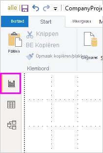
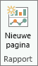
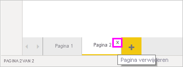
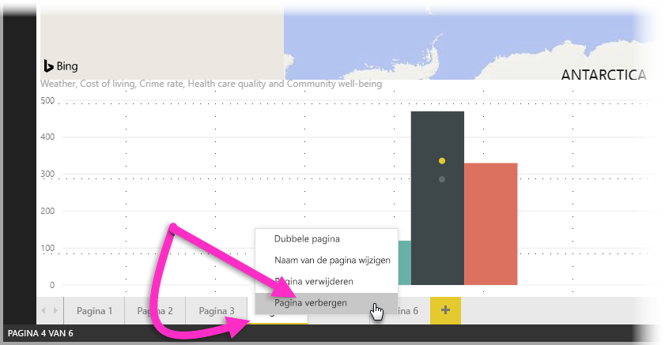
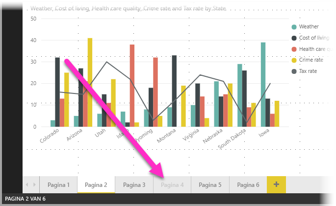

# Werken met de rapportweergave in Power BI Desktop

Als u met Power BI hebt gewerkt, dan weet u hoe eenvoudig het is om rapporten te maken met dynamische perspectieven en inzichten in uw gegevens. Power BI heeft nog meer geavanceerde functies in Power BI Desktop. Met Power BI Desktop kunt u geavanceerde query's uitvoeren, een mashup maken van gegevens uit meerdere bronnen, relaties tussen tabellen maken en nog veel meer.

Power BI Desktop omvat een *rapportweergave*, waarin u een willekeurig aantal rapportpagina's met visuele elementen kunt maken. De rapportweergave in Power BI Desktop biedt een vergelijkbare ontwerpervaring als de bewerkingsweergave van het rapport in de *Power BI-service*. U kunt er visualisaties verplaatsen, kopiëren en plakken, samenvoegen enzovoort.

Het verschil is dat u in Power BI Desktop met uw query's kunt werken en gegevens kunt modelleren om ervoor te zorgen dat uw rapporten de beste inzichten geven in uw gegevens. U kunt uw Power BI Desktop-bestand vervolgens opslaan waar u wilt, bijvoorbeeld op de lokale harde schijf of in de cloud.

## Laten we dit eens bekijken.

Wanneer u de eerste keer gegevens in Power BI Desktop laadt, ziet u de rapportweergave met een leeg canvas, met koppelingen om u te helpen bij het toevoegen van gegevens aan het rapport.

U kunt schakelen tussen de **rapportweergave**, **gegevensweergave** en **relatieweergave** door de pictogrammen in het navigatiedeelvenster aan de linkerkant te selecteren:

Zodra u gegevens hebt toegevoegd, kunt u velden toevoegen aan een nieuwe visualisatie op het canvas.

Als u het type visualisatie wilt wijzigen, selecteert u de visualisatie op het canvas. Vervolgens selecteert u een nieuw type in **Visualisaties**.

> [!TIP]
> Experimenteer met verschillende visualisatietypen. Het is belangrijk dat uw visualisatie de informatie over uw gegevens duidelijk naar voren brengt.

Een rapport bevat ten minste één lege pagina om mee te beginnen. De pagina's worden links van het canvas in de navigatiebalk weergegeven. U kunt allerlei soorten visuele elementen aan een pagina toevoegen, maar het is belangrijk dat u er niet te veel gebruikt. Te veel visualisaties op een pagina maken deze onoverzichtelijk, waardoor de juiste informatie lastig te vinden is. U kunt nieuwe pagina's toevoegen aan het rapport. U klikt in het lint gewoon op **Nieuwe pagina**.

Als u een pagina wilt verwijderen, klikt u op de **x** op het tabblad van de pagina onder aan de rapportweergave.

> [!NOTE]
> Rapporten en visuele elementen kunnen in Power BI Desktop niet worden vastgemaakt aan een dashboard. Als u dit wilt doen, moet u publiceren op uw Power BI-site. Raadpleeg [Gegevenssets en rapporten publiceren vanuit Power BI Desktop](desktop-upload-desktop-files.md) voor meer informatie.

## Kopiëren en plakken van het ene naar het andere rapport

U kunt een visual uit een Power BI Desktop-rapport gemakkelijk kopiëren en in een ander rapport plakken. Gebruik de sneltoets Ctrl+C om uw rapportvisual te kopiëren. In het andere Power BI Desktop-rapport gebruikt u Ctrl+V om de visual in het andere rapport te plakken. U kunt één visual per keer selecteren, of alle visuals op een pagina selecteren en ze vervolgens kopiëren en plakken in het beoogde Power BI Desktop-rapport.

De mogelijkheid om visuals te kopiëren en plakken is handig voor personen die regelmatig meerdere rapporten maken en bijwerken. Wanneer u elementen naar andere bestanden kopieert, worden de instellingen en opmaak die specifiek zijn ingesteld in het opmaakvenster, ook toegepast in het nieuwe bestand. Visuals die zijn gebaseerd op een thema of de standaardinstellingen, worden automatisch bijgewerkt, zodat ze overeenkomen met het thema van het doelrapport. Als u een visual dus volledig naar wens hebt opgemaakt, kunt u die eenvoudig kopiëren en plakken naar nieuwe rapporten zonder dat uw werk verloren gaat.

Als de velden in uw model afwijken, geeft de visual een foutmelding en een waarschuwing over welke velden niet bestaan. De fout is vergelijkbaar met de fout die optreedt wanneer u een veld uit het model verwijdert dat door de visual wordt gebruikt.

Als u deze fout wilt oplossen, vervangt u de betreffende velden met door u gekozen velden uit het model in het rapport waarin u de visual hebt geplakt. Als u een aangepaste visual gebruikt, moet u de aangepaste visual ook in het doelrapport importeren.

## Rapportpagina’s verbergen

Als u een rapport maakt, kunt u ook pagina's uit een rapport verbergen. Deze aanpak kan nuttig zijn als u onderliggende gegevens of visuals in een rapport wilt maken, maar u niet wilt dat anderen deze pagina's kunnen zien, bijvoorbeeld als u tabellen of ondersteunende visuals maakt die ook op andere rapportpagina’s worden gebruikt. Er zijn veel andere creatieve redenen te bedenken waarom u een rapportpagina zou willen maken die u vervolgens wilt verbergen voor een rapport dat u wilt publiceren.

Een rapportpagina verbergen is eenvoudig. Klik met uw rechtermuisknop op het tabblad Rapportpagina en selecteer **Verbergen** in het menu dat dan verschijnt.

Er zijn enkele overwegingen waarmee u rekening moet houden als u een rapportpagina verbergt:

* In Power BI Desktop kunt u nog steeds een weergave van een verborgen rapport zien, zelfs als de titel van de pagina in het grijs wordt weergegeven. In de volgende afbeelding is pagina 4 verborgen.

    

* U kunt een verborgen rapportpagina *niet* zien als u het rapport weergeeft in de Power BI-service.

* Een rapportpagina verbergen is *geen* veiligheidsmaatregel. Gebruikers kunnen nog steeds toegang krijgen tot de pagina en de inhoud is nog steeds toegankelijk door middel van detailanalyse of andere methoden.

* Als een pagina in de Weergavemodus verborgen is, worden er geen navigatiepijlen weergegeven.
