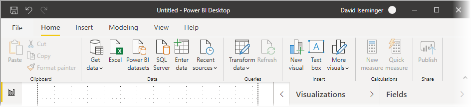

# Het bijgewerkte lint in Power BI Desktop gebruiken

Het ontwerp van het lint in Power BI Desktop is aangepast. Het uiterlijk en de ervaring zijn nu beter afgestemd op andere Microsoft-producten, zoals Microsoft Office.

## Het bijgewerkte lint inschakelen

Het bijgewerkte lint is algemeen verkrijgbaar vanaf de release van Power BI Desktop van mei 2020. Vanaf de update van maart 2020 is het bijgewerkte lint standaard ingeschakeld. 

## Functies van het bijgewerkte lint

De voordelen van het bijwerken van het lint zijn bedoeld om uw ervaring tijdens het gebruik van Power BI Desktop, alsook andere Microsoft-producten, eenvoudig en vertrouwd te maken. 

Deze voordelen kunnen worden gegroepeerd in de volgende categorieën:

* **Verbeterd uiterlijk en verbeterde organisatie**: pictogrammen en functies op het bijgewerkte Power BI Desktop-lint zijn afgestemd op het uiterlijk en de organisatie van lintitems in Office-toepassingen.

    

* **Een intuïtieve themagalerie**: de galerie met thema's, die u vindt op het lint **Weergave**, heeft het vertrouwde uiterlijk van de PowerPoint-themagalerie. Als zodanig laten de afbeeldingen op het lint zien hoe de themawijzigingen eruit zien als ze worden toegepast op het rapport, zoals kleurencombinaties en lettertypen. 

    

* **Dynamische lintinhoud op basis van uw weergave**: op het bestaande lint voor Power BI Desktop werden pictogrammen en opdrachten die niet beschikbaar waren, grijs weergegeven, wat de ervaring niet optimaal maakte. Op het bijgewerkte lint worden pictogrammen dynamisch weergegeven en gerangschikt, zodat u altijd weet welke opties beschikbaar zijn voor u, in context.

* **Een samengevouwen lint met één regel bespaart ruimte**: een ander voordeel van het bijgewerkte lint is de mogelijkheid om het lint samen te vouwen tot één regel, waarna lintitems dynamisch worden weergegeven op basis van uw context. 

    

* **Keytips voor navigatie en selectieknoppen**: u kunt op **Alt + Windows-toets** drukken om keytips te activeren om gemakkelijker door het lint te navigeren. Nadat u de keytips hebt geactiveerd, kunt u op de weergegeven toetsen op het toetsenbord drukken om te navigeren.

    

* **Tekenreeksen met aangepaste notatie**: naast het instellen van tekenreeksen met aangepaste notatie in het deelvenster *Eigenschappen* kunt u deze ook instellen op het lint. Selecteer de meting of de kolom die u wilt aanpassen. Afhankelijk van uw selectie wordt er een contextgevoelig tabblad **Meethulpmiddelen** of **Kolomhulpmiddelen** weergegeven. In het opmaakgedeelte van dat tabblad kunt u uw tekenreeks met aangepaste notatie rechtstreeks in de vervolgkeuzelijst typen.

    

* **Toegankelijkheid**: de titelbalk, het lint en het menu Bestand zijn volledig toegankelijk. Druk op CTRL + F6 om naar het lintgedeelte te navigeren. Daar kunt u **Tab** gebruiken om tussen de bovenste en onderste balken te schakelen en de pijltoetsen gebruiken om tussen elementen te schakelen.

Naast deze zichtbare wijzigingen stelt een bijgewerkt lint ons ook in staat om in de toekomst updates door te voeren in Power BI Desktop en het bijbehorende lint, zoals bijvoorbeeld:

* Meer flexibele en intuïtieve besturingselementen maken op het lint, zoals de galerie met visuals
* De *zwarte* en *donkergrijze* Office-thema’s toevoegen aan Power BI Desktop
* Toegankelijkheid verbeteren

## Volgende stappen
Met Power BI Desktop kunt u verbinding maken met allerlei andere gegevens. Bekijk de volgende bronnen voor meer informatie over gegevensbronnen:

* [Wat is Power BI Desktop?](../fundamentals/desktop-what-is-desktop.md)
* [Data Sources in Power BI Desktop](../connect-data/desktop-data-sources.md) (Gegevensbronnen in Power BI Desktop)
* [Shape and Combine Data with Power BI Desktop](../connect-data/desktop-shape-and-combine-data.md) (Gegevens vormgeven en combineren met Power BI Desktop)
* [Connect to Excel workbooks in Power BI Desktop](../connect-data/desktop-connect-excel.md) (Verbinding maken met Excel-werkmappen in Power BI Desktop)   
* [Enter data directly into Power BI Desktop](../connect-data/desktop-enter-data-directly-into-desktop.md) (Rechtstreeks gegevens in Power BI Desktop invoeren)   
