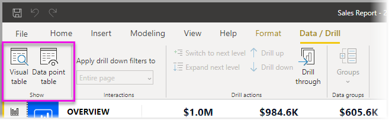
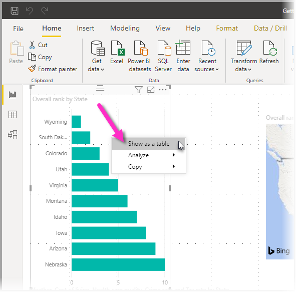

# Visuele tabel en gegevenspunttabel gebruiken in Power BI Desktop
In **Power BI Desktop** kunt u inzoomen op de gegevens van een visualisatie en ziet u tekstweergaven van de onderliggende gegevens of de afzonderlijke gegevensrecords voor de geselecteerde visual. Deze functies worden soms aangeduid met *doorklikken*, *drillthrough* of *drillthrough naar details*.

U kunt **Visuele tabel** gebruiken om de gegevens in een visual als een tabel weer te geven. Gebruik **Gegevenspunttabel** om een tabel weer te geven van de gegevens die zijn gebruikt voor het berekenen van één gegevenspunt. 

>[!IMPORTANT]
>**Visuele tabel** en **Gegevenspunttabel** ondersteunen alleen de volgende visualisatietypen:
>  - Staafdiagram
>  - Kolomdiagram
>  - Ringdiagram
>  - Choropletenkaart
>  - Trechterdiagram
>  - Kaart
>  - Cirkeldiagram
>  - Treemap

## Visuele tabel gebruiken in Power BI Desktop

Met **Visuele tabel** ziet u de onderliggende gegevens van een visualisatie. **Visuele tabel** bevindt zich op het tabblad **Gegevens/analyseren** in de sectie **Weergeven** van het lint wanneer er een visual is geselecteerd.

U kunt de gegevens ook bekijken door met de rechtermuisknop op een visual te klikken en vervolgens **Gegevens weergeven** te selecteren in het menu dat wordt weergegeven. U kunt ook **Meer opties** (...) selecteren in de rechterbovenhoek van een visual en vervolgens **Weergeven als tabel** selecteren.

&nbsp;&nbsp;

> [!NOTE]
> Houd de muisaanwijzer boven een gegevenspunt in de visual, zodat het snelmenu zichtbaar wordt.

Wanneer u **Visuele tabel** of **Gegevenspunttabel** selecteert, wordt op het Power BI Desktop-canvas zowel de visual als de tekstweergave van de gegevens weergegeven. De visual wordt in de *horizontale weergave* weergegeven op het bovenste gedeelte van het canvas; de gegevens worden weergegeven op de onderste helft. 

U kunt schakelen tussen de horizontale weergave en een *verticale weergave* door het pictogram in de rechterbovenhoek van het canvas te selecteren.

Als u terug wilt gaan naar het rapport, selecteert u **< Terug naar rapport** in de linkerbovenhoek van het canvas.

## Gegevenspunttabel gebruiken in Power BI Desktop

U kunt zich ook focussen op één gegevensrecord in een visualisatie en inzoomen op de achterliggende gegevens. Als u **Gegevenspunttabel** wilt gebruiken, selecteert u een visualisatie, selecteert u **Gegevenspunttabel** op het tabblad **Gegevens/analyseren** in de sectie **Weergeven** van het lint en selecteert u vervolgens een gegevenspunt of rij van de visualisatie. 

> [!NOTE]
> Als de knop **Gegevenspunttabel** op het lint is uitgeschakeld en niet beschikbaar is, betekent dit dat de geselecteerde visualisatie geen ondersteuning biedt voor **Gegevenspunttabel**.

U kunt ook met de rechtermuisknop op een gegevenselement klikken en **Gegevenspunttabel** kiezen in het menu dat verschijnt.

Wanneer u **Gegevenspunttabel** selecteert voor een gegevenselement, worden op het Power BI Desktop-canvas alle gegevens weergegeven die zijn gekoppeld aan het geselecteerde element. 

Als u terug wilt gaan naar het rapport, selecteert u **< Terug naar rapport** in de linkerbovenhoek van het canvas.

> [!NOTE]
>**Gegevenspunttabel** heeft de volgende beperkingen:
> - U kunt de gegevens in de weergave **Gegevenspunttabel** niet wijzigen en in het rapport opslaan.
> - U kunt **Gegevenspunttabel** niet gebruiken als voor de visual een berekende meting wordt gebruikt.
> - U kunt **Gegevenspunttabel** niet gebruiken als u bent verbonden met een live, multidimensionaal model (MD).

## Volgende stappen
**Power BI Desktop** bevat diverse functies voor gegevensbeheer en het opmaken van rapporten. Bekijk de volgende bronnen voor enkele voorbeelden:

* [Use grouping and binning in Power BI Desktop](desktop-grouping-and-binning.md) (Groeperen en binning in Power BI Desktop gebruiken)
* [Use gridlines, snap-to-grid, z-order, alignment and distribution in Power BI Desktop reports](desktop-gridlines-snap-to-grid.md) (Rasterlijnen, Uitlijnen op raster, Z-volgorde, Uitlijnen en Verdelen gebruiken in Power BI Desktop-rapporten)

