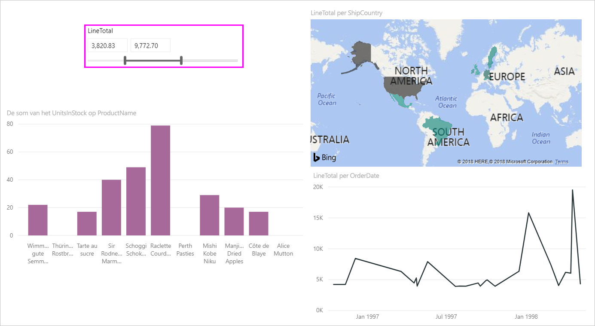
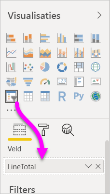
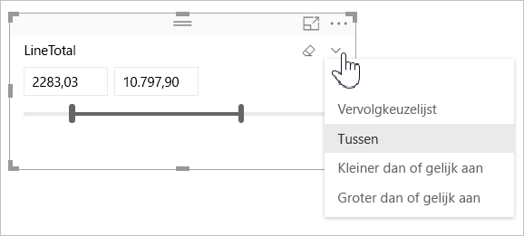
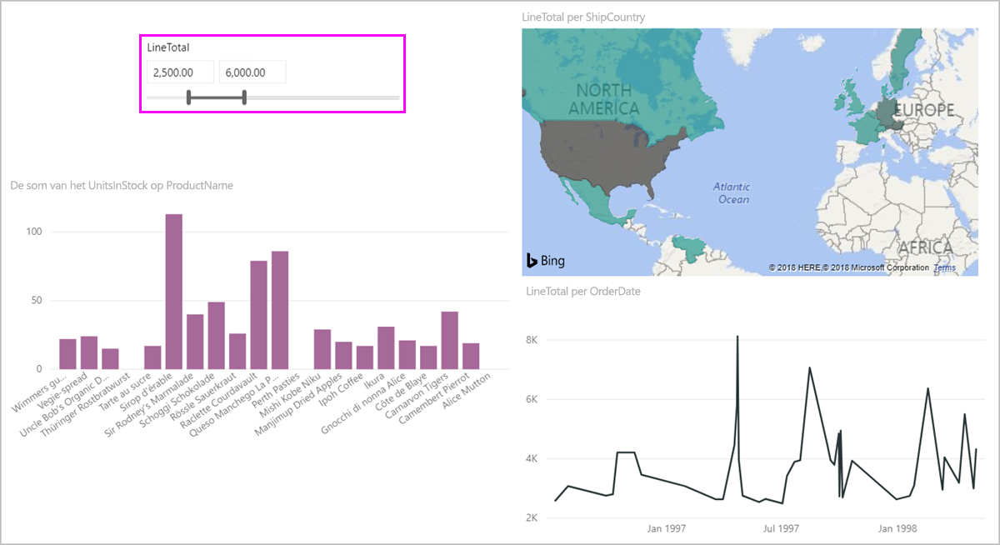
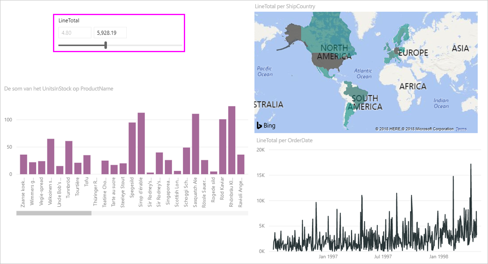
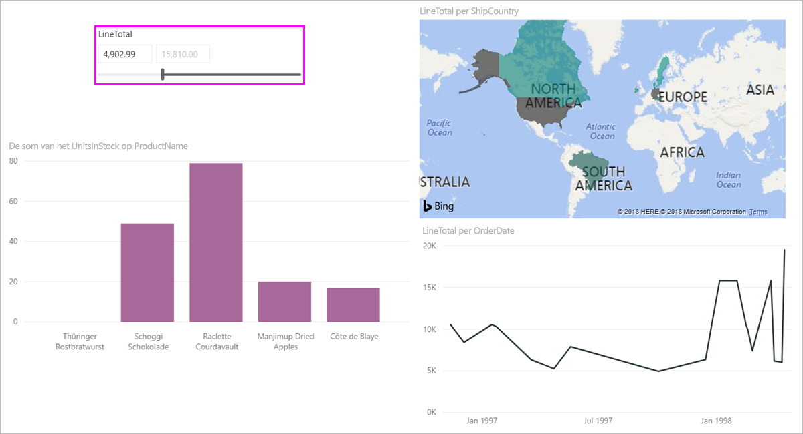

# De slicer voor numeriek bereik in Power BI gebruiken

[!INCLUDE [applies-to](../includes/applies-to.md)] [!INCLUDE [yes-desktop](../includes/yes-desktop.md)] [!INCLUDE [yes-service](../includes/yes-service.md)]

Met de slicer voor numeriek bereik kunt u allerlei filters toepassen op numerieke kolommen in uw gegevensmodel. Er zijn drie opties om uw numerieke gegevens te filteren: tussen getallen, kleiner dan of gelijk aan een getal of groter dan of gelijk aan een getal. Deze eenvoudige techniek is een krachtige manier om uw gegevens te filteren.

## video

In deze video wordt uitgelegd hoe u een slicer voor een numeriek bereik maakt.

> [!NOTE]
> Deze video maakt gebruik van een oudere versie van Power BI Desktop.

<iframe width="560" height="315" src="https://www.youtube.com/embed/zIZPA0UrJyA" frameborder="0" allowfullscreen></iframe> 

## Een slicer voor numeriek bereik toevoegen

U kunt de slicer voor numeriek bereik net als elke andere slicer gebruiken. U maakt gewoon een **slicer**-visual voor uw rapport en selecteert vervolgens een numerieke waarde voor de waarde **Veld**. In de volgende afbeelding is het veld **LineTotal** geselecteerd.

Selecteer de pijl-omlaag in de rechterbovenhoek van de slicer voor numeriek bereik. Er wordt een menu weergegeven.

Voor het numerieke bereik kunt u kiezen uit de volgende drie opties:

* **Tussen**
* **Kleiner dan of gelijk aan**
* **Groter dan of gelijk aan**

Wanneer u **Tussen** in het menu selecteert, wordt er een schuifregelaar weergegeven. Met de schuifregelaar kunt u numerieke waarden selecteren die tussen de getallen liggen. Door de granulariteit van de slicerbalkverplaatsingen is het soms lastig om precies op het goede getal te belanden. U kunt ook de schuifregelaar gebruiken en de gewenste waarden invoeren in de vakjes. Deze optie is handig als u op specifieke getallen wilt slicen.

In de volgende afbeelding is de rapportpagina gefilterd op **LineTotal**-waarden binnen een bereik van 2500,00 tot 6000,00.

Wanneer u **Kleiner dan of gelijk aan** selecteert, verdwijnt de linkergreep (lagere waarde) van de schuifregelaar en kunt u alleen de bovengrens van de schuifregelaar aanpassen. In de volgende afbeelding is het maximum van de schuifregelaar ingesteld op 5928.19.

Wanneer u tot slot **Groter dan of gelijk aan** selecteert, verdwijnt de rechtergreep van de schuifregelaar (hogere waarde). U kunt vervolgens de lagere waarde aanpassen, zoals op de volgende afbeelding te zien is. Nu worden alleen items met een **LineTotal** groter dan of gelijk aan 4902,99 weergegeven in de visuals op de rapportpagina.

## Uitlijnen op hele getallen met de slicer met numeriek bereik

Met een slicer met numeriek bereik wordt uitgelijnd op gehele getallen als het gegevenstype van het onderliggende veld *Geheel getal* is. Hierdoor kunt u met de slicer foutloos uitlijnen op gehele getallen. Met velden van het type *Decimaal getal* kunt u fracties van een getal invoeren of selecteren. De opmaak die is ingesteld in het tekstvak komt overeen met de opmaak die is ingesteld voor het veld, hoewel u ook preciezere getallen kunt invoeren of selecteren.

## Opmaak weergeven met de slicer voor het datumbereik

Wanneer u een slicer gebruikt om een datumbereik weer te geven of in te stellen, worden de datums weergegeven in de *korte datumnotatie*. De datumnotatie wordt bepaald door de taal van de browser of van het besturingssysteem van de gebruiker. Dat wordt de weergavenotatie, ongeacht hoe de gegevenstypen van de onderliggende gegevens of het onderliggende model zijn ingesteld.

Stel dat u bijvoorbeeld een lange datumnotatie heeft voor het onderliggende gegevenstype. In dat geval zou een datumnotatie zoals *dddd, MMMM d, jjjj* in andere visuals of omstandigheden de notatie *Woensdag, maart 14, 2001* krijgen. In de slicer voor datumbereik wordt die datum echter weergegeven als *03/14/2001*.

Door de korte datumnotatie in de slicer weer te geven, blijft de lengte van de tekenreeks consistent en compact in de slicer.

## Beperkingen en overwegingen

De volgende beperkingen en overwegingen zijn van toepassing op de slicer met numeriek bereik:

* Met de slicer voor numeriek bereik worden alle onderliggende rijen in de gegevens gefilterd, geen aggregatiewaarden. Stel dat u een gebruikmaakt van een veld *Verkoophoeveelheid*. Met de slicer wordt elke transactie gefilterd op basis van de verkoophoeveelheid, niet op basis van de som van de verkoophoeveelheid van elk gegevenspunt van een visual.
* Deze slicer werkt momenteel niet met metingen.
* U kunt een willekeurig getal invoeren in de slicer met numeriek bereik, zelfs als dit getal buiten het bereik van de waarden in de onderliggende kolom ligt. Met deze optie kunt u filters instellen als u weet dat de gegevens in de toekomst kunnen veranderen.
