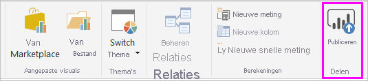
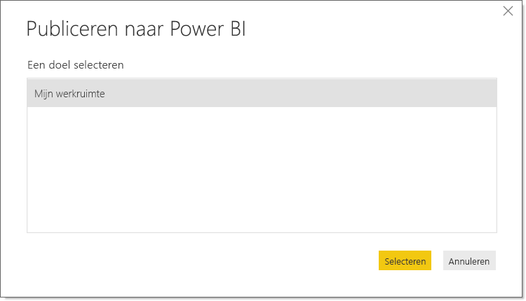
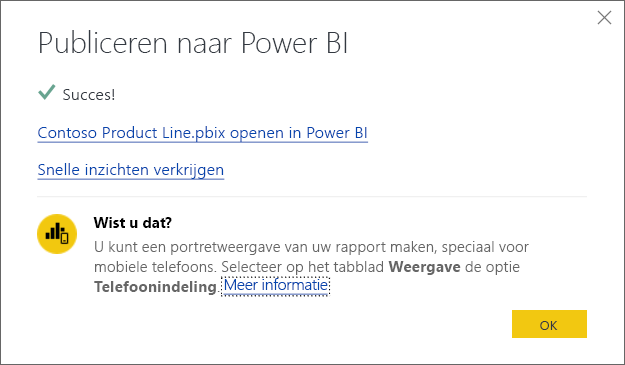
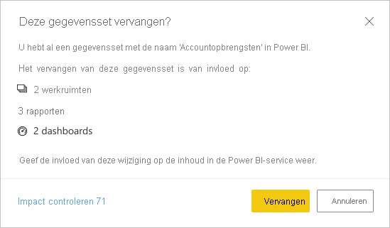

# Gegevenssets en rapporten van Power BI Desktop publiceren
Als u een Power BI Desktop-bestand publiceert naar de Power BI-service, publiceert u de gegevens in het model naar uw Power BI-werkruimte. Dit geldt ook voor rapporten die u in de **rapportweergave** hebt gemaakt. U ziet een nieuwe gegevensset met dezelfde naam (en eventuele rapporten) in uw werkruimtenavigator.

Het publiceren vanuit Power BI Desktop heeft hetzelfde effect als **Gegevens ophalen** gebruiken in Power BI om verbinding te maken met een Power BI Desktop-bestand en er gegevens naar te uploaden.

> [!NOTE]
> Wijzigingen die u in het rapport in Power BI aanbrengt, worden niet opnieuw opgeslagen in het oorspronkelijke Power BI Desktop-bestand. Dit geldt ook wanneer u visualisaties in rapporten toevoegt, verwijdert of wijzigt.
> 
> 

## Power BI Desktop-gegevenssets en -rapporten publiceren
1. In Power BI Desktop kiest u **Bestand** \> **Publiceren** \> **Publiceren naar Power BI** of klikt u op **Publiceren** op het lint.  

   

2. Meld u aan bij Power BI.
3. Selecteer het doel.

   

Wanneer de publicatie is voltooid, ontvangt u een koppeling naar uw rapport. Selecteer de koppeling om het rapport in uw Power BI-site te openen.

## Een vanuit Power BI Desktop gepubliceerde gegevensset opnieuw publiceren of vervangen
De gegevensset en eventuele rapporten die u in Power BI Desktop hebt gemaakt, worden geüpload naar uw Power BI-site als u een Power BI Desktop-bestand publiceert. Als u uw Power BI Desktop-bestand opnieuw publiceert, wordt de gegevensset op uw Power BI-site vervangen door de bijgewerkte gegevensset uit het Power BI Desktop-bestand.

Dit proces is erg eenvoudig, maar u mag een paar dingen niet vergeten:

* Als er al twee of meer gegevenssets in Power BI zijn met dezelfde naam als het Power BI Desktop-bestand, kan het publiceren mislukken. Zorg ervoor dat u slechts één gegevensset in Power BI hebt met dezelfde naam. U kunt het bestand ook een andere naam geven en dit publiceren, waardoor u een nieuwe gegevensset maakt met dezelfde naam als het bestand.
* Als u een kolom of meting verwijdert of een andere naam geeft, raken eventuele visuele elementen die al in Power BI met dat veld voorkomen, beschadigd. 
* Power BI negeert een aantal wijzigingen aan de indeling van bestaande kolommen. Bijvoorbeeld als u de indeling van een kolom wijzigt van 0,25 in 25%.
* Stel dat u een vernieuwingsschema hebt dat is geconfigureerd voor uw bestaande gegevensset in Power BI. Wanneer u nieuwe gegevensbronnen aan uw bestand toevoegt en het bestand vervolgens opnieuw publiceert, moet u zich hierbij aanmelden vóór de volgende geplande vernieuwing.
* Wanneer u opnieuw een gegevensset publiceert die eerder vanaf Power BI Desktop is gepubliceerd en u een vernieuwingsschema hebt gedefinieerd, wordt het vernieuwen van de gegevensset gestart zodra u deze opnieuw hebt gepubliceerd.
* Wanneer u een wijziging aanbrengt in een gegevensset en de gegevensset vervolgens opnieuw publiceert, wordt een bericht weergegeven met het aantal werkruimten, rapporten en dashboards dat mogelijk door de wijziging wordt beïnvloed. U wordt ook gevraagd om te bevestigen dat u de momenteel gepubliceerde gegevensset wilt vervangen door de gegevensset die u hebt gewijzigd. Het bericht bevat ook een koppeling naar de volledige impactanalyse van de gegevensset in de Power BI-service, waar u meer informatie vindt en actie kunt ondernemen om de risico's van uw wijziging te beperken.

   

   [Lees meer over de impactanalyse voor gegevenssets](../collaborate-share/service-dataset-impact-analysis.md).