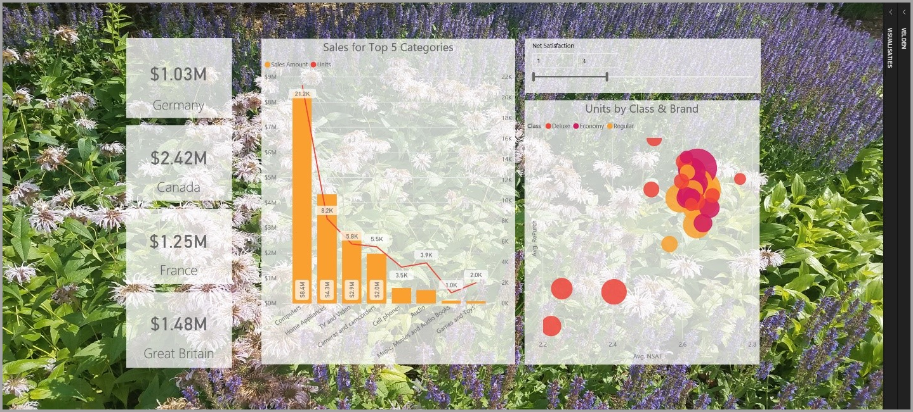
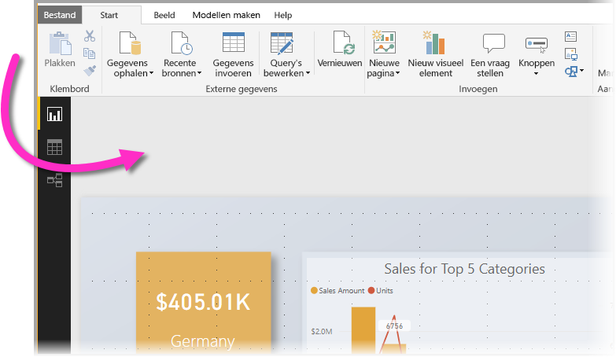
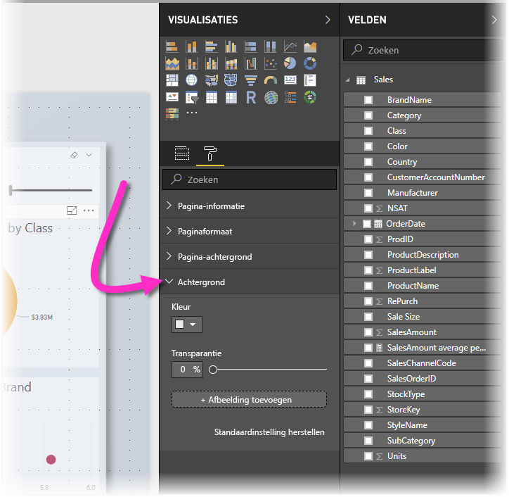
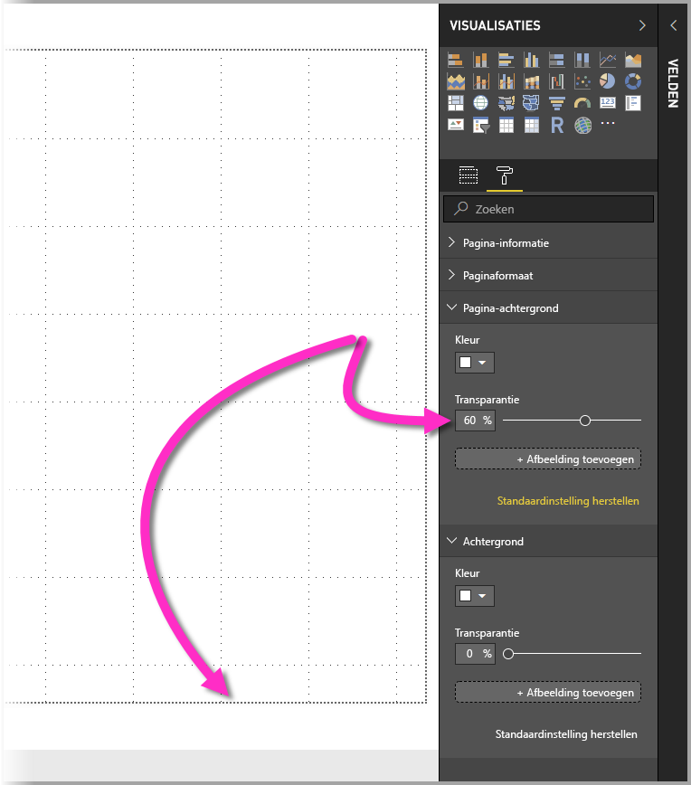
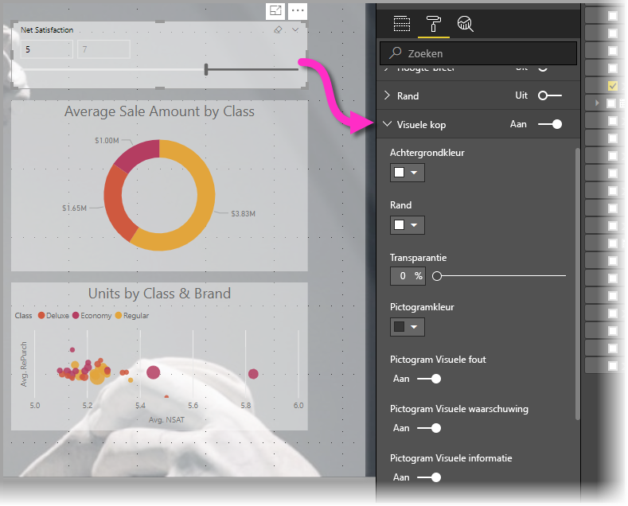
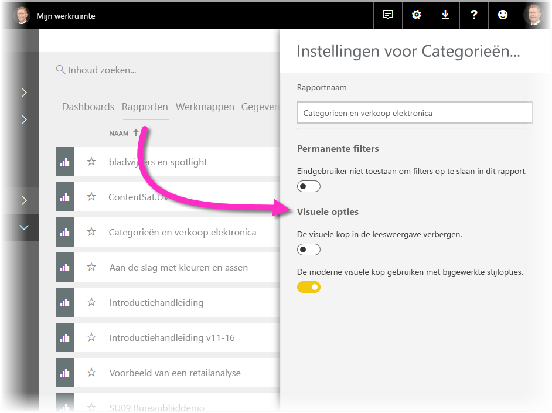
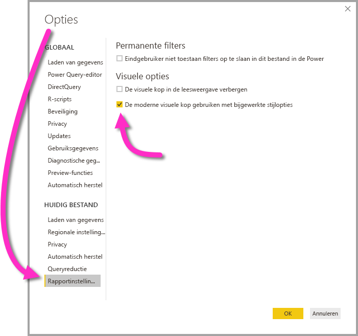

# Power BI-rapporten verbeteren met visualisaties

Met **Power BI Desktop** kunt u visuele elementen, zoals achtergronden en verbeterde visuele koppen voor visualisaties, gebruiken om zo de weergave van uw rapporten te verbeteren.

Vanaf de release van juli 2018 van **Power BI Desktop** zijn er verbeteringen beschikbaar voor gebruik in uw rapporten om uw analyses en rapporten nog aantrekkelijker te maken. In dit artikel bespreken we de volgende verbeteringen: 

* Een **achtergrond** gebruiken voor rapporten om zo onderdelen van het verhaal dat u wilt vertellen met uw gegevens te verbeteren of benadrukken.
* Verbeterde **visuele koppen** gebruiken voor afzonderlijke visualisaties om perfect uitgelijnde visualisaties te maken op het rapportcanvas. 

In de volgende secties wordt beschreven hoe u deze verbeteringen gebruikt en hoe u ze toepast op uw rapporten.

## Achtergrond gebruiken in Power BI-rapporten

U kunt het grijze gebied buiten de rapportpagina opmaken met behulp van een **achtergrond**. In de volgende afbeelding wijst de pijl naar het gebied waarop de achtergrond wordt toegepast. 

U kunt een achtergrond instellen voor afzonderlijke pagina's van een rapport of voor elke pagina in het rapport dezelfde achtergrond gebruiken. Als u een achtergrond wilt instellen, tikt of klikt u op het pictogram **Opmaak** wanneer er geen visualisatie is geselecteerd in uw rapport. U ziet nu de kaart **Achtergrond** in het deelvenster.

U kunt een kleur kiezen om toe te passen als **achtergrond** door de vervolgkeuzelijst **Kleur** te openen. Selecteer de knop **Afbeelding toevoegen** om een afbeelding te selecteren die u als achtergrond wilt gebruiken. Met behulp van de schuifregelaar **Transparantie** kunt u de achtergrond ook meer of minder doorzichtig maken. Dit kan voor een achtergrond in de vorm van een kleur of een afbeelding.

De volgende definities zijn handig om te weten als het gaat om **achtergronden**:

* Het grijze gebied buiten uw rapportgebied is de **achtergrond**.
* Het gebied in het canvas waar u visualisaties kunt plaatsen, wordt de **rapportpagina** genoemd. Gebruik de vervolgkeuzelijst **Pagina-achtergrond** in het deelvenster **Opmaak** om deze te wijzigen.

De **rapportpagina** bevindt zich altijd op de voorgrond (in verhouding tot de achtergrond), terwijl de **achtergrond** zich achter de rapportpagina bevindt en het meest naar achteren gelegen element op de rapportpagina is. Wanneer u transparantie toepast op de pagina, geldt dit ook voor de visualisaties in uw rapport ook doorzichtigheid toegepast, zodat uw achtergrond door de visualisaties zichtbaar blijft.

Dit zijn de standaardinstellingen voor alle nieuwe rapporten:

* De **rapportpagina** is ingesteld op **wit** en de transparantie op **100%**
* De **achtergrond** is ingesteld op **wit** en de transparantie op **0%**

Als u de transparantie van de pagina-achtergrond instelt op meer dan 50%, wordt er een rand met een stippellijn weergegeven terwijl u het rapport maakt of bewerkt, zodat u weet waar het rapportcanvas ophoudt. 

Het is belangrijk om te weten dat de rand met een stippellijn *alleen* wordt weergegeven tijdens het bewerken van uw rapport en dat deze *niet* zichtbaar is voor personen die uw gepubliceerde rapport bekijken, bijvoorbeeld in de **Power BI-service**.

> [!NOTE]
> Als u donkere kleuren als achtergrond gebruikt en de kleur van de tekst instelt op wit of een zeer lichte kleur, moet u zich ervan bewust zijn dat de functie **Exporteren naar PDF** niet geldt voor de achtergrond. Daarom wordt een wit lettertype bij exporteren bijna onzichtbaar in het geëxporteerde PDF-bestand. Zie [Exporteren naar PDF](desktop-export-to-pdf.md) voor meer informatie over **Exporteren naar PDF**.

## Verbeterde visuele koppen gebruiken in Power BI-rapporten

Sinds de release van juli 2018 van **Power BI Desktop** zijn de koppen voor visualisaties in rapporten aanzienlijk verbeterd. De belangrijkste verbeteringen zijn dat de kop is losgekoppeld van de visualisatie, zodat de positie van de kop kan worden aangepast op basis van uw voorkeur ten aanzien van indeling en positie, en dat de kop nu wordt weergegeven in de visualisatie zelf in plaats van zwevend erboven. 

Koppen worden standaard weergegeven in de visualisatie, uitgelijnd met de titel. In de volgende afbeelding ziet u de kop (het pictogram van een punaise, het pictogram voor uitvouwen en de weglatingstekens) binnen de visualisatie en rechts uitgelijnd, langs dezelfde horizontale positie als de titel van de visualisatie.

Als uw visualisatie geen titel heeft, zweeft de kop boven de bovenrand van de visualisatie, rechts uitgelijnd, zoals wordt weergegeven in de volgende afbeelding. 

Als uw visualisatie helemaal bovenaan het rapport staat, wordt de visuele kop naar de onderzijde van de visualisatie verplaatst. 

Elke visualisatie heeft ook een kaart in het gedeelte **Opmaak** van het deelvenster **Visualisaties**, met de naam **Visuele kop**. Op die kaart kunt u allerlei soorten kenmerken van de visuele kop aanpassen.

> [!NOTE]
> De zichtbaarheid van schakelknoppen heeft geen invloed op uw rapport wanneer u het rapport samenstelt of wijzigt. U moet het rapport publiceren en weergeven in de leesmodus om het effect te kunnen zien. Dit gedrag zorgt ervoor dat de vele opties voor visuele koppen belangrijk zijn bij het bewerken, met name waarschuwingspictogrammen die u waarschuwen voor problemen tijdens het bewerken.

Voor rapporten die alleen worden weergegeven in de **Power BI-service** kunt u het gebruik van visuele koppen aanpassen door naar **Mijn werkruimte > Rapporten** te gaan en vervolgens het pictogram **Instellingen** te selecteren. U ziet nu instellingen voor het rapport waarvoor u **Instellingen** hebt geselecteerd en u kunt de instellingen van daaruit aanpassen, zoals wordt weergegeven in de volgende afbeelding.

### Verbeterde visuele koppen inschakelen voor bestaande rapporten

De nieuwe visuele kop is het standaardgedrag voor alle nieuwe rapporten. Voor bestaande rapporten moet u dit gedrag inschakelen in **Power BI Desktop**. Ga hiervoor naar **Bestand > Opties en instellingen > Opties** en schakel vervolgens in het gedeelte **Rapportinstellingen** het selectievakje **Gebruik de moderne visuele kop met de bijgewerkte opmaakopties** in.

## Volgende stappen
Lees de volgende artikelen voor meer informatie over **Power BI Desktop** en hoe u aan de slag kunt.

* [Wat is Power BI Desktop?](../fundamentals/desktop-what-is-desktop.md)
* [Queryoverzicht met Power BI Desktop](../transform-model/desktop-query-overview.md)
* [Gegevensbronnen in Power BI Desktop](../connect-data/desktop-data-sources.md)
* [Connect to Data in Power BI Desktop](../connect-data/desktop-connect-to-data.md) (Verbinding maken met gegevens in Power BI Desktop)
* [Gegevens vormgeven en combineren met Power BI Desktop](../connect-data/desktop-shape-and-combine-data.md)
* [Algemene querytaken in Power BI Desktop](../transform-model/desktop-common-query-tasks.md)   
