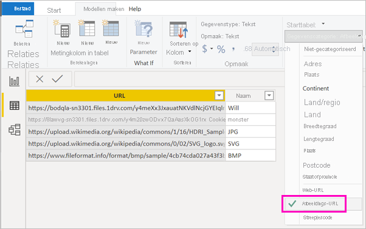

# Afbeeldingen weergeven in een tabel, matrix of slicer in een rapport

Een goede manier om rapporten te verbeteren is door er afbeeldingen aan toe te voegen. Statische afbeeldingen op de pagina zijn goed voor sommige doeleinden. Maar soms wilt u afbeeldingen die betrekking hebben op de gegevens in uw rapport. In dit onderwerp leert u hoe u afbeeldingen kunt weergeven in een tabel, matrix, slicer of kaart met meerdere rijen. 

## Afbeeldingen aan uw rapport toevoegen

1. Maak een kolom met de URL's van de afbeeldingen. Zie [Overwegingen](#considerations) verderop in dit artikel voor de vereisten.

1. Selecteer de kolom. Selecteer op het lint **Modelweergave** bij **Gegevenscategorie** de optie **Afbeeldings-URL**.

    

1. Voeg de kolom toe aan een tabel, matrix, slicer of kaart met meerdere rijen.

    

## Overwegingen

- De afbeelding moet de bestandsindeling .bmp, .jpg, .jpeg, .gif, .png of .svg hebben
- De URL moet anoniem toegankelijk zijn en mag niet een site zijn waarvoor men zich moet aanmelden, zoals SharePoint. Als afbeeldingen worden gehost op SharePoint of OneDrive, kunt u mogelijk een invoegcode ophalen die direct naar de afbeeldingen verwijst. 

## Volgende stappen

[Pagina-indeling en -opmaak](/learn/modules/visuals-in-power-bi/12-formatting)

[Basisconcepten voor ontwerpers in de Power BI-service](../fundamentals/service-basic-concepts.md)

Nog vragen? [Misschien dat de Power BI-community het antwoord weet](https://community.powerbi.com/)
