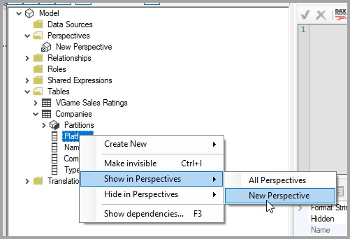
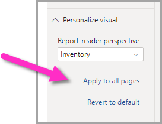

# Gebruikers de mogelijkheid geven om visuals in een rapport aan te passen

[!INCLUDE [applies-to](../includes/applies-to.md)] [!INCLUDE [yes-desktop](../includes/yes-desktop.md)] [!INCLUDE [yes-service](../includes/yes-service.md)]

Wanneer u een rapport met een breed publiek deelt, willen sommige van uw gebruikers mogelijk enigszins verschillende weergaven van bepaalde visuals zien. Misschien willen ze elementen op de as omwisselen, het type visual wijzigen of iets toevoegen aan de knopinfo. Het is moeilijk om één visual te maken die voldoet aan de vereisten van iedereen. Met deze nieuwe functionaliteit kunt u uw zakelijke gebruikers machtigen om visuals te verkennen en aan te passen, en dit allemaal in de leesweergave voor rapporten. Ze kunnen de visuals op elke gewenste manier aanpassen, en deze opslaan als bladwijzer om ernaar terug te gaan. Ze hoeven geen bewerkingsmachtiging voor het rapport te hebben of contact op te nemen met de auteur van het rapport om een wijziging aan te brengen.

:::image type="content" source="media/power-bi-personalize-visuals/power-bi-personalize-visual.png" alt-text="Een visual aanpassen":::
 
## Welk rapport kunnen gebruikers wijzigen

Met deze functie kunnen zakelijke gebruikers meer inzichten in een Power BI-rapport krijgen door middel van een ad-hoconderzoek van visuals. Zie [Visuals aanpassen in uw rapporten](../consumer/end-user-personalize-visuals.md) voor meer informatie over het gebruik van deze functie als gebruiker. De functie is ideaal voor makers van rapporten die voor de lezers van hun rapporten basisscenario's voor onderzoek mogelijk willen maken. Dit zijn de wijzigingen die lezers van rapporten kunnen aanbrengen:

- Het type visualisatie wijzigen
- Een meting of afmeting uitwisselen
- Een legenda toevoegen of verwijderen
- Twee of meer metingen vergelijken
- Aggregaties enzovoort wijzigen

Deze functie biedt niet alleen de mogelijkheid om nieuwe functies te verkennen. Gebruikers krijgen ook de beschikking over manieren om hun wijzigingen vast te leggen en te delen:

- Hun wijzigingen vastleggen
- Hun wijzigingen delen
- Al hun wijzigingen voor een rapport herstellen
- Al hun wijzigingen voor een visual herstellen
- Recente wijzigingen wissen

## Perspectieven gebruiken voor een meer gerichte weergave

Voor ‘Visuals aanpassen’ kunt u **Perspectieven** gebruiken om een subset van een model te kiezen dat een meer gerichte weergave biedt. Het kiezen van een subset kan handig zijn wanneer u met een groot gegevensmodel werkt, omdat u zich dan kunt concentreren op een beheersbare subset van velden en rapportgebruikers niet overweldigt met de volledige verzameling velden in dat grote model. 

Houd de volgende overwegingen in gedachten wanneer u met perspectieven werkt:

* Perspectieven zijn niet bedoeld om te worden gebruikt als beveiligingsmechanisme, maar zijn een hulpmiddel om eindgebruikers een betere ervaring te geven. Alle beveiliging voor een perspectief wordt overgenomen van het onderliggende model.

* Perspectieven in zowel tabellaire modellen als multidimensionale modellen worden ondersteund. Voor perspectieven in multidimensionale modellen kunt u het perspectief echter alleen zodanig instellen dat dit hetzelfde is als de basiskubus voor het rapport.

* Voordat u een perspectief uit een model verwijdert, moet u controleren of het perspectief niet wordt gebruikt in de ervaring ‘Visuals aanpassen’. 

Om Perspectieven te kunnen gebruiken, moet u ‘Visuals aanpassen’ inschakelen voor het rapport. U moet ook ten minste één Perspectief maken dat de dimensies en metingen bevat die u eindgebruikers wilt laten gebruiken voor de ervaring ‘Visuals aanpassen’.

Om het perspectief te maken, gebruikt u [Tabular Editor](https://tabulareditor.com/), wat u kunt downloaden op de volgende locatie: Tabular Editor-download

Zodra u **Tabular Editor** hebt geïnstalleerd, opent u uw rapport in **Power BI Desktop** en opent u **Tabular Editor** via het tabblad **Externe hulpprogramma’s** op het lint, zoals weergegeven in de volgende afbeelding.

In Tabular Editor klikt u met de rechtermuisknop op de map **Perspectieven** om een nieuw perspectief te maken.

U kunt op de tekst dubbelklikken om de naam van het perspectief te wijzigen.

Vervolgens voegt u velden aan het perspectief toe door de map **Tabellen** in Tabular Editor te openen en met de rechtermuisknop te klikken op de velden die u in het perspectief wilt weergeven.

Herhaal dat proces voor elk veld dat u aan het perspectief wilt toevoegen. U kunt in een perspectief geen dubbele velden toevoegen, dus voor velden die u al aan een perspectief hebt toegevoegd, is de optie om het toe te voegen uitgeschakeld.

Nadat u alle gewenste velden hebt toegevoegd, moet u uw instellingen zowel in Tabular Editor als in Power BI Desktop opslaan.

Zodra u het nieuwe perspectief in het model hebt opgeslagen en het Power BI Desktop-rapport hebt opgeslagen, navigeert u naar het deelvenster **Opmaak** voor de pagina, waar u een nieuwe sectie ziet voor **Visual aanpassen**.

De selectie voor *Perspectief van rapportlezer* is aanvankelijk ingesteld op *Standaardvelden*. Zodra u de vervolgkeuzepijl hebt geselecteerd, ziet u de andere Perspectieven die u hebt gemaakt.

Zodra u het Perspectief hebt ingesteld voor de rapportpagina, wordt de ervaring ‘Visuals aanpassen’ voor die pagina gefilterd op het geselecteerde Perspectief. U kunt de instellingen voor uw Perspectief op alle bestaande pagina’s in uw rapport toepassen door **Toepassen op alle pagina's** te selecteren.

## Aanpassing inschakelen in een rapport

U kunt deze functie inschakelen in Power BI Desktop en in de Power BI-service.

### In Power BI Desktop

Als u de functie in Power BI Desktop wilt inschakelen, gaat u naar **Bestand** > **Opties en instellingen** > **Opties**  > **Huidige bestand**  > **Rapportinstellingen**. Zorg ervoor dat het selectievakje onder **Visuals personaliseren** is ingeschakeld.

:::image type="content" source="media/power-bi-personalize-visuals/personalize-report-setting-desktop.png" alt-text="Een visual aanpassen":::

### In de Power BI-service

Als u in plaats daarvan de functie wilt inschakelen in de Power BI-service, gaat u naar **Instellingen** voor uw rapport.

:::image type="content" source="media/power-bi-personalize-visuals/power-bi-report-service-settings-personalize-visual.png" alt-text="Een visual aanpassen":::

Schakel de optie onder **Visuals personaliseren** in > **Opslaan**.

:::image type="content" source="media/power-bi-personalize-visuals/personalize-report-setting-service.png" alt-text="Een visual aanpassen":::

## De functie in-of uitschakelen op pagina- of visualniveau

Wanneer u het personaliseren van visuals inschakelt voor een bepaald rapport, kunnen standaard alle visuals in dat rapport worden aangepast. Als u dat niet wilt, kunt u de instelling per pagina of per visual in- of uitschakelen.

### Per pagina

Selecteer het tabblad Pagina > selecteer **Indeling** in het deelvenster **Visualisaties**.

:::image type="content" source="media/power-bi-personalize-visuals/personalize-page-level-setting.png" alt-text="Een visual aanpassen":::
 
Zet de schuifregelaar **Visual aanpassen** >  **Aan** of **Uit**.

### Per visual

Selecteer de visual > selecteer **Indeling** in het deelvenster **Visualisaties** > vouw **Visuele koptekst** uit.

:::image type="content" source="media/power-bi-personalize-visuals/power-bi-format-visual-header-personalize.png" alt-text="Een visual aanpassen":::
 
Zet de schuifregelaar **Visual aanpassen** >  **Aan** of **Uit**.

:::image type="content" source="media/power-bi-personalize-visuals/power-bi-format-visual-personalize-on-off.png" alt-text="Een visual aanpassen":::

## Beperkingen

Op dit moment heeft de functie enkele beperkingen waarmee u rekening moet houden.

- Deze functie wordt niet ondersteund voor publiceren op internet.
- Onderzoekingen van gebruikers blijven niet automatisch behouden. U moet uw weergave opslaan als een persoonlijke bladwijzer om uw wijzigingen vast te leggen.
- Deze functie wordt ondersteund in de mobiele apps van Power BI Mobile voor iOS en Android-tablets en in de Power BI Windows-app. Het wordt niet ondersteund in de Power BI Mobile Apps voor telefoons. Wijzigingen in de visual die u in de Power BI-service in een persoonlijke bladwijzer opslaat, worden echter in alle mobiele Power BI-apps aangehouden.

## Volgende stappen

[Visuals aanpassen in uw rapporten](../consumer/end-user-personalize-visuals.md).     

Probeer de nieuwe ervaring met visuals aanpassen eens. Geef ons feedback over deze functie en vertel ons hoe we deze kunnen blijven verbeteren. Ga hiervoor naar de [site Power BI Ideas](https://ideas.powerbi.com/forums/265200-power-bi). 

Hebt u nog vragen? [Misschien dat de Power BI-community het antwoord weet](https://community.powerbi.com/)