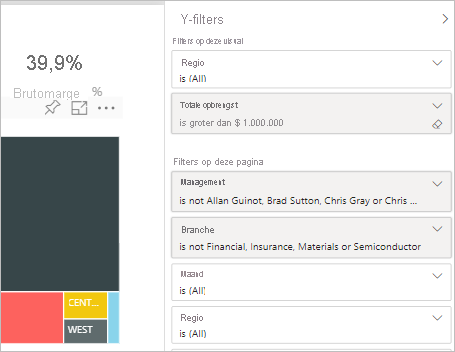

# Typen filters in Power BI-rapporten

Filters gedragen zich niet allemaal op dezelfde manier omdat ze niet op dezelfde manier zijn gemaakt. Hoe u ze maakt, is van invloed op hoe ze zich gedragen in het deel venster filter in de bewerkings modus. In dit artikel beschrijven we de verschillende soorten filters: de verschillende manieren waarop u ze maakt en hun verschillende functies. Meer informatie over [filters toevoegen aan rapporten](power-bi-report-add-filter.md). 

Laten we beginnen met de twee meest voorkomende filter typen: automatisch en hand matig.

## Automatische filters 

Automatische filters zijn de filters die automatisch worden toegevoegd aan de visuele elementen van het filterdeelvenster wanneer u een visueel element bouwt. Deze filters zijn gebaseerd op de velden waaruit uw visuele element bestaat. Gebruikers met de machtiging bewerken kunnen het rapport bewerken, wissen, verbergen, vergren delen, de naam ervan wijzigen of het filter in het deel venster sorteren. Ze kunnen de automatische filters niet verwijderen, omdat het visuele element naar die velden verwijst.

## Handmatige filters 

Hand matige filters zijn de filters die u kunt slepen en neerzetten in een sectie van het deel venster filter wanneer u een rapport bewerkt. Als u de machtiging bewerken hebt voor het rapport, kunt u dit filter in het deel venster bewerken, verwijderen, wissen, vergren delen of de naam ervan wijzigen.

Meer informatie over het [toevoegen van filters aan een rapport](power-bi-report-add-filter.md).

## Meer geavanceerde filters

De volgende filtertypen komen minder vaak voor, maar het is nog steeds belangrijk om ze te begrijpen als ze worden weergegeven in uw rapport. Bovendien zijn ze mogelijk nuttig voor u bij het maken van de juiste filter voor uw rapport.

## Opname- en uitsluitingsfilters

Opname- en uitsluitingsfilters worden automatisch toegevoegd aan het filterdeelvenster wanneer u de opname- en uitsluitingsfunctie voor een visueel element gebruikt. Als u een rapport kunt bewerken, kunt u dit filter verwijderen, vergren delen, verbergen of sorteren in het deel venster. U kunt een include-of EXCLUDE-filter niet bewerken, wissen of een andere naam geven, omdat het is gekoppeld aan de functionaliteit voor insluiten en uitsluiten van visuals.

## Inzoomfilters

Inzoomfilters worden automatisch toegevoegd aan het filterdeelvenster wanneer u de inzoomfunctie voor een visueel element in uw rapport gebruikt. Als u een rapport kunt bewerken, kunt u het filter in het deel venster bewerken of wissen. U kunt dit filter niet verwijderen, verbergen, vergren delen of de naam ervan wijzigen, omdat het is gekoppeld aan de inzoom functionaliteit van visuele elementen. Als u het filter voor inzoomen wilt verwijderen, selecteert u de knop Inzoomen voor het visuele element.

## Kruisfilters

Filters voor meerdere analysen worden automatisch toegevoegd aan het deel venster wanneer een filter voor inzoomen wordt door gegeven aan een ander visueel element op de rapport pagina via de cross-filter-of kruislings-markerings functie. Zelfs als u een rapport kunt bewerken, kunt u dit filter niet verwijderen, wissen, verbergen, vergren delen of de naam ervan wijzigen, omdat het is gekoppeld aan de inzoom functionaliteit van visuele elementen. U kunt dit filter ook niet bewerken omdat het van inzoomen in een ander visueel element afkomstig is. Als u het filter voor inzoomen wilt verwijderen, selecteert u de knop Inzoomen voor het visuele element waarmee het filter wordt door gegeven.

## Analyse filters

Inzoom filters worden door gegeven van de ene pagina naar de andere via de functie voor inzoomen. Ze worden weer gegeven in het deel venster analyse. Er zijn twee soorten analyse filters. Het eerste type is de versie die de detail analyse aanroept. Als u een rapport kunt bewerken, kunt u dit type filter bewerken, verwijderen, wissen, verbergen of vergren delen. Het tweede type is het analyse filter dat wordt door gegeven aan het doel, op basis van de filters op pagina niveau van de bron pagina. U kunt dit tijdelijke type analyse filter bewerken, verwijderen of wissen. U kunt dit filter niet vergren delen of verbergen voor eind gebruikers.

Meer informatie over [het maken van analyse filters](desktop-drillthrough.md).

## URL-filters

URL-filters worden toegevoegd aan het deel venster door een URL-query parameter toe te voegen. Als u een rapport kunt bewerken, kunt u het filter in het deel venster bewerken, verwijderen of wissen. U kunt dit filter niet verbergen, vergren delen of de naam ervan wijzigen, omdat het is gekoppeld aan de URL-para meter. Om het filter te verwijderen, verwijdert u de parameter uit de URL. Hier is een voorbeeld-URL met een parameter:

app.powerbi.com/groups/me/apps/*app-id*/reports/*report-id*/ReportSection?filter=Stores~2FStatus%20eq%20'Off'

Meer informatie over het [instellen van URL-filters](../collaborate-share/service-url-filters.md).

## Pass-through-filters

Pass-through-filters zijn filters op het niveau van visuele elementen, die door middel van Q&A worden gemaakt. Als u een rapport kunt bewerken, kunt u deze filters verwijderen, verbergen of sorteren in het deel venster. U kunt deze filters echter niet een andere naam geven, bewerken, wissen of vergren delen.

## Vergelijking tussen filtertypes

Deze tabel vergelijkt wat auteurs kunnen doen met de verschillende typen filters.

| Filtertype | Bewerken | Clear | Verwijderen | Verbergen | Vergrendelen | Sorteren | Naam wijzigen |
|----|----|----|----|----|----|----|----|
| Handmatige filters | J | J | J | J | J | J | J |
| Automatische filters | J | J | N | J | J | J | J |
| Opname-/uitsluitingsfilters | N | N | J | J | J | J | N |
| Inzoomfilters | J | J | N | N | N | N | N |
| Kruisfilters | N | N | N | N | N | N | N |
| Analyse filters (Hiermee wordt inzoomen geactiveerd) | J | J | J | J | J | N | N |
| Analyse filters (tijdelijk) | J | J | J | N | N | N | N |
| URL-filters - tijdelijk | J | J | J | N | N | N | N |
| Pass-through-filters | N | N | J | J | N | J | N |

## Volgende stappen

[Filters aan rapporten toevoegen](power-bi-report-add-filter.md)

[Rondleiding door het deelvenster Filters van het rapport](../consumer/end-user-report-filter.md)

[Filters en markeren in rapporten](power-bi-reports-filters-and-highlighting.md)

Nog vragen? [Misschien dat de Power BI-community het antwoord weet](https://community.powerbi.com/)
