# <a name="format-filters-in-power-bi-reports"></a>Filters in Power BI rapporten opmaken

[!INCLUDE [applies-to](../includes/applies-to.md)] [!INCLUDE [yes-desktop](../includes/yes-desktop.md)] [!INCLUDE [yes-service](../includes/yes-service.md)]

U hebt veel controle over het ontwerp en de functionaliteit van rapportfilters. In dit artikel wordt uitgelegd hoe u het deel venster filters kunt opmaken zodat deze eruitziet als de rest van het rapport. U kunt filters vergrendelen en zelfs verbergen.

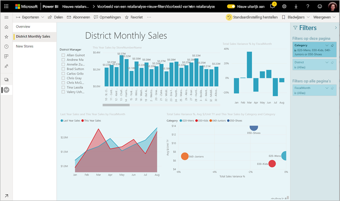

De eerste stap is het [toevoegen van filters aan uw rapport](power-bi-report-add-filter.md). Als rapport ontwerper kunt u het deel venster filters op verschillende manieren opmaken:

- Velden toevoegen en verwijderen om op te filteren. 
- De filterstatus wijzigen.
- Het deelvenster Filters zo indelen en aanpassen dat het een onderdeel van uw rapport lijkt.
- Definiëren of het venster Filters standaard open of samengevouwen is wanneer een gebruiker het rapport opent.
- Het deelvenster Filters helemaal verbergen of alleen bepaalde filters die rapportgebruikers niet mogen zien.
- De zichtbaarheid, en de uitgevouwen of samengevouwen status van het deelvenster Filters beheren en er zelfs bladwijzers voor maken.
- Filters vergrendelen waarvan u niet wilt dat gebruikers deze bewerken.

Wanneer gebruikers een rapport lezen, kunnen ze een visualisatie aanwijzen om een lijst van alle filters of slicers te zien die invloed hebben op deze visualisatie. Deze lijst kan overigens niet worden gewijzigd.

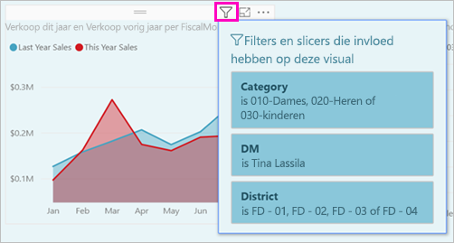

Meer informatie over [hoe rapport lezers filters gebruiken](../consumer/end-user-report-filter.md) in de Lees modus van het rapport.

## <a name="build-the-filters-pane"></a>Het deelvenster Filters samenstellen

Standaard wordt het deel venster filters opgemaakt op basis van uw huidige rapport instellingen. In het deelvenster Filters kunt u instellen welke filters u wilt gebruiken en kunt u bestaande filters bijwerken. Het deel venster filters ziet er hetzelfde uit als uw rapport gebruikers wanneer u het rapport publiceert. 

1. Wanneer u een visual toevoegt aan een rapportcanvas, wordt er automatisch voor elk veld in de visual een filter toegevoegd aan het deelvenster Filters.

2. Als u het deel venster filters wilt maken, sleept u andere velden van belang in het deel venster filters als visuele elementen, pagina's of filters op rapport niveau.

## <a name="show-or-hide-the-filters-pane"></a>Het deel venster filters weer geven of verbergen

### <a name="hide-the-filters-pane-in-reading-mode"></a>Het deel venster filters verbergen in de Lees modus

Als u niet wilt dat uw rapport lezers het deel venster filters helemaal weer geven, selecteert u het **oogpictogram** naast **filters**.

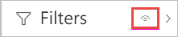 

### <a name="hide-the-filters-pane-while-editing"></a>Het deelvenster Filters verbergen tijdens het bewerken

U kunt het deel venster filters verbergen tijdens het bewerken van het rapport, wanneer u het deel venster filters niet gebruikt en er extra ruimte op het scherm nodig is. 

- Op het tabblad **weer gave** kunt u op de knop **filters** klikken om het deel venster filters weer te geven of te verbergen.

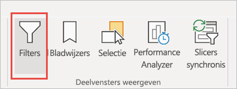

Met deze instelling wordt alleen het deelvenster Filters in Power BI Desktop verborgen. Er is geen equivalent in de bewerkings modus in de Power BI-service.

## <a name="lock-or-hide-filters"></a>Filters vergrendelen of verbergen

U kunt afzonderlijke filterkaarten vergrendelen of verbergen. Wanneer u een filter vergrendelt, kunnen de gebruikers van uw rapport het filter zien, maar niet wijzigen. Als u het filter verbergt, kunnen de gebruikers het ook niet zien. Het is handig om filterkaarten te verbergen als u opruimfilters wilt verbergen die onverwachte of null-waarden uitsluiten. 

- Schakel in het deelvenster Filters de pictogrammen **Filter vergrendelen** of **Filter verbergen** in of uit op een filterkaart.

   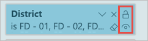

Als u deze instellingen in- of uitschakelt in het deelvenster Filters, worden de wijzigingen direct doorgevoerd in het rapport. Verborgen filters worden niet weergegeven in de pop-upfilterlijst voor een visual.

U kunt de status van het deelvenster Filters ook zo configureren dat het venster zich aanpast aan de bladwijzers in uw rapport. De zichtbaarheidsstatus en de status Open of Gesloten zijn allemaal vast te leggen in het deelvenster.
 
## <a name="format-the-filters-pane"></a>Het deelvenster Filters opmaken

Een belangrijk onderdeel van de filterervaring is dat u de opmaak van het deelvenster Filters in overeenstemming kunt brengen met het uiterlijk van uw rapport. U kunt het deelvenster Filters ook verschillend opmaken voor elke pagina in het rapport. Dit zijn de elementen die u kunt opmaken: 

- Achtergrondkleur
- Doorzichtigheid van achtergrond
- Rand wel of niet weergeven
- Randkleur
- Lettertype, kleur en tekstgrootte van titel en koptekst

U kunt deze elementen ook opmaken voor filterkaarten, afhankelijk van of deze zijn toegepast (ingesteld op iets) of beschikbaar zijn (uitgeschakeld): 

- Achtergrondkleur
- Doorzichtigheid van achtergrond
- Rand: in- of uitschakelen
- Randkleur
- Lettertype, kleur en tekstgrootte
- Kleur van het invoervak

### <a name="format-the-filters-pane-and-cards"></a>De indeling voor het deelvenster Filters en de filterkaarten instellen

1. In het rapport klikt u op het rapport zelf, of op de *achtergrond*, en vervolgens selecteert u **Indeling** in het venster **Visualisaties**. 
    U ziet opties voor het opmaken van de rapportpagina en de achtergrond, evenals het deelvenster Filters en de filterkaarten.

1. Vouw het **deelvenster Filters** uit om de kleur van de achtergrond, het pictogram en de linkerrand te kiezen om de rapportpagina op te maken.

    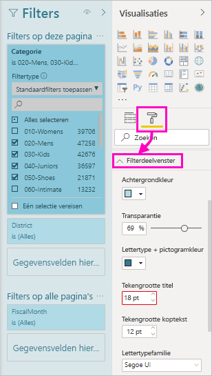

1. Vouw **Filterkaarten** uit om de kleuren en randen voor **Beschikbaar** en **Toegepast** in te stellen. Als u beschikbare en toegepaste kaarten verschillende kleuren geeft, is het duidelijk welke filters er zijn toegepast. 
  
    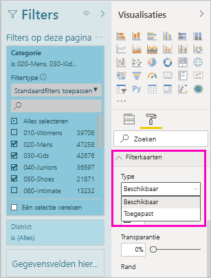

## <a name="theming-for-filters-pane"></a>Thema's voor het deelvenster Filters
U kunt nu de standaardinstellingen van het deelvenster Filters wijzigen met het themabestand. Hier volgt een voorbeeld van een codefragment voor een thema om u een beetje op weg te helpen:

 
```
"outspacePane": [{ 

"backgroundColor": {"solid": {"color": "#0000ff"}}, 

"foregroundColor": {"solid": {"color": "#00ff00"}}, 

"transparency": 50, 

"titleSize": 35, 

"headerSize": 8, 

"fontFamily": "Georgia", 

"border": true, 

"borderColor": {"solid": {"color": "#ff0000"}} 

}], 

"filterCard": [ 

{ 

"$id": "Applied", 

"transparency": 0, 

"backgroundColor": {"solid": {"color": "#ff0000"}}, 

"foregroundColor": {"solid": {"color": "#45f442"}}, 

"textSize": 30, 

"fontFamily": "Arial", 

"border": true, 

"borderColor": {"solid": {"color": "#ffffff"}}, 

"inputBoxColor": {"solid": {"color": "#C8C8C8"}} 

}, 

{ 

"$id": "Available", 

"transparency": 40, 

"backgroundColor": {"solid": {"color": "#00ff00"}}, 

"foregroundColor": {"solid": {"color": "#ffffff"}}, 

"textSize": 10, 

"fontFamily": "Times New Roman", 

"border": true, 

"borderColor": {"solid": {"color": "#123456"}}, 

"inputBoxColor": {"solid": {"color": "#777777"}} 

}] 
```

## <a name="sort-the-filters-pane"></a>Het deelvenster Filters sorteren

Er zijn mogelijkheden voor aangepast sorteren beschikbaar in het deelvenster Filters. Als u een rapport gaat maken, kunt u filters verslepen om ze in elke gewenste volgorde te rangschikken.


Filters worden standaard op alfabetische volgorde gesorteerd. U start de modus voor aangepast sorteren door een filter naar een andere positie te slepen. U kunt de volg orde van filters alleen wijzigen op het niveau waarop ze van toepassing zijn. U kunt bijvoorbeeld de volg orde van de filters op het niveau van het visuele element in de sectie op het niveau van het deel venster filters wijzigen.

## <a name="improved-filters-pane-accessibility"></a>Verbeterde toegankelijkheid van deelvenster Filters

De toetsenbordnavigatie voor het deelvenster Filters is verbeterd. U kunt met de Tab-toets door de onderdelen van het deelvenster Filters lopen en de contexttoets op het toetsenbord of Shift + F10 gebruiken om het contextmenu te openen.

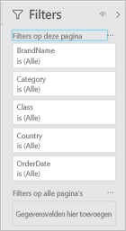

## <a name="rename-filters"></a>Namen van filters wijzigen
Als u het deelvenster Filters bewerkt, kunt u dubbelklikken op de titel om deze te bewerken. Dit is handig als u de filterkaart wilt bijwerken om deze meer zinvol te maken voor uw eindgebruikers. Als u de naam van de filterkaart wijzigt, heeft dit *geen* gevolgen voor de weergavenaam van het veld in de lijst met velden. U verandert alleen de weergavenaam die wordt gebruikt op de filterkaart.


## <a name="filters-pane-search"></a>Zoeken in het deelvenster Filters

Met de functie voor zoeken in het deelvenster Filters kunt u op titel zoeken in uw filterkaarten. Deze functie is handig als u verschillende filterkaarten in het deelvenster Filters hebt en u hulp nodig hebt bij het vinden van belangrijke items.

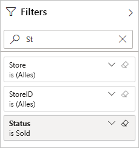

U kunt ook het zoekvak opmaken, net zoals u de andere elementen van het deelvenster Filters kunt opmaken.

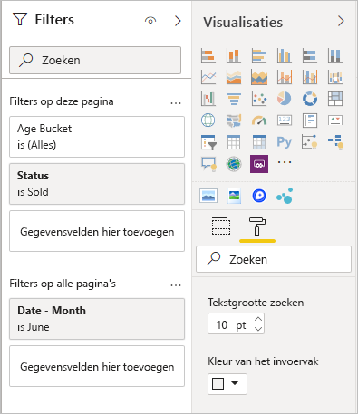

Hoewel deze functie van het deelvenster Filters standaard is ingeschakeld, kunt u er ook voor kiezen om deze in of uit te schakelen via **Zoeken inschakelen in het deelvenster Filters** in de **rapportinstellingen** van het dialoogvenster **Opties**.

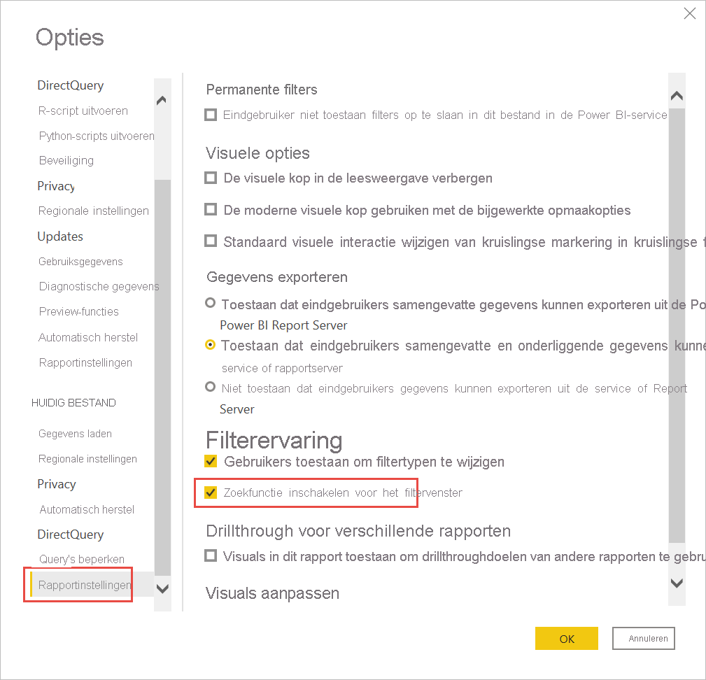

## <a name="restrict-changes-to-filter-type"></a>Wijzigingen van filtertype beperken

In het gedeelte **Filterervaring** van de **rapportinstellingen** staat een optie waarmee u kunt bepalen of gebruikers het filtertype kunnen wijzigen.

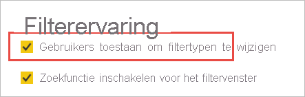

## <a name="allow-saving-filters"></a>Opslaan van filters toestaan

Standaard kunnen uw rapportlezers filters voor uw rapport opslaan. U kunt ervoor kiezen om ze niet toe te staan filters op te slaan.

- Selecteer in de **rapportinstellingen** van het dialoogvenster **Opties**, onder **Permanente filters**, **Eindgebruiker niet toestaan om filters op te slaan in dit rapport**.

    :::image type="content" source="media/power-bi-report-filter/power-bi-persistent-filters.png" alt-text="Schermopname van Eindgebruiker niet toestaan om filters op te slaan in dit rapport.":::

## <a name="apply-filters-button"></a>De knop Filters toepassen

U kunt één knop **Toepassen** aan het deelvenster Filters, zodat u en uw eindgebruikers alle filterwijzigingen in één keer kunnen toepassen. Deze knop kan nuttig zijn als u het toepassen van filterwijzigingen wilt uitstellen. U hoeft dan maar één keer te wachten, totdat u klaar bent om alle filterwijzigingen toe te passen op het rapport of de visualisaties.

:::image type="content" source="media/power-bi-report-filter/apply-filter-button.png" alt-text="De knop Toepassen":::

### <a name="turn-on-the-apply-button"></a>De knop Toepassen inschakelen

U kunt deze functie op rapportniveau instellen. Deze functie is standaard echter uitgeschakeld.

1. Ga naar **Bestand** > **Opties en instellingen** > **Opties** > **Query's beperken**.

1. Selecteer **Eén knop Toepassen aan het filterdeelvenster toevoegen om wijzigingen allemaal tegelijk toe te passen**.

    :::image type="content" source="media/power-bi-report-filter/apply-all-filters.png" alt-text="De knop Toepassen inschakelen":::

### <a name="format-the-apply-button"></a>De knop Toepassen opmaken

Op dit moment kunt u bepaalde opmaakelementen van de tekst **Toepassen** instellen voor de knop. Stel in de sectie **Filtervenster** van het deelvenster **Indeling** deze opties in:

- **Selectievakje en Kleur toepassen** bepalen de opvulkleur. 
- **Kleur van lettertype en pictogram**: bepaalt de tekstkleur.
- **Grootte van de koptekst**: bepaalt de tekengrootte voor de tekst.
- **Lettertypefamilie**: bepaalt het lettertype.

    :::image type="content" source="media/power-bi-report-filter/format-apply-filter.gif" alt-text="De tekst van de knop Filter toepassen opmaken":::

## <a name="considerations-and-limitations"></a>Overwegingen en beperkingen

Het deelvenster Filters wordt niet weergegeven in Publiceren op internet. Als u van plan bent een rapport naar het web te publiceren, kunt u in plaats daarvan Slicers voor filteren toevoegen.

## <a name="next-steps"></a>Volgende stappen

- [How to use report filters](../consumer/end-user-report-filter.md) (Rapportfilters gebruiken)
- [Filters en markeren in rapporten](power-bi-reports-filters-and-highlighting.md)
- [Verschillende soorten filters in Power BI](power-bi-report-filter-types.md)

Hebt u nog vragen? [Misschien dat de Power BI-community het antwoord weet](https://community.powerbi.com/)
