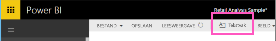
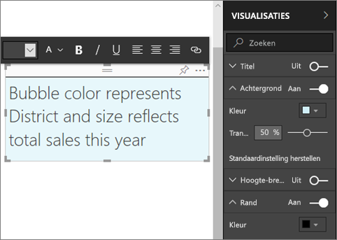
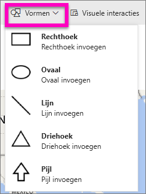
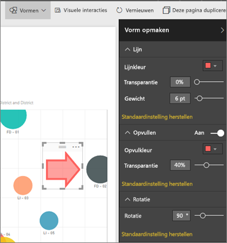

# Tekstvakken en vormen toevoegen aan Power BI-rapporten
U kunt de Microsoft Power BI-service gebruiken om tekstvakken en shapes toe te voegen aan en te maken in een rapport. In beide gevallen moet u bewerkingsrechten voor het rapport hebben. Als een rapport met u is gedeeld in de Power BI-service, hebt u geen bewerkingsmachtigingen. 

Bekijk hoe Will Power BI Desktop gebruikt om [statische afbeeldingen aan een rapport toe te voegen](/learn/modules/visuals-in-power-bi/12-formatting) en volg vervolgens de stappen hieronder om het zelf met de Power BI-service te proberen.
> 
> <iframe width="560" height="315" src="https://www.youtube.com/embed/_3q6VEBhGew" frameborder="0" allowfullscreen></iframe>
> 

## Een tekstvak toevoegen aan een rapport
1. Open een rapport in de bewerkingsweergave.

2. Plaats de cursor op een leeg gebied in het rapportcanvas en selecteer in het bovenste menu **Tekstvak**.
   
   
3. Typ de tekst in het tekstvak en stel desgewenst het lettertype, de kleur en de uitlijning in. 
   
   
4. Selecteer het grijze gebied aan de bovenkant en sleep dit om het tekstvak te positioneren. Als u de grootte van het tekstvak wilt wijzigen, selecteert en sleept u een van de contourgrepen. 
   
   

5. Terwijl het tekstvak nog is geselecteerd, voegt u aanvullende opmaak toe in het deelvenster **Visualisaties**. In dit voorbeeld hebben we de achtergrond en rand opgemaakt. U kunt ook een exacte grootte en positie voor een tekstvak maken.  

   

6. Als u het tekstvak wilt sluiten, selecteert u een lege ruimte op het rapportcanvas. 

7. Selecteer het speldpictogram   om het tekstvak vast te maken aan een dashboard. 

## Een vorm toevoegen aan een rapport
1. Plaats de cursor op het rapportcanvas en selecteer **Vormen**.
   
   
2. Selecteer in de vervolgkeuzelijst de vorm die u wilt toevoegen aan uw rapportcanvas. Voeg voor dit voorbeeld een pijl toe om de aandacht te vestigen op de bel met de hoogste verkoopafwijking. 
   
   Pas uw vorm aan in het deelvenster **Vorm opmaken**. In dit voorbeeld hebben we een rode pijl met een donkerrode rand gemaakt die 90 graden is gedraaid.
   
   
3. Selecteer het grijze gebied aan de bovenkant en sleep om de vorm te positioneren. Als u de grootte van de shape wilt wijzigen, selecteert en sleept u een van de contourgrepen. U kunt, net als bij het tekstvak, een exacte grootte en positie maken voor een vorm.

   > [!NOTE]
   > vormen kunnen niet worden vastgemaakt aan een dashboard, behalve als één van de visualisaties wanneer u [een live-pagina vastmaakt](service-dashboard-pin-live-tile-from-report.md). 
   > 
   > 

## Volgende stappen

Wellicht bent u ook geïnteresseerd in de volgende artikelen:

* [Een hyperlink toevoegen aan een tekstvak](service-add-hyperlink-to-text-box.md)
* [Basisconcepten voor ontwerpers in de Power BI-service](../fundamentals/service-basic-concepts.md)
* [Tips voor het verbeteren van analyses met vormen, afbeeldingen en pictogrammen in Power BI-rapporten](../guidance/report-tips-shapes-images-icons.md)
* Nog vragen? [Misschien dat de Power BI-community het antwoord weet](https://community.powerbi.com/)
