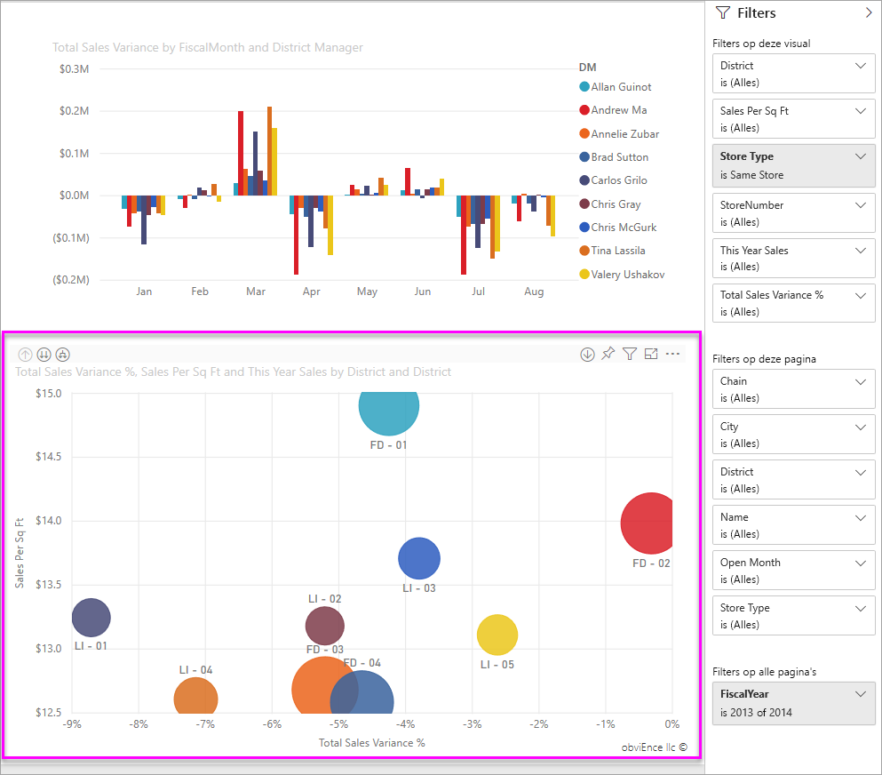
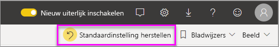

# Filters en markeren in Power BI-rapporten
 In dit artikel wordt beschreven hoe u filtert en markeert in de Power BI-service. De ervaring is echter nagenoeg hetzelfde als in Power BI Desktop. *Filters* zorgen ervoor dat alleen die gegevens worden weergegeven waarop u zich wilt concentreren. In het algemeen wordt *markeren* niet gefilterd. In de meeste visuele elementen worden de niet-gerelateerde gegevens niet verwijderd. In plaats daarvan wordt de subset van gerelateerde gegevens gemarkeerd. De rest van de gegevens blijft zichtbaar, maar lichter gekleurd. Zie [ad hoc kruislings filteren en kruislings markeren](#ad-hoc-cross-filtering-and-cross-highlighting) verderop in dit artikel voor meer informatie.

Er zijn veel verschillende manieren om rapporten in Power BI te filteren en te markeren. Wanneer al deze informatie in één artikel zou worden gepresenteerd, zou dit alleen maar tot verwarring leiden. Daarom hebben we deze in de volgende secties opgesplitst:

* Inleiding tot filters en markeren (het artikel dat u nu leest).
* [Filters maken en gebruiken in de bewerkingsweergave](power-bi-report-add-filter.md) in rapporten in Power BI Desktop en de Power BI-service. Wanneer u over bewerkingsmachtigingen beschikt voor een rapport, kunt u filters in rapporten maken, wijzigen en verwijderen.
* [Het filteren en markeren van visuals in een rapport dat met u is gedeeld](../consumer/end-user-interactions.md), in de leesweergave van rapporten in de Power BI-service. De mogelijkheden zijn beperkter, maar u beschikt nog altijd over tal van filter- en markeeropties.  
* Een gedetailleerd overzicht van de [besturingselementen voor filteren en markeren die beschikbaar zijn in de bewerkingsweergave](power-bi-report-add-filter.md) in Power BI Desktop en de Power BI-service. Het artikel bevat detailinformatie over typen filters, zoals datum en tijd, numeriek en tekst. Er wordt ook ingegaan op de verschillen tussen de basis- en geavanceerde opties.
* Nu u weet hoe de standaardfilter- en markeeropties werken, vindt u hier meer informatie over het [wijzigen van de manier waarop visualisaties op een pagina elkaar filteren en markeren](service-reports-visual-interactions.md)

**Wist u dat?** Power BI heeft een nieuwe filterervaring. Lees meer over de [nieuwe filterervaring in Power BI-rapporten](power-bi-report-filter.md).

## Inleiding tot het deelvenster Filters

U kunt filters toepassen in het deelvenster **Filters** of door rechtstreeks in het rapport [selecties te maken in slicers](../visuals/power-bi-visualization-slicers.md). Het deelvenster Filters bevat de tabellen en velden die in het rapport worden gebruikt en de filters die zijn toegepast, indien van toepassing. 

Er zijn vier soorten filters.

- **Paginafilter** wordt toegepast op alle visuals op een rapportpagina     
- het **visuele filter** is van toepassing op één visueel element op een rapport pagina. U ziet alleen filters op visueel niveau als u een visual op het rapportcanvas hebt geselecteerd.    
- **Rapportfilter** wordt toegepast op alle pagina's in een rapport    
- **Gedetailleerde filter** wordt toegepast op één item in een rapport    

U kunt zowel in de lees- als de bewerkingsweergave zoeken in pagina-, visual- en rapportfilters, om de gewenste waarde te zoeken en te selecteren. 

Als naast het filter het woord **All** staat, betekent dit dat alle waarden in het veld zijn opgenomen in het filter.  Zo betekent **Chain (All)** (Keten (Alle)) in onderstaande schermopname dat deze rapportpagina gegevens bevat over alle winkelketens.  Het filter op rapportniveau **FiscalYear is 2013 or 2014** (Boekjaar is 2013 of 2014) betekent daarentegen dat het rapport alleen gegevens voor de boekjaren 2013 en 2014 bevat.

## Filters in lees- of bewerkingsweergave
Er zijn twee modi voor interactie met rapporten: [Lees weergave](../consumer/end-user-reading-view.md) en bewerk weergave. De beschikbare filtermogelijkheden zijn afhankelijk van de modus waarin u werkt.

* In de bewerkingsweergave kunt u filters voor rapporten, pagina’s, visuals en drillthrough toevoegen. Wanneer u het rapport opslaat, worden de filters samen met het rapport opgeslagen, zelfs als u het rapport in een mobiele app opent. Personen die het rapport in de leesweergave bekijken, kunnen de filters gebruiken die u hebt toegevoegd, maar kunnen geen nieuwe filters toevoegen.
* In de leesweergave kunt u de filters gebruiken die al beschikbaar zijn in het rapport. Daarnaast kunt u de door u aangebrachte selecties opslaan. U kunt geen nieuwe filters toevoegen.

### Filters in leesweergave
Als u alleen in de leesweergave toegang hebt tot een rapport, ziet het deelvenster Filters er ongeveer als volgt uit:

Deze pagina van het rapport bevat dus zes filters op paginaniveau en één filter op rapportniveau.

Elke visual kan filters hebben voor alle velden in de visual, en de auteur van het rapport kan meer filters toevoegen. In de onderstaande afbeelding ziet u een bellendiagram waarop zes filters zijn toegepast.

Verken de gegevens in de leesweergave door de bestaande filters te wijzigen. De wijzigingen die u aanbrengt, worden samen met het rapport opgeslagen, zelfs als u het rapport in een mobiele app opent. Tijdens een [rondleiding door het deelvenster Filters van het rapport](../consumer/end-user-report-filter.md) leert u hoe u dit doet.

Wanneer u het rapport afsluit, worden uw filters opgeslagen. Als u uw filters ongedaan wilt maken en wilt terugkeren naar de standaardfilters, slicers, zoomwaarden en sorteervolgorde die door de auteur van het rapport zijn ingesteld, selecteert u **Standaardinstelling herstellen** in de bovenste menubalk.

### Filters in de bewerkingsweergave
Wanneer u over eigenaarsmachtigingen voor een rapport beschikt en het rapport opent in de leesweergave, ziet u dat **Filters** slechts een van de vele beschikbare deelvensters is.

Net als in de leesweergave ziet u dat deze pagina van het rapport zes filters op paginaniveau en één filter op rapportniveau heeft. En als u het bellendiagram selecteert, ziet u dat er zes filters op visualniveau zijn toegepast.

In de leesweergave kunt u meer doen met filters en markeringen. U kunt voornamelijk nieuwe filters toevoegen. Meer informatie over [Een filter toevoegen aan een rapport](power-bi-report-add-filter.md) en nog veel meer.

## Ad-hoc kruislings filteren en kruislings markeren
Selecteer een waarde of aslabel in één visueel element om de gerelateerde waarden in andere visualisaties op de pagina kruislings te filteren of te markeren. In de meeste visuele elementen worden de niet-gerelateerde gegevens in de andere visuele elementen niet verwijderd als u een waarde in een visueel element selecteert. In plaats daarvan wordt de subset van gerelateerde gegevens gemarkeerd. De niet-gerelateerde gegevens blijven zichtbaar maar lichter gekleurd. In sommige visualisaties is het selecteren van een waarde in een visueel element echter meer zoals een filter in de andere visuele elementen. In lijn diagrammen en spreidings diagrammen blijven bijvoorbeeld alleen de gerelateerde gegevens zichtbaar. De niet-gerelateerde gegevens zijn niet zichtbaar, net zoals u zou zien met een filter. 

Als u de markering wilt verwijderen, selecteert u de waarde opnieuw of selecteert u een lege ruimte in dezelfde visual. Markeren is een leuke manier om snel de impact van gegevens te verkennen. Voor meer voor beelden raadpleegt u de [sectie kruislings filteren en kruislings markeren](../consumer/end-user-interactions.md#cross-filtering-and-cross-highlighting) van ' hoe visuals elkaar kruislings filteren in een Power bi rapport '.

Rapport editors kunnen de manier wijzigen waarop visuele elementen worden gecommuniceerd. Zie [wijzigen hoe visuals in het rapport werken](service-reports-visual-interactions.md)om de werking van kruis markeringen te verfijnen.

## Volgende stappen

[De nieuwe filterervaring in Power BI-rapporten](power-bi-report-filter.md)

[Een filter toevoegen aan een rapport (in de bewerkingsweergave)](power-bi-report-add-filter.md)

[Een overzicht van de rapportfilters](../consumer/end-user-report-filter.md)

[Hoe een visueel element in een rapport kruislings filtert en elkaar kruisen.](../consumer/end-user-interactions.md)

Hebt u nog vragen? [Misschien dat de Power BI-community het antwoord weet](https://community.powerbi.com/)
