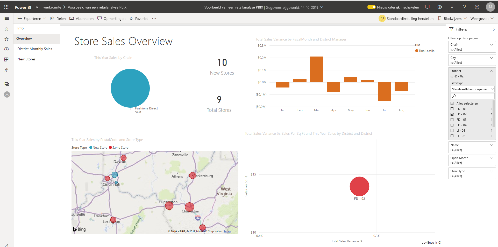
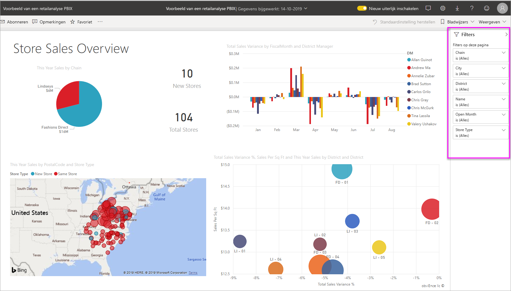
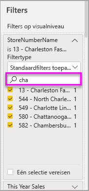
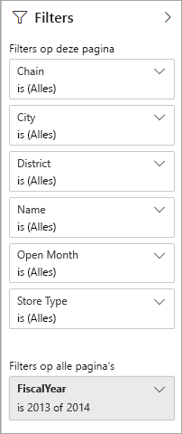
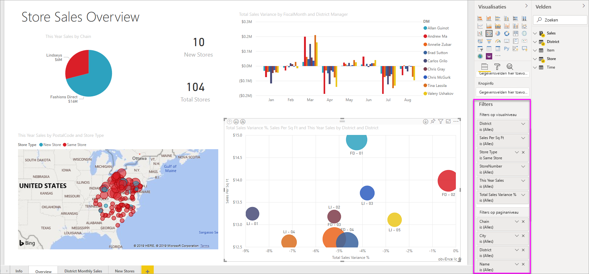

# Filters en markeren in Power BI-rapporten

 In dit artikel wordt beschreven hoe u filtert en markeert in de Power BI-service. De ervaring is echter nagenoeg hetzelfde als in Power BI Desktop. *Filters* zorgen ervoor dat alleen die gegevens worden weergegeven waarop u zich wilt concentreren. In het algemeen wordt *markeren* niet gefilterd. In de meeste visualisaties worden de niet-gerelateerde gegevens niet verwijderd met markeren. In plaats daarvan worden de gerelateerde gegevens gemarkeerd. De rest van de gegevens blijft zichtbaar, maar lichter gekleurd. Zie [kruislings filteren en kruislings markeren](#cross-filter-and-cross-highlight-visuals) verderop in dit artikel voor meer informatie.

Er zijn veel verschillende manieren om rapporten in Power BI te filteren en te markeren. Als u al deze informatie in één artikel plaatst, is dit een heleboel, dus we hebben deze in de volgende secties onderverdeeld:

* Inleiding tot filters en markeren (het artikel dat u nu leest).
* Hoe [filters en markeringen werken in de Lees weergave](../consumer/end-user-interactions.md) in de Power bi-service. Wat u kunt doen, is beperkter dan de bewerkings weergave, maar u hebt nog steeds een breed scala aan opties voor filteren en markeren.  
* [Filters maken in het deel venster filters](power-bi-report-add-filter.md) in Power bi Desktop en de Power bi-service. Wanneer u over bewerkingsmachtigingen beschikt voor een rapport, kunt u filters in rapporten maken, wijzigen en verwijderen.
* Nadat u filters hebt toegevoegd, kunt u [de filters opmaken](power-bi-report-filter.md) om de gewenste manier te gebruiken en de rest van het rapport bekijken.
* U hebt geleerd hoe filters en markeringen standaard werken. Meer informatie over [het wijzigen van de manier waarop visualisaties op een pagina worden gefilterd en elkaar worden gemarkeerd](service-reports-visual-interactions.md).
* Meer informatie over andere [typen filters in Power bi-rapporten](power-bi-report-filter-types.md).

## Inleiding tot het deelvenster Filters

U kunt filters toep assen in het deel venster **filters** , of op de rapport pagina zelf [selecties maken in Slicers](../visuals/power-bi-visualization-slicers.md) . In het deel venster filters ziet u de velden in afzonderlijke visuals en andere filters die door Report Designer worden toegevoegd. 

Er zijn vier standaard typen filters die u kunt maken in het deel venster filters.

- Het **visuele filter** is van toepassing op één visueel element op een rapport pagina. U ziet filters op het niveau van visuele elementen wanneer u een visueel element op het canvas van het rapport selecteert. Zelfs als u een rapport niet kunt bewerken, kunt u een visueel element selecteren en het filteren.
- **Pagina filter** is van toepassing op alle visuele elementen op de rapport pagina.
- **Rapport filter** is van toepassing op alle pagina's in het rapport.
- **Analyse filter** Met Inzoomen in de Power BI-service en Power BI Desktop maakt u een *doel* rapport pagina die zich richt op een specifieke entiteit, zoals een leverancier. Op de andere rapport pagina's kunnen gebruikers met de rechter muisknop op een gegevens punt voor die entiteit klikken en inzoomen op de pagina met focus.

Zie [een filter toevoegen aan een rapport in Power bi](power-bi-report-add-filter.md)voor het maken van de eerste drie, de visuele-, pagina-en rapport filters. 

Als u analyse filters wilt maken, raadpleegt [u inzoomen instellen in Power bi-rapporten](desktop-drillthrough.md).

### Basis-en geavanceerde filtering

Standaard kunnen rapport lezers overschakelen van **Basic** naar **Geavanceerde** filters. 

Bij **basis filters** wordt een lijst met alle waarden in het veld weer gegeven. U kunt zowel in de lees- als de bewerkingsweergave zoeken in pagina-, visual- en rapportfilters, om de gewenste waarde te zoeken en te selecteren. 

Er wordt een filter gefilterd op het woord dat erin staat **om alle waarden** in het veld weer te geven.  Bijvoorbeeld: **ketting is (alle)** betekent dat de rapport pagina gegevens bevat over alle winkel ketens. Het filter FiscalYear op rapport niveau is daarentegen **2013 of 2014** betekent dat het rapport alleen gegevens weergeeft voor de boek jaren 2013 en 2014.

Met **Geavanceerde filters** kunt u complexere filters gebruiken. U kunt bijvoorbeeld zoeken naar waarden die bevatten of niet bevatten, beginnen met of niet beginnen met, een specifieke waarde. 

:::image type="content" source="media/power-bi-reports-filters-and-highlighting/power-bi-advanced-filter.png" alt-text="Geavanceerde filters bieden meer opties voor het filteren van nuances.":::

Wanneer u een rapport maakt, kunt u de schakel optie uitschakelen en [niet toestaan dat rapport lezers de filter typen wijzigen](power-bi-report-filter.md#restrict-changes-to-filter-type). U kunt ook zoeken uitschakelen in het deel venster filter.

## Filters in lees- of bewerkingsweergave

Er zijn twee modi voor interactie met rapporten in de Power BI-service: Lees weergave en bewerkings weergave. De beschikbare filtermogelijkheden zijn afhankelijk van de modus waarin u werkt.

* In de [Lees weergave](#filters-in-reading-view)kunt u werken met filters die al in het rapport bestaan en de selecties opslaan die u maakt. U kunt geen nieuwe filters toevoegen.
* In de [bewerkings weergave](#filters-in-editing-view)kunt u alle soorten filters toevoegen. Wanneer u het rapport opslaat, worden de filters opgeslagen met het rapport, zelfs als rapport lezers het openen in een mobiele app. Personen die het rapport bekijken in de Lees weergave, werken met de filters die u hebt toegevoegd, maar kunnen geen nieuwe filters toevoegen.

### Filters in leesweergave

Als u in de Power BI-service een visueel element in de Lees weergave selecteert, ziet het deel venster filters er ongeveer als volgt uit:

Elk visueel element heeft filters voor alle velden in de Visual. Wanneer u een rapport maakt, kunt u meer toevoegen. In dit deel venster filters heeft het visuele element drie filters.

In de Lees weergave kunt u de gegevens verkennen door de bestaande filters te wijzigen. U filtert alleen uw weer gave van het rapport. Wanneer u het rapport afsluit, worden de wijzigingen die u aanbrengt opgeslagen in de weer gave van het rapport, zelfs als u het rapport in een mobiele app opent. Selecteer **opnieuw instellen op** de bovenste menu balk om het filteren ongedaan te maken en terug te keren naar de standaard instellingen die zijn ingesteld door de auteur van het rapport.

:::image type="content" source="../consumer/media/end-user-report-filter/power-bi-reset-icon.png" alt-text="Standaard pictogram opnieuw instellen.":::

Meer informatie over de Lees weergave: [Volg een rond leiding door het deel venster rapport filters](../consumer/end-user-report-filter.md).

### Filters in de bewerkingsweergave
Wanneer u een rapport opent in Power BI Desktop, ziet u dat **filters** slechts een van de beschik bare bewerkings Vensters zijn. U ziet dezelfde deel Vensters als u een rapport opent in de bewerkings weergave in de Power BI-service.

Deze pagina van het rapport bevat drie filters op pagina niveau en één filter op rapport niveau. Als u het kolom diagram selecteert, ziet u ook drie filters op het niveau van visuele elementen.

#### Werken met filters in de bewerkings weergave

- Meer informatie over het [toevoegen van filters aan een rapport](power-bi-report-add-filter.md) in Power bi Desktop en in de bewerkings weergave in de Power bi-service.

- Nadat u filters hebt toegevoegd, hebt u een groot aantal opmaak opties. U kunt filters bijvoorbeeld verbergen, vergren delen of de volg orde ervan wijzigen, of ze opmaken zodat deze overeenkomen met de rest van het rapport. Meer informatie over het [opmaken van filters in een rapport](power-bi-report-filter.md). 

- U kunt ook de manier wijzigen waarop de visuele elementen werken. Zie de [interactie van visuals in rapporten wijzigen](service-reports-visual-interactions.md)om cross-markering en kruislings filteren te verfijnen.

## Meerdere filters en gemarkeerde visuele elementen

U kunt de relaties tussen de visuals in uw rapport verkennen zonder filters of Slicers te gebruiken. Selecteer een waarde of aslabel in één visueel element om de gerelateerde waarden in andere visualisaties op de pagina *kruislings te filteren* of te *markeren* . Ze werken niet allemaal hetzelfde. 

- **Kruislings markeren** Als u een waarde in een visueel element selecteert, worden de gerelateerde gegevens in visuele elementen, zoals kolom-en staaf diagrammen, gemarkeerd. Door Kruis markeringen worden niet-gerelateerde gegevens uit deze visuals verwijderd. De niet-gerelateerde gegevens zijn nog steeds zichtbaar maar lichter gekleurd. 
- **Kruislings filteren** Het selecteren van een waarde in een visueel element fungeert meer als een filter in andere visuele elementen, zoals lijn diagrammen en spreidings diagrammen. In deze visuals blijft alleen de gerelateerde gegevens zichtbaar. De niet-gerelateerde gegevens zijn niet zichtbaar, net zoals u zou zien met een filter. 

Als u de markering wilt verwijderen, selecteert u de waarde opnieuw of selecteert u een lege ruimte in dezelfde visual. Voor meer voor beelden raadpleegt u de sectie [kruislings filteren en kruislings markeren](../consumer/end-user-interactions.md#cross-filtering-and-cross-highlighting) van ' hoe visuals elkaar kruislings filteren in een Power bi rapport '.

## Volgende stappen

- [Een filter toevoegen aan een rapport in de bewerkings weergave](power-bi-report-add-filter.md)
- [Filters in Power BI rapporten opmaken](power-bi-report-filter.md)
- [Een overzicht van de rapportfilters](../consumer/end-user-report-filter.md)
- [Hoe een visueel element in een rapport kruislings filtert en elkaar kruisen.](../consumer/end-user-interactions.md)

Hebt u nog vragen? [Misschien dat de Power BI-community het antwoord weet](https://community.powerbi.com/)
