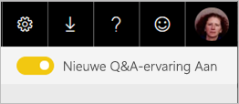
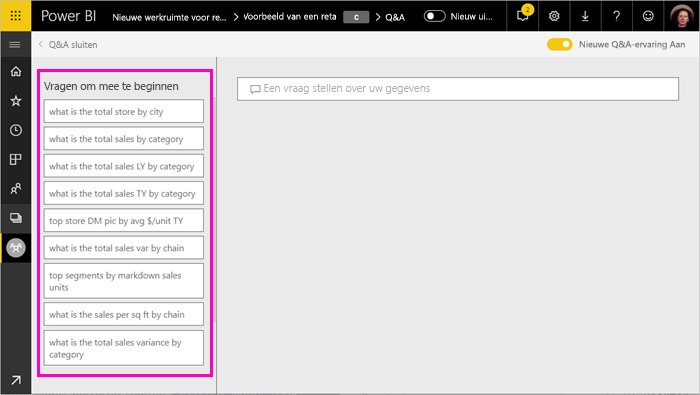
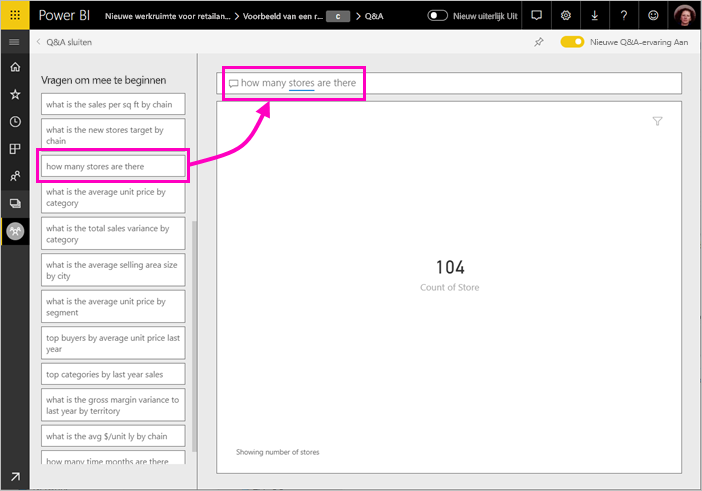
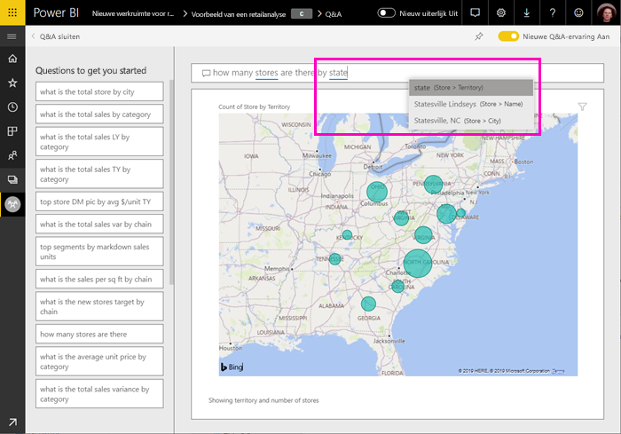
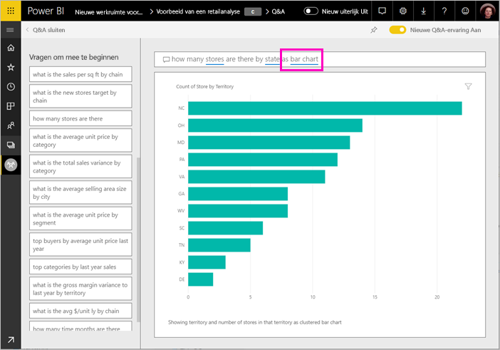
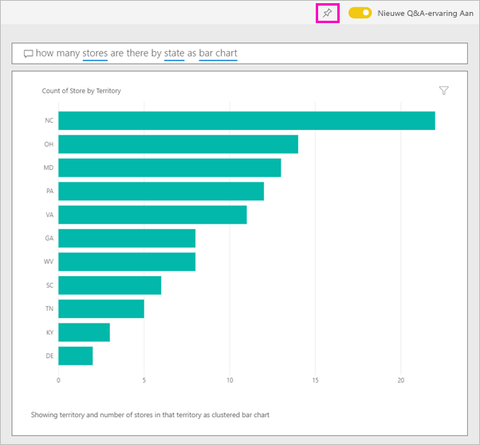
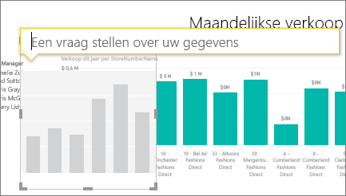

# Power BI Q&A gebruiken om uw gegevens te verkennen te verkennen en visuals te maken

Soms krijgt u het snelst een antwoord uit uw gegevens wanneer u een vraag stelt in natuurlijke taal. Met de Q&A-functie in Power BI kunt u uw gegevens verkennen in uw eigen woorden.  In het eerste deel van dit artikel ziet u hoe u Q&A gebruikt in dashboards in de Power BI-service. In het tweede deel ziet u wat u met Q&A kunt doen bij het maken van rapporten in de Power BI-service of Power BI Desktop. Lees het artikel [Q&A voor gebruikers](../consumer/end-user-q-and-a.md) voor meer achtergrondinformatie. 

[Q&A in de mobiele Power BI-apps](../consumer/mobile/mobile-apps-ios-qna.md) en [Q&A met Power BI Embedded](../developer/embedded/qanda.md) komen in afzonderlijke artikelen aan bod. 

Q&A is interactief, zelfs leuk. Vaak leidt een vraag naar andere vragen wanneer de visualisaties interessante paden onthullen om verder te onderzoeken. Kijk hoe Amanda demonstreert hoe ze met Q&A visualisaties maakt, dieper op deze visuals ingaat en deze aan dashboards vastmaakt.

<iframe width="560" height="315" src="https://www.youtube.com/embed/qMf7OLJfCz8?list=PL1N57mwBHtN0JFoKSR0n-tBkUJHeMP2cP" frameborder="0" allowfullscreen></iframe>

## Deel 1: Q&A gebruiken op een dashboard in de Power BI-service

In de Power BI-service (app.powerbi.com) bevat een dashboard tegels die zijn vastgemaakt vanuit één of meer gegevenssets, zodat u over gegevens in elk van deze gegevenssets vragen kunt stellen. Selecteer **Gerelateerde items weergeven** in de menubalk om te zien welke rapporten en gegevenssets zijn gebruikt om het dashboard te maken.

Het vak met Q&A-vragen bevindt zich in de linkerbovenhoek van het dashboard. Hier typt u uw vraag in natuurlijke taal in. Ziet u het Q&A-vak niet? Zie [Aandachtspunten en probleemoplossing](../consumer/end-user-q-and-a.md#considerations-and-troubleshooting) in het artikel **Q&A voor gebruikers**.  Q&A herkent de woorden die u typt en zoekt uit waar (in welke gegevensset) het antwoord kan worden gevonden. Ook helpt Q&A u uw vraag te formuleren door middel van automatisch aanvullen, anders formuleren en andere tekstuele en visuele hulpmiddelen.

Het antwoord op uw vraag wordt weergegeven als een interactieve visualisatie en wordt bijgewerkt als u de vraag wijzigt.

1. Open een dashboard en plaats de cursor in het vragenvak. Selecteer in de rechterbovenhoek **Nieuwe Q&A-ervaring**.

    

1. Voordat u begint te typen, worden in een nieuw scherm suggesties weergegeven om u te helpen uw vraag te formuleren. U krijgt zinnen en volledige vragen met de namen van de tabellen in de onderliggende gegevenssets en mogelijk zelfs volledige vragen te zien als de eigenaar van de gegevensset [aanbevolen vragen](service-q-and-a-create-featured-questions.md) heeft gemaakt.

   

   U kunt een van deze vragen als beginpunt kiezen en de vraag verder verfijnen om naar een specifiek antwoord te zoeken. U kunt ook een tabelnaam gebruiken om een nieuwe vraag te formuleren.

2. Maak een keuze uit de lijst met vragen of begin met uw eigen vraag in te typen en kies suggesties uit de vervolgkeuzelijst.

   

3. Terwijl u een vraag typt, kiest Q&A de beste visualisatie om uw antwoord weer te geven.

   

4. De visualisatie wordt dynamisch gewijzigd als u de vraag wijzigt.

   

1. Wanneer u een vraag typt, zoekt Power BI het beste antwoord op via gegevenssets die een tegel op dat dashboard hebben.  Als alle tegels van *gegevenssetA* zijn, is het antwoord afkomstig van *gegevenssetA*.  Als er tegels van *gegevenssetA* en *gegevenssetB* zijn, wordt het beste antwoord in deze twee gegevenssets gezocht.

   > [!TIP]
   > Wanneer u dus slechts een tegel van *gegevenssetA* hebt en u deze van uw dashboard verwijdert, heeft Q&A niet langer toegang tot *gegevenssetA*.
   >

5. Wanneer u tevreden bent met het resultaat, maakt u de visualisatie aan een dashboard vast door het speldpictogram in de rechterbovenhoek te selecteren. Als het dashboard met u is gedeeld of deel uitmaakt van een app, kunt u de visualisatie niet vastmaken.

   

## Deel 2: Q&A gebruiken in een rapport in Power BI-service of Power BI Desktop

Verken met Q&A om uw gegevensset te verkennen en visualisaties aan het rapport en dashboards toe te voegen. Een rapport is gebaseerd op een enkele gegevensset en kan volledig leeg zijn of pagina's vol met visualisaties bevatten. Maar omdat een rapport leeg is, betekent dit nog niet dat er geen gegevens zijn om te verkennen--de gegevensset is gekoppeld aan het rapport en wacht tot u visualisaties verkent en maakt.  Als u wilt zien welke gegevensset wordt gebruikt om een rapport te maken, opent u het rapport in de leesmodus van Power BI-service en selecteert u **Gerelateerde items weergeven** op de menubalk.

Als u Q&A wilt gebruiken in rapporten, moet u over bewerkingsmachtigingen beschikken voor het rapport en de onderliggende gegevensset. In het artikel [Q&A voor gebruikers](../consumer/end-user-q-and-a.md) verwijzen we hiernaar als een *maker*scenario. Als u een rapport *gebruikt* dat met u is gedeeld, is Q&A niet beschikbaar.

1. Open een rapport in de bewerkingsweergave (Power BI-service) of rapportweergave (Power BI Desktop) en selecteer **Een vraag stellen** in de menubalk.

    **Power BI Desktop**    
    

    **Service**    
    

2. Een vak met Q&A-vragen wordt op het rapportcanvas weergegeven. In het onderstaande voorbeeld wordt het vragenvak weergegeven boven op een andere visualisatie. Dat is prima, maar mogelijk is het beter om een lege pagina aan het rapport toe te voegen voordat u een vraag stelt.

    

3. Plaats de cursor in het vraagvak. Terwijl u typt, geeft Q&A suggesties om u te helpen met het stellen van uw vraag.

   

4. Als u een vraag typt, kiest de Q&A-functie de beste [visualisatie](../visuals/power-bi-visualization-types-for-reports-and-q-and-a.md) om uw antwoord weer te geven. De visualisatie wordt dynamisch gewijzigd als u de vraag wijzigt.

   

5. Wanneer u de visualisatie hebt die u wilt, selecteert u ENTER. U slaat de visualisatie met het rapport op door **Bestand > Opslaan** te selecteren.

6. Interactie met de nieuwe visualisatie. Het maakt niet uit hoe u de visualisatie gemaakt -- u hebt de beschikking over dezelfde interactiviteit, opmaak en functies.

   

   Als u de visualisatie in Power BI-service hebt gemaakt, kunt u deze zelfs [vastmaken aan een dashboard](service-dashboard-pin-tile-from-q-and-a.md).

## Aangeven welke visualisatie Q&A moet gebruiken
U kunt met Q&A niet alleen de gegevens voor zichzelf laten spreken, u kunt in Power BI ook aangeven hoe de gegevens moeten worden weergegeven. U hoeft alleen maar 'as a <visualization type>' aan het einde van uw vraag te typen.  Bijvoorbeeld 'show inventory volume by plant as a map' en 'show total inventory as a card'.  Probeer het zelf maar eens.

## Aandachtspunten en probleemoplossing
- Als u verbinding hebt gemaakt met een gegevensset met behulp van een live-verbinding of de gateway, moet u Q&A [inschakelen voor deze gegevensset](service-q-and-a-direct-query.md).

- U hebt een rapport geopend en ziet de optie Q&A niet. Zorg ervoor, als u de Power BI-service gebruikt, dat het rapport in de bewerkingsweergave is geopend. Als u de bewerkingsweergave niet kunt openen, betekent dit dat u niet over bewerkingsmachtigingen voor het rapport beschikt en Q&A niet kunt gebruiken bij dat specifieke rapport.

## Volgende stappen

- [Q&A voor gebruikers](../consumer/end-user-q-and-a.md)   
- [Tips voor het stellen van vragen in Q&A](../consumer/end-user-q-and-a-tips.md)   
- [Een werkmap voorbereiden voor Q&A](service-prepare-data-for-q-and-a.md)  
- [Een on-premises gegevensset voorbereiden voor Q&A](service-q-and-a-direct-query.md)   
- [Een tegel vastmaken aan het dashboard vanuit Q&A](service-dashboard-pin-tile-from-q-and-a.md)
